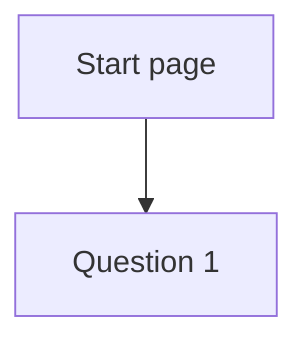

# Design spec: <Name>

- **Status:** Draft <!-- Draft | In review | Approved | Superseded -->
- **Designer:** <name / ux-designer agent> · **Date:** YYYY-MM-DD
- **Plan:** docs/plans/NNNN-*.md · **Related ADRs:** ADR-NNNN
- **Type:** block | flow | component default styling | theme/token change | docs page

## 1. Brief

- **Users:** residents | staff | both. Hardest-case user: …
- **Job to be done:** When <situation>, I want to <motivation>, so I can <outcome>.
- **Context:** device, frequency, time pressure, stress.
- **Constraints:** legal (WAD, statement, GDPR), data, integrations.
- **Success criteria:** measurable outcomes (completion rate, error rate, time on task, support calls).
- **Evidence:** research findings with sources. Anything without a source is listed as an assumption.
- **Assumptions and research questions:**
  - Assumption: … → Research question: …

## 2. Prior art

| Source                      | What we reuse | What we change and why |
| --------------------------- | ------------- | ---------------------- |
| KvirnUI component / block   |               |                        |
| APG pattern                 |               |                        |
| Public-sector design system |               |                        |

## 3. Flow



Unhappy paths: validation error · empty · loading · no results · timeout warning · save and return · back · integration failure · not eligible.

## 4. Content

| i18n key                 | en  | sv  | longest fi (length check) | Notes |
| ------------------------ | --- | --- | ------------------------- | ----- |
| `<block>.heading`        |     |     |                           |       |
| `<block>.errors.<field>` |     |     |                           |       |

## 5. Structure

Per breakpoint (320px · 40rem · 64rem): landmarks, heading outline and reading order.

```
[header: banner]
  skip link · logo · language switcher · help
[main]
  h1 …
  …
  [primary action]
[footer: contentinfo]
```

## 6. Visual specification

| Part | Tokens / component style (DESIGN.md) | Density | Notes |
| ---- | ------------------------------------ | ------- | ----- |
|      |                                      |         |       |

### States

| Part | default | hover | focus-visible | active | disabled | invalid | loading | selected / open | empty |
| ---- | ------- | ----- | ------------- | ------ | -------- | ------- | ------- | --------------- | ----- |
|      |         |       |               |        |          |         |         |                 |       |

### Modes

- Dark, light-contrast, dark-contrast:
- Forced colours (what carries state without colour):
- RTL:
- Motion (and the reduced-motion alternative):
- 320px reflow, 400% zoom, text spacing (1.4.12):

### New or changed tokens

| Token | Value per theme | Contrast pair and measured ratio | ADR |
| ----- | --------------- | -------------------------------- | --- |

## 7. Accessibility annotations

Draft input for the plan's accessibility contract (`<name>.a11y.md`).

- Accessible names (visible label = accessible name, 2.5.3):
- Roles and native elements:
- Focus order and focus moves (on open, on submit, on error, on close):
- Announcements (Announcer, i18n key):
- WCAG SCs of note:

## 8. Validation

- [ ] Self-review against `.claude/skills/design/references/review-checklist.md` (no open blockers)
- [ ] Contrast of any new colour pair measured
- [ ] Usability test plan written. Result: `pending`

### Usability test plan

- Participants: … (include screen reader, magnification, cognitive disability, low digital confidence, second-language)
- Tasks: …
- What we measure: …

## 9. Open questions

- …
