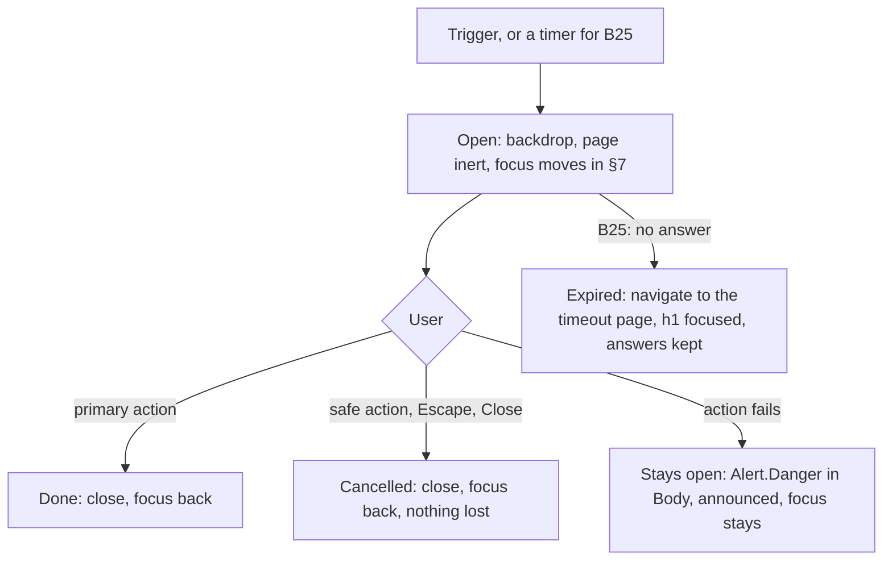

# Design spec: Dialog and AlertDialog

- **Status:** Draft · **Designer:** ux-designer agent · **Date:** 2026-10-06
- **Plan:** to be written (roadmap: Dialog, AlertDialog, FocusScope, Portal; M2). Unblocks B25 and P9 in [municipality-reference-site.md](municipality-reference-site.md)
- **Type:** component default styling (`kv-dialog`) and behaviour rules

## 1. Brief

- **Users:** both. Residents meet a dialog rarely (a timeout warning, "delete the draft?"); staff daily (edit a record, confirm a decision).
- **Hardest case: B25, the session-timeout warning.** A resident on a phone, NVDA or VoiceOver, 200% text, Swedish as a second language, halfway through an application. A dialog they didn't ask for opens; they must understand it, and act within 2 minutes, without losing their answers (2.2.1). Then: a magnifier user at 400% (320 CSS px wide, ~200 high), a tremor user (accidental taps), a Windows Contrast Themes user.
- **Job:** _When the service needs a decision before I go on, I want to see what it is, what each choice does, and which is safe, so I can answer once and get back to my task._
- **Constraints:** APG Dialog (Modal) and Alert Dialog; DESIGN.md elevation level 4; existing tokens only; strings in six locales.
- **Success:** 0 axe violations in every story state and theme; in the usability test (`pending`) every participant extends the session in time and nobody deletes by mistake.
- **Evidence:** none from our own users. Assumptions:
  - Showing the clock time ("kl. 14:32") beside a minute count is easier than a ticking timer. → RQ: which do participants act on?
  - A bottom sheet below 40rem is easier to reach and read than a centred box. → RQ: do phone and 400% participants find all of it, including the actions?

## 2. Prior art

| Source                                                                                                                                                                                             | Reuse                                                                                                                                                          | Change and why                                     |
| -------------------------------------------------------------------------------------------------------------------------------------------------------------------------------------------------- | -------------------------------------------------------------------------------------------------------------------------------------------------------------- | -------------------------------------------------- |
| APG [Dialog (Modal)](https://www.w3.org/WAI/ARIA/apg/patterns/dialog-modal/), [Alert Dialog](https://www.w3.org/WAI/ARIA/apg/patterns/alertdialog/)                                                | Focus trap, inert background, Escape, return focus; the least destructive action first for irreversible steps; a static start (the title) when content is long | –                                                  |
| HTML `<dialog>.showModal()`                                                                                                                                                                        | Top layer, `::backdrop`, inert page, `cancel` on Escape                                                                                                        | No z-index tokens needed                           |
| HMRC [service timeout](https://design.tax.service.gov.uk/hmrc-design-patterns/service-timeout), DWP [manage a session timeout](https://design-system.dwp.gov.uk/patterns/manage-a-session-timeout) | Warn 2 minutes ahead; minutes, then 20-second steps in the last minute, shown and announced politely; Escape closes; a timeout page after expiry               | We add the clock time and say the answers are kept |
| KvirnUI Alert (`alert.md` §6.3, §7.5), Card footer (`card.md` §6.4)                                                                                                                                | Actions: start-aligned, primary first, a column below 40rem; the quiet close button                                                                            | The Close sits after the Title in the DOM (§7)     |

## 3. Flow



- **Trigger gone** (the row was deleted): focus goes to a documented fallback (the list's heading, `tabIndex={-1}`), never `body`.
- **Typed input and Close/Escape:** values are kept until the user leaves the page, so reopening shows them. No "discard changes?" dialog on top.
- **Nesting:** at most an AlertDialog over a Dialog. Escape closes the innermost.
- **When not to use one:** a multi-step form, long reading, or anything on page load (B25 is the one system-initiated case). Use a page.

## 4. Content

Component strings (`@kvirn-ui/i18n`, all six locales, overridable per provider and instance):

| Key            | en    | sv    | fi    |
| -------------- | ----- | ----- | ----- |
| `dialog.close` | Close | Stäng | Sulje |

Example strings (the block's or the app's keys, not the component's). Length check: `fi` is the longest.

| Key                               | en                                                                                      | sv                                                                                | fi                                                                                                   |
| --------------------------------- | --------------------------------------------------------------------------------------- | --------------------------------------------------------------------------------- | ---------------------------------------------------------------------------------------------------- |
| `sessionTimeout.title`            | Do you want to stay signed in?                                                          | Vill du fortsätta vara inloggad?                                                  | Haluatko pysyä kirjautuneena?                                                                        |
| `sessionTimeout.description`      | For your security, we will sign you out in {minutes} at {time}. Your answers are saved. | Av säkerhetsskäl loggar vi ut dig om {minutes}, kl. {time}. Dina svar är sparade. | Tietoturvasi vuoksi kirjaamme sinut ulos {minutes} kuluttua, klo {time}. Vastauksesi on tallennettu. |
| `sessionTimeout.stay`             | Stay signed in                                                                          | Fortsätt vara inloggad                                                            | Jatka kirjautuneena                                                                                  |
| `sessionTimeout.signOut`          | Sign out                                                                                | Logga ut                                                                          | Kirjaudu ulos                                                                                        |
| `sessionTimeout.remaining` (live) | {minutes} left.                                                                         | {minutes} kvar.                                                                   | {minutes} jäljellä.                                                                                  |
| `deleteDraft.title`               | Delete the draft application?                                                           | Vill du ta bort utkastet till ansökan?                                            | Haluatko poistaa hakemusluonnoksen?                                                                  |
| `deleteDraft.description`         | You can't undo this. Your answers will be deleted.                                      | Det går inte att ångra. Dina svar tas bort.                                       | Tätä ei voi perua. Vastauksesi poistetaan.                                                           |
| `deleteDraft.confirm` / `.keep`   | Delete draft / Keep draft                                                               | Ta bort utkastet / Behåll utkastet                                                | Poista luonnos / Säilytä luonnos                                                                     |

`{minutes}` is formatted with `Intl` and plural rules ("2 minuter", "1 minut", "40 sekunder"); `{time}` with `Intl.DateTimeFormat` (`14:32`).

**Copy rules (docs page and content guide):**

- **Title** is the question the buttons answer, or a verb phrase for a task ("Ändra telefonnummer"). Never "Är du säker?" / "Are you sure?", "Varning", "Bekräfta" or "Confirm".
- **Description** says the consequence and whether it can be undone, in one or two short sentences. `text`, never muted.
- **Buttons** say verb + object ("Ta bort utkastet"), so each makes sense alone. Never "OK", "Ja", "Nej". Avoid "Avbryt" when it could mean "cancel the application"; say what is kept ("Behåll utkastet").
- One primary action. No blame, no jargon ("session" → "inloggad").

## 5. Structure

```
::backdrop                                   (dims the page; the page is inert)
<dialog class="kv-dialog [kv-dialog--small]" role=[alertdialog] aria-labelledby=T [aria-describedby=D]>
  <h2 class="kv-dialog-title" id=T>          Title                 [Close ×]  ← optional, Dialog only
  <p  class="kv-dialog-description" id=D>    Description
  <div class="kv-dialog-body">               Body (fields, prose, an Alert after a failure)
  <div class="kv-dialog-actions">            [Primary] [Secondary]           ← start-aligned, primary first
</dialog>
```

| Viewport                    | Layout                                                                                                                                                                                                             |
| --------------------------- | ------------------------------------------------------------------------------------------------------------------------------------------------------------------------------------------------------------------ |
| < 40rem (phones, 400% zoom) | **Sheet:** full inline size at the block-end edge, `xl` radius on the top corners only, padding `space-4`. Height from content, `max-block-size: 100dvh` (no fixed height). Actions a column of full-width buttons |
| ≥ 40rem                     | Centred, `inline-size: min(100% - 2 × space-6, <size>)`, `max-block-size: calc(100dvh - 2 × space-6)`, `xl` radius, padding `space-6`. Actions a wrapping row                                                      |
| ≥ 64rem in `kv-compact`     | Padding `space-4`; buttons and Close 32px                                                                                                                                                                          |

**Sizes:** default `40rem` (the form measure, reused); `kv-dialog--small` for AlertDialog, proposed `30rem` (D2).

**Long content:** the whole `kv-dialog` is the scroll container (`overflow-y: auto`, the native scrollbar never hidden or thinned). Nothing is pinned: at 400% a pinned title and actions would leave no room for the body, and a sticky part could cover focus (2.4.11). `scroll-padding-block: space-6` keeps a focused control off the edge, and the padding (≥ 16px) is wider than the ring (2px + 2px offset), so a ring is never clipped.

## 6. Visual specification

| Part                    | Tokens and style                                                                                                                                                                                                                                                                               |
| ----------------------- | ---------------------------------------------------------------------------------------------------------------------------------------------------------------------------------------------------------------------------------------------------------------------------------------------- |
| Popup `kv-dialog`       | Level 4: `surface-raised`, 1px `border-subtle`, `--kv-shadow-dialog` (none in dark and contrast themes), `--kv-radius-xl`, `color: text`. Grid: Title and Close share row 1 (`minmax(0, 1fr) auto`), every other part spans both columns. `overflow-wrap: break-word`                          |
| `::backdrop`            | `--kv-color-backdrop` (**new, D1**). Never blurs the page (no `backdrop-filter`: a glass effect)                                                                                                                                                                                               |
| Title `kv-dialog-title` | `h2` (no `as`: another element uses the hook). `heading-2` role (1.375rem, 1.25rem below 40rem), `--kv-font-family-heading`, `heading` colour, margin 0, hyphenation as `kv-heading`                                                                                                           |
| Description             | `body`, `text`, `margin-block-start: space-2`, `max-inline-size: var(--kv-prose-measure)`                                                                                                                                                                                                      |
| Body                    | `body`, `text`, `margin-block-start: space-4`; first and last child margins 0; `kv-prose` inside turns prose on. May hold an Alert                                                                                                                                                             |
| Actions                 | The button-group layout built in (as `kv-alert-actions`): `gap: space-3`, start-aligned, primary first in the DOM, a full-width column below 40rem. `margin-block-start: space-6`                                                                                                              |
| Close `kv-dialog-close` | As `kv-alert-close`: quiet icon button, `close` icon (decorative), `--kv-control-min-block-size` square (44px; 32px compact from 64rem), `md` radius, transparent, `text`. Hover `surface` (the dialog is already `surface-raised`). Pulled into the padding so row 1 keeps the title's height |
| Destructive             | No class and no red surface (DESIGN.md: status `-subtle` only in alerts). The confirming button is `kv-button--danger`; the safe one is a plain `kv-button`. The title's words carry the risk, never colour alone                                                                              |

**Button order and focus.** DOM order = visual order = Tab order, primary first (as Card and Alert, so the main action is always in one place).

| Dialog type                        | Order                                | Initial focus                                                           |
| ---------------------------------- | ------------------------------------ | ----------------------------------------------------------------------- |
| Dialog with a field                | Body fields, then [Save] [secondary] | The first field                                                         |
| Dialog that is mostly reading      | [primary] [secondary]                | The Title (`tabindex="-1"`), so the start is read and arrows scroll     |
| AlertDialog, non-destructive (B25) | [Stay signed in] [Sign out]          | **The primary action**                                                  |
| AlertDialog, destructive           | [Delete draft] (danger) [Keep draft] | **The safe action** ("Keep draft"): an accidental Enter changes nothing |

### States

| Part    | Closed                         | Open                              | Hover          | Focus-visible                                            | Active  | Disabled                  | Busy / failed                                |
| ------- | ------------------------------ | --------------------------------- | -------------- | -------------------------------------------------------- | ------- | ------------------------- | -------------------------------------------- |
| Popup   | not rendered (`display: none`) | `[open]`, `data-open`             | –              | – (never focused itself)                                 | –       | –                         | Failed: an `Alert.Danger` at the top of Body |
| Title   | –                              | as §6                             | –              | 2px `focus-ring`, 2px offset, only after a keyboard open | –       | –                         | –                                            |
| Close   | –                              | as §6                             | `surface` fill | ring as Title                                            | no fill | `text-muted`, not-allowed | –                                            |
| Actions | –                              | Button states (`button-depth.md`) | Button         | Button ring                                              | Button  | Button                    | Busy: open question Q2                       |

### Modes

- **Contrast (existing pairs only, numbers from `tooltip.md` and `card.md`, light / dark / light-contrast / dark-contrast):** `text` on `surface-raised` 19.05 / 16.55 / 20.86 / 17.61; `focus-ring` 4.70 / 6.14 / 9.89 / 9.40; `secondary` edge 4.98 / 3.54 / 10.86 / 12.05; `primary` 4.70 / 3.75 / 9.89 / 9.40; `danger-hover` 8.23 / 10.42 / 12.00 / 13.14. A hovered primary keeps its `primary` border, so the dark 2.98:1 `primary-hover` gap doesn't apply. All are in `theme:check` already.
- **Dark:** no shadow. The edge against the dimmed page is ~1.15:1, so the dialog stands out by the page's text going dim, not by its edge (as every dark popup; Q3).
- **Forced colours:** `Canvas` fill, `CanvasText` text, an explicit 1px `CanvasText` edge on all four sides (the shadow vanishes). The backdrop is left to the system; the edge carries the boundary. Close and buttons follow Button's forced-colours rules. No `forced-color-adjust: none`.
- **RTL:** logical properties only. Close at inline-end (left), actions start at inline-start (right). The close icon is symmetrical and never mirrors.
- **Motion:** under `prefers-reduced-motion: no-preference` only: on open, the backdrop fades in and the Popup fades in and moves `space-2` (the sheet: `space-4`) from block-end, over `--kv-duration-slow` with `--kv-easing-standard` (`@starting-style`). No scale, no bounce. Closing is instant in every setting, so focus returns at once. Under `reduce`, opening is instant too.
- **320px, 400% zoom, 1.4.12:** the sheet, no fixed width or height, `min-inline-size: 0`, wrapping buttons, hyphenation. Text spacing only makes it taller, and it scrolls.

### New or changed tokens (decisions for the maintainer)

| Token                      | Proposed value per theme                                                                                                             | Measured (scratch, `contrast.ts` formula, 2026-10-06)                                                                                                                                                                                               |
| -------------------------- | ------------------------------------------------------------------------------------------------------------------------------------ | --------------------------------------------------------------------------------------------------------------------------------------------------------------------------------------------------------------------------------------------------- |
| `--kv-color-backdrop` (D1) | light `color-mix(in srgb, var(--kv-neutral-950) 50%, transparent)`; light-contrast 60%; dark and dark-contrast `var(--kv-black)` 70% | `surface-raised` against the backdrop over `canvas`: light 3.55, light-contrast 4.97, dark 1.19 (over `surface-raised` pages 1.14). Decorative: the dialog's text pairs are unchanged because the Popup is opaque. Proposed: no `theme:check` floor |

The orchestrator should run `vp run theme:check` when D1 is implemented. Without D1 there is no way to dim the page in tokens, and the light theme would rely on the shadow alone.

## 7. Accessibility annotations

Draft input for `dialog.a11y.md` and `alert-dialog.a11y.md`.

- **Roles:** a native `<dialog>` opened with `showModal()` (implicit `dialog`, modal, page inert). AlertDialog sets `role="alertdialog"` on it.
- **Names:** `aria-labelledby` → Title (always). `aria-describedby` → Description: required on AlertDialog; on Dialog only when it's a short sentence, never the Body. Close: `<button type="button">` named by `dialog.close`. Visible label = name (2.5.3) for every action.
- **Tab stops, in order:** [Close] → Body controls → Actions in DOM order → back to the first (trap). The Title (`tabindex="-1"`) is never a Tab stop.
- **Keys:** Tab / Shift+Tab cycle inside. Escape closes (Dialog: as Close; AlertDialog: runs the cancel outcome, which is never destructive: "Keep draft", and in B25 "Stay signed in", as HMRC). Enter and Space are the buttons' own. No other keys.
- **Pointer:** a backdrop click doesn't close an AlertDialog ever, and doesn't close a Dialog by default (a tremor or a stray tap must not lose typed input; an opt-in for read-only dialogs).
- **Focus on open:** the table in §6. Never the Close button, never the Popup itself.
- **Focus on close:** the trigger. If it's gone, a documented fallback the consumer passes, never `body`. B25: the element focused before the warning opened; after expiry, the timeout page's `h1` (route focus).
- **Announcements:** opening is announced by the focus move (role, name, and for AlertDialog the description). The page's live regions are inert, so the Dialog hosts its own polite region for in-dialog status: B25's `sessionTimeout.remaining` once per minute, then every 20 seconds in the last minute (the visible text updates on the same beat, never every second); a failed action's error. Strings from i18n.
- **Targets:** every button 44×44px (comfortable, 2.5.5); 32px compact from 64rem, never under 24px (2.5.8).
- **Focus not obscured:** nothing pinned or sticky inside; the on-screen keyboard must not cover a focused field in the sheet (tested, §8).
- **WCAG SCs of note:** 1.3.1, 1.3.2, 1.4.3, 1.4.10, 1.4.11, 1.4.12, 2.1.1, 2.1.2 (the trap is the modal exception), 2.2.1, 2.4.3, 2.4.7, 2.4.11, 2.5.3, 2.5.5/2.5.8, 3.2.2, 4.1.2, 4.1.3.

## 8. Validation

- [x] Self-review against `review-checklist.md`: no open blocker. Every string has a key; no colour-only cue; 320px and 400% covered.
- [ ] D1 measured with `theme:check` (scratch numbers only, §6).
- [x] Usability test plan written. Result: `pending`. AT matrix: `pending`.

### Usability test plan (`pending`)

- **Participants:** NVDA, JAWS and VoiceOver (iOS) users; a magnifier user at 400%; a tremor or switch user; a Windows Contrast Themes user; two second-language Swedish speakers; two residents with low digital confidence; two staff.
- **Tasks:** 1. Mid-application, the timeout warning opens: stay signed in. 2. Let it expire, then find your answers again. 3. Delete one of two drafts, keep the other. 4. On a phone, change your phone number in a dialog, with the on-screen keyboard open. 5. At 400%, read a long dialog to its end and press its primary action.
- **Measure:** completion; time to act after the warning; accidental deletes; whether the countdown announcements help or distract; whether the clock time or the minute count is used; whether anything is missed in the sheet.

## 9. Open questions

1. **(maintainer) D1** `--kv-color-backdrop`, the values in §6. **D2** `kv-dialog--small` at `30rem`, a new layout constant, or reuse `24rem` (Columns `lg`), which wraps the two B25 buttons to two rows on desktop. **D3** a DESIGN.md Overlays bullet for Dialog (level 4, `xl`, the sheet below 40rem, nothing pinned) and the index row.
2. **Busy state.** DESIGN.md has no button loading style. While "Stay signed in" or "Delete draft" waits for the server, should the button keep its label with `aria-disabled` and a visible "Sparar…" text, or is there a Button plan for this?
3. **Dark edge.** As `tooltip.md` Q4: keep the hairline (1.15:1 against the backdrop), or give overlays in dark a stronger edge (a DESIGN.md change for all of them)?
4. **Destructive order.** Danger first (primary position, consistent with every other action row) with focus on the second button, as here; or the safe action first, as APG's example? Needs the usability test.
5. **Forced colours backdrop:** is the 1px `CanvasText` edge enough to tell the dialog from the identical-looking page, or should the backdrop be opaque `Canvas` there?
