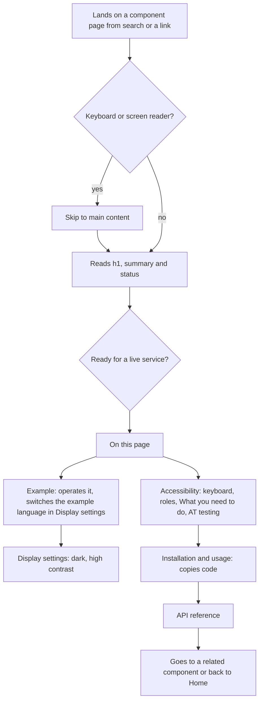

# Design spec: Docs site shell, component page template, and pages for KvirnProvider, Button and Link

- **Status:** Draft
- **Designer:** ux-designer agent · **Date:** 2026-10-01
- **Plan:** Plan 0005 (to be written; §10 has the proposed Design section and tasks)
- **Type:** docs page (site shell + template + four pages)
- **Depends on:** [default-theme-button-link.md](default-theme-button-link.md) for tokens and recipes. Companion: [storybook-presentation.md](storybook-presentation.md)
- **Amended by:** [docs-site-components.md](docs-site-components.md) (Plan 0052 Phase C): the shell and template are rebuilt from the shipped components; where it and §5–§7 here disagree, it wins.

## 1. Brief

- **Users:**
  1. Developers and designers at Nordic and EU municipalities, regions and agencies, and their suppliers, who **evaluate** KvirnUI (is it fit for our services, can we defend it in a procurement?) and then **integrate** it.
     - Some use assistive technology: screen readers, magnification, Windows Contrast Themes, keyboard only, voice control.
     - Many read English as a second language (Swedish, Finnish, Norwegian and Sámi first-language readers).
  2. Maintainers, who dogfood the components on the site.
- **Hardest-case user:** a Finnish accessibility specialist at a municipality who uses NVDA and 200% zoom, reads English as a second language, and must decide whether KvirnUI's claims hold up. They'll judge the library by whether its own documentation site works with their screen reader, and by whether it is honest about what hasn't been tested.
- **Job to be done:**
  - When I evaluate a component library for a public service, I want to see each component working, read what it guarantees for accessibility and what I must still do myself, and see real test status, so I can decide quickly and defend the decision.
  - When I integrate, I want copyable setup and usage code for my router, and the strings in my language.
- **Context:** mostly desktop at work, sometimes a phone. Evaluators arrive from search or a colleague's link, often straight onto a component page. They return many times while integrating. They are not under time pressure, but they form a trust judgement in the first minute.
- **Constraints:**
  - No third-party requests: no remote fonts, analytics, embeds or CDN scripts (hard rule 7).
  - Never claim compliance. Say "designed and tested to meet WCAG 2.2 AA".
  - The site copy is English (brief). Examples show the Nordic locales.
  - `apps/docs` is a bare Next.js App Router skeleton with no content system.
  - Headless packages ship zero CSS. Styling comes from `@kvirn-ui/theme`.
  - Any new dependency (MDX, syntax highlighting) needs the maintainer's approval.
- **Success criteria**, to be measured in the usability plan (§8):
  - At least 80% of evaluators correctly state a component's status, including that manual AT testing is pending, within 2 minutes of landing on its page.
  - At least 80% find the keyboard table and the "What you need to do" list without help.
  - Every page has 0 axe violations in all four themes, and no horizontal scrolling at 320px except inside flagged table regions.
  - The theme and display settings can be changed with the keyboard only, and the choice survives a reload.
- **Evidence:** none from users yet. The structure borrows from GOV.UK and Radix (§2). Everything else is an assumption, listed below.
- **Assumptions and research questions:**
  - Assumption: evaluators look for accessibility evidence before API details. → Research question: which section do evaluators open first, and in what order do they read?
  - Assumption: "Same as my device" is clearer than "System" for the theme options, especially for second-language readers. → Research question: do participants predict correctly what "Same as my device" does?
  - Assumption: one example language select in Display settings is found and understood. → Research question: do participants discover it without prompting, and do they understand that it changes every example?
  - Assumption: moving focus to the new page's `h1` after client-side navigation works better for screen reader users than leaving focus on the activated link. → Research question: compare both with NVDA and VoiceOver users (AT test, `pending`).

## 2. Prior art

| Source                                                                                                                 | What we reuse                                                                                                                                                                                        | What we change and why                                                                                                                                                                                                                                                                                                         |
| ---------------------------------------------------------------------------------------------------------------------- | ---------------------------------------------------------------------------------------------------------------------------------------------------------------------------------------------------- | ------------------------------------------------------------------------------------------------------------------------------------------------------------------------------------------------------------------------------------------------------------------------------------------------------------------------------ |
| [GOV.UK Design System](https://design-system.service.gov.uk/components/button/), component page (checked 2026-10-01)   | Guidance first: "When to use this component" and "How it works", variant sections, "Disabled buttons", "Grouping buttons", "Research on this component". A left sidebar of pages in the section      | We add API, keyboard and data-attribute tables (we are a React library, not an HTML kit). Our "Research on this component" equivalent is **Assistive technology testing**, which shows `pending` honestly. Code sits behind a disclosure, not tabs, because tabs hide the preview while reading ([docs-code.md](docs-code.md)) |
| [Radix Primitives](https://www.radix-ui.com/primitives/docs/components/accordion), component page (checked 2026-10-01) | "API Reference" with a props table and a **data-attributes** table per part. "Accessibility" with a "Keyboard Interactions" table (Key, Description)                                                 | Our keyboard table adds **Context** and **Test** columns from `.a11y.md`, because the test link is the evidence. Accessibility comes before the API, because it is our positioning (`docs/vision.md`)                                                                                                                          |
| GOV.UK Skip link and header components                                                                                 | A skip link that is the first focusable element and becomes visible on focus, and a plain header                                                                                                     | –                                                                                                                                                                                                                                                                                                                              |
| APG Disclosure (Show/Hide) and the Disclosure Navigation example                                                       | The mobile "Menu" and "Display settings" are `<button aria-expanded aria-controls>`. The navigation is a list of links, **not** `role="menu"`                                                        | Built with KvirnUI `Button`, to dogfood it. There is no Disclosure primitive yet (roadmap M1)                                                                                                                                                                                                                                  |
| APG Radio Group (native)                                                                                               | The theme switcher: two native radio groups in `<fieldset>`/`<legend>`, exactly the recipe in `kvirn-provider.md`                                                                                    | Option labels in plainer words ("Same as my device")                                                                                                                                                                                                                                                                           |
| **Linear-inspired DESIGN.md** ([shadcn.io/design/linear](https://www.shadcn.io/design/linear), fetched 2026-10-01)     | The calm dark shell (`#010102` canvas, `#0f1011` sidebar, hairlines), a 56px top bar, 14px/500 dense navigation items, surface-lift hover, 8px and 12px radii, and hairline-separated section rhythm | Values adjusted to AA. Dense chrome only at 64rem and wider. Content stays at 16px. The current item has a bar and weight, not just a background. A light theme is added (the source is dark-only)                                                                                                                             |
| KvirnUI `kvirn-provider.md` (draft docs page)                                                                          | All content for the KvirnProvider page                                                                                                                                                               | Restructured into the template. The package file is replaced by a pointer (Open question 3)                                                                                                                                                                                                                                    |

## 3. Flow

### Information architecture

```
/                               Home
/foundation/kvirn-provider      KvirnProvider
/components/button              Button
/components/link                Link
(404)                           Page not found
```

Navigation is a nested list. Group names are list-item text, not headings, so the heading outline of each page starts at its own `h1`:

```
- Introduction           → /
- Foundation
  - KvirnProvider        → /foundation/kvirn-provider
- Components
  - Button               → /components/button
  - Link                 → /components/link
```

### Evaluator flow (primary)



### Integrator flow

1. Home, then "Set up KvirnProvider".
2. Copies the Next.js or TanStack Router setup.
3. Goes to Button and Link, copies usage and the default-theme class names.
4. Checks "Strings" for their locale and learns how to override a string.

### Unhappy paths

| Situation                                           | What the user gets                                                                                                                                                                                                                                                                                                         |
| --------------------------------------------------- | -------------------------------------------------------------------------------------------------------------------------------------------------------------------------------------------------------------------------------------------------------------------------------------------------------------------------- |
| **Page not found**                                  | A 404 page with the site shell, the `h1` "Page not found", a plain explanation and a link to Home. The page title is "Page not found – KvirnUI"                                                                                                                                                                            |
| **JavaScript off or failed**                        | All content, code and tables render on the server. The theme follows the device through the `tokens.css` media-query fallback. The navigation is **expanded** and the "Menu" and "Display settings" buttons are hidden, because they need JavaScript. Examples render but don't respond (a native form submit still works) |
| **A live example throws**                           | An error boundary around each example frame shows `docs.example.error` in the frame. The rest of the page works. Nothing is announced: it happens on load, not after a user action                                                                                                                                         |
| **Forced colours active** (Windows Contrast Themes) | Display settings shows `docs.display.forcedColors` above the storage note. The radios still work and the choice is saved for when forced colours are off                                                                                                                                                                   |
| **Storage blocked**                                 | The theme choice applies for this visit (the store handles it). The storage note is still accurate ("saved in this browser"). No error is shown                                                                                                                                                                            |
| **IBM Plex fails to load**                          | The system fonts (system-ui for text, ui-serif for headings). The layout doesn't depend on font metrics                                                                                                                                                                                                                    |
| **Contract file changed or malformed** (build time) | The build **fails** with a message naming the file and the missing section. The site never ships an empty or stale accessibility section                                                                                                                                                                                   |
| **Northern Sámi example strings missing**           | Sámi is not offered in the example-language select, so these strings appear only if it is added. Missing strings render in English with `lang="en"`, and the frame shows `docs.example.samiPending`                                                                                                                        |
| **Deep link to a section** (`#keyboard`)            | The header isn't sticky, so the heading isn't covered. The target heading scrolls to the top with `scroll-margin-block-start: space-4`                                                                                                                                                                                     |
| **Client-side navigation** (Next.js `<Link>`)       | The mobile menu closes and focus moves to the new page's `h1` (`tabindex="-1"`). The `<title>` updates. We rely on Next.js's route announcer and add no second live region (verify with AT: `pending`)                                                                                                                     |
| **Narrow screen and 400% zoom**                     | A single column. Tables wrap first, and scroll inside a labelled, focusable region only when they still overflow                                                                                                                                                                                                           |

## 4. Content

The site copy is English (en-GB spelling, as elsewhere in the repo: "colour", "licence"). Plain English for second-language readers: short sentences, common words, "you" and "we", no idioms.

**Where strings live:**

- **Shell and template strings** (skip link, navigation, buttons, template headings, status texts, notices, footer, 404) are keys in an app-local catalog, `apps/docs/messages/en.ts`, namespace `docs.*`. They aren't in `@kvirn-ui/i18n`, which holds library strings only. The catalog is English-only for now, keyed so the site can be translated later (Open question 7).
- **Page prose** lives in the page content files, English only.
- **Example strings** shown inside live examples exist in all six locales: the library strings come from `@kvirn-ui/i18n`, and the example labels from the example fixture catalog. The example keys are the same as the Storybook fixture keys in [storybook-presentation.md §4](storybook-presentation.md#4-content), so one fixture module serves both. Agents write the nb, nn and fi strings, and `se` is English, marked `lang="en"`.

### Shell and template keys (en)

| i18n key                                               | en                                                                                                                                                                                                                   | Notes                                                                                                                                                                        |
| ------------------------------------------------------ | -------------------------------------------------------------------------------------------------------------------------------------------------------------------------------------------------------------------- | ---------------------------------------------------------------------------------------------------------------------------------------------------------------------------- |
| `docs.meta.title`                                      | `({ page }) => \`${page} – KvirnUI\``                                                                                                                                                                                | `<title>` (2.4.2). Home: "KvirnUI – accessible React components for public services"                                                                                         |
| `docs.meta.homeTitle`                                  | KvirnUI – accessible React components for public services                                                                                                                                                            |                                                                                                                                                                              |
| `docs.skipLink`                                        | Skip to main content                                                                                                                                                                                                 |                                                                                                                                                                              |
| `docs.header.home`                                     | KvirnUI                                                                                                                                                                                                              | Wordmark link text = accessible name                                                                                                                                         |
| `docs.header.status`                                   | Pre-alpha                                                                                                                                                                                                            | Badge next to the wordmark                                                                                                                                                   |
| `docs.nav.label`                                       | Documentation                                                                                                                                                                                                        | `<nav aria-label>`                                                                                                                                                           |
| `docs.nav.menuButton`                                  | Menu                                                                                                                                                                                                                 | Doesn't change when expanded: the state is `aria-expanded` (APG)                                                                                                             |
| `docs.nav.introduction`                                | Introduction                                                                                                                                                                                                         | Link to `/`                                                                                                                                                                  |
| `docs.nav.foundation` / `docs.nav.components`          | Foundation / Components                                                                                                                                                                                              | Group labels (list-item text)                                                                                                                                                |
| `docs.display.button`                                  | Display settings                                                                                                                                                                                                     | Disclosure toggle                                                                                                                                                            |
| `docs.display.colorScheme.legend`                      | Colour scheme                                                                                                                                                                                                        |                                                                                                                                                                              |
| `docs.display.colorScheme.light` / `.dark` / `.system` | Light / Dark / Same as my device                                                                                                                                                                                     |                                                                                                                                                                              |
| `docs.display.contrast.legend`                         | Contrast                                                                                                                                                                                                             |                                                                                                                                                                              |
| `docs.display.contrast.standard` / `.more` / `.system` | Standard / High / Same as my device                                                                                                                                                                                  |                                                                                                                                                                              |
| `docs.display.exampleLanguage`                         | Example language                                                                                                                                                                                                     | Label of the one select that sets the language of every example, saved under `kvirn-docs:example-locale`. Svenska and English only. Changing it announces nothing            |
| `docs.display.forcedColors`                            | Your device is using its own colours, for example a Windows contrast theme. They replace the settings here. Your choice is kept for when you turn them off.                                                          | Shown only when `isForcedColors`                                                                                                                                             |
| `docs.display.storageNote`                             | We save your choice in this browser only. We don't use cookies or send it anywhere.                                                                                                                                  | Shown as the library `Alert` (info). Covers the theme and example language choice. Honest and GDPR-transparent. `TODO(legal-verify)` covers the exemption, not this sentence |
| `docs.contents.heading`                                | On this page                                                                                                                                                                                                         | `h2`, labels the contents `<nav>`                                                                                                                                            |
| `docs.status.label`                                    | Status                                                                                                                                                                                                               |                                                                                                                                                                              |
| `docs.status.planned` / `.alpha` / `.beta` / `.stable` | Planned / Alpha / Beta / Stable                                                                                                                                                                                      | Badge text                                                                                                                                                                   |
| `docs.status.plannedText`                              | Not built yet.                                                                                                                                                                                                       |                                                                                                                                                                              |
| `docs.status.alphaText`                                | Automated tests and an independent accessibility review pass. Manual testing with assistive technology is pending. Don't use it in a live service yet.                                                               |                                                                                                                                                                              |
| `docs.status.betaText`                                 | Tested with the core set of assistive technologies. The API can still change.                                                                                                                                        | Not used yet                                                                                                                                                                 |
| `docs.status.stableText`                               | The API is stable and follows semantic versioning.                                                                                                                                                                   | Not used yet                                                                                                                                                                 |
| `docs.template.example`                                | Example                                                                                                                                                                                                              | `h2`                                                                                                                                                                         |
| `docs.template.whenToUse`                              | When to use it                                                                                                                                                                                                       | `h2`                                                                                                                                                                         |
| `docs.template.whenNotToUse`                           | When not to use it                                                                                                                                                                                                   | `h3` under "When to use it"                                                                                                                                                  |
| `docs.template.installation`                           | Installation                                                                                                                                                                                                         | `h2`                                                                                                                                                                         |
| `docs.template.usage`                                  | Usage                                                                                                                                                                                                                | `h2`                                                                                                                                                                         |
| `docs.template.accessibility`                          | Accessibility                                                                                                                                                                                                        | `h2`                                                                                                                                                                         |
| `docs.template.guarantees`                             | What the component does for you                                                                                                                                                                                      | `h3`                                                                                                                                                                         |
| `docs.template.keyboard`                               | Keyboard                                                                                                                                                                                                             | `h3`                                                                                                                                                                         |
| `docs.template.roles`                                  | Roles and attributes                                                                                                                                                                                                 | `h3`                                                                                                                                                                         |
| `docs.template.focus`                                  | Focus                                                                                                                                                                                                                | `h3`                                                                                                                                                                         |
| `docs.template.announcements`                          | Announcements                                                                                                                                                                                                        | `h3`                                                                                                                                                                         |
| `docs.template.yourResponsibilities`                   | What you need to do                                                                                                                                                                                                  | `h3`. From "Consumer responsibilities"                                                                                                                                       |
| `docs.template.wcag`                                   | WCAG success criteria                                                                                                                                                                                                | `h3`                                                                                                                                                                         |
| `docs.template.atTesting`                              | Testing with assistive technology                                                                                                                                                                                    | `h3`                                                                                                                                                                         |
| `docs.template.atPendingNote`                          | Nobody has tested this component with assistive technology yet. The results will appear here.                                                                                                                        | Shown while every row is `pending`                                                                                                                                           |
| `docs.template.knownIssues`                            | Known issues                                                                                                                                                                                                         | `h3`                                                                                                                                                                         |
| `docs.template.strings`                                | Strings                                                                                                                                                                                                              | `h2`                                                                                                                                                                         |
| `docs.template.noStrings`                              | This component has no text of its own. Its label is your content.                                                                                                                                                    |                                                                                                                                                                              |
| `docs.template.stringLanguage` / `.stringDefault`      | Language / Default text                                                                                                                                                                                              | Column headers of the per-key strings table                                                                                                                                  |
| `docs.template.stringPendingSami`                      | Not translated. English is used.                                                                                                                                                                                     | Northern Sámi row                                                                                                                                                            |
| `docs.template.styling`                                | Styling                                                                                                                                                                                                              | `h2`                                                                                                                                                                         |
| `docs.template.stateAttributes`                        | State attributes                                                                                                                                                                                                     | `h3`                                                                                                                                                                         |
| `docs.template.defaultTheme`                           | Default theme                                                                                                                                                                                                        | `h3`                                                                                                                                                                         |
| `docs.template.api`                                    | API reference                                                                                                                                                                                                        | `h2`                                                                                                                                                                         |
| `docs.template.related`                                | Related                                                                                                                                                                                                              | `h2`                                                                                                                                                                         |
| `docs.template.columns.*`                              | Prop · Type · Default · Description · Key · Context · Action · Test · Part · Element or role · ARIA and attributes · Notes · Attribute · Values · Meaning · Assistive technology, browser and system · Date · Result | Table headers                                                                                                                                                                |
| `docs.template.result.pending`                         | Pending                                                                                                                                                                                                              | AT result in words, never colour alone                                                                                                                                       |
| `docs.display.exampleLanguage`                         | Example language                                                                                                                                                                                                     | `<label>` of the global example-language select in Display settings                                                                                                          |
| `docs.example.languages.*`                             | Svenska · Suomi · Norsk bokmål · Norsk nynorsk · Davvisámegiella · English                                                                                                                                           | Each option in its own language, with `lang` on the `<option>`                                                                                                               |
| `docs.example.codeHeading`                             | Code                                                                                                                                                                                                                 | A visible label above the code block (label typography, not a heading)                                                                                                       |
| `docs.example.samiPending`                             | Some text in this example is in English because it isn't available in Northern Sámi.                                                                                                                                 | English, `lang="en"`                                                                                                                                                         |
| `docs.example.error`                                   | This example could not be shown. The rest of the page still works. Reload the page to try again.                                                                                                                     |                                                                                                                                                                              |
| `docs.example.wholeSiteTheme`                          | This example changes the theme of the whole site, like Display settings at the top of the page.                                                                                                                      | KvirnProvider theme example only                                                                                                                                             |
| `docs.notice.notVerified`                              | Not verified yet                                                                                                                                                                                                     | Warning panel heading (for `TODO(verify-recipe)` and `TODO(legal-verify)`)                                                                                                   |
| `docs.footer.licence`                                  | KvirnUI is free for personal use. Any other use needs a commercial licence.                                                                                                                                          |                                                                                                                                                                              |
| `docs.footer.claim`                                    | KvirnUI is designed and tested to meet WCAG 2.2 AA. Whether your service meets it depends on how you build and test the whole service.                                                                               | Approved phrasing (hard rule 8)                                                                                                                                              |
| `docs.footer.noTracking`                               | This site uses no cookies, analytics or third-party services.                                                                                                                                                        | True by hard rule 7. The theme choice is in `localStorage`, which the storage note discloses                                                                                 |
| `docs.notFound.heading`                                | Page not found                                                                                                                                                                                                       |                                                                                                                                                                              |
| `docs.notFound.body`                                   | Check the web address. If you followed a link on this site, the page may have moved.                                                                                                                                 |                                                                                                                                                                              |
| `docs.notFound.homeLink`                               | Go to the introduction                                                                                                                                                                                               |                                                                                                                                                                              |

The longest example string is fi `button.saveLong`, "Tallenna rakennuslupahakemuksen luonnos", 39 characters with a 23-character compound. The longest library string is fi `link.newTabNotice`, "(avautuu uuteen välilehteen)", 28 characters against 20 in en. Both are shown in the examples to prove wrapping.

### Page content outlines

The headings below are the real headings. The sentences are first drafts in plain English, to be polished in the content task. Everything in the Accessibility, Strings, Styling (attributes) and API sections is **derived** from source files, never retyped (see §6, "Derived content").

#### Home (`/`)

- `h1` (display) **KvirnUI**
- Lead (body-large): "Accessible React components for public services in the Nordics and the EU. You write the markup and styles. KvirnUI gives you the behaviour, keyboard support and screen reader support, designed and tested to meet WCAG 2.2 AA."
- Info panel, `h2` **"This is a pre-alpha version"**: "The API will change. Don't use KvirnUI in a live service yet."
- `h2` **What you get**
  - "Behaviour, keyboard support and ARIA for each component. You own the markup and the styles."
  - "An accessibility contract for each component, with the tests behind it and the results of testing with assistive technology."
  - "Text in Swedish, Finnish, Norwegian Bokmål, Norwegian Nynorsk, Northern Sámi and English. You can replace any of it."
  - "An optional default theme with light, dark and two high-contrast versions."
- `h2` **Components**: a table (Component · What it's for · Status). Rows:
  - KvirnProvider: "Gives components their language, text, router links and theme."
  - Button: "Does something: sends, saves or deletes."
  - Link: "Goes somewhere: another page, a file or another site."
  - Status is a badge plus words, derived from the source of truth (Open question 5).
- `h2` **Start here**: "Set up KvirnProvider first, then add components." Link: **"Set up KvirnProvider"**. This is a link styled as a link, not a button (DESIGN.md: never swap).
- `h2` **What "designed and tested to meet WCAG 2.2 AA" means**: "Every component has automated accessibility tests, keyboard tests in real browsers and an independent accessibility review. Each component page shows its accessibility contract and which assistive technologies it has been tested with. So far, manual testing with assistive technology is pending for every component. Whether your service meets WCAG depends on how you build and test all of it."

#### KvirnProvider (`/foundation/kvirn-provider`)

- `h1` **KvirnProvider**
- Summary: "Gives every KvirnUI component its language, text, text direction, date settings and router link. It also owns the page's theme preference."
- Status: badge "Alpha", plus `docs.status.alphaText`.
- Warning panel `docs.notice.notVerified`: "We haven't tried the Next.js and TanStack Router setups in a sample app yet." (`TODO(verify-recipe)`, until resolved.)
- `h2` On this page (contents).
- `h2` **Example**
  - Example 1, "Language and dates": the provider fixture's settings list (language, direction, time zone, a formatted date, the new-tab text) in the chosen example language.
  - Example 2, "Theme switcher": the recipe live, with `docs.example.wholeSiteTheme` above it.
- `h2` **When to use it**: "Put one KvirnProvider at the root of your app. It's optional. Without it, components use English, left-to-right text, weeks starting on Monday and a plain `<a>`, and the theme follows the device. Add a nested provider for a part of the page in another language."
  - `h3` When not to use it: "Don't nest providers only to change the theme. There is one theme per page."
- `h2` **Installation**: `pnpm add @kvirn-ui/react @kvirn-ui/i18n`, plus optionally `@kvirn-ui/theme`.
- `h2` **Usage**
  - `h3` Next.js (App Router)
  - `h3` TanStack Router
  - `h3` Typed router links
  - `h3` Language and text direction
  - `h3` A section in another language
  - `h3` Text and translations
  - `h3` Adjusting a catalog
  - `h3` Your own translation system
  - `h3` Theme preference
  - `h3` Building a theme switcher
  - `h3` Where the choice is stored, with a warning panel `docs.notice.notVerified` for `TODO(legal-verify)`
  - `h3` Storing the choice in a cookie
  - `h3` The theme script
  - `h3` Advanced: another window or document

  All content comes from `kvirn-provider.md`, reworded only where a heading becomes plainer.

- `h2` **Accessibility**, derived from `kvirn-provider.a11y.md`:
  - `h3` What the component does for you: the four guarantee bullets.
  - `h3` Keyboard, with the intro "The provider adds no keys. These rows test that the theme switcher example, which is your markup, keeps native radio behaviour."
  - `h3` Roles and attributes
  - `h3` Focus
  - `h3` Announcements
  - `h3` What you need to do
  - `h3` WCAG success criteria
  - `h3` Testing with assistive technology
  - `h3` Known issues
- `h2` **Strings**: "The provider has no text of its own. It passes text to every component. See Link for the first string." Then the resolution-order list.
- `h2` **Styling**: `h3` State attributes: `data-kv-color-scheme` (`light`, `dark`) and `data-kv-contrast` (`standard`, `more`) on `<html>`.
- `h2` **API reference**: `h3` KvirnProvider props · `h3` Hooks · `h3` KvirnThemeScript props.
- `h2` **Related**: Button · Link.

#### Button (`/components/button`)

- `h1` **Button**
- Summary: "A button that does something, such as sending a form or saving a draft. It never sends a form by accident, and it can stay reachable by keyboard when it's disabled."
- Status: badge plus text.
- `h2` On this page.
- `h2` **Example**: the Variants group (Skicka ansökan · Spara utkast · Ta bort utkast), followed by the danger note.
- `h2` **When to use it**:
  - "Use a button when the user does something: sends, saves, deletes or opens."
  - "Write the label as a verb that says what will happen: 'Send application', not 'OK'."
  - "Use one primary button per page, for the main next step."
  - "Deleting and other actions that can't be undone need a confirmation step."
  - `h3` When not to use it: "To go to another page, use a Link. Don't make a link look like a button, or a button look like a link."
- `h2` **Installation**
- `h2` **Usage**
  - `h3` A button that does something: `type="button"` is the default, so it never submits a form by accident.
  - `h3` Sending a form: `type="submit"`, with a form example.
  - `h3` Disabled buttons, with the guidance: "Try not to disable buttons. Let people press them and then explain what's missing. If you must disable one, use `focusableWhenDisabled` so keyboard and screen reader users can still find it, and show the reason next to it." Example: "Disabled with a reason".
  - `h3` Using your own button component (`render`): "It must still render a `<button>`. To go somewhere, use Link."
  - `h3` The hook: `useButton`
- `h2` **Accessibility**, from `button.a11y.md` (same `h3`s as KvirnProvider).
- `h2` **Strings**: `docs.template.noStrings`.
- `h2` **Styling**:
  - `h3` State attributes: `data-disabled`, `data-focus-visible`.
  - `h3` Default theme: "Import `@kvirn-ui/theme/tokens.css` and `@kvirn-ui/theme/recipes/button.css`. `kv-button` gives a secondary button. Add `kv-button-primary` for the one main action, or `kv-button-danger` for a destructive action. Wrap several buttons in `kv-button-group`." Then a list of the tokens used.
  - `h3` Density: "Buttons are 44px by default. Inside `class=\"kv-compact\"` they are 32px with 14px labels, for staff tools. Keep primary actions for residents at the default."
  - `h3` Your own look: "Override the `--kv-*` variables. KvirnUI's CSS sits in `@layer kv`, so your own CSS always wins. With Tailwind v4, import `@kvirn-ui/theme/tailwind.css` and use utilities such as `bg-kv-primary`." Plus a code example of an override, and a reminder to run `checkTheme()`.
- `h2` **API reference**: `h3` Button · `h3` useButton.
- `h2` **Related**: Link · KvirnProvider.

#### Link (`/components/link`)

- `h1` **Link**
- Summary: "A link to another page, a file or another website. It works with your router, tells screen reader users which page is the current one, and warns people when a link opens a new tab."
- Status.
- `h2` On this page.
- `h2` **Example**: a sentence with a link, a small navigation with the current page, and a new-tab link with its visible notice.
- `h2` **When to use it**:
  - "Use a link when the user goes somewhere. Use a Button when the user does something."
  - "Write link text that makes sense on its own: 'Apply for a parking permit', not 'Click here'."
  - "Avoid opening new tabs. If you must, say so in the link with `Link.NewTabNotice`."
  - `h3` When not to use it: "There are no disabled links. If a page isn't available yet, show text instead of a link and say why."
- `h2` **Installation**
- `h2` **Usage**
  - `h3` Links with your router
  - `h3` The current page in a navigation
  - `h3` Opening a new tab
  - `h3` Changing the new-tab text: three ways, in resolution order.
  - `h3` Links to pages in another language: `hrefLang` and `lang`, with the example "Suomeksi · På svenska · Sámegillii".
  - `h3` Downloads and links outside your router: `render={<a />}`.
  - `h3` The hook: `useLink`
- `h2` **Accessibility**, from `link.a11y.md`.
- `h2` **Strings**: `h3` `link.newTabNotice`, with a Language · Default text table:
  - Svenska (sv), Suomi (fi), Norsk bokmål (nb), Norsk nynorsk (nn), Davvisámegiella (se), English (en).
  - Each text cell has `lang`.
  - The `se` row says `docs.template.stringPendingSami`.
- `h2` **Styling**:
  - `h3` State attributes: `data-current`, `data-focus-visible`.
  - `h3` Default theme: `kv-link` for links in text, and `kv-nav-item` inside `kv-nav-list` for navigation lists.
- `h2` **API reference**: `h3` Link · `h3` Link.NewTabNotice · `h3` useLink.
- `h2` **Related**: Button · KvirnProvider.

## 5. Structure

### Landmarks and DOM order (all widths)

```
<html lang="en" dir="ltr" data-kv-color-scheme data-kv-contrast>   (KvirnThemeScript sets these two state attributes before paint)
  [a.skip-link → #main]                 first focusable element
  [header: banner]
    wordmark link "KvirnUI" · badge "Pre-alpha"
    [Button "Menu" aria-expanded aria-controls=docs-nav-list]           hidden at 64rem and wider, and without JS
    [Button "Display settings" aria-expanded aria-controls=display-panel]  hidden without JS
    [div#display-panel hidden]         fieldset Colour scheme · fieldset Contrast · select Example language · Alert storage note
  [nav aria-label="Documentation"]
    [ul#docs-nav-list]                  nested list (see §3)
  [main#main tabindex=-1]
    h1 · summary · status
    [nav aria-labelledby=contents-heading]  h2 "On this page" · list of h2 links
    h2 sections …
  [footer: contentinfo]
    p licence · p claim · p no tracking
```

Reading order equals focus order at every width. The `display-panel` sits inside the header, right after its toggle, so it comes next in both orders.

### 320px (below 40rem)

```
┌──────────────────────────────┐
│ KvirnUI [Pre-alpha]          │  header, padding-inline space-4
│ [Menu ▾] [Display settings ▾]│  secondary buttons, wrap to 2 lines if needed
│ (display panel, in flow)     │
├──────────────────────────────┤
│ (nav list, in flow when open)│  44px rows, surface bg
├──────────────────────────────┤
│ h1 Button                    │  main, padding-inline space-4
│ summary                      │
│ [Alpha] status text          │
│ On this page                 │
│ • Example …                  │
│ h2 Example                   │
│ ┌ Example language [Svenska▾]┐
│ │ [Skicka ansökan   (full)]  │  button group stacks
│ │ [Spara utkast     (full)]  │
│ │ [Ta bort utkast   (full)]  │
│ │ danger note                │
│ └────────────────────────────┘
│ Code                         │
│ ┌ pre (wraps, no scroll) ────┐
│ h2 When to use it …          │
│ tables wrap; scroll region   │
│ only if still too wide       │
├──────────────────────────────┤
│ footer                       │
└──────────────────────────────┘
```

### 40rem to 64rem

The same single column, with padding-inline `space-6`. Buttons in examples sit inline. The header is one row if it fits (wordmark and badge at the inline start, the two buttons at the inline end), and wraps otherwise. The navigation is still behind "Menu".

### 64rem and wider

```
┌──────────────────────────────────────────────────────────────┐
│ KvirnUI [Pre-alpha]                       [Display settings ▾]│  header, min 56px, compact (Menu hidden)
│ (display panel, full width, in flow)                          │
├───────────────┬──────────────────────────────────────────────┤
│ nav 15rem     │ main, padding space-10                        │
│ surface bg    │ content max 48rem · prose max 70ch            │
│ compact 32px  │                                               │
│ Introduction  │ h1 …                                          │
│ Foundation    │                                               │
│  KvirnProvider│                                               │
│ Components    │                                               │
│ ▌Button       │  (current: primary-subtle + bar + weight      │
│               │   + aria-current)                             │
│  Link         │                                               │
├───────────────┴──────────────────────────────────────────────┤
│ footer                                                        │
└──────────────────────────────────────────────────────────────┘
```

At 80rem and wider, the whole layout is centred with `max-inline-size: 80rem`. Nothing is sticky: no header, sidebar or contents list (2.4.11).

### Heading outlines

- **Home:** `h1` KvirnUI → `h2` This is a pre-alpha version · What you get · Components · Start here · What "designed and tested to meet WCAG 2.2 AA" means.
- **Component pages:** `h1` → `h2` On this page · Example · When to use it (`h3` When not to use it) · Installation · Usage (`h3`s) · Accessibility (`h3`s) · Strings (`h3` per key) · Styling (`h3`s) · API reference (`h3` per part or hook) · Related.
- The navigation and header contain **no** headings. The Display settings panel uses `fieldset`/`legend`, not headings.

## 6. Visual specification

### Look and feel: Linear-inspired

The docs site is a calm, dense developer tool in the direction the maintainer chose ([shadcn.io/design/linear](https://www.shadcn.io/design/linear)), held to WCAG 2.2 AA:

- **A calm shell in both schemes.**
  - Dark: a near-black `canvas` (`#010102`), a `surface` sidebar (`#0f1011`), `surface-raised` (`#18191a`) for hovered items and panels, and `#23252a` hairlines.
  - Light: white, a `#f6f7f7` sidebar and `#e4e5e7` hairlines.
  - The colour scheme follows the device by default (DESIGN.md principle 6). Display settings switch it.
- **Depth from the surface ladder and hairlines, never shadows.** Every region edge is a 1px `border-subtle`.
- **One accent, used sparingly:** the single primary action on a page, focus rings, links, and the current navigation item (a `primary` bar on `primary-subtle`). There is no decorative colour, gradient or glow.
- **Dense chrome, readable content.**
  - At 64rem and wider, the header and sidebar use `kv-compact`: 14px/500 `label-compact` items, 32px rows (2.5.8). That's close to Linear's 14px, ~33px controls.
  - Below 64rem, where touch is likely, they return to comfortable (44px).
  - Content is always comfortable to read: `body` 16px at line height 1.5, prose at 70ch or less, and headings on the tight Linear tracking ramp (`heading-1` 28px at -0.021em).
- **Examples are comfortable (44px)**, because they show the resident-facing default. The chrome around them is compact.
- **Radii:** 8px (`md`) for items, controls, code and panels. 12px (`lg`) for example frames and the display panel.

Only DESIGN.md tokens, the theme-delivery decision recipes and the three `--docs-*` layout constants are used. The docs CSS is plain CSS or CSS Modules (supported by Next.js, no dependency), unlayered, so it wins over `@layer kv`. The "no raw colour" check covers `apps/docs`.

| Part                            | Specification                                                                                                                                                                                                                                                                                  | Density (at 64rem and wider / below)                    | Notes                                                                                                                                                        |
| ------------------------------- | ---------------------------------------------------------------------------------------------------------------------------------------------------------------------------------------------------------------------------------------------------------------------------------------------- | ------------------------------------------------------- | ------------------------------------------------------------------------------------------------------------------------------------------------------------ |
| Page                            | `canvas` bg, `text`, `body`, `--kv-font-family-sans` (self-hosted IBM Plex Sans)                                                                                                                                                                                                               | –                                                       | `scroll-padding-block-start: space-4`                                                                                                                        |
| Skip link                       | Visually hidden until focused. On focus it is **in flow** at the top: `canvas` bg, `.kv-link`, padding `space-2` `space-4`, ring                                                                                                                                                               | –                                                       | Never covers anything (2.4.11)                                                                                                                               |
| Header                          | `canvas` bg, 1px `border-subtle` bottom hairline, `min-block-size: 3.5rem` (56px, as Linear's top nav), padding-inline as main, flex, wrap, gap `space-3`, items centred                                                                                                                       | compact / comfortable                                   | Not sticky                                                                                                                                                   |
| Wordmark link                   | `label` size at weight 600, colour `text`, no underline (underline on hover), ring                                                                                                                                                                                                             | –                                                       | Site-identity exception. Position is the cue                                                                                                                 |
| Status badge                    | DESIGN.md `badge`: `primary-subtle` bg, `link` text, `body-small`, radius `full`, padding 2px 10px                                                                                                                                                                                             | –                                                       | 4.68 / 5.44 / 8.72 / 8.33                                                                                                                                    |
| Menu / Display settings toggles | KvirnUI `Button`, `.kv-button` (secondary), 16px chevron (`aria-hidden`) after the label. `[aria-expanded="true"]` uses `primary-subtle` bg and a `primary` border                                                                                                                             | 32px / 44px                                             | Open state: `aria-expanded`, chevron direction and background                                                                                                |
| Display panel                   | In flow under the header row: `surface` bg, 1px `border-subtle`, radius `lg`, padding `space-4` (`space-6` from 40rem). Fieldsets side by side from 40rem (gap `space-8`)                                                                                                                      | compact / comfortable                                   | Not an overlay. It doesn't close when a radio is chosen                                                                                                      |
| Legend                          | `label-compact` (compact) or `label`, colour `text`, margin-block-end `space-2`. No fieldset border                                                                                                                                                                                            | –                                                       |                                                                                                                                                              |
| Radio option                    | Native radio at 1.5rem (24px), `accent-color: var(--kv-color-primary)`. The label row is flex, gap `space-2`, `min-block-size: var(--kv-control-min-block-size)`. Ring on the radio                                                                                                            | 32px row / 44px row                                     | The radio itself is 24px, so it meets 2.5.8 at either density                                                                                                |
| "In use now" and storage note   | `body-small` in compact, `body` otherwise. "In use now" in `text`, the storage note in `text-muted`                                                                                                                                                                                            | –                                                       | Not a live region                                                                                                                                            |
| Sidebar nav (64rem and wider)   | `surface` bg, 1px `border-subtle` inline-end hairline, padding `space-4` `space-3`, `kv-compact`. Group labels in `label-compact`, colour `text-muted`, padding `space-2` `space-3`, margin-block-start `space-4`. No nesting indent: groups are flat, as in Linear's sidebar                  | compact                                                 | Group labels: `text-muted` on `surface` is 5.79 / 5.86 / 11.27 / 13.04. The items carry the meaning                                                          |
| Nav (below 64rem, expanded)     | Same list, full width, `surface` bg, bottom hairline                                                                                                                                                                                                                                           | comfortable                                             |                                                                                                                                                              |
| Nav items                       | `ul.kv-nav-list` with `.kv-nav-item` links (KvirnUI `Link`, `current="page"` for the current route)                                                                                                                                                                                            | 32px / 44px                                             | Hover: `surface-raised`. Current: `primary-subtle`, weight 600, `primary` bar and `aria-current`                                                             |
| Main                            | Padding-inline `space-4` / `space-6` / `space-10` by breakpoint. Padding-block `space-10`. Content `max-inline-size: var(--docs-content-max)`. `p`, `ul` and `ol` at `max-inline-size: 70ch`                                                                                                   | comfortable                                             |                                                                                                                                                              |
| Headings                        | Home `h1`: `display` (40px, -0.025em). Other `h1`: `heading-1` (28px, -0.021em). `h2`: `heading-2` (22px/500, -0.018em), margin-block-start `space-12`, with a 1px `border-subtle` hairline above at `space-6` padding. `h3`: `heading-3` (18px/600), margin-block-start `space-8`. All `text` | –                                                       | `h1` has `tabindex="-1"` for route focus, and no ring (not operable). The hairline above each `h2` gives the Linear "changelog row" rhythm                   |
| Summary (lead)                  | `body-large`, `text`                                                                                                                                                                                                                                                                           | –                                                       | Never muted                                                                                                                                                  |
| Status line                     | Badge plus status text in `body`, `text`                                                                                                                                                                                                                                                       | –                                                       |                                                                                                                                                              |
| Contents nav                    | `h2` "On this page" at `heading-3` size in `text`. It is a real heading, so it is never styled as a muted label. A list of `.kv-link` links, `body`, gap `space-1`                                                                                                                             | –                                                       | Underlined links                                                                                                                                             |
| Info and warning panels         | `primary-subtle` or `warning-subtle` bg, a `--kv-indicator-width` inline-start border in `primary` or `warning`, a 20px icon (`aria-hidden`), a heading in words, radius `md`, padding `space-4`                                                                                               | –                                                       | `text` on `warning-subtle`: 17.44 / 15.02 / 19.23 / 15.98                                                                                                    |
| Example frame (`<figure>`)      | 1px `border-subtle`, radius `lg` (12px). `<figcaption>` above in `label`. **Toolbar:** `surface` bg, bottom hairline, padding `space-2` `space-4`, "Example language" label plus `<select>`. **Stage:** `canvas`, padding `space-8` (`space-4` below 40rem)                                    | toolbar compact / comfortable. Stage always comfortable | The stage gets `localeProps` from a nested provider                                                                                                          |
| Select                          | DESIGN.md `input`: `canvas` bg, `text`, 1px `border-control`, radius `md`, padding-inline `space-3`, `min-block-size: var(--kv-control-min-block-size)`                                                                                                                                        | 32px / 44px                                             | Native. `lang` on each `<option>`                                                                                                                            |
| Code block                      | Label "Code" (`label-compact`), then `pre`: `surface` bg, 1px `border-subtle`, radius `md`, padding `space-4`, `code` (14px, line height 1.6), `white-space: pre-wrap`, `overflow-wrap: anywhere`                                                                                              | –                                                       | Long lines scroll sideways from 40rem and wrap below. Highlighted by a docs-only tokenizer, colours from existing text tokens ([docs-code.md](docs-code.md)) |
| Inline code                     | `code`, `surface` bg, 1px `border-subtle`, radius `sm`, padding-inline `space-1`                                                                                                                                                                                                               | –                                                       | `text` on `surface`: 17.75 / 17.90 / 19.57 / 19.05                                                                                                           |
| Tables                          | Header row `surface`, header cells `label-compact` in `text`. Body cells `body`, row hairlines `border-subtle`, no zebra stripes, padding `space-2` `space-3`, `vertical-align: top`. Code cells `code` with `overflow-wrap: anywhere`. Labelled by the section heading                        | –                                                       | See "Table overflow"                                                                                                                                         |
| AT result cell                  | The word "Pending", `body`                                                                                                                                                                                                                                                                     | –                                                       | Never colour alone                                                                                                                                           |
| Footer                          | `canvas` bg, 1px `border-subtle` top hairline, padding-block `space-10`, `body`, `text`                                                                                                                                                                                                        | –                                                       | The claim is essential, so it isn't muted                                                                                                                    |

**Table overflow.** Tables have no minimum width and wrap first. A wrapper `div` has `overflow-x: auto`. When the table still overflows (measured on the client, re-measured on resize), the wrapper gets `role="region"`, `aria-labelledby` (the section heading) and `tabindex="0"`, so it can be scrolled with the keyboard (DESIGN.md exception for data tables, axe `scrollable-region-focusable`). When it doesn't overflow, the wrapper adds no Tab stop.

**Derived content** (single source of truth, build time):

- The Accessibility section is generated from `packages/react/src/<name>/<name>.a11y.md`: the guarantee bullets, the Roles table, the Keyboard table, Focus, Announcements, Consumer responsibilities, WCAG SCs, the AT record and Known issues.
- The Strings tables come from the `@kvirn-ui/i18n` locale catalogs.
- The API tables come from a typed props description kept next to the component, or are hand-written in the page with a type test. That choice is left to the plan.
- The "Test" column shows test names as `code`. It doesn't link to files, because the docs site isn't a code browser. Open question 9 covers a repository link.
- A section that can't be derived fails the build (§3).

**Font.** Self-host IBM Plex Sans (text and controls) and IBM Plex Serif (headings), IBM's own split woff2 files (Latin1, Latin2, Pi), so the Sámi letters á č đ ŋ š ŧ ž and å ä ö æ ø are covered. Amended by the IBM Plex decision and [typography-ibm-plex.md](typography-ibm-plex.md), which replace Inter.

- Vendor the woff2 and the OFL licence in `apps/docs/fonts/ibm-plex/`, with `ibm-plex.css` holding the `@font-face` blocks. Don't modify, subset or rename the files (the licence reserves the name "Plex").
- The docs layout and Storybook's `preview.tsx` import `ibm-plex.css`: plain CSS, no new dependency and no network call (the theme-prototype decision, as amended).
- Use `font-display: swap`. Plex needs no feature settings for l, I and 1 (DESIGN.md).
- Never use `next/font/google`: it fetches from Google at build time. Never install `@ibm/plex-*` as dependencies: their `postinstall` sends IBM telemetry.

**Site wiring (dogfooding):**

- `<html lang="en" dir="ltr" suppressHydrationWarning>`.
- `KvirnThemeScript` in `<head>`, with a nonce if a CSP is added (Open question 8).
- A client `Providers` wrapper with `<KvirnProvider locale="en" linkComponent={NextLink} theme={{ defaultColorScheme: 'system', defaultContrast: 'system' }}>`, and `Register` augmented with `NextLink`.
- Display settings are built on `useTheme()`. The navigation and in-page links use KvirnUI `Link`, and the toggles use KvirnUI `Button`.
- The skip link is `<Link render={<a />} href="#main">`, which opts out of the router.

**No-JS detection without a new script.** `KvirnThemeScript` sets `data-kv-color-scheme` on `<html>` before paint. CSS can therefore hide the two toggles and expand the navigation with `html:not([data-kv-color-scheme])`. Verify that the script always writes the resolved attribute. If it doesn't, use a one-line inline class script with the same nonce.

### New or changed tokens

None in the theme. There are three docs-site layout constants. They aren't theme tokens and have no colour, so there is no contrast pair. They live in the docs CSS as custom properties with a `--docs-` prefix:

| Constant               | Value   | Why                                                                                                                                                                                   |
| ---------------------- | ------- | ------------------------------------------------------------------------------------------------------------------------------------------------------------------------------------- |
| `--docs-sidebar-width` | `15rem` | Fits the longest nav label ("KvirnProvider") at `label-compact` plus padding, with room for 200% text zoom wrapping. Narrower than before for the denser Linear look. On the 4px grid |
| `--docs-content-max`   | `48rem` | Room for 4-column tables. Prose is still capped at 70ch (DESIGN.md)                                                                                                                   |
| `--docs-page-max`      | `80rem` | DESIGN.md's largest reference breakpoint                                                                                                                                              |

Colour pairs used for the first time, measured 2026-10-01:

These use the visual-direction decision palette, light / dark / light-contrast / dark-contrast:

- `text` on `warning-subtle`: 17.44, 15.02, 19.23, 15.98.
- `warning` on `warning-subtle`: 5.79, 8.65, 9.61, 11.14. This isn't needed for text, but it's listed for the icon.
- `text` on `surface` (nav items): 17.75, 17.90, 19.57, 19.05.
- `text` on `primary-subtle` (the current item): 16.80, 14.66, 18.52, 15.59.
- `primary` on `primary-subtle` (the current-item bar, 3:1 minimum): 4.15, 3.32, 8.72, 8.33.
- `text-muted` on `surface` (group labels): 5.79, 5.86, 11.27, 13.04.
- `link` on `surface`: 4.94, 6.64, 9.21, 10.17.
- `link` on `primary-subtle` (badge): 4.68, 5.44, 8.72, 8.33.

All pass.

### States

| Part                       | default                | hover                                        | focus-visible                  | active   | disabled | selected / open / current                                     | empty / error                                                          |
| -------------------------- | ---------------------- | -------------------------------------------- | ------------------------------ | -------- | -------- | ------------------------------------------------------------- | ---------------------------------------------------------------------- |
| Skip link                  | hidden                 | –                                            | visible, in flow, ring         | –        | –        | –                                                             | –                                                                      |
| Menu / Display toggles     | `.kv-button`           | recipe                                       | ring                           | recipe   | –        | open: `aria-expanded=true`, chevron up, `primary-subtle` bg   | no JS: hidden                                                          |
| Nav item                   | `.kv-nav-item`         | bg `surface-raised`                          | ring                           | as hover | –        | current: `primary-subtle` bg, bar, weight 600, `aria-current` | –                                                                      |
| Radio                      | native, `accent-color` | native                                       | ring                           | native   | –        | checked: native dot. The checked radio is the only feedback   | forced colours: the note replaces "In use now"                         |
| Example select             | `input` style          | no change (DESIGN.md defines no input hover) | ring                           | –        | –        | –                                                             | –                                                                      |
| Example frame              | stage                  | –                                            | –                              | –        | –        | –                                                             | error: `docs.example.error` in the stage. Sámi: note under the toolbar |
| Table wrapper              | no Tab stop            | –                                            | ring (only when it's a region) | –        | –        | –                                                             | –                                                                      |
| Contents and in-text links | `.kv-link`             | recipe                                       | ring                           | recipe   | –        | –                                                             | –                                                                      |

### Modes

- **Four themes:** only the tokens change. The docs CSS uses tokens only, so it has no theme-specific rules.
- **Forced colours:**
  - Panels, the example frame, code blocks and tables keep their 1px borders (`CanvasText`). Panels have a `--kv-indicator-width` border too, so they keep a visible edge.
  - The current nav link keeps its bar and weight. The toggles keep a visible border.
  - The info and warning panels are told apart by their headings, not colour.
- **RTL:** the site is LTR, but the example stage follows the example's `dir`. No shipped locale is RTL, but the CSS uses logical properties throughout, so an RTL example still lays out correctly.
- **Motion:** only the chevron rotation (180ms) and the recipe transitions (120ms), both under `prefers-reduced-motion: no-preference`. There is no smooth scrolling for anchor links under reduced motion, and `scroll-behavior: smooth` is off by default.
- **320px, 400% zoom, text spacing:**
  - A single column and wrapping code.
  - Tables wrap, and scroll inside a region as a last resort.
  - The header wraps to two rows.
  - No fixed heights anywhere, and the 1.4.12 overrides don't clip anything.

## 7. Accessibility annotations

- **Names:** every control's name is its visible label (2.5.3):
  - "Menu", "Display settings", each radio label, and "Example language" (a `<label>` for the select).
  - The nav is `aria-label="Documentation"`. The contents nav is `aria-labelledby` its "On this page" heading.
  - Each example `<figure>` is named by its `<figcaption>`.
- **Roles and native elements:**
  - `header`, `nav`, `main` and `footer` landmarks, one each, plus a second `nav` for the contents, which has a different name.
  - Native `button`, `a`, `input type=radio`, `fieldset`/`legend`, `select` and `table` with `th scope`.
  - No `role="menu"` for the navigation (APG Disclosure Navigation).
- **Page title:** a unique `<title>` per page (2.4.2), from `docs.meta.title`.
- **Language:** `<html lang="en">` (3.1.1).
  - Each example stage gets `lang` and `dir` from a nested provider's `localeProps` (3.1.2).
  - Each language name in the select has its own `lang`, and so do the per-locale string cells.
  - Untranslated Sámi strings carry `lang="en"`.
- **Focus order and moves:**
  - The skip link comes first. Activating it moves focus to `main#main` (`tabindex="-1"`).
  - The toggles don't move focus. The expanded content follows the toggle in DOM order.
  - Choosing a radio or an example language keeps focus where it is.
  - After client-side navigation, focus moves to the new page's `h1` and the mobile menu closes (research question in §1). Hash links rely on native behaviour.
  - Focus is never lost to `body`: if the mobile menu closes for any reason other than navigation, focus returns to "Menu".
- **Announcements:**
  - None of our own. The theme change isn't announced (the `kvirn-provider.a11y.md` contract), and the example language change isn't announced either, because the content changes in place, right after the control.
  - Route changes use Next.js's route announcer only. There is no second live region.
  - The Announcer primitive isn't built yet (roadmap M1), and no feature here needs it. That's why "Copy code" is deferred (Open question 4).
- **Obscuring (2.4.11):** there are no sticky or fixed elements.
- **Target size:** below 64rem, the toggles, nav items, radio rows and select are 44px or more (2.5.5). At 64rem and wider the chrome is compact: 32px rows, with radios 24px (2.5.8, documented; §9 Open question 11). Examples are always 44px. Inline links fall under the inline exception.
- **Keyboard:** everything uses native elements. There are no custom key handlers except closing the menu on navigation. Escape doesn't close the disclosures (APG doesn't require it), and that is documented.
- **WCAG SCs of note:** 1.3.1, 1.4.1, 1.4.3, 1.4.10, 1.4.11, 1.4.12, 2.1.1, 2.4.1, 2.4.2, 2.4.3, 2.4.4, 2.4.7, 2.4.11, 2.4.13, 2.5.3, 2.5.8, 3.1.1, 3.1.2, 3.2.2, 3.2.3, 3.2.4, 4.1.2.

## 8. Validation

- [x] Self-review against `review-checklist.md`:
  - No open blockers.
  - The checks cover the task and its unhappy paths (§3), content keys (§4), contrast (only measured tokens), colour-only cues (none), focus, reflow, text spacing, targets, obscuring (nothing sticky) and honesty (the claim wording, and AT `pending` shown on every page).
- [x] Contrast of every new pair measured (§6). No new theme colours.
- [x] Usability test plan written. Result: `pending`.

### Usability test plan (evaluators and integrators)

- **Status:** `pending`. No sessions have taken place. Recruit through adopter municipalities and agencies.
- **Participants (8–10):**
  - 2 screen reader users (NVDA + Firefox; VoiceOver + Safari on macOS or iOS).
  - 1 screen magnifier or 400% zoom user.
  - 1 Windows Contrast Themes user.
  - 1 keyboard-only or voice control user.
  - 3 who read English as a second language (at least one each with Finnish, Swedish and Norwegian as their first language).
  - At least 2 with low confidence in React (designers, procurement or accessibility specialists).
  - For Storybook, maintainers are covered in [storybook-presentation.md §8](storybook-presentation.md#8-validation).
- **Tasks:**
  1. From the home page: "Can you use KvirnUI's Button in a live service today? Why?" (Expected: no, it's pre-alpha and alpha, and manual AT testing is pending.)
  2. "Which keys operate a Button, and how do you know that's tested?" (The keyboard table and the Test column.)
  3. "What must you do yourself to make KvirnProvider accessible?" (What you need to do.)
  4. "Show the Link example in Finnish. What does the new-tab text say?"
  5. "Change this site to dark with high contrast. Then make it follow your device again." (Keyboard-only for keyboard and AT participants.)
  6. "Copy the setup for a Next.js app."
  7. On a phone or at 320px: "Go from the Button page to the Link page."
  8. "What does 'designed and tested to meet WCAG 2.2 AA' promise, and what doesn't it?"
- **What we measure:**
  - Completion and time per task, and wrong turns (the first section opened).
  - Whether participants understand the status and the claim correctly (tasks 1 and 8).
  - Whether they found the example-language select without a prompt.
  - Screen reader users' experience of route changes (focus on the `h1` vs a stay-in-place prototype).
  - Confidence rating after each task (1–5), and qualitative trust comments.

## 9. Open questions

1. **the theme delivery and visual direction decisions** are decided after the Phase 1 prototype (§10). The docs site and Storybook styling depend on them.
2. **Content system.**
   - Recommendation: pages as TSX server components built from template components (`ComponentPage`, `ExampleFrame`, `PropsTable`, `A11yContract`, `StringsTable`). This needs no new dependency, and the template enforces the structure.
   - `.a11y.md` is extracted by a small first-party build-time parser that reads the known headings and GFM tables, is unit-tested, and fails on anything unknown.
   - Revisit MDX (`@next/mdx`, which needs the maintainer's approval) when there are more than about 10 pages or outside contributors writing prose.
   - Does the maintainer agree?
3. **`packages/react/src/provider/kvirn-provider.md`:** when its content moves to the docs site, should the package file be deleted or turned into a short pointer, so there is one source?
4. **Syntax highlighting and "Copy code":** done in [Plan 0064](../plans/0064-docs-code-and-example-frame.md): a hand-written tokenizer (no dependency) and a Copy button that announces through the Announcer.
5. **Source of truth for status:** `docs/roadmap.md` or the `Status` line in each `.a11y.md`? The docs should derive it from one of them. The recommendation is `.a11y.md`, because it sits next to the evidence.
6. **Docs e2e harness:**
   - Playwright currently targets Storybook only.
   - The docs site needs its own web server and projects (axe on every page in four themes, keyboard: skip link, toggles, route focus; `reflow-320`, `chromium-forced-colors`, `chromium-reduced-motion`).
   - Is that a tooling change that needs the maintainer's approval?
7. **Translating the docs site** (sv and fi first?) is out of scope. The `docs.*` keys make it possible later. When should it happen?
8. **CSP on the docs site:** add a strict CSP with a nonce for `KvirnThemeScript`, to dogfood the public-sector setup?
9. **Repository link and an "Accessibility of this site" page** (a statement-like page with a feedback route) in the footer. The site isn't a public-sector body, so WAD doesn't apply, but it would build trust. It needs the `regulations` skill.
10. **Dense chrome:** 14px/32px navigation at 64rem and wider meets 2.5.8, but not 2.5.5, and it breaks DESIGN.md's old "16px for essential labels" rule. DESIGN.md now allows `label-compact` in compact density only. Does the maintainer accept that for the docs site's evaluators, some of whom have low vision? The fallback is comfortable chrome everywhere, which is less Linear-like.
11. **Default scheme:** the docs follow the device (`system`). Linear is dark-first. Keep `system`? Recommended, because it respects the user's settings.

## 10. Handoff

### Recommended text for the plan's Design section

> **Design specs:** docs/design/docs-site.md, docs/design/storybook-presentation.md and docs/design/default-theme-button-link.md (Draft, revised 2026-10-01 for the Linear-inspired direction).
>
> - **Visual direction (Proposed):** Linear-inspired ([shadcn.io/design/linear](https://www.shadcn.io/design/linear)):
>   - a near-black `#010102` and white canvas, a surface ladder with hairlines and no shadows
>   - lavender `#5e6ad2` with white labels, and IBM Plex self-hosted (the IBM Plex decision replaced Inter)
>   - the tight heading tracking ramp, 8px and 12px radii
>   - compact 14px/32px chrome for staff tools and the docs sidebar, while resident-facing controls stay 44px
>     Every failing target value is adjusted and measured (168 pairs, 0 failures): hover darkens instead of lightening, `link` is a separate token, controls use `border-control` instead of hairlines, and the focus ring is 2px with a 2px offset. DESIGN.md is updated, and the decision waits for this prototype.
> - **Delivery (Proposed):**
>   - `@kvirn-ui/theme` generates `tokens.css` (four themes, fallbacks, `color-scheme`, compact density) and `tailwind.css` (Tailwind v4 `@theme inline`, mapped to `--kv-*`) from `tokens.ts`.
>   - Opt-in recipes: `recipes/button.css` (`kv-button` = secondary, `kv-button-primary`, `kv-button-danger`, `kv-button-group`) and `recipes/link.css` (`kv-link`, `kv-nav-list`, `kv-nav-item`).
>   - Everything sits in `@layer kv`, so consumer CSS always wins. Theming overrides `--kv-*`.
>   - The provider loads no CSS. Headless packages stay CSS-free.
> - **Docs site:** a calm Linear-style shell:
>   - a 56px header with a hairline, a `surface` sidebar with compact nav items (current = `primary-subtle`, bar, weight and `aria-current`), and content at 16px/70ch
>   - Home, KvirnProvider, Button and Link on one template, with accessibility derived from `.a11y.md` (AT `pending`)
>   - Display settings on `useTheme`, the navigation on KvirnUI Link, and the toggles on KvirnUI Button
>   - `<html lang="en">`, no third-party requests
> - **Storybook:**
>   - a Theme toolbar applied through the theme store in `Default theme/*` stories
>   - fixed per-theme stories as the axe gate, plus Compact density and Theme override stories
>   - an Introduction story
>   - sort order Introduction, Foundation, Primitives (component-engineer's `Primitives/*`), Default theme
> - **Accessibility annotations** are in §7 of each spec. The usability plans are `pending`.

### Proposed task breakdown for component-engineer

The maintainer decides the theme delivery and visual direction decisions **after seeing a styled result**, so the plan runs in two phases. Separate PRs, one concern each.

#### Phase 1: visible prototype (for the maintainer's decision)

**A. `@kvirn-ui/theme`: tokens, CSS and recipes**

- [ ] A1. `tokens.ts`:
  - The DESIGN.md colour tokens for four themes, including `link`, `link-hover`, `on-danger` and `danger-hover`.
  - All 168 `contrastRequirements` pairs from the visual-direction decision (42 per theme), plus the four `primary`-on-`primary-subtle` indicator pairs.
  - Evidence: `vp run theme:check` green.
- [ ] A2. The non-colour tokens: space, radius (4, 8, 12, 16), typography roles including `label-compact` and the new tracking, focus ring, border width, the `--kv-control-*` density set, indicator width, motion, and the link underline.
- [ ] A3. Generate `tokens.css`:
  - `@layer kv.tokens, kv.recipes;` and the `kv.tokens` layer.
  - Attribute selectors plus media-query fallbacks, and `color-scheme`.
  - `.kv-compact`, reset to comfortable below 64rem.
  - Forced colours.
  - An export, and a test that every token exists in every theme. Read the snapshot before accepting it.
- [ ] A4. `recipes/button.css` and `recipes/link.css` (`kv.recipes` layer), to the state tables. `var(--kv-*)` only, logical properties, forced colours, reduced motion.
- [ ] A5. Generate `tailwind.css` (`@theme inline`, every token mapped to `var(--kv-*)`), with a mapping-completeness test. A Tailwind compile test only if the `tailwindcss` dev-dependency decision is accepted.
- [ ] A6. A check that fails on raw colour values in the recipes, `apps/docs` and the Storybook CSS.
- [ ] A7. A changeset for the new public exports.

**B. Storybook prototype surface**

- [ ] B1. `preview.tsx`: the imports, the Theme toolbar, `storySort`, and Inter through `staticDirs` (vendored woff2 plus the OFL licence).
- [ ] B2. The meta-level default-theme decorator (theme store, a KvirnProvider with the toolbar locale, `.kv-story-canvas`). The provider stories are untouched and still pass.
- [ ] B3. The shared example fixture module (all locales, `se` falling back with `lang="en"` and the note).
- [ ] B4. `Default theme/Button` and `Default theme/Link` stories, including Compact density, Compact navigation, Theme override, the four fixed themes, RTL and forced colours, with their play assertions.
- [ ] B5. The Introduction story. Optionally `Default theme/Colours`, which is useful for the maintainer's review.

**C1–C2. Docs shell plus one page**

- [ ] C0. The content-system decision (§9 Open question 2).
- [ ] C1. Wiring: `<html lang dir>`, `KvirnThemeScript`, `Providers` (KvirnProvider, NextLink, `Register`), the theme CSS imports, Inter via `next/font/local`, and the `docs.*` catalog.
- [ ] C2. The Linear-style shell:
  - the header, sidebar with compact `kv-nav-item`s, Menu and Display settings disclosures, and footer
  - the skip link, 404 page, `<title>`, route-change focus and no-JS behaviour
  - **the Button page** as the first page on the template (C3 subset: `ComponentPage`, `ExampleFrame`, `StatusLine`, code block)
- [ ] P1. A ux-designer design review of the prototype: screenshots at 320px and 1280px in four themes and forced colours, compared with the reference and the specs. Then the **maintainer's decision** on the theme delivery and visual direction decisions. If the direction changes, only `tokens.ts` and DESIGN.md change.

#### Phase 2: complete (after acceptance)

- [ ] C3. The remaining template components: `Contents`, `Notice`, `TableRegion`, `PropsTable`, `StringsTable`, and `A11yContract` with the `.a11y.md` parser. The parser is unit-tested and fails the build on unknown structure.
- [ ] C4. The pages: Home, KvirnProvider (migrate `kvirn-provider.md`), Link. Finish Button (Accessibility, Strings, Styling with density and theming, API).
- [ ] B6. Storybook e2e: `reflow-320` (including compact resetting to 44px), forced colours, reduced motion, and focus-ring width.
- [ ] C5. The docs e2e harness (§9 Open question 6): axe on every page in four themes, keyboard flows, reflow, forced colours, reduced motion.
- [ ] C6. Gates: `vp check`, `vp test run`, `vp run e2e`, `i18n:check` and `theme:check`. accessibility-reviewer. Set the theme delivery and visual direction decisions to Accepted. Manual AT `pending`.
