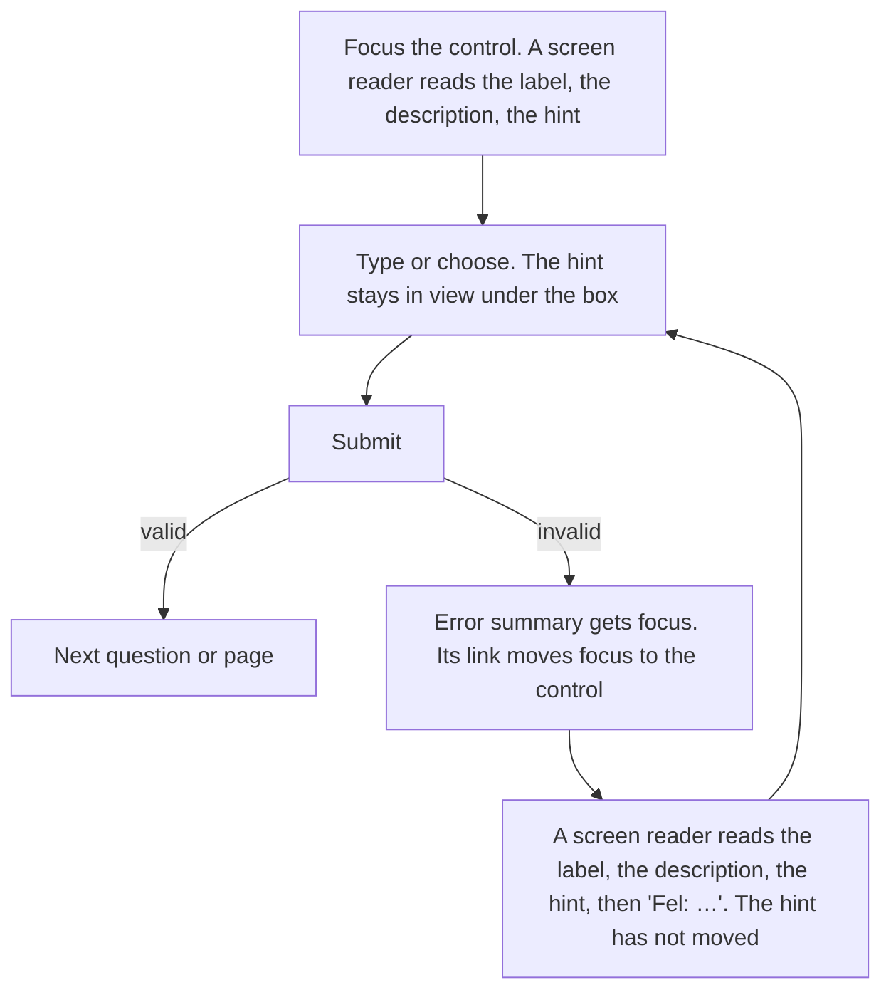

# Design spec: Field.Hint, a 14px hint under the control, and the description above it

- **Status:** Draft
- **Designer:** ux-designer agent · **Date:** 2026-10-04
- **Plan:** [docs/plans/0029-field-hint.md](../plans/0029-field-hint.md)
- **Type:** component default styling, plus a DESIGN.md rule change (no token or colour change)
- **Supersedes, in [form-fields.md](form-fields.md):** §4.4 "Which hint goes where", the hint rows of the §6.2 class table, the §6.4 spacing table rows that name a hint, the option-hint bullet in §6.5, the "hint above, error" and "hint under the control" rows of the §6.7 density table, and the date example's position (§6.6, open question 4). Everything else in that spec stands.

The maintainer's rule (2026-10-04): _"hint is not a prose, hint is hint and should be the 14px text size, a hint is almost always underneath the input, and above input there can be a prose as a description."_ The same day he confirmed it as absolute: a hint is always under the control.

## 1. Brief

- **Users:** both. Residents who fill in a form once, and staff who use a compact tool every day.
  - **Hardest case 1:** a 74-year-old resident at 400% zoom (320 CSS px) with a screen magnifier. Finnish is their first language, and they're using a Swedish municipality's service in Finnish. They see the label, the box and a little of what's under it, one piece at a time.
  - **Hardest case 2:** a screen-reader user who hears the label, the description and the hint as one string when they focus the box, and can't skim back and forth.
  - **Hardest case 3:** a case worker with low vision on a compact staff form, eight hours a day, reading 14px hints next to 14px labels.
- **Job to be done:** When I reach a question, I want to know what to answer, and then how to type it, so I get it right the first time and don't get an error.
- **Context:** any device. The hint is read while typing, often with the on-screen keyboard open. Residents may be stressed (benefits, permits, deadlines).
- **Constraints:** WCAG 2.2 AA (1.3.1, 1.3.2, 1.4.3, 1.4.4, 1.4.10, 1.4.12, 3.3.2). AGENTS.md hard rule 4: hint text is the adopter's, so the library adds no message keys (the story fixtures carry keys in all six locales). No form state.
- **Success criteria:**
  - Fewer format errors on the first submit for fields with a format hint than for the same field without one.
  - Participants tell the description, the hint and the error apart without being told.
  - No horizontal scrolling at 320px, and no clipping under the 1.4.12 overrides.
- **Evidence:** none of our own. The prior art below is public design-system guidance, not research on our users.
- **Assumptions and research questions:**
  - Assumption: a format hint under the box is seen before or while typing, even at 400% zoom. → RQ: do magnifier users see "12 siffror, ÅÅÅÅMMDD-NNNN" before they type, or only after the error?
  - Assumption: 14px in `text` colour is readable enough for a short hint, because it's high contrast, plain and never the only place the format lives (the error repeats it). → RQ: do low-vision participants without AT read the 14px hint, and do they ask for it bigger?
  - Assumption: a size difference (16px label, 14px hint) is enough to tell an option's label from its hint without a colour difference. → RQ: in a radio group with option hints, do participants read the hint as part of the option, or as a separate option?
  - Assumption: the description, then the hint, then "Error: …" is a good order to hear. → RQ (already in `field.a11y.md`): Designsystemet reads the error first. Is that better?

## 2. Prior art

| Source                                                                                      | What we reuse                                                                                                                                                                                                                                                                            | What we change and why                                                                                                                                                                                                                                                                                                             |
| ------------------------------------------------------------------------------------------- | ---------------------------------------------------------------------------------------------------------------------------------------------------------------------------------------------------------------------------------------------------------------------------------------- | ---------------------------------------------------------------------------------------------------------------------------------------------------------------------------------------------------------------------------------------------------------------------------------------------------------------------------------- |
| KvirnUI `Field.Prose` (Plans 0025, 0028), `docs/design/form-fields.md`                      | The registration (`useDescriptionPart`), `aria-describedby` in DOM order then the error, `--kv-field-gap`, the text colour, the choice-row grid                                                                                                                                          | The size moves from the position to the part. Before, a Prose was 16px above and 14px under the control, by a `~` sibling selector nobody could see in the markup. Now a Prose is always 16px and a Hint is always 14px                                                                                                            |
| [GOV.UK Text input](https://design-system.service.gov.uk/components/text-input/): hint text | "Help that's relevant to the majority of users", "a single short sentence", **"do not use links in hint text"**, because screen readers read the description without saying it's a link. Hints sit outside the label, and option hints sit under the option label, aligned with its text | GOV.UK puts the hint above the input and the error between the hint and the input. We put the hint under the control (the maintainer's rule) and the error last. The relative order is the same as GOV.UK's: hint, then error. GOV.UK hints are grey; ours stay `text` (DESIGN.md: never `text-muted` for what the user must read) |
| [Designsystemet (NO) Field](https://designsystemet.no/en/components/docs/field/overview)    | The anatomy: Label, `Field.Description` above the input, the input, `ValidationMessage` under it. A description is a separate, named part                                                                                                                                                | Designsystemet puts its `Field.Counter` after the validation message. Our hint is static text, not a counter, and sits next to the box it describes, before the error (see §2.1). Designsystemet lists the error first in `aria-describedby`; we keep DOM order (Plan 0029 non-goal)                                               |
| Digi (Arbetsförmedlingen, SE)                                                               | Not used. Its docs page didn't render for this session, so its order wasn't verified (open question 6)                                                                                                                                                                                   | –                                                                                                                                                                                                                                                                                                                                  |
| Material Design text fields: supporting text                                                | Supporting text under the field, smaller than the input text                                                                                                                                                                                                                             | Material **replaces** the supporting text with the error. We never do: the hint usually holds the format the user needs to fix the error                                                                                                                                                                                           |
| APG                                                                                         | None: a form field has no APG pattern. Native `<label for>` plus `aria-describedby` ([field.a11y.md](../../packages/react/src/field/field.a11y.md))                                                                                                                                      | –                                                                                                                                                                                                                                                                                                                                  |

### 2.1 Decision: the anatomy and default order

```
Field.Label          what we ask                                   label type, 16px (14px compact)
Field.Prose          description, optional: what, why, where       body, 16px, may hold paragraphs, lists, links
<control>            Input, InputGroup, Listbox, …
Field.Hint           hint, optional: format, example, limit        body-small, 14px
Field.ErrorMessage   only while invalid                            label type, 16px, danger, icon, "Fel:"
```

A Fieldset is the same: `Fieldset.Legend`, `Fieldset.Prose`, the controls (options, the three date boxes), `Fieldset.Hint`, `Fieldset.ErrorMessage`. An option's Field is the choice row: `Checkbox` or `Radio`, `Field.Label`, `Field.Hint`, and an error only for a standalone checkbox.

**The error goes after the hint, not between the control and the hint.** Reasons, most important first:

1. **The visual order matches the spoken order (1.3.2).** `aria-describedby` is the descriptions in DOM order, then the error, and that's fixed (Plan 0029 non-goal). With the error last, a screen-reader user and a sighted user meet the parts in the same order. With the error above the hint, the screen reader would say "hint, Error: …" while the page shows "error, hint".
2. **Nothing moves when the error appears.** The error is added at the end of the field, so the hint stays exactly where the user last saw it, next to the box. Above the hint, the error would push the hint down, which a magnifier user experiences as content jumping out of view.
3. **The hint belongs to the box.** It's about typing (a format, a limit), so it sits closest to where the user types. The error is about the answer as a whole.
4. **It's the same relative order as GOV.UK** (hint, then error) and the same "message under the control" as Designsystemet.

The cost: when there is a hint, the error is one hint line (21px plus a gap) further from the box. The error must therefore make sense on its own, and repeats the format when the format is the problem ("Skriv personnumret med 12 siffror, ÅÅÅÅMMDD-NNNN"). Pages keep `scroll-padding` so the error isn't under the on-screen keyboard (form-fields.md §3).

## 3. Flow

A hint has no flow of its own. It's part of answering a question:



Unhappy paths:

- **Validation error:** the error is added after the hint. The hint text, colour and position don't change. The error restates the format if the format is wrong.
- **Missed hint:** a magnifier user types before seeing the hint under the box. The error repeats the format, so they can still fix it. The description above holds anything they must know **before** they start.
- **Disabled:** the hint stays readable in `text`, and often says why the field can't be used.
- **Read-only:** the hint should say why the value can't change ("Du kan inte ändra ditt personnummer här.").
- **Empty, loading, timeout, save and return, back, integration failure, not eligible:** not the hint's concern. They belong to the page or block.

## 4. Content

### 4.1 What a hint is

A **hint** (`Field.Hint`, `Fieldset.Hint`) is:

- one or two short sentences, or a format example, or a limit. Aim for one line at 40rem in Swedish, about 80 characters, and never more than two sentences;
- plain text only: no headings, lists, links, buttons, images or bold. A screen reader reads it as one flat string, and a link in it can't be followed from the control (GOV.UK);
- about **how** to type the answer: "Till exempel ABC 123", "12 siffror, ÅÅÅÅMMDD-NNNN", "Högst 500 tecken.";
- a sentence ends with a full stop, and a fragment or example doesn't ("Till exempel ABC 123");
- a pattern with plain words first ("12 siffror, …"), because "ÅÅÅÅMMDD-NNNN" alone is read letter by letter and means little in a second language. The pattern letters are translated (ÅÅÅÅ, VVVV, YYYY), never copied from Swedish;
- an example value that is obviously an example and never a real person's identity number;
- never the only place the format lives: the error repeats it;
- never a placeholder, never the label again, never the error.

A **description** (`Field.Prose`, `Fieldset.Prose`) is everything the user needs **before** they answer: what to answer, why we ask, where to find it, and anything with structure (paragraphs, a list, a link). It goes above the control, at 16px.

When in doubt: if the user must read it before they start, it's a description. If it helps while typing, it's a hint.

### 4.2 Example copy (story fixture keys)

These live in `FormTexts` in `apps/storybook/src/components/form/form.fixture.tsx`, in all six locales. The library adds no message keys (Plan 0029: hint text is the adopter's).

| Fixture key                              | en                                                                | sv                                                              | fi                                                               | Part                                                                                              |
| ---------------------------------------- | ----------------------------------------------------------------- | --------------------------------------------------------------- | ---------------------------------------------------------------- | ------------------------------------------------------------------------------------------------- |
| `personalNumber` (exists)                | Personal identity number                                          | Personnummer                                                    | Henkilötunnus                                                    | Label                                                                                             |
| `personalNumberWhy` (new)                | We use it to get your details from the Swedish Tax Agency.        | Vi använder det för att hämta dina uppgifter från Skatteverket. | Haemme sen avulla tietosi Ruotsin verovirastosta (Skatteverket). | Description above                                                                                 |
| `personalNumberFormat` (new)             | 12 digits, YYYYMMDD-NNNN                                          | 12 siffror, ÅÅÅÅMMDD-NNNN                                       | 12 numeroa, VVVVKKPP-NNNN                                        | Hint under                                                                                        |
| `personalNumberError` (new)              | Enter your personal identity number with 12 digits, YYYYMMDD-NNNN | Skriv personnumret med 12 siffror, ÅÅÅÅMMDD-NNNN                | Kirjoita henkilötunnus 12 numerolla, VVVVKKPP-NNNN               | Error, repeats the format                                                                         |
| `personalNumberHint` (exists)            | You can’t change your personal identity number here.              | Du kan inte ändra ditt personnummer här.                        | Henkilötunnusta ei voi muuttaa täällä.                           | Hint under a read-only field: why                                                                 |
| `registrationWhere` (exists)             | You can find it on the vehicle registration certificate.          | Det står på registreringsbeviset.                               | Löydät sen ajoneuvon rekisteröintitodistuksesta.                 | Description above                                                                                 |
| `registrationHint` (exists)              | For example, ABC 123                                              | Till exempel ABC 123                                            | Esimerkiksi ABC-123                                              | Hint under                                                                                        |
| `visitDateExample` (exists)              | For example, 27/3/2026                                            | Till exempel 2026-03-27                                         | Esimerkiksi 27.3.2026                                            | `Fieldset.Hint` under the date boxes (was a description above)                                    |
| `messageLimit` (new)                     | Up to 500 characters.                                             | Högst 500 tecken.                                               | Enintään 500 merkkiä.                                            | Hint under a textarea. Static: a live count is a later component                                  |
| `durationHint` (new)                     | The lowest price per month.                                       | Lägst pris per månad.                                           | Edullisin kuukausihinta.                                         | Option hint (form-fields.md `permit.duration12Hint`)                                              |
| `grantReferenceHint` (new, length check) | It’s on the decision about your housing adaptation grant.         | Det står i beslutet om bostadsanpassningsbidrag.                | Löydät sen asunnon­muutostyö­avustus­päätöksestä.                | Hint under, with `longLabel`. The `fi` string has soft hyphens (U+00AD) in its 34-letter compound |

## 5. Structure

A field adds no landmark or heading. Reading order = DOM order = visual order = `aria-describedby` order.

**320px (and 400% zoom), comfortable:**

```
[Field.Root .kv-field]                           single column, full width
  label.kv-field-label         Personnummer
  div.kv-prose#…-a             Vi använder det för att hämta dina uppgifter
                               från Skatteverket.                      16px
  input.kv-input--width-20     [_________________________]             44px
  p.kv-field-hint#…-b          12 siffror, ÅÅÅÅMMDD-NNNN               14px
  p.kv-field-error-message     (!) Skriv personnumret med 12 siffror,
                               ÅÅÅÅMMDD-NNNN                           16px, danger
```

Input `aria-describedby="…-a …-b …-error"`.

**40rem:** the same column. The hint and the description wrap at `--kv-prose-measure`. A narrow input (`--width-6`) doesn't narrow the hint.

**64rem with `kv-compact` (staff):** the same order. Label 14px, input 32px, gaps 4px. The description stays 16px, and the hint stays 14px.

**Choice row (an option with a hint):**

```
[Field.Root .kv-field, grid: 24px | 1fr, column gap 12px]
  ( ) ┌─ label, whole row, ≥44px high (32px compact) ─────────┐  ← target
      └───────────────────────────────────────────────────────┘
      Lägst pris per månad.            hint: column 2, 14px, directly under the label's box
  (8px, 4px compact, to the next option)
```

**Fieldset with a group hint (a date):**

```
fieldset.kv-fieldset
  legend          När var besöket?
  [Dag] [Månad] [År]          the DateInput row
  p.kv-field-hint             Till exempel 2026-03-27              14px
  p.kv-field-error-message    (only while invalid)
```

## 6. Visual specification

| Part                                                         | Tokens and component style (DESIGN.md)                                                                                                                                                                          | Density                                          | Notes                                                                                                                                                                                                                                    |
| ------------------------------------------------------------ | --------------------------------------------------------------------------------------------------------------------------------------------------------------------------------------------------------------- | ------------------------------------------------ | ---------------------------------------------------------------------------------------------------------------------------------------------------------------------------------------------------------------------------------------- |
| `kv-field-hint`                                              | `--kv-font-body-small-size` (14px), `-weight` (400), `-line-height` (1.5, 21px), `-letter-spacing`, `-feature-settings`. `color: var(--kv-color-text)`. `margin: 0`. `max-inline-size: var(--kv-prose-measure)` | 14px in both densities. There is no smaller step | Inherits the field's hyphenation (`hyphens: auto`, `hyphenate-limit-chars: 10 4 4`, `overflow-wrap: break-word`). Logical properties only. No border, fill or icon. Flush with the control's inline start, including under an InputGroup |
| `kv-field-hint` in a choice row                              | Column 2 (`grid-column: 2`), so its start lines up with the label's text, not the box                                                                                                                           | Same                                             | Directly under the label's box: 0 gap (below). Outside the label, so not part of the target                                                                                                                                              |
| `kv-prose` directly in a Field or Fieldset (the description) | `body` (16px, 1.5), `text`, `margin: 0`, the prose measure                                                                                                                                                      | 16px in both densities                           | **Anywhere**, including under the control and in a choice row. The position-based 14px rule (`theme.css` around line 2539) is removed                                                                                                    |
| `kv-field-error-message`                                     | Unchanged: `label` type at 16px, `danger`, icon, indent                                                                                                                                                         | Unchanged                                        | Differs from the hint in size (16 vs 14), weight (500 vs 400), colour, icon and indent: never colour alone                                                                                                                               |

### 6.1 Spacing

Every part is one `--kv-field-gap` from the next, in any order: `--kv-space-2` (8px), and `--kv-space-1` (4px) in `kv-compact` from 64rem. The one new rule is the option hint.

| Between                                         | Comfortable | Compact (from 64rem) | Token                                          | Notes                                                                                                                                                                                                                                                                                                                                                                                                                                       |
| ----------------------------------------------- | ----------- | -------------------- | ---------------------------------------------- | ------------------------------------------------------------------------------------------------------------------------------------------------------------------------------------------------------------------------------------------------------------------------------------------------------------------------------------------------------------------------------------------------------------------------------------------- |
| Label → description                             | 8px         | 4px                  | `--kv-field-gap`                               |                                                                                                                                                                                                                                                                                                                                                                                                                                             |
| `--heading` label or legend → next part         | 16px        | 16px                 | `--kv-field-gap` + `--kv-space-2`              | Unchanged, never compact                                                                                                                                                                                                                                                                                                                                                                                                                    |
| Description → control                           | 8px         | 4px                  | `--kv-field-gap`                               |                                                                                                                                                                                                                                                                                                                                                                                                                                             |
| Label → control (no description)                | 8px         | 4px                  | `--kv-field-gap`                               |                                                                                                                                                                                                                                                                                                                                                                                                                                             |
| Control → hint                                  | 8px         | 4px                  | `--kv-field-gap`                               | The focus ring reaches 4px outside the control (2px offset, 2px ring). In compact it ends at the top of the hint's line box and never overlaps its glyphs, since the line box includes the half-leading and the ascent above Å. Check in the `Compact` screenshot (polish)                                                                                                                                                                  |
| Hint → error                                    | 8px         | 4px                  | `--kv-field-gap`                               | No extra space: a bigger gap pushes the error further from the box for a magnifier user                                                                                                                                                                                                                                                                                                                                                     |
| Control → error (no hint)                       | 8px         | 4px                  | `--kv-field-gap`                               |                                                                                                                                                                                                                                                                                                                                                                                                                                             |
| Legend → description                            | 8px         | 4px                  | legend `margin-block-end: var(--kv-field-gap)` |                                                                                                                                                                                                                                                                                                                                                                                                                                             |
| Last option or DateInput row → group hint       | 8px         | 4px                  | `--kv-field-gap`                               |                                                                                                                                                                                                                                                                                                                                                                                                                                             |
| Group hint → group error                        | 8px         | 4px                  | `--kv-field-gap`                               |                                                                                                                                                                                                                                                                                                                                                                                                                                             |
| **Option label's box → option hint**            | **0**       | **0**                | **`--kv-space-0`**                             | **New.** The label's box is already padded to 44px (32px compact), so the text-to-text distance is about 11px of label padding plus the hint's half-leading. With the old 8px row gap, an option hint was as far from its own label (about 22px) as from the next option's label, so it could be read as belonging to either. Mechanism is the engineer's: for example, cancel the row gap on a hint that directly follows the option label |
| Option hint → next option                       | 8px         | 4px                  | `--kv-field-gap`                               | Plus the next label's own padding, about 22px text to text, so the hint groups with its own option                                                                                                                                                                                                                                                                                                                                          |
| Option row and hint → standalone checkbox error | 8px         | 4px                  | `--kv-field-gap`                               | Unchanged                                                                                                                                                                                                                                                                                                                                                                                                                                   |

Everything stays on the 4px grid.

### 6.2 Decision: option hints are 14px too

An option hint under a checkbox or radio label is a `Field.Hint` at 14px, like every hint. No exception.

- **Legibility and hierarchy.** An option label is 16px at weight 400 in `text`. A 16px option hint, also 400 in `text`, looked exactly like a second line of the label: the only difference was a gap. At 14px the hint reads as about the option, not as part of it, without using `text-muted` (which DESIGN.md forbids for instructions). This is the GOV.UK pattern, which uses one hint style for options and fields.
- **Target size.** The target is the label's box, at least 44px high (32px compact), across the whole row. The hint sits outside the label, directly under it, so it neither shrinks nor grows the target. A tap that lands on the hint does nothing, which also gives a little buffer before the next option (2.5.8 spacing).
- **Alignment.** The hint is in column 2, so its start lines up with the label's text, 36px from the row's start (24px box plus 12px gap), and never under the box. The box stays centred on the label's first line. In RTL the columns mirror.
- **One rule.** A hint is 14px everywhere, so an adopter never has to know where a part sits to know its size.
- **The cost (open question 1):** in compact, an option label is 14px at weight 400 too, so the label and its hint have the same type. They are told apart only by position (beside the box, or under it, with no box). Staff use these forms daily, which lowers the risk, but it's a research question.

An option that needs more than a hint (a paragraph, a link to the price list) puts a `Field.Prose` there instead. It's 16px, in column 2, with the normal 8px gap.

### 6.3 Decision: a hint is always under the control (maintainer, 2026-10-04)

- **A hint goes under the control, never above it.** The first version of this spec allowed a rare hint above the control. The maintainer ruled it out: text the user reads before answering is a description, so it is a `Field.Prose` (16px) above the control, and a `Field.Hint` (14px) is only ever under it.
- **The size still belongs to the part, not the position.** That is the point of Plan 0029: no hidden sibling selector.
- **A guard:** a Hint rendered before its control in the DOM warns once in development (`hint-before-control`). The warning says to move it under the control, or to use a `Field.Prose` above.
- The `SizeFollowsThePart` story is removed: with a Hint never above the control, it showed nothing the other stories don't. The DateInput fixtures had a `Fieldset.Hint` above the boxes. They now put it under them.

### States

| Part                     | default     | hover               | focus-visible       | active | disabled                                                                                                                                                                                                 | invalid                                                                                                                             | read-only                                                 | loading | selected / open | empty                       |
| ------------------------ | ----------- | ------------------- | ------------------- | ------ | -------------------------------------------------------------------------------------------------------------------------------------------------------------------------------------------------------- | ----------------------------------------------------------------------------------------------------------------------------------- | --------------------------------------------------------- | ------- | --------------- | --------------------------- |
| `kv-field-hint`          | 14px `text` | – (not interactive) | – (never focusable) | –      | **Unchanged, `text`.** The control and a disabled option's label go to `text-muted`, but the hint stays readable, because it often says why the field is disabled. `data-disabled` is set but not styled | **Unchanged.** No colour, icon or weight change. The error after it carries the state (1.4.1). `data-invalid` is set but not styled | Unchanged. Its copy should say why the value can't change | –       | –               | Not rendered: leaves no gap |
| Description (`kv-prose`) | 16px `text` | –                   | –                   | –      | Unchanged                                                                                                                                                                                                | Unchanged                                                                                                                           | Unchanged                                                 | –       | –               | Not rendered                |

The theme never styles `.kv-field-hint[data-invalid]` or `[data-disabled]`. The attributes are there for adopters.

### Modes

- **Dark, light-contrast, dark-contrast:** `text` on `canvas`, `surface` and `surface-raised` is already measured by `theme:check` in all four themes. No new pair.
- **Forced colours:** the hint is `CanvasText` like all text, with no border or fill to lose. In forced colours the error loses `danger` too, and is still told apart from the hint by its icon, weight (500), size (16px), indent and the spoken "Fel:" prefix.
- **RTL:** logical properties only. The hint aligns to the inline start, and an option hint's column mirrors with the grid. A format example with neutral characters at its edges (`ABC 123.`, `ÅÅÅÅMMDD-NNNN`) inside right-to-left text should go in `<bdi>` or `<span dir="ltr">` so its punctuation stays put. That's the consumer's markup, shown in the `RTL` story.
- **Motion:** none.
- **200% zoom and text-only zoom (1.4.4):** every size is in `rem`, so the hint grows with the browser's text size and stays 0.875 × the body size.
- **320px reflow and 400% zoom (1.4.10):** no fixed width or height. The hint wraps inside the field at any width.
- **Text spacing (1.4.12):** no fixed block size. Line height 1.5 already meets the override.
- **Long Finnish words:** the field's `hyphens: auto` with `lang` set. Chromium has no Finnish dictionary (DESIGN.md, Layout), so `overflow-wrap: break-word` breaks a long compound anywhere there. Put soft hyphens in long compounds in hint copy (`grantReferenceHint`) for the same result in every browser.
- **Compact:** the hint stays 14px with line height 1.5. Only the gaps (4px) and the label (14px) change.

### New or changed tokens

None. No colour, size, space or radius is added. `theme:check` should still run, because `theme.css` changes (the orchestrator runs it).

## 7. Accessibility annotations

Draft input for `field.a11y.md` and `fieldset.a11y.md` (the Field contract also covers the Hint page).

- **Roles and native elements:** `Field.Hint` and `Fieldset.Hint` render a plain `<p class="kv-field-hint" id>` with no role. `render` can swap the element (a `<div>`), never to something interactive.
- **Accessible names:** the hint is never part of the name. It's outside the `<label>`, so the name stays the visible label (2.5.3).
- **Description:** the control's (or the `<fieldset>`'s) `aria-describedby` lists every rendered description, Prose and Hint alike, in DOM order, then the error id while invalid. With the default order: description, hint, error. A hint that isn't rendered isn't listed, and the attribute is never empty. An option's hint describes that option's input, not the group.
- **Focus:** the hint is never focusable (no `tabindex`), and moves no focus. Tab goes from the control to the next control. `field.a11y.md`'s Keyboard section already has the row "Tab skips the hint and the error message", which the Hint page shows.
- **Announcements:** none, and **no live region**. The hint is read as part of the control's description when the control gets focus. It isn't `role="status"`, `aria-live` or the Announcer. A hint whose text changes while the user types (a live character count) is a different component, later.
- **WCAG SCs of note:** 1.3.1 and 3.3.2 (the hint is associated with the control), 1.3.2 (the visual order equals the spoken order), 1.4.1 (invalid is the error's text, icon and edge, never the hint's colour), 1.4.3 (`text`), 1.4.4, 1.4.10, 1.4.12, 2.5.8 (an option hint is outside the target).
- **Outside a Field or Fieldset:** a Hint warns `hint-outside-field` and renders a plain `<p class="kv-field-hint">` with no id. It describes nothing, so the warning matters.
- **AT research for the matrix (pending):** is a fieldset's description, including its hint, read on entering the group in NVDA, JAWS, VoiceOver (macOS and iOS) and TalkBack? Is the option hint read for each radio? Is a pattern like "ÅÅÅÅMMDD-NNNN" understandable when spoken?

## 8. DESIGN.md changes

Exact replacement text, for the maintainer's approval. No token values change, so `theme:check` needs no new pair. The engineer applies these in the same change as `theme.css` (Plan 0029 task).

**Front matter, `components`: add after `input`:**

```yaml
field-hint:
  textColor: '{colors.text}'
  typography: '{typography.body-small}'
```

**Line 274, the `text-muted` row's Use column:**

> Secondary text and metadata. Never hints or descriptions: they are instructions, so they use `text`

**Line 334:**

> - `body-small` (14px) is for metadata and for the hint (`Field.Hint`, `kv-field-hint`), and never for errors or descriptions. A hint is a short instruction or format example, always under the control, never above it, and read with it: always `text`, never `text-muted`, in every density. Anything the user must read before answering is a description: a `Prose` above the control, at `body`.

**Line 489 (Text inputs):**

> - **Text inputs.** A visible label, then an optional description, then the input, then an optional hint, then the error message. The description is a `Prose` above the input, at `body`, for what to answer, why and where to find it, and it may hold paragraphs, lists and links. The hint is a short instruction, format example or limit under the input, at `body-small`, in plain text with no links. The error comes last, under the input and any hint, so the visual order is the spoken order. No placeholder-only labels. The input width reflects the expected answer (a postcode field is short).

**Line 490 (Parts):**

> - Parts: `Field.Root` with `Field.Label`, `Field.Prose` (the description), the control (`TextInput`), `Field.Hint` and `Field.ErrorMessage`, and `Fieldset.Root` with `Fieldset.Legend` and the same parts for a group. KvirnUI holds no form state: the form logic sets `invalid`, `required` and `disabled`, and writes the messages. A Prose or a Hint in a Field or Fieldset registers as a description, and a field can have several. The size belongs to the part, not its position: a Prose is `body` and a Hint is `body-small` wherever they sit. A Hint goes under the control, never above it: what the user must read before answering is a description, a `Prose` above the control. This order is the default in the theme, the stories and the docs. The consumer owns the markup, and `aria-describedby` always lists the descriptions (Prose and Hint) in DOM order, then the error. On submit, move focus to the error summary (or the first invalid field) and keep `scroll-padding` on the page, so the on-screen keyboard doesn't cover the message under the field.

**Line 493 (the third sentence onwards):**

> - The label is `label` type (`label-compact` in compact). A field that isn't required ends its label with "(optional)" in weight 400, which is part of its name. Required fields carry no marker. A description is `body` (16px) and a hint is `body-small` (14px, line height 1.5), in both densities, both in `text` and never `text-muted`. A hint never changes with the field's state: the error carries invalid, and a disabled or read-only field's hint stays `text`. Errors are `label` type at 16px in `danger` with the error icon and a visually hidden "Error:" prefix, and repeat the format when the format is the problem.

**Line 498 (Checkboxes and radios):**

> - **Checkboxes and radios** are at least 24px, with the whole label clickable, and are grouped in a `fieldset` with a `legend` question. An option's hint is a `Field.Hint` in the option's Field: `body-small`, lined up with the label's text and directly under the label's box, outside the target. A group's error message goes under the options and any group hint, and a single checkbox's under its label and hint.

**Line 512 (Theming), two edits:**

1. In the list of form parts, after `kv-field-optional`, add `kv-field-hint`:

   > The form parts render `kv-field`, `kv-field-label`, `kv-field-optional`, `kv-field-hint`, `kv-field-error-message`, …

2. Replace the sentence "The hint is a `kv-prose` that is a direct child of `kv-field` or `kv-fieldset`, which the theme sets in the text colour in every density, in body type above a control and for an option's hint, and in `body-small` under a control." with:

   > The description is a `kv-prose` that is a direct child of `kv-field` or `kv-fieldset`, in `body` and the text colour wherever it sits. The hint (`Field.Hint`, `Fieldset.Hint`) renders `kv-field-hint`, in `body-small` and the text colour in every density and position, and takes `data-invalid` and `data-disabled`, which the theme doesn't style.

**Line 554 (Don't):**

> - Use all caps, justified text, italic paragraphs, or text smaller than 16px for errors, descriptions or an instruction above a control. The hint (`body-small`) is the one 14px instruction, and it goes under the control.

Lines 332 and 503 are unchanged. Their disagreement about whether Prose has a smaller size is out of scope (open question 7).

## 9. The Storybook Hint page

`Components/Form/Hint`, with `component: Field.Hint` and the contract `field.a11y.md`. Locale `sv` by default, in `kv-story-form`. The stories replace `InField`, `WithExample`, `AboveAndUnder` and `SixteenAboveAndForOptions`.

| Story             | Purpose                                                                                                                              |
| ----------------- | ------------------------------------------------------------------------------------------------------------------------------------ |
| `Keyboard`        | The fixture the keyboard tests drive: Tab goes to the input and never stops on the description or the hint                           |
| `UnderTheControl` | The default: label, input, `Field.Hint` (`personalNumberFormat`) at 14px, listed in the input's `aria-describedby`                   |
| `WithDescription` | Label, description `Field.Prose` (16px), input, Hint (14px). `aria-describedby` is description, then hint, in DOM order, one id each |
| `Invalid`         | The same field with an error: the hint doesn't change, the error comes last, and the description reads "description hint Fel: …"     |
| `InFieldset`      | `Fieldset.Hint` (`visitDateExample`) under the three date boxes, describing the group                                                |
| `OptionHints`     | A RadioGroup with option hints: 14px, in column 2, directly under the label's box, outside the 44px target                           |
| `Disabled`        | A disabled field: the input is muted, and the hint stays `text` and says why                                                         |
| `ReadOnly`        | A read-only personal identity number with the hint `personalNumberHint` saying why it can't change                                   |
| `Compact`         | `kv-compact`: label 14px, gaps 4px, description 16px, hint 14px. Reviewed by eye: the sizes are not tested (rule 13)                 |
| `LongFinnish`     | `fi`, the long label and `grantReferenceHint` in a 320px column: no horizontal overflow (1.4.10)                                     |
| `RTL`             | Right to left (en): the hint and an option hint align to the inline start, and the example sits in `<bdi>`                           |
| `ForcedColors`    | Forced colours: the hint is `CanvasText`, and the error is still distinct by icon, weight, size and indent                           |

Text spacing (1.4.12) and 400% zoom are covered by the e2e sweep (`E2E_BROWSERS=sweep`), not a story. `hint-outside-field` is a unit test, not a story (it would warn in the console).

The fixtures in `FieldStates` and the form stories move every Prose that sits under a control to `Field.Hint` (Plan 0029 task).

## 10. Validation

- [x] Self-review against `.claude/skills/design/references/review-checklist.md`. One conflict, which needs a skill edit rather than a design change (open question 2): the checklist's blocker "no essential text in `body-small`" versus the maintainer's 14px hint. The spec limits the risk: the hint is short, in `text`, under the control, never the only place the format lives (the error repeats it), and anything needed before answering is a 16px description.
- [x] Contrast: no new colour pair. `text` on the three surfaces is already measured.
- [ ] Usability test plan written below. Result: `pending`.

### Usability test plan (pending)

- **Participants (8 to 10):** two screen-reader users (NVDA with Firefox, VoiceOver on iOS), two screen-magnifier users at 300–400%, two low-vision users without AT, two Finnish speakers using a Swedish service in Finnish, two people with low digital confidence. A second round with three case workers on a compact staff form.
- **Tasks:**
  1. Enter a personal identity number in a field with a description above and a format hint under it.
  2. Choose a permit length in a radio group where one option has a hint.
  3. After a format error, correct the answer.
  4. (Staff) Fill in a compact form with option hints, and say which text belongs to which option.
- **What we measure:** whether the hint is seen or heard before typing; format errors on the first submit; time to fix an error; whether option hints are read as part of the right option; self-rated readability of the 14px hint; whether "ÅÅÅÅMMDD-NNNN" (or the translated pattern) is understood when spoken.

## 11. Handoff

**Text for the plan's Design section:**

> Design spec: [docs/design/field-hint.md](../design/field-hint.md). Order: label, description (`Prose`, 16px, optional), control, hint (`Field.Hint`, `kv-field-hint`, `body-small` 14px, line height 1.5, `text`, prose measure), error last, so the visual order is the `aria-describedby` order. Every part is one `--kv-field-gap` apart (8px, 4px compact), except an option hint, which sits directly under its label's box (0 gap) in column 2. Option hints are 14px (no exception). A Hint above the control is allowed, rare and still 14px. The hint never changes with invalid, disabled or read-only. No new token. DESIGN.md text in §8 of the spec, for the maintainer's approval. Stories: §9.

**For the main session (outside `docs/design/`):** the forms skill (the default order, "Hint colour", the maintainer's preferences on order and size, and the mask rule "a masked TextInput in a Field without a hint warns", which should accept a `Field.Hint`), the design review checklist's `body-small` blocker, the `theme.css` section 12 comments ("hints and errors stay 16px in compact"), and `field.a11y.md` (native elements, the Hint row). Also add this spec to `docs/design/README.md`. The ux-designer wasn't asked to edit that file.

## 12. Open questions

1. **Compact option hints.** In compact, an option label and its hint are both 14px at weight 400, told apart only by position. Accept it, or give compact option labels something more? (Research question in §10.)
2. **The review checklist's blocker** "no essential text in `body-small`" conflicts with the 14px hint. Reword it to "…except the hint under a control, which is never the only place essential information lives"?
3. **A warning for rich content in a Hint.** Should `Field.Hint` warn in development when it contains a link, list or heading, like `InputGroup.Addon` warns on focusable content? This spec only states it in the docs.
4. **The date example moves under the boxes.** form-fields.md put "Till exempel 2026-03-27" above as a description. Under the new rule it's a `Fieldset.Hint` under the row. Confirmed 2026-10-04.
5. **`FileUpload.Limits`** also registers as a description and is a hint in all but name. Should it take the `kv-field-hint` look in a later plan?
6. **Digi (Arbetsförmedlingen)** wasn't verified, because its docs didn't render in this session. Check it before this spec is approved, if it matters for the Swedish audience.
7. **Out of scope, noticed:** DESIGN.md line 503 says Prose has "no smaller size", but line 332 lists `kv-prose--small` (14px).
