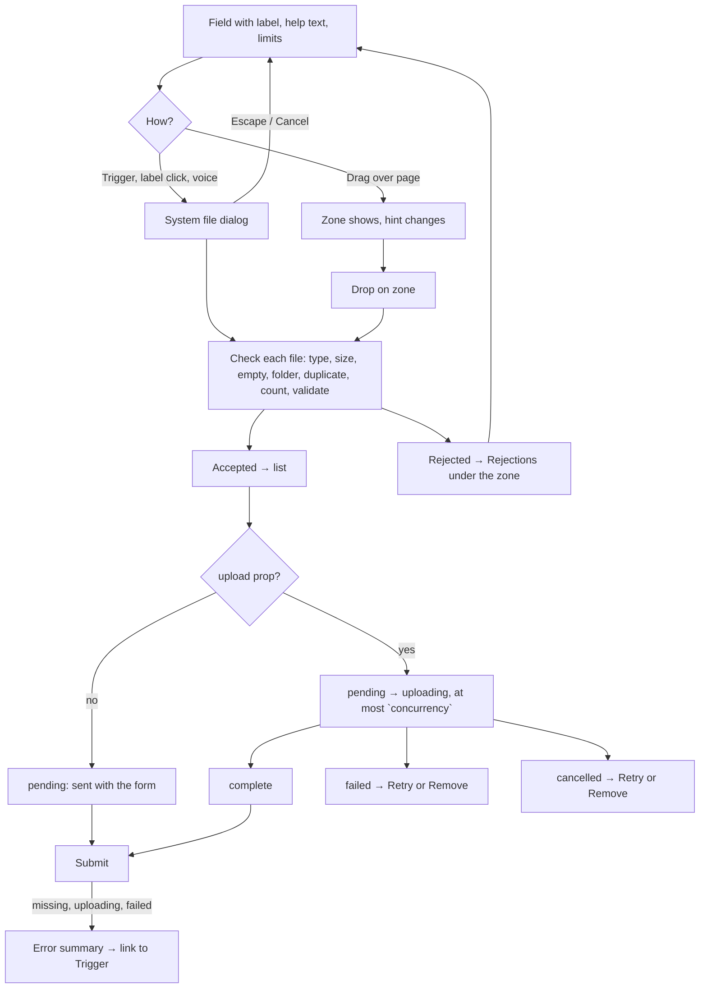

# Design spec: FileUpload

- **Status:** Draft, revised after the independent WCAG review (changelog at the end of §10). §9 Q4 is still open
- **Designer:** ux-designer agent · **Date:** 2026-10-02
- **Plan:** Plan 0021
- **Type:** new component (headless) + default-theme styling + one DESIGN.md rule addition (§6.4)

## 0. Decisions on FileUpload

The brief asked for a decision on six points. Each one is decided here and listed as a decision change in §10.

| #   | Earlier decision says                                                                                            | Decision                                                                                                                                                                                                                                                                                                                                                                                                                                                                                                                                                                                                                                                                                                                                               |
| --- | ---------------------------------------------------------------------------------------------------------------- | ------------------------------------------------------------------------------------------------------------------------------------------------------------------------------------------------------------------------------------------------------------------------------------------------------------------------------------------------------------------------------------------------------------------------------------------------------------------------------------------------------------------------------------------------------------------------------------------------------------------------------------------------------------------------------------------------------------------------------------------------------ |
| D1  | A native `<progress>` per item, named "Uploading report.pdf"                                                     | **Keep, with limits.** Render it **only while `uploading`**, and remove it when the upload ends, so finished items don't keep a progressbar in the tree. Name it with `fileUpload.uploadingFile`. The core rounds the value to whole percent, so a screen reader that reports progress changes (JAWS can) gets at most 100 changes, not thousands. Show the percentage as **visible text** in the status line, so the bar is never the only cue (1.4.1, and forced colours). Never focusable, never live                                                                                                                                                                                                                                               |
| D2  | Drop hint only with `pointer: fine`                                                                              | **Replace it with `any-pointer: fine`, plus drag detection.** `pointer` reports only the _primary_ pointer, so a touchscreen laptop with a trackpad or a tablet with a mouse loses the hint. The drop handlers are **always** attached. The drop zone's box and hint show when `(any-pointer: fine)` matches, **and on any device as soon as a file is dragged over the page** (`data-drag-active`), so an iPad user dragging from Files still sees where to drop. Coarse-only devices get no box and no hint, only the button                                                                                                                                                                                                                         |
| D3  | Trigger name: visible text + Field label through `aria-labelledby` (the earlier decision writes it with a comma) | **Keep the name, without the comma.** Name computation joins the `aria-labelledby` parts with a space, so the name is "Välj filer Bilagor (valfritt)" ("Choose files Attachments (optional)"), or "Välj filer Bilagor" when the Field is required. It starts with the visible text (2.5.3, voice users say "click Välj filer"), and it tells two uploads on one page apart. **Change the wiring:** the Field's control id and `<label for>` go on the **Trigger**, and the native input is taken out of the accessibility tree (`aria-hidden`, `tabIndex={-1}`, visually hidden). Otherwise browse mode and voice control see two controls, and an error-summary link to the Field's id lands on an invisible input, so the user sees no focus (2.4.7) |
| D4  | Rejected files stay in the list with an error and a Remove button                                                | **Rejected files don't enter the list.** They're reported for the latest add only, in `FileUpload.Rejections` directly under the drop zone, one line per file that names it and says how to fix it. The list holds only files that were accepted. Why: a rejected file was never added, so listing it makes residents think it's attached, makes them remove something that isn't there, inflates the count against `maxFiles`, and leaves the consumer to decide whether it blocks submit. Dropping 20 files over a limit of 15 would add five identical error rows. GOV.UK reports rejections as the field's error, and Aksel separates "permanent" errors from the upload list. Failed _uploads_ stay in the list                                   |
| D5  | After a removal, focus goes to the next item's Remove button, else the previous item's, else the Trigger         | **Focus the next item itself** (`<li tabIndex={-1}>`), else the previous item, else the Trigger, and announce "report.pdf har tagits bort". Landing on the next Remove button means one held or repeated Enter (tremor, key repeat, a double tap in TalkBack) deletes a second file the user never chose. On the item, the screen reader reads which file is now there, and Enter does nothing. **The same rule covers every focused button that disappears** (Cancel or Retry pressed, Cancel gone because the upload completed or failed, Retry gone because the upload restarted): focus goes to that item's `<li>`, never to another button (§7.2)                                                                                                 |
| D6  | Retry button on failed uploads                                                                                   | **Retry in place, never re-add.** The component keeps the `File` in memory, so Retry restarts the same file without the picker. Finding a file again in a phone's picker is the hardest step in the whole task. Retry shows on `failed` (when the consumer marks the failure retryable, the default) and on `cancelled`. A permanent failure (a virus, a server-side type check) shows only Remove and the consumer's message, which says what to do                                                                                                                                                                                                                                                                                                   |

Further decisions that follow from these (all in §10):

- **D7. One action button per state** (§6.2). Uploading shows only Cancel, not Cancel and Remove. A cancelled file stays, with Retry and Remove, so a mistaken Cancel costs Tab and one press to undo (focus lands on the item, and Retry is the next Tab stop).
- **D8. Limits come from the component.** `FileUpload.Limits` renders the limits as a description part (the same registration a description `Prose` uses) built from the props, so the text can't disagree with `maxFiles`, `maxFileSize` and `accept`.
- **D9. Limit reached keeps the Trigger focusable** with `aria-disabled="true"`, `data-disabled` (for the disabled look) and a visible `FileUpload.Summary` line that says what to do. It's not `disabled`, which would drop it from the Tab order and hide why. Activation is blocked on every path: Enter and Space on the Trigger, a pointer click, voice control, **and a click on the Field label** (which activates the button through `<label for>`). The click handler returns before opening the input, so all of them are covered by one check.
- **D10. Single-file mode (no `multiple`) replaces** the file instead of appending, and the Trigger reads "Byt fil". Appending and then rejecting with "you can add 1 file" is a trap.
- **D11. Exact duplicates and empty files are rejected** by default (`errorDuplicate`, `errorEmpty`), and a dropped folder gets its own message (`errorFolder`). An `allowDuplicates` prop turns the duplicate check off (§9 Q3).
- **D12. Announcements are one sentence group per batch,** built by one buffer per Announcer that every FileUpload on the page shares, with no Announcer `key` (§7.3). The Announcer's throttle drops messages rather than delaying them, so a key would lose "uploaded" messages, and two buffers would replace each other's messages.

## 1. Brief

- **Users:** both.
  - Residents attaching evidence to an application: a doctor's certificate, receipts, a photo of damage, a scanned ID. Usually once, often on a phone, often with photos straight from the camera roll, sometimes under stress (a deadline, a benefit at stake).
  - Staff attaching case documents every day, on a desktop, often dragging from a file manager, sometimes many files at once, in compact density.
- **Hardest-case users:**
  1. **A screen-reader user on a phone** (VoiceOver on iOS, TalkBack) who picks three photos, all named `image.jpg`, one of them too large, and must know which one failed and fix it without seeing the thumbnails.
  2. **A resident with a tremor or using a switch** who can't drag, may double-press, and must never delete a second file by accident.
  3. **A low-vision resident at 400% zoom (320 CSS px)**, in Windows Contrast Themes, who sees part of the list at a time and can't rely on colour or on a bar.
  4. **A second-language reader with low digital confidence** who doesn't know what "upload", "MB" or "file type" means, and needs each error to say what to do.
  5. **A staff user** dropping 20 files with a 15-file limit, who needs one clear summary, not 20 announcements.
- **Job to be done:** When a service asks for documents, I want to add the right files, see that they're attached, and fix any that aren't accepted, so I can send my application and not be asked again.
- **Context:** any device. Files come from the camera roll, a downloads folder or a scanner app. Connections can be slow (a phone in the countryside). Uploads can take minutes.
- **Constraints:** no network code in the library (hard rule 7); file content read only for an image preview (GDPR data minimisation); no hard-coded strings (hard rule 4); announcements only through the Announcer, which replaces a pending message within 100 ms; only DESIGN.md tokens; no timers that end an upload (2.2.1).
- **Success criteria:**
  - Every state in §6.2 has a story with 0 axe violations in the four themes, RTL and forced colours.
  - e2e: add files with the keyboard (file chooser) and by drop; a rejected file is named in text under the Trigger and never appears in the list; remove, cancel and retry keep focus off `body`; no horizontal scroll at 320px with a 120-character Finnish file name.
  - Unit: one Announcer call per batch, never two within 100 ms; no percentage is ever announced.
  - Usability (§8, `pending`): participants attach three files, one rejected, and fix it, without help.
- **Evidence:** none from users. Prior art in §2. GOV.UK reports Dragon users could activate its improved file upload (design-system.service.gov.uk, 2025).
- **Assumptions and research questions:**
  - Assumption: residents understand a rejected file was _not_ added when it's reported under the button and absent from the list. → RQ: after adding three files with one rejected, can participants say how many files are attached?
  - Assumption: focusing the next item after a removal is clear to screen-reader users. → RQ: do NVDA, VoiceOver and TalkBack users know what happened, and where they are?
  - Assumption: the visible percentage is enough, and nobody needs progress announced. → RQ: do screen-reader users want to check progress, and can they find the progressbar?
  - Assumption: iPhone photos chosen with `accept="image/jpeg"` arrive as JPEG (Safari converts HEIC). → RQ for engineering, on real devices (§9).

## 2. Prior art

| Source                                                                                                      | What we reuse                                                                                                                                                                                                       | What we change and why                                                                                                                                                                                |
| ----------------------------------------------------------------------------------------------------------- | ------------------------------------------------------------------------------------------------------------------------------------------------------------------------------------------------------------------- | ----------------------------------------------------------------------------------------------------------------------------------------------------------------------------------------------------- |
| [GOV.UK File upload](https://design-system.service.gov.uk/components/file-upload/) (improved version, 2025) | A visible secondary button "Choose file", a visible drop zone with "or drop file", errors that state the rule ("The selected file must be smaller than 2MB", "The selected file is empty", "…up to [number] files") | Our errors **name the file** (several files at once) and add the fix. Rejections aren't the field's error (§7.4). Multiple files get a list with per-file status                                      |
| [Aksel FileUpload](https://aksel.nav.no/komponenter/core/fileupload) (NAV, NO)                              | Dropzone + Trigger + Item parts, per-item Retry and Delete, "permanent" errors kept apart from upload errors, server-side checks stated in the docs                                                                 | Aksel marks the drag-and-drop text `aria-hidden`. We leave the hint readable: it's visible text, and a low-vision screen-reader user sees it. Aksel's dropzone is itself clickable; ours isn't (§3.2) |
| KvirnUI Field, `field.a11y.md`                                                                              | Label, descriptions, error under the control, the `error` icon and hidden "Fel:" prefix, error summary links to the control id                                                                                      | The control id moves to the Trigger (D3)                                                                                                                                                              |
| KvirnUI Alert (`docs/design/alert.md`)                                                                      | The Announcer rules: never a live region on the visible element, one call, text equal to what's visible                                                                                                             | Rejections aren't an Alert: they belong to the field                                                                                                                                                  |
| KvirnUI Icon (`docs/design/icon.md`)                                                                        | `upload`, `document`, `delete`, the status shapes                                                                                                                                                                   | `add` isn't used (§6.1)                                                                                                                                                                               |
| APG                                                                                                         | No pattern. The keyboard practice: native button, Tab order = DOM order, no composite                                                                                                                               | –                                                                                                                                                                                                     |

## 3. Flow



| Unhappy path                                    | What the user gets                                                                                                                                                                                                                                                                                                                                                                                                                     |
| ----------------------------------------------- | -------------------------------------------------------------------------------------------------------------------------------------------------------------------------------------------------------------------------------------------------------------------------------------------------------------------------------------------------------------------------------------------------------------------------------------- |
| Cancels the system dialog                       | Nothing added, nothing announced, focus on the Trigger. Rejections from the previous add stay (a cancelled dialog isn't an add)                                                                                                                                                                                                                                                                                                        |
| Wrong type, too large, empty, folder, duplicate | The file isn't added; Rejections names it and says what to do; announced with the add (§7.3). In single-file mode a rejected file **keeps the existing file**: nothing is replaced                                                                                                                                                                                                                                                     |
| More files than `maxFiles`                      | The first files up to the limit are added in the order given; each extra file gets an `errorTooMany` line. The add's announcement ends with `summaryFull` (§7.3)                                                                                                                                                                                                                                                                       |
| Limit reached, tries again                      | The Trigger is `aria-disabled`; the Summary says to remove a file first. A drop is rejected with `errorTooMany`                                                                                                                                                                                                                                                                                                                        |
| Drops outside the zone                          | Ignored: the page doesn't open the file and the form isn't lost. The page-level `dragover` and `drop` listeners (bubble phase) call `preventDefault` **only** when `dataTransfer.types` includes `Files`, the event isn't already `defaultPrevented` (another drop target handled it) and the target isn't an `<input type="file">`. Dragging text into a text area, and drops on other drop zones or native file inputs, keep working |
| Slow connection                                 | Progress with a visible percentage; no timeout ever (2.2.1). Cancel is always there                                                                                                                                                                                                                                                                                                                                                    |
| Upload fails                                    | Item says so and why; Retry uses the same file (D6). Permanent failure: Remove, with the consumer's fix text                                                                                                                                                                                                                                                                                                                           |
| Leaves the page and comes back                  | Out of scope for the component. In upload mode the consumer's form state holds the server ids and can render complete items again (docs)                                                                                                                                                                                                                                                                                               |
| Submits too early                               | The consumer's Field error and error summary (§7.4)                                                                                                                                                                                                                                                                                                                                                                                    |

### 3.1 Mobile

- **No drop zone, no hint** on coarse-only devices (D2): only the Trigger, at its intrinsic width, start-aligned, 44px high.
- **Camera:** without `capture`, iOS and Android offer "Take photo", "Photo library" and "Browse/Files" in their own sheet. That's what residents need: the certificate is often already a PDF or a photo. **`capture` removes the choice** and goes straight to the camera on Android and iOS. Decision: the component passes `capture` through but never sets it, and the docs say to use it only when a new photo is the only valid answer ("photograph the damage now"). For that case, the docs show a second Trigger ("Ta ett foto") next to "Välj filer", not `capture` on the only one.
- **`accept="image/*"`** on iOS shows only photos, no Files option. The docs recommend listing the real types (`.pdf,image/jpeg,image/png`), so both show.
- **Names:** camera photos share names (`image.jpg`): §4.3 rule 1.
- **Target sizes:** Trigger and every item button 44px high, at least 44px wide (the shortest label, "Avbryt", is wider). In `kv-compact` from 64rem, 32px (≥ 24px, 2.5.8). Buttons in one item are 8px apart.

### 3.2 Why the drop zone isn't clickable

A click on the zone outside the button does nothing. A big click area that isn't the button gives pointer users a target that keyboard, voice ("click Välj filer") and screen-reader users don't have, invites taps on touch where it would look like the control, and the 44px Trigger is already the click target. Revisit if the usability test shows pointer users clicking the box (§8).

## 4. Content

### 4.1 Component strings (`fileUpload` namespace, all six locales)

Corrects the plan's draft table. Conventions:

- `{count}` keys are plural functions (`format.plural`: `one`/`other` in en and sv; **`se` also has `two`**, and fi/nb/nn `one`/`other`). `{size}` and `{limit}` are `format.number(bytes, { style: 'unit', unit: 'megabyte' | 'kilobyte' | 'byte', maximumFractionDigits: 1 })`, decimal units, the same formatter for the file and the limit, so they compare (sv "14,2 MB", fi "14,2 Mt"). `{allowed}` is a disjunction list ("PDF, JPG eller PNG"), built from `accept` with the existing `format.list` helper in `@kvirn-ui/i18n` (`Intl.ListFormat`, `type: 'disjunction'`; §9 Q2). `{name}` is the file's name, inserted as plain text. Every message is a full sentence with its full stop, so the announcer can join sentences with a space.
- Agents write `fi`, `nb` and `nn`; `se` uses `en`, marked `lang="en"` (as `field.*`).
- Errors name the file, say what's wrong in plain words, and say what to do. They never say "invalid", "not supported" or "error code", and never blame.

**Visible text**

| Key                           | Params                     | en                                                                                      | sv                                                                                      | Where                                    |
| ----------------------------- | -------------------------- | --------------------------------------------------------------------------------------- | --------------------------------------------------------------------------------------- | ---------------------------------------- |
| `chooseFiles`                 | –                          | Choose files                                                                            | Välj filer                                                                              | Trigger, `multiple`                      |
| `chooseFile`                  | –                          | Choose file                                                                             | Välj fil                                                                                | Trigger, single, empty                   |
| `replaceFile`                 | –                          | Replace file                                                                            | Byt fil                                                                                 | Trigger, single, one chosen (D10)        |
| `dropHint`                    | `{multiple}`               | or drop files here / or drop a file here                                                | eller släpp filer här / eller släpp en fil här                                          | DropHint                                 |
| `dropHintActive`              | `{multiple}`               | Drop the files to add them / Drop the file to add it                                    | Släpp filerna för att lägga till dem / Släpp filen för att lägga till den               | DropHint while `data-dragging`           |
| `limitsMaxFiles`              | `{count}`                  | You can add 1 file. / You can add up to {count} files.                                  | Du kan lägga till 1 fil. / Du kan lägga till högst {count} filer.                       | Limits                                   |
| `limitsTypes`                 | `{allowed}`, `{multiple}`  | The files must be {allowed}. / The file must be {allowed}.                              | Filerna ska vara i formatet {allowed}. / Filen ska vara i formatet {allowed}.           | Limits                                   |
| `limitsMaxSize`               | `{limit}`, `{multiple}`    | Each file can be up to {limit}. / The file can be up to {limit}.                        | Varje fil får vara högst {limit}. / Filen får vara högst {limit}.                       | Limits                                   |
| `summary`                     | `{count}`                  | 1 file added / {count} files added                                                      | 1 fil tillagd / {count} filer tillagda                                                  | Summary, no `maxFiles`                   |
| `summaryOfMax`                | `{count}`, `{maxFiles}`    | {count} of {maxFiles} files added                                                       | {count} av {maxFiles} filer tillagda                                                    | Summary with `maxFiles`                  |
| `summaryFull`                 | `{maxFiles}`               | {maxFiles} of {maxFiles} files added. Remove a file if you want to add a different one. | {maxFiles} av {maxFiles} filer tillagda. Ta bort en fil om du vill lägga till en annan. | Summary, limit reached                   |
| `rejectedHeading`             | `{count}`                  | 1 file couldn't be added: / {count} files couldn't be added:                            | 1 fil kunde inte läggas till: / {count} filer kunde inte läggas till:                   | Rejections, first line                   |
| `statusReady`                 | –                          | Added. It will be sent with the form                                                    | Tillagd. Skickas med formuläret                                                         | Status, `pending` with the form          |
| `statusQueued`                | –                          | Waiting to upload                                                                       | Väntar på att laddas upp                                                                | Status, `pending` in a queue             |
| `statusUploading`             | –                          | Uploading                                                                               | Laddar upp                                                                              | Status, unknown size                     |
| `statusUploadingPercent`      | `{percent}` (Intl percent) | Uploading, {percent}                                                                    | Laddar upp, {percent}                                                                   | Status, known size ("45 %" in sv)        |
| `statusComplete`              | –                          | Uploaded                                                                                | Uppladdad                                                                               | Status                                   |
| `statusFailed`                | –                          | Upload failed                                                                           | Uppladdningen misslyckades                                                              | Status                                   |
| `statusCancelled`             | –                          | Upload cancelled                                                                        | Uppladdningen avbröts                                                                   | Status                                   |
| `typeUnknown`                 | –                          | Unknown type                                                                            | Okänd filtyp                                                                            | Type, no extension                       |
| `remove` / `cancel` / `retry` | –                          | Remove / Cancel / Try again                                                             | Ta bort / Avbryt / Försök igen                                                          | Item buttons, visible                    |
| `duplicateName`               | `{name}`, `{number}`       | {name} ({number})                                                                       | {name} ({number})                                                                       | Name, when two items share a name (§4.3) |

**Error text** (visible, and read through `aria-describedby` and the announcements)

| Key                    | Params                               | en                                                                                                                                           | sv                                                                                                                                                              |
| ---------------------- | ------------------------------------ | -------------------------------------------------------------------------------------------------------------------------------------------- | --------------------------------------------------------------------------------------------------------------------------------------------------------------- |
| `errorType`            | `{name}`, `{allowed}`                | report.docx isn't a type of file we can accept. Choose a file in {allowed} format.                                                           | report.docx har ett filformat som inte går att använda. Välj en fil i formatet {allowed}.                                                                       |
| `errorTooLarge`        | `{name}`, `{size}`, `{limit}`        | scan.jpg is 14.2 MB. Choose a file that is {limit} or smaller. To make a photo or scan smaller, save or scan it again at a lower resolution. | scan.jpg är 14,2 MB. Välj en fil som är högst {limit}. Du kan göra en bild eller en skanning mindre genom att spara eller skanna den igen med lägre upplösning. |
| `errorTooSmall`        | `{name}`, `{size}`, `{limit}`        | note.pdf is {size}. Choose a file that is at least {limit}.                                                                                  | note.pdf är {size}. Välj en fil som är minst {limit}.                                                                                                           |
| `errorEmpty`           | `{name}`                             | note.pdf is empty. Check that you chose the right file.                                                                                      | note.pdf är tom. Kontrollera att du har valt rätt fil.                                                                                                          |
| `errorTooMany`         | `{name}`, `{maxFiles}` (plural)      | photo-6.jpg wasn't added. You can add only 1 file. / … You can add up to {maxFiles} files. Remove a file if you want to add a different one. | photo-6.jpg lades inte till. Du kan bara lägga till 1 fil. / … Du kan lägga till högst {maxFiles} filer. Ta bort en fil om du vill lägga till en annan.         |
| `errorDuplicate`       | `{name}`                             | report.pdf is already in the list.                                                                                                           | report.pdf finns redan i listan.                                                                                                                                |
| `errorFolder`          | `{name}`                             | Receipts is a folder. Open the folder and choose the files in it.                                                                            | Kvitton är en mapp. Öppna mappen och välj filerna i den.                                                                                                        |
| `uploadFailedMessage`  | `{name}`                             | We couldn't upload report.pdf. Try again. If it still doesn't work, contact us.                                                              | Det gick inte att ladda upp report.pdf. Försök igen. Om det fortfarande inte fungerar, kontakta oss.                                                            |
| `rejectedFilePosition` | `{position}`, `{total}`, `{message}` | File 2 of 3, {message}                                                                                                                       | Fil 2 av 3, {message}                                                                                                                                           |

**Which `image.jpg`?** When two or more files in the same add share a name, each of their rejection lines starts with `rejectedFilePosition`: the file's place in that selection, in the order the browser returns it (the picker's selection order). "Fil 2 av 3, image.jpg är 14,2 MB. …" tells a screen-reader user which of three camera photos failed when there's no thumbnail to look at. Lines for files with a unique name don't get the prefix, so the common case stays short. The size in `errorTooLarge` is the second cue.

The consumer's `validate(file)` and a permanent upload failure return their own message, resolved from the consumer's translations, with the same rules: name the file, say what to do ("scan.pdf är lösenordsskyddad. Ta bort lösenordet och lägg till filen igen.").

**Accessible names only** (not visible as one string; each starts with the visible text, 2.5.3)

| Key             | Params   | en                          | sv                                 | On                      |
| --------------- | -------- | --------------------------- | ---------------------------------- | ----------------------- |
| `removeFile`    | `{name}` | Remove report.pdf           | Ta bort report.pdf                 | RemoveButton            |
| `cancelFile`    | `{name}` | Cancel upload of report.pdf | Avbryt uppladdningen av report.pdf | CancelButton            |
| `retryFile`     | `{name}` | Try again with report.pdf   | Försök igen med report.pdf         | RetryButton             |
| `uploadingFile` | `{name}` | Uploading report.pdf        | Laddar upp report.pdf              | Progress (`aria-label`) |

The Trigger's name has no key of its own: `aria-labelledby="<trigger> <label>"` joins the Trigger text and the Field label with a **space** (accessible-name computation), so it reads "Välj filer Bilagor (valfritt)", or "Välj filer Bilagor" when the Field is required. Never write it with a comma in docs or tests.

**Announced only** (one Announcer call per batch joins these sentences, §7.3)

| Key                    | Params                 | en                                                           | sv                                                                    |
| ---------------------- | ---------------------- | ------------------------------------------------------------ | --------------------------------------------------------------------- |
| `fileAdded`            | `{name}`               | report.pdf added.                                            | report.pdf har lagts till.                                            |
| `filesAdded`           | `{count}`              | 1 file added. / {count} files added.                         | 1 fil har lagts till. / {count} filer har lagts till.                 |
| `filesRejected`        | `{count}`              | 1 file couldn't be added. / {count} files couldn't be added. | 1 fil kunde inte läggas till. / {count} filer kunde inte läggas till. |
| `uploadsStarted`       | `{count}`              | Uploading 1 file. / Uploading {count} files.                 | Laddar upp 1 fil. / Laddar upp {count} filer.                         |
| `uploadComplete`       | `{name}`               | report.pdf uploaded.                                         | report.pdf har laddats upp.                                           |
| `uploadsComplete`      | `{count}`              | {count} files uploaded.                                      | {count} filer har laddats upp.                                        |
| `allUploadsComplete`   | `{count}`              | The file has been uploaded. / All {count} files uploaded.    | Filen har laddats upp. / Alla {count} filer har laddats upp.          |
| `uploadFailed`         | `{name}`               | report.pdf couldn't be uploaded.                             | report.pdf kunde inte laddas upp.                                     |
| `uploadsFailed`        | `{count}`              | {count} files couldn't be uploaded.                          | {count} filer kunde inte laddas upp.                                  |
| `fileRemoved`          | `{name}`               | report.pdf removed.                                          | report.pdf har tagits bort.                                           |
| `announcementForField` | `{label}`, `{message}` | {label}: {message}                                           | {label}: {message}                                                    |

`announcementForField` wraps one FileUpload's sentence group only when more than one FileUpload is mounted under the same Announcer (§7.3): "Bilagor: 2 filer har laddats upp." `{label}` is the Field label's text content without the optional marker.

Dropped from the plan's draft: `statusPending` (split into `statusReady` and `statusQueued`, because "Redo" doesn't say whether anything was sent), and per-item `errorTooMany` without a name (every rejection line names its file).

**Longest strings for layout** (`fi`): `errorTooLarge` "skannaus.jpg on 14,2 Mt. Valitse enintään 10 Mt:n kokoinen tiedosto. Voit pienentää kuvaa tai skannausta tallentamalla tai skannaamalla sen uudelleen pienemmällä tarkkuudella." · `summaryFull` "5/5 tiedostoa lisätty. Poista tiedosto, jos haluat lisätä toisen." · `errorType` "raportti.docx on tiedostomuodossa, jota emme voi käyttää. Valitse PDF-, JPG- tai PNG-muotoinen tiedosto." · `statusUploadingPercent` "Ladataan, 45 %" · `cancelFile` (name only) "Peruuta tiedoston raportti.pdf lataus".

### 4.2 Field copy (the consumer's; for the docs and the story fixture)

| Fixture key            | en                                                                                                                                 | sv                                                                |
| ---------------------- | ---------------------------------------------------------------------------------------------------------------------------------- | ----------------------------------------------------------------- |
| `label`                | Attachments                                                                                                                        | Bilagor                                                           |
| `description`          | Attach the doctor's certificate and receipts for your costs.                                                                       | Bifoga läkarintyget och kvitton på dina utgifter.                 |
| `error.required`       | Add at least one file                                                                                                              | Lägg till minst en fil                                            |
| `error.stillUploading` | Wait until all files have uploaded, then send again                                                                                | Vänta tills alla filer har laddats upp och skicka sedan igen      |
| `error.failed`         | report.pdf couldn't be uploaded. Try again, or remove the file                                                                     | report.pdf kunde inte laddas upp. Försök igen eller ta bort filen |
| `longName`             | `hakemuksen-liite-lääkärintodistus-terveyskeskus-2026-lopullinen-allekirjoitettu-versio.pdf` (a 90-character `fi` name, no spaces) | same                                                              |

### 4.3 Content rules

1. **Duplicate names** (every iPhone photo is `image.jpg`): the second and later items with the same name show `duplicateName` ("image.jpg (2)") in Name and in every button name, so "Ta bort image.jpg (2)" is unambiguous. The file itself isn't renamed. A **rejected** file never gets a number (it isn't in the list); its line starts with its place in the selection instead (`rejectedFilePosition`, §4.1).
2. **Type** is the extension in capitals ("PDF", "JPG"), never the MIME type; `typeUnknown` when there's none.
3. **Sizes** never show bytes above 1 kB, and never more than one decimal ("2,4 MB", "350 kB").
4. **Limits are said before the user chooses** (3.3.2): `FileUpload.Limits` or the consumer's own help text, a `Prose` or `Field.HelpText` in the Field. A dev warning fires when a limit prop is set and neither is rendered.

## 5. Structure

### 5.1 Parts

Over the FileUpload decision's list: `Limits`, `DropHint`, `Rejections`, `Summary` and `Status` are new. `ItemError` stays. Every part is also a named export (`FileUploadTrigger`, …).

| Part                                                   | Element                                                  | Class                        | Renders when                                                                                     |
| ------------------------------------------------------ | -------------------------------------------------------- | ---------------------------- | ------------------------------------------------------------------------------------------------ |
| `FileUpload.Root`                                      | `<div>`                                                  | `kv-file-upload`             | Always. Inside a `Field.Root`                                                                    |
| `FileUpload.Limits`                                    | `<p>`, registered as a Field description                 | `kv-file-upload-limits`      | Optional. Only the limits that are set                                                           |
| `FileUpload.DropZone`                                  | `<div>`, no role, not focusable                          | `kv-file-upload-drop-zone`   | Optional. Drawn as a box only with `data-droppable` or `data-dragging`                           |
| `FileUpload.Trigger`                                   | `<button type="button">`                                 | `kv-file-upload-trigger`     | Always                                                                                           |
| `FileUpload.DropHint`                                  | `<p>`                                                    | `kv-file-upload-drop-hint`   | Only while the zone is droppable and the list isn't full                                         |
| `FileUpload.Input`                                     | `<input type="file">`, visually hidden, `aria-hidden`    | none                         | Always (the component renders it if the consumer doesn't)                                        |
| `FileUpload.Rejections`                                | `<div>` with a `<p>` and a `<ul>`                        | `kv-file-upload-rejections`  | Only when the latest add had rejections                                                          |
| `FileUpload.Summary`                                   | `<p>`                                                    | `kv-file-upload-summary`     | When the list has at least one item                                                              |
| `FileUpload.List`                                      | `<ul role="list">`, named by the Field label             | `kv-file-upload-list`        | When the list has at least one item                                                              |
| `FileUpload.Item`                                      | `<li tabIndex={-1}>`                                     | `kv-file-upload-item`        | One per accepted file. `tabIndex={-1}` only so focus can land there (D5); never in the Tab order |
| `FileUpload.Preview`                                   | `` or the `document` Icon in a `<span>`      | `kv-file-upload-preview`     | Optional                                                                                         |
| `FileUpload.Name`                                      | `<bdi>`                                                  | `kv-file-upload-name`        | Always in an item                                                                                |
| `FileUpload.Type`                                      | `<span>`                                                 | `kv-file-upload-type`        | Optional                                                                                         |
| `FileUpload.Size`                                      | `<span>`                                                 | `kv-file-upload-size`        | Optional                                                                                         |
| `FileUpload.Status`                                    | `<p>` with a decorative icon                             | `kv-file-upload-status`      | Always in an item (1.4.1)                                                                        |
| `FileUpload.Progress`                                  | `<progress>`                                             | `kv-file-upload-progress`    | Only while `uploading` (D1)                                                                      |
| `FileUpload.ItemError`                                 | `<p>` with the `error` icon and the hidden "Fel:" prefix | `kv-file-upload-item-error`  | Only while `failed`                                                                              |
| `FileUpload.Actions`                                   | `<div>` around the item's buttons                        | `kv-file-upload-actions`     | Optional layout wrapper                                                                          |
| `FileUpload.CancelButton`/`RetryButton`/`RemoveButton` | `<button type="button">`, `kv-button`                    | `kv-file-upload-cancel` etc. | Per state, §6.2. Never rendered `disabled`: a button that doesn't apply isn't rendered           |

### 5.2 Anatomy and reading order (= DOM order = focus order)

```
div.kv-field
  label.kv-field-label  for=<trigger id>           "Bilagor"
  div.kv-prose > p                                 "Bifoga läkarintyget och kvitton på dina utgifter."     (consumer)
  div.kv-file-upload  [data-drag-active] [data-full] [data-invalid] [data-disabled]
    p.kv-file-upload-limits  (a Field description)  "Du kan lägga till högst 5 filer. Filerna ska vara i formatet PDF, JPG eller PNG. Varje fil får vara högst 10 MB."
    div.kv-file-upload-drop-zone  [data-droppable] [data-dragging] [data-invalid] [data-disabled]
      button.kv-button.kv-file-upload-trigger      [icon upload] "Välj filer"  [aria-disabled + data-disabled when full]  ← Tab stop 1
      p.kv-file-upload-drop-hint                   "eller släpp filer här"
    p.kv-field-error-message                       [icon error] [Fel:] "Lägg till minst en fil"   (consumer, Field invalid only)
    div.kv-file-upload-rejections                  (latest add only)
      p                                            [icon error] [Fel:] "1 fil kunde inte läggas till:"
      ul > li                                      "scan.jpg är 14,2 MB. Välj en fil som är högst 10 MB."
    p.kv-file-upload-summary                       "2 av 5 filer tillagda"
    ul.kv-file-upload-list  role=list  aria-labelledby=<label id>
      li.kv-file-upload-item  data-status=complete  tabindex=-1
        img.kv-file-upload-preview  alt=""                     (or span > svg document)
        bdi.kv-file-upload-name                    "intyg-läkare-2026.pdf"
        span.kv-file-upload-type "PDF"  span.kv-file-upload-size "2,4 MB"
        p.kv-file-upload-status                    [icon success] "Uppladdad"
        div.kv-file-upload-actions
          button.kv-button "Ta bort"  aria-label="Ta bort intyg-läkare-2026.pdf"                ← Tab stop
      li.kv-file-upload-item  data-status=uploading
        … p.kv-file-upload-status "Laddar upp, 45 %"
        progress.kv-file-upload-progress  value=45 max=100  aria-label="Laddar upp kvitto.jpg"
        button "Avbryt"  aria-label="Avbryt uppladdningen av kvitto.jpg"                          ← Tab stop
    input type=file  aria-hidden=true  tabindex=-1  (visually hidden; name, accept, multiple pass through; never `required`)
```

The Field's error goes directly under the drop zone, as under any control, so it's next to the Trigger it describes and isn't pushed down by a long list.

### 5.3 Per breakpoint

**320px** (16px page gutter, 288px column; coarse pointer, so no box and no hint):

```
Bilagor
Bifoga läkarintyget och kvitton …
Du kan lägga till högst 5 filer. …
[⤒ Välj filer]                       ← 44px, intrinsic width, start-aligned
Fel: 1 fil kunde inte läggas till:
 • scan.jpg är 14,2 MB. Välj en …
2 av 5 filer tillagda
─────────────────────────────────
[48] intyg-läkare-2026-        ← name wraps (hyphen only at fi/sv dictionary points; else breaks anywhere)
     slutversion.pdf
     PDF · 2,4 MB
     ✓ Uppladdad
     [🗑 Ta bort]                     ← actions under the text column
─────────────────────────────────
[48] kvitto.jpg
     JPG · 3,1 MB
     Laddar upp, 45 %
     [██████░░░░░░░░]                 ← full text-column width
     [Avbryt]
─────────────────────────────────
```

Text column at 320px: 288 − 48 (preview) − 12 (gap) = **228px**. Without a Preview, 288px.

**40rem and up** (fine pointer, so the box and hint show):

```
┌╌╌╌╌╌╌╌╌╌╌╌╌╌╌╌╌╌╌╌╌╌╌╌╌╌╌╌╌╌╌╌╌╌╌╌╌╌╌╌╌╌╌╌╌╌╌╌╌╌┐   1px dashed border-control, radius md
╎ [⤒ Välj filer]   eller släpp filer här            ╎   padding 24px / 16px, start-aligned
└╌╌╌╌╌╌╌╌╌╌╌╌╌╌╌╌╌╌╌╌╌╌╌╌╌╌╌╌╌╌╌╌╌╌╌╌╌╌╌╌╌╌╌╌╌╌╌╌╌┘
2 av 5 filer tillagda
──────────────────────────────────────────────────
[48] intyg-läkare-2026.pdf                [🗑 Ta bort]
     PDF · 2,4 MB
     ✓ Uppladdad
──────────────────────────────────────────────────
[48] kvitto.jpg                              [Avbryt]
     JPG · 3,1 MB
     Laddar upp, 45 %
     [████████████░░░░░░░░░░░░░░░░]
──────────────────────────────────────────────────
```

- The drop zone and list fill the form column (DESIGN.md: at most `40rem`). The item's actions move to the inline end when the **item** is at least 30rem wide (a container query, so a narrow sidebar behaves like 320px), and wrap under the text otherwise.
- **64rem in `kv-compact`** (staff): buttons 32px, item padding `space-2`, preview 40px (`space-10`). The drop zone keeps its padding, because a drop target shouldn't shrink.
- The hint sits next to the Trigger when there's room and wraps below it when there isn't. No centred layout: the Trigger stays on the same inline-start edge as every other control, where a magnifier user looks for it.

## 6. Visual specification

### 6.1 Parts and look

| Part       | Tokens and style (default theme)                                                                                                                                                                                                                                                                                                                                                                                                                                                                                                                                           |
| ---------- | -------------------------------------------------------------------------------------------------------------------------------------------------------------------------------------------------------------------------------------------------------------------------------------------------------------------------------------------------------------------------------------------------------------------------------------------------------------------------------------------------------------------------------------------------------------------------- |
| Root       | `display: flex; flex-direction: column; gap: var(--kv-space-3)`. No background, no border, no `overflow`                                                                                                                                                                                                                                                                                                                                                                                                                                                                   |
| Limits     | Same look as a description (a `kv-prose` in a Field): `body` 16px, `text` (never `text-muted`: it's an instruction)                                                                                                                                                                                                                                                                                                                                                                                                                                                        |
| DropZone   | Plain wrapper by default (no box). With `data-droppable`: `border: var(--kv-border-width) dashed var(--kv-color-border-control)`, `--kv-radius-md`, `padding: var(--kv-space-6) var(--kv-space-4)` (`space-4` both below 40rem), `display: flex; flex-wrap: wrap; align-items: center; gap: var(--kv-space-3)`, transparent background (works on `canvas`, a Section's `surface` or a Card). Dashed is the near-universal drop-target convention, see §6.4                                                                                                                 |
| Trigger    | A secondary `kv-button` (44px, 32px in compact from 64rem), the `upload` icon at `md` at the start. Not primary: the form's one primary action is Send                                                                                                                                                                                                                                                                                                                                                                                                                     |
| DropHint   | `body` 16px, `text`. Not `text-muted`: it's how pointer users learn they can drop                                                                                                                                                                                                                                                                                                                                                                                                                                                                                          |
| Rejections | Field error look (`kv-field-error-message`): `label` type 16px in `danger`, the `error` icon on the first line, the visually hidden "Fel:" prefix (`field.errorPrefix`). The `<ul>` below it in `body` `text` with markers, `padding-inline-start: var(--kv-space-6)`. Not an Alert: it's about this field, like a field error                                                                                                                                                                                                                                             |
| Summary    | `body` 16px, `text`, `numeric` figures                                                                                                                                                                                                                                                                                                                                                                                                                                                                                                                                     |
| List       | No markers, no padding. `border-block-start: var(--kv-border-width) solid var(--kv-color-border-subtle)`. Not a box: a list of rows                                                                                                                                                                                                                                                                                                                                                                                                                                        |
| Item       | `display: grid; grid-template-columns: auto 1fr` (preview, content), `auto 1fr auto` with actions at the end from a 30rem item width. `column-gap: var(--kv-space-3)`, `padding-block: var(--kv-space-3)`, `border-block-end: 1px solid border-subtle` (a hairline divider, not a control edge). `min-inline-size: 0`. `border-inline-start: var(--kv-indicator-width) solid transparent` with `padding-inline-start: var(--kv-space-3)` on every item, so a failed item's bar doesn't shift the text. Focus (`:focus-visible` after D5): the 2px `focus-ring`, 2px offset |
| Preview    | 48×48px (`space-12`), `--kv-radius-sm`, `object-fit: cover`, `background: var(--kv-color-surface)` (shows while decoding and behind transparent PNGs). Non-image: the `document` icon at `lg` (24px), centred in the same 48px `surface` square, `text-muted` colour (decorative, next to the name). Images that can't decode (HEIC in most browsers) fall back to the document icon. `aspect-ratio` isn't used; the box is fixed and holds no text                                                                                                                        |
| Name       | `label` type (16px, 500), `text`. `overflow-wrap: anywhere` (the FileUpload decision: file names have no dictionary points and often no spaces). No truncation, no ellipsis, no `nowrap`                                                                                                                                                                                                                                                                                                                                                                                   |
| Type, Size | One meta line, `body` 16px in `text-muted` (metadata, ≥ 4.8:1 on every background it sits on). `numeric` figures for the size. The separator between them is a CSS `::before { content: '·' / '' }` with `margin-inline: var(--kv-space-2)`, so it's never read                                                                                                                                                                                                                                                                                                            |
| Status     | `body` 16px, `text`, `numeric`. Icon at `sm` (16px) on the first line: `success` (circle) in `success` for complete, `error` (octagon) in `danger` for failed, `warning` (triangle) in `warning` for cancelled, none for pending and uploading. The text always says the status; the icon is a second cue                                                                                                                                                                                                                                                                  |
| Progress   | `appearance: none`, `inline-size: 100%` of the text column, `block-size: var(--kv-space-2)` (8px, not text), `--kv-radius-sm`. Track: `background: var(--kv-color-surface)` with a 1px `border-control` edge (3:1, so the bar's full extent is visible). Value: `primary`. Indeterminate (no `value`): a **static** pattern, a `repeating-linear-gradient(-45deg, primary 0 4px, transparent 4px 8px)` over the whole track. No animation in any preference (§6.3)                                                                                                         |
| ItemError  | As Rejections' first line: `label` 16px in `danger`, `error` icon, hidden "Fel:". Spans the content column                                                                                                                                                                                                                                                                                                                                                                                                                                                                 |
| Actions    | `display: flex; flex-wrap: wrap; gap: var(--kv-space-2)`, start-aligned. Secondary `kv-button`s at their own size (44px, 32px compact). Remove has the `delete` icon at the start; Cancel and Retry are text only. Never full width, never icon-only                                                                                                                                                                                                                                                                                                                       |

**Icons used** (built-ins, `docs/design/icon.md`): `upload` (Trigger), `document` (non-image preview), `delete` (Remove), `success` / `error` / `warning` (Status, ItemError, Rejections). `add` isn't used: the Trigger says "Välj filer", and the tray arrow is the symbol people know from file pickers. icon.md's row for `add` ("FileUpload 'Add files'") changes (§10).

### 6.2 States

**Field-level states**

| State                   | Trigger                                                                                                                                                                                                                                                                     | DropZone                                                                                                                                        | Text shown                                                                                                                                                      | `data-*`                      |
| ----------------------- | --------------------------------------------------------------------------------------------------------------------------------------------------------------------------------------------------------------------------------------------------------------------------- | ----------------------------------------------------------------------------------------------------------------------------------------------- | --------------------------------------------------------------------------------------------------------------------------------------------------------------- | ----------------------------- |
| Empty                   | "Välj filer" / "Välj fil", enabled                                                                                                                                                                                                                                          | Dashed 1px `border-control` (fine pointer); nothing on coarse                                                                                   | Limits, hint                                                                                                                                                    | Zone `data-droppable`         |
| Hover, focus-visible    | Button hover (`primary` edge, depth) and the 2px ring                                                                                                                                                                                                                       | Unchanged: the zone isn't a control and has no hover                                                                                            | –                                                                                                                                                               | –                             |
| File dragged over page  | Unchanged                                                                                                                                                                                                                                                                   | The box appears even on coarse devices (D2), unchanged otherwise                                                                                | Hint appears                                                                                                                                                    | Root `data-drag-active`       |
| Dragging over the zone  | Unchanged                                                                                                                                                                                                                                                                   | **2px solid `primary`** with 1px less padding (no shift), `primary-subtle` fill. Style, width and text all change, so it doesn't rely on colour | Hint becomes "Släpp filerna för att lägga till dem"                                                                                                             | Zone `data-dragging`          |
| Disabled (Field)        | Native `disabled`: the Button's dashed `disabled` look, out of the Tab order                                                                                                                                                                                                | No box, no hint. Drops ignored (still `preventDefault`, so the page doesn't navigate away)                                                      | Limits stay. Item buttons aren't rendered; the list is read-only                                                                                                | Root and zone `data-disabled` |
| Invalid (Field)         | `aria-invalid="true"`, described by the error. No look of its own (it's a button)                                                                                                                                                                                           | **2px solid `danger`**, 1px less padding. On coarse devices (no box) the error text and icon carry it                                           | `Field.ErrorMessage` under the zone                                                                                                                             | Root and zone `data-invalid`  |
| Rejected (latest add)   | Unchanged, keeps focus. Described by Rejections                                                                                                                                                                                                                             | Unchanged: the field isn't invalid, nothing bad was added                                                                                       | Rejections block: summary line + one line per file. Lifecycle in §7.4                                                                                           | –                             |
| Many files              | Unchanged                                                                                                                                                                                                                                                                   | Unchanged                                                                                                                                       | Summary "12 filer tillagda". The list grows with the page; **no inner scroll box** (it would need its own focusable, named region and hides items at 400% zoom) | –                             |
| Limit reached           | Text unchanged, **`aria-disabled="true"` and `data-disabled`** (the Button's dashed disabled look is styled from `data-disabled`), stays in the Tab order. Activation does nothing, from Enter, Space, a click or a click on the Field label (D9). Described by the Summary | Box stays (so a drop is still caught). A drop is rejected with `errorTooMany` lines                                                             | Hint hidden. Summary "5 av 5 filer tillagda. Ta bort en fil om du vill lägga till en annan."                                                                    | Root `data-full`              |
| Single file, one chosen | "Byt fil" (D10). Choosing an accepted file replaces the file; a rejected one keeps the current file; Remove still empties it                                                                                                                                                | Unchanged                                                                                                                                       | No Summary (one item says it)                                                                                                                                   | –                             |

**Item states** (`data-status` on Item). Buttons are listed in DOM order; only these render.

| `data-status`                 | Status text (sv)                  | Status icon                   | Progress                                   | ItemError                                | Buttons       | Item look                     |
| ----------------------------- | --------------------------------- | ----------------------------- | ------------------------------------------ | ---------------------------------------- | ------------- | ----------------------------- |
| `pending`, with the form      | "Tillagd. Skickas med formuläret" | none                          | –                                          | –                                        | Remove        | Default                       |
| `pending`, waiting in queue   | "Väntar på att laddas upp"        | none                          | –                                          | –                                        | Remove        | Default                       |
| `uploading`, known size       | "Laddar upp, 45 %" (`numeric`)    | none                          | `<progress value max>`, `primary` fill     | –                                        | Cancel        | Default                       |
| `uploading`, unknown size     | "Laddar upp"                      | none                          | `<progress>` without `value`: static hatch | –                                        | Cancel        | Default                       |
| `complete`                    | "Uppladdad"                       | `success` circle, `success`   | removed                                    | –                                        | Remove        | Default                       |
| `failed`, retryable (default) | "Uppladdningen misslyckades"      | none (ItemError has it)       | removed                                    | `uploadFailedMessage` or consumer        | Retry, Remove | 4px `danger` inline-start bar |
| `failed`, permanent           | "Uppladdningen misslyckades"      | none                          | removed                                    | The consumer's message (says how to fix) | Remove        | 4px `danger` inline-start bar |
| `cancelled`                   | "Uppladdningen avbröts"           | `warning` triangle, `warning` | removed                                    | –                                        | Retry, Remove | Default                       |

The state matrix columns the template asks for, for the interactive parts:

| Part         | default                   | hover                  | focus-visible                       | active        | disabled                                                                  | invalid                       | loading             | selected / open                | empty             |
| ------------ | ------------------------- | ---------------------- | ----------------------------------- | ------------- | ------------------------------------------------------------------------- | ----------------------------- | ------------------- | ------------------------------ | ----------------- |
| Trigger      | Secondary button          | Button hover           | 2px ring, 2px offset                | Button active | Native: dashed; limit reached: dashed (`data-disabled`) + `aria-disabled` | `aria-invalid`, zone shows it | –                   | –                              | Shown             |
| DropZone     | Dashed box (fine pointer) | none                   | none (never focusable)              | –             | No box                                                                    | 2px `danger`                  | –                   | Dragging: 2px `primary` + fill | Shown             |
| Item         | Row                       | none (not interactive) | 2px ring, only after D5 moves focus | –             | Buttons not rendered                                                      | Failed: `danger` bar          | Uploading: progress | –                              | List not rendered |
| Item buttons | Secondary button          | Button hover           | 2px ring                            | Button active | Not rendered (never `disabled`)                                           | –                             | –                   | –                              | –                 |

No state moves layout except by adding or removing text: nothing animates in, nothing slides.

### 6.3 Modes

- **Dark, light-contrast, dark-contrast:** only tokens change. The dragging fill is `primary-subtle` (step 950 in dark), the edge `primary`.
- **Forced colours** (what carries state without colour):
  - Drop zone: dashed `CanvasText` at rest; **dragging is solid, 2px, `Highlight`** (an explicit `@media (forced-colors: active)` rule on `[data-dragging]`), plus the hint's changed text. Invalid: 2px solid `CanvasText`, plus the error text. The `primary-subtle` fill is lost, which is fine: style, width and words carry it.
  - Progress: keeps `appearance: none`. Track: 1px `CanvasText` border, `Canvas` fill. Value: `forced-color-adjust: none; background: Highlight` on the value pseudo-element, so the fill stays visible in the user's own palette. Indeterminate: the track border only (the hatch is a background image and is dropped); the "Laddar upp" text carries it. The visible percentage carries the amount in every case.
  - Failed item: the 4px bar is a border, so it stays (as `CanvasText`), with the octagon icon and the error text. **Every item that isn't failed** gets `border-inline-start-color: Canvas` inside `@media (forced-colors: active)`: forced colours repaint the `transparent` placeholder border, so without this rule every item would show the bar and it would mark nothing. The bar is then only a supporting cue; the text and the octagon icon carry the state.
  - Status icons: `CanvasText`, told apart by shape (circle, octagon, triangle) and by the text next to them.
  - Item focus ring and button rings: system `Highlight` via the existing focus rule.
- **RTL:** logical properties only. The bar, the preview and the actions flip sides. `<bdi>` keeps a Latin file name intact on an Arabic page, and an Arabic file name intact on a Swedish page. The progress fills from the inline start (right in RTL): engineering checks the `::-webkit-progress-value` and `::-moz-progress-bar` direction, and the e2e RTL story screenshots it. Icons don't mirror (`upload`, `document`, `delete` and the status icons aren't directional).
- **Motion:** the determinate fill's `inline-size` transitions over `--kv-duration-fast` (120ms) only under `prefers-reduced-motion: no-preference`; otherwise it jumps. The drop zone changes state instantly in every preference. **The indeterminate bar never moves:** a sliding bar that runs for minutes while the user can keep working is moving content without a pause control (2.2.2), so it's a static hatch, and "Laddar upp" says it's working. No spinners.
- **320px, 400% zoom, 1.4.12:** no fixed widths or heights on text. Names break anywhere; the meta line and status wrap; actions wrap under the text; the hint wraps under the Trigger. The preview (48px) and the progress bar (8px high) are fixed, but hold no text. A 120-character `fi` file name with no spaces wraps inside 228px without horizontal scroll.
- **Print:** the list, statuses and names print; the drop zone prints as its dashed box. Nothing to hide.

### 6.4 Tokens and contrast

**No new token, no new colour pair.** Every pair below is already in `contrast-requirements.ts`, measured in DESIGN.md (Colors) and in `docs/design/alert.md` §6.6:

| Use                                              | Pair                                                                      | Minimum    | Lowest measured (theme)                |
| ------------------------------------------------ | ------------------------------------------------------------------------- | ---------- | -------------------------------------- |
| Drop zone edge at rest                           | `border-control` on `canvas` / `surface` / `surface-raised`               | 3:1        | ≥ 3:1 in all themes (DESIGN.md Colors) |
| Dragging edge, outer side                        | `primary` on `canvas` / `surface` / `surface-raised`                      | 3:1        | 3.75:1 (dark)                          |
| Dragging edge, inner side; hint text on the fill | `primary` on `primary-subtle`; `text` on `primary-subtle`                 | 3:1; 4.5:1 | 3.32:1 (dark); 14.66:1 (dark)          |
| Trigger edge and ring on the dragging fill       | `secondary` / `focus-ring` on `primary-subtle`                            | 3:1        | 3.13:1 / 5.44:1 (dark)                 |
| Invalid zone edge, failed item bar               | `danger` on `canvas` / `surface` / `surface-raised`                       | 3:1        | ≥ 4.5:1 (it's a text pair)             |
| Progress value against the track; track edge     | `primary` on `surface`; `border-control` on `canvas` / `surface`          | 3:1        | 3.75:1 (dark); ≥ 3:1                   |
| Meta line                                        | `text-muted` on `canvas` / `surface` / `surface-raised`                   | 4.5:1      | ≥ 4.5:1 (DESIGN.md)                    |
| Status icons and error text                      | `success`, `warning`, `danger` on `canvas` / `surface` / `surface-raised` | 4.5:1      | ≥ 4.5:1 (text pairs)                   |

Lowest to watch: the dragging edge's inner side (`primary` on `primary-subtle`, **3.32:1** dark) and a secondary Trigger's edge on the dragging fill (**3.13:1** dark). Both pass and are enforced; a rebrand of `--kv-primary-*` breaks them first. No `theme:check` change is needed. The orchestrator runs `vp run theme:check` once the theme section lands, as for any theme change.

**Spacing and sizes used** (all DESIGN.md tokens): `space-2` (8px: progress height, button gap, separator), `space-3` (12px: gaps, item padding), `space-4`, `space-6` (zone padding, list indent), `space-10` and `space-12` (preview 40px compact, 48px), `--kv-radius-sm` (preview, progress), `--kv-radius-md` (zone), `--kv-border-width`, `--kv-indicator-width` (4px failed bar), `--kv-duration-fast`.

**DESIGN.md rule addition (needs the decision change, §10):** DESIGN.md says a dashed edge is the disabled cue on controls. The drop zone isn't a control (it's never focused or clicked), and the dashed drop target is a convention residents know from other services, so its rest state is dashed. Proposed text for Components: "**File upload.** A drop zone has a 1px dashed `border-control` edge at rest, and a 2px solid `primary` edge with a `primary-subtle` fill while a file is dragged over it. It's the one dashed edge that doesn't mean disabled: it's a target, not a control, and the button inside it carries the disabled look when it applies."

## 7. Accessibility annotations

Draft input for `packages/react/src/file-upload/file-upload.a11y.md`. APG pattern: none. Native button, input and progress do the work.

### 7.1 Names, roles, descriptions

| Element               | Role                                                                                                                                                                                                                                   | Name                                                                                                                                                                        | Description (`aria-describedby`, in this order)                                                                                                                             | State                                                                                                                                                                                                                                                                                                                                                                                                                    |
| --------------------- | -------------------------------------------------------------------------------------------------------------------------------------------------------------------------------------------------------------------------------------- | --------------------------------------------------------------------------------------------------------------------------------------------------------------------------- | --------------------------------------------------------------------------------------------------------------------------------------------------------------------------- | ------------------------------------------------------------------------------------------------------------------------------------------------------------------------------------------------------------------------------------------------------------------------------------------------------------------------------------------------------------------------------------------------------------------------ |
| Trigger               | `button` (native)                                                                                                                                                                                                                      | `aria-labelledby="<trigger> <label>"`, joined with a space: "Välj filer Bilagor (valfritt)", required "Välj filer Bilagor" (single: "Välj fil Bilagor" / "Byt fil Bilagor") | The Field's descriptions in DOM order (the consumer's hint, then Limits), the Field error, Rejections (latest add), Summary only when full                                  | `aria-invalid` from the Field; `aria-disabled="true"` and `data-disabled` when full; native `disabled` when the Field is. **Never `aria-required`**: it isn't allowed on `button` (axe `aria-allowed-attr`), so the Trigger doesn't spread the `aria-required` that Field's `controlProps` adds. Required is conveyed the Field way: a required Field has no "(valfritt)" marker in the name, and an optional one has it |
| Input                 | none (out of the tree)                                                                                                                                                                                                                 | –                                                                                                                                                                           | –                                                                                                                                                                           | `aria-hidden="true"`, `tabIndex={-1}`, visually hidden (never `display: none`). **Never native `required`**: on submit Chrome tries to focus the invalid input and shows its bubble on an invisible element. The consumer's Field error carries "required" (§7.4)                                                                                                                                                        |
| Field label           | `<label for=<trigger id>>`                                                                                                                                                                                                             | –                                                                                                                                                                           | –                                                                                                                                                                           | A click activates the Trigger, which opens the dialog. At the limit the Trigger's click handler blocks it (D9)                                                                                                                                                                                                                                                                                                           |
| DropZone              | none                                                                                                                                                                                                                                   | –                                                                                                                                                                           | –                                                                                                                                                                           | –                                                                                                                                                                                                                                                                                                                                                                                                                        |
| DropHint              | text                                                                                                                                                                                                                                   | –                                                                                                                                                                           | Not in any description: it's pointer-only advice. Read in browse mode as plain text                                                                                         | –                                                                                                                                                                                                                                                                                                                                                                                                                        |
| Rejections            | text: `<p>` + `<ul>`                                                                                                                                                                                                                   | –                                                                                                                                                                           | –                                                                                                                                                                           | Not a live region. Announced once through the Announcer (§7.3)                                                                                                                                                                                                                                                                                                                                                           |
| List                  | `list` (`role="list"`, because `list-style: none` drops it in Safari)                                                                                                                                                                  | `aria-labelledby=<label id>`: "Bilagor, lista, 3 objekt"                                                                                                                    | –                                                                                                                                                                           | –                                                                                                                                                                                                                                                                                                                                                                                                                        |
| Item                  | `listitem`, `tabIndex={-1}`. Focus target after Remove and whenever a focused item button disappears (§7.2). What a screen reader reads on focusing it varies (NVDA and JAWS read the content; iOS VoiceOver and TalkBack: AT run, §8) | –                                                                                                                                                                           | –                                                                                                                                                                           | –                                                                                                                                                                                                                                                                                                                                                                                                                        |
| Preview               | `` / `svg aria-hidden`                                                                                                                                                                                                     | none (decorative: the name is next to it)                                                                                                                                   | –                                                                                                                                                                           | –                                                                                                                                                                                                                                                                                                                                                                                                                        |
| Progress              | `progressbar` (native)                                                                                                                                                                                                                 | `aria-label` from `uploadingFile`: "Laddar upp kvitto.jpg"                                                                                                                  | –                                                                                                                                                                           | `value`/`max` in whole percent; no `value` when indeterminate                                                                                                                                                                                                                                                                                                                                                            |
| Remove, Cancel, Retry | `button` (native)                                                                                                                                                                                                                      | `removeFile` / `cancelFile` / `retryFile`: "Ta bort report.pdf"                                                                                                             | The item's Status, then ItemError when the item has one. So Retry reads "Försök igen med kvitto.jpg, Uppladdningen avbröts" and the user hears the state the button acts on | –                                                                                                                                                                                                                                                                                                                                                                                                                        |

### 7.2 Keyboard and focus

```md
- **Focus strategy:** native
- **Selection follows focus:** n/a
- **Arrows wrap:** n/a
- **Shortcuts:** none

| Key         | Context                                                          | Action                                                                                                | Test                                                                               |
| ----------- | ---------------------------------------------------------------- | ----------------------------------------------------------------------------------------------------- | ---------------------------------------------------------------------------------- |
| Tab         | Before the field                                                 | Moves to the Trigger. The drop zone, hint, input and items aren't stops                               | `file-upload.e2e.ts › Tab reaches the Trigger and skips the drop zone`             |
| Tab         | On the Trigger, files listed                                     | Moves through each item's buttons in DOM order, then out of the field                                 | `file-upload.e2e.ts › Tab moves through the item buttons in order`                 |
| Shift+Tab   | Anywhere in the field                                            | Moves back through the same order                                                                     | `file-upload.e2e.ts › Shift+Tab moves back`                                        |
| Enter/Space | On the Trigger                                                   | Opens the system file dialog. Focus is on the Trigger when it closes                                  | `file-upload.e2e.ts › Enter opens the file chooser`                                |
| Enter/Space | On the Trigger, limit reached                                    | Does nothing; the Trigger keeps focus and its description says why                                    | `file-upload.e2e.ts › a full list doesn't open the chooser`                        |
| Enter/Space | On Remove, Cancel or Retry                                       | Removes, cancels or retries that file; focus moves as in the table below                              | `file-upload.e2e.ts › Remove moves focus to the next item` (and one per row below) |
| Enter/Space | On an item (after a focus move), or held down on Cancel or Retry | Does nothing: the item isn't a control, so a repeated key can't cancel, retry or remove anything else | `file-upload.e2e.ts › held Enter on Cancel doesn't retry`                          |
| Escape      | In the system dialog                                             | Closes it (the browser's). Nothing is added. Never cancels uploads                                    | `file-upload.e2e.ts › Escape in the chooser adds nothing`                          |
```

**Focus moves** (never to `body`; the component moves focus only in these cases):

| Event                                                                    | Focus goes to                                                    | Why                                                                                                                                                                  |
| ------------------------------------------------------------------------ | ---------------------------------------------------------------- | -------------------------------------------------------------------------------------------------------------------------------------------------------------------- |
| Files added (dialog closes, or a drop)                                   | Stays where it was (the Trigger after the dialog)                | Adding is the user's action; the announcement reports it (3.2.2)                                                                                                     |
| Remove pressed                                                           | The next item (`<li>`), else the previous item, else the Trigger | D5: no second deletion from a repeated key; the screen reader reads the file now there                                                                               |
| Cancel pressed                                                           | The same item (`<li>`)                                           | The pressed button is gone. A held or repeated Enter lands on the item and does nothing, instead of retrying (and then cancelling again). Retry is the next Tab stop |
| Retry pressed                                                            | The same item (`<li>`)                                           | Same: a repeated key mustn't cancel the restart it just asked for                                                                                                    |
| Focused Cancel disappears (upload completes or fails, in the background) | The same item (`<li>`)                                           | The user stays on the same file and hears its new state from the item; **never Remove**, where the next Enter would delete the file                                  |
| Focused Retry disappears (the consumer restarts the upload)              | The same item (`<li>`)                                           | Same rule                                                                                                                                                            |
| Any other focused item button disappears                                 | The same item (`<li>`)                                           | One rule for every disappearing button: focus the item, never another button                                                                                         |
| Single-file mode: the file is replaced                                   | Stays on the Trigger                                             | –                                                                                                                                                                    |
| The item holding focus is removed by the consumer (`reset()`)            | The Trigger                                                      | Fallback; never `body`                                                                                                                                               |

The rule in one line: **when the focused element disappears, focus goes to the nearest item that still exists** (the same item for a button, the next or previous item for a removed item), else the Trigger. Focus never moves to a button the user didn't choose. These moves only happen when the element holding focus is removed; if focus is elsewhere, nothing moves (3.2.1: no change of context; 2.4.3: focus stays in a meaningful place).

Focused items and buttons scroll into view with the page's `scroll-padding` (2.4.11).

### 7.3 Announcement timeline

One polite Announcer call per batch, never two that replace each other (the Announcer replaces a pending message within 100 ms), and **no `key`**, because a keyed throttle drops a message instead of delaying it.

**One buffer per Announcer**, shared by every FileUpload under it (for example a `WeakMap` from the Announcer instance to its buffer in the FileUpload module; no Announcer API change). Two buffers, one per instance, would each call the Announcer on their own schedule and replace each other's messages. Each sentence in the buffer is tagged with its FileUpload instance and, where it has one, its item.

- **User events** (add, remove, `uploadAll()`) flush the buffer **at once**, together with any pending background sentences from every instance.
- **Background events** (an upload completes or fails) are held until **1 s without another background event, or 3 s after the first**, whichever is sooner, then flushed as one sentence group.
- **Merge window.** The buffer remembers the text and time of its last Announcer call. A flush less than **~150 ms** after the previous call (more than the Announcer's 100 ms replacement window) calls the Announcer with the previous text and the new text joined, so the replacement still carries both. A user flush never wipes out a background flush that was still pending in the Announcer, and the other way round.
- **Stale sentences are dropped.** When an item is removed, retried or cancelled before the flush, its held sentences are dropped, so "kvitto.jpg kunde inte laddas upp." is never read after the user has already pressed Retry. Counts (`uploadsComplete`, `uploadsFailed`) are computed at flush time from what's left.
- **Several fields.** When more than one FileUpload is mounted under the Announcer, each instance's sentence group is wrapped in `announcementForField` with its Field label: "Bilagor: 2 filer har laddats upp. Kvitton: 1 fil har lagts till." Groups follow the order of their first sentence. With one FileUpload, no prefix.
- **Unmount: discard.** When a FileUpload unmounts, its held sentences are dropped, not flushed. Unmount means the user has moved on (the next step, a closed Dialog, a submitted form), so a late "2 filer har laddats upp." would describe something they can no longer see or reach, and would interrupt the next page being read. Nothing a user did is lost: user sentences are never held (they flush at once). A failure that mattered shows up in the consumer's form state and error summary (§7.4). The shared buffer itself lives as long as its Announcer.
- **Never announced:** progress, percentages, each upload starting in auto mode (the add message is enough), Cancel and Retry (focus moves to the item, which reads its Status, "Uppladdningen avbröts" or "Väntar på att laddas upp", and the item buttons are described by that Status), and anything present at page load.

**Rejections, dialog versus drop.** After the system dialog closes, focus returns to the Trigger and the screen reader re-reads it, **including its description, which contains the Rejections**. So after a dialog add the announcement carries **counts only** (`filesAdded`, `filesRejected`) and the description carries the detail; otherwise the rejection text is read twice. After a **drop**, focus doesn't move and nothing re-reads the Trigger, so the announcement carries the **full text**: `rejectedHeading`, then each rejection line.

**Full list.** When an add fills the list to `maxFiles`, `summaryFull` ends that add's announcement, after the rejection sentences (4.1.3): the user hears that the Trigger now does nothing and what to do.

Example: a resident with `upload`, `concurrency` 3, adds 4 files, one too large.

| Time  | Event                                                | Announced (sv), polite                                  | Rule                                                                                                                                                                                                                                                                                               |
| ----- | ---------------------------------------------------- | ------------------------------------------------------- | -------------------------------------------------------------------------------------------------------------------------------------------------------------------------------------------------------------------------------------------------------------------------------------------------- |
| 0 s   | Dialog closes: 3 accepted, `scan.jpg` rejected       | "3 filer har lagts till. 1 fil kunde inte läggas till." | User event, at once. Dialog add: counts only; the Trigger's description (re-read as focus returns) carries "scan.jpg är 14,2 MB. …". The same add by **drop** announces "3 filer har lagts till. 1 fil kunde inte läggas till: scan.jpg är 14,2 MB. Välj en fil som är högst 10 MB. Du kan göra …" |
| 0–8 s | Progress events                                      | –                                                       | Never                                                                                                                                                                                                                                                                                              |
| 4.0 s | `intyg.pdf` completes                                | (held)                                                  | Background                                                                                                                                                                                                                                                                                         |
| 4.6 s | `kvitto-1.jpg` completes                             | (held, window extends)                                  | Within 1 s                                                                                                                                                                                                                                                                                         |
| 5.6 s | Quiet for 1 s                                        | "2 filer har laddats upp."                              | `uploadsComplete`                                                                                                                                                                                                                                                                                  |
| 7.0 s | User removes `kvitto-2.jpg`, still uploading         | "kvitto-2.jpg har tagits bort."                         | User event, at once. Removing an uploading file cancels it silently                                                                                                                                                                                                                                |
| —     | Alternative: `kvitto-2.jpg` completes instead at 8 s | "Alla 3 filer har laddats upp."                         | When a batch empties the queue with no failures, `allUploadsComplete` replaces the per-file sentence                                                                                                                                                                                               |
| —     | Alternative: it fails                                | "kvitto-2.jpg kunde inte laddas upp."                   | `uploadFailed`; two or more: `uploadsFailed`. Mixed: "2 filer har laddats upp. kvitto-2.jpg kunde inte laddas upp."                                                                                                                                                                                |

Sentence order inside one instance's group: added, rejected, full (`summaryFull`), removed, uploaded, failed, all done. With one file, use the `{name}` form; with two or more, the `{count}` form. In form mode (no `upload`), only add, reject and remove are announced. In single-file mode a replacement is announced as `fileAdded`.

**Known risks** (AT run, `pending`): a polite message right after the system dialog closes can collide with the screen reader re-reading the Trigger; we expect the polite region to queue after it. VoiceOver on macOS can drop a polite message that arrives together with a focus change, which affects `fileRemoved` after D5's focus move and the add message after the dialog closes; after an add the Trigger description carries the rejections, but after a removal the user would hear only the next file, not that the removal happened. The AT run checks both (§8). A drop with many rejections (a staff user dropping 20 files over a limit of 15) is one long message; the user can stop speech, and the lines stay on screen. An announcement while a modal dialog is open is silenced (the Announcer decision follow-up), so FileUpload inside a Dialog isn't heard until that's fixed.

### 7.4 Rejected files, Field invalid and the error summary

Three different things. Only one of them is form validation.

| Situation                                                                               | Who decides                                                                             | Where it shows                                                                | Announced                         | Field `invalid`?                                                               | In the error summary?                                                                                               |
| --------------------------------------------------------------------------------------- | --------------------------------------------------------------------------------------- | ----------------------------------------------------------------------------- | --------------------------------- | ------------------------------------------------------------------------------ | ------------------------------------------------------------------------------------------------------------------- |
| A file is **rejected** on add (type, size, count, empty, duplicate, folder, `validate`) | The component (the Field-wiring decision exception, scoped to checks the browser skips) | `FileUpload.Rejections` under the drop zone, latest add only; lifecycle below | Yes, with the add (§7.3)          | **No.** Nothing bad entered the form; there's nothing to fix in the form state | No. It's not in the form's data. `onFilesReject` reports it                                                         |
| An **upload fails**                                                                     | The consumer's `upload`                                                                 | The item: status text, `danger` bar, ItemError, Retry                         | Yes (§7.3)                        | Only if the consumer blocks submit on it, then with `error.failed`-style text  | Yes, if invalid on submit: a link to the Trigger with the Field error text                                          |
| On **submit**: no file, still uploading, a failed upload                                | The consumer's form logic                                                               | `Field.ErrorMessage` under the drop zone; zone edge 2px `danger`              | No: the error summary takes focus | Yes                                                                            | Yes. The link's `href` is `#<Field control id>`, which is **the Trigger** (D3), so focus lands on a visible control |

**Rejections lifecycle.** Rejections always describe the latest add, and nothing older:

| Event                                                 | Rejections                                                                                                 |
| ----------------------------------------------------- | ---------------------------------------------------------------------------------------------------------- |
| An add (dialog confirmed, or a drop), with rejections | Replaced by this add's lines                                                                               |
| An add with no rejections                             | Cleared                                                                                                    |
| Remove (any item)                                     | Cleared: a line like "Ta bort en fil om du vill lägga till en annan" is out of date once a file is removed |
| `reset()`                                             | Cleared                                                                                                    |
| The system dialog is cancelled (Escape, Cancel)       | **Kept.** Nothing was added, so the user can still read why their last files weren't accepted              |
| Cancel, Retry, an upload completes or fails           | Kept: those are about accepted files                                                                       |
| Single-file mode, the chosen file is rejected         | Shows the rejection; **the existing file stays** in the list, unreplaced (D10)                             |

When Rejections clears, the Trigger's description loses it at the same time (the part unregisters), so a stale rejection is never read.

### 7.5 WCAG 2.2 per element

| Element               | SCs                                                                                                                                                                                                                                                                                                                 |
| --------------------- | ------------------------------------------------------------------------------------------------------------------------------------------------------------------------------------------------------------------------------------------------------------------------------------------------------------------- |
| Trigger               | 2.1.1 (keyboard path to every file), 2.5.7 (single-pointer alternative to drag), 2.5.3 (name starts with "Välj filer"), 4.1.2 (no `aria-required` on a button; required shown by the absent "(valfritt)"), 3.3.2, 2.4.7 / 2.4.13 (ring), 2.5.8 (44px; 32px compact)                                                 |
| Field label → Trigger | 1.3.1, 3.3.2 (label and limits before choosing)                                                                                                                                                                                                                                                                     |
| Limits                | 3.3.2, 1.3.1 (in `aria-describedby`)                                                                                                                                                                                                                                                                                |
| DropZone              | 2.5.7 (never the only way), 1.4.11 (edge 3:1), 1.4.1 (dragging by style, width and text)                                                                                                                                                                                                                            |
| DropHint              | 1.3.3 (no sensory-only instruction: "släpp filer här" sits next to a button that does the same)                                                                                                                                                                                                                     |
| Input                 | 4.1.2 (out of the tree, so not a nameless duplicate), 2.4.3                                                                                                                                                                                                                                                         |
| Rejections, ItemError | 3.3.1 (names the file, in text), 3.3.3 (says how to fix), 1.4.1 (icon and hidden "Fel:" plus text), 4.1.3 (announced: counts after a dialog add, full text after a drop)                                                                                                                                            |
| Summary               | 1.3.1, 4.1.2 (explains the `aria-disabled` Trigger), 4.1.3 (`summaryFull` announced with the add that fills the list)                                                                                                                                                                                               |
| List, Item            | 1.3.1 (a named list), 1.3.2 (DOM = visual order), 2.4.3 (focus goes to the item after Remove and whenever a focused button disappears, never to another button or `body`), 3.2.1 (focusing an item changes nothing, and focus moves only when the focused element is removed), 1.4.10 (names wrap at 320px), 1.4.12 |
| Name                  | 1.4.10, 1.3.2 (`<bdi>` in mixed direction)                                                                                                                                                                                                                                                                          |
| Status                | 1.4.1 (status in text), 1.4.3 (`text`), 1.4.11 (status icons ≥ 3:1)                                                                                                                                                                                                                                                 |
| Progress              | 4.1.2 (name, value), 1.4.11 (fill and track edge 3:1), 1.4.1 (percentage in text), 2.2.2 (no moving indeterminate bar), 4.1.3 (no stream of announcements)                                                                                                                                                          |
| Item buttons          | 2.5.3, 4.1.2, 2.5.8, 2.4.6 (names unique per file, including duplicates), 1.3.1 (described by the item's Status), 2.4.3 and 3.2.1 (when one disappears, focus goes to its item)                                                                                                                                     |
| Whole component       | 2.2.1 (no time limits), 3.2.2 (adding never moves focus), 2.4.11 (scroll-padding), 3.3.4 does not apply (it's not the legal or financial submission itself)                                                                                                                                                         |

## 8. Validation

- [x] Self-review against `.claude/skills/design/references/review-checklist.md`. No open blockers. Checked: every string has a key (§4.1); errors name the file and the fix; status never by colour alone (text, icon shape, bar width); every drag has the Trigger (2.5.7); names start with the visible text (2.5.3); 44px targets, 24px+ in compact; 320px with a 90-character name; no timers; forced colours for the zone, progress and failed items (§6.3); no compliance claim. The independent WCAG review then returned CHANGES REQUIRED (3 blocking); all items are applied (§10 changelog). A re-review is `pending`.
- [x] Contrast: no new colour or pair (§6.4). `theme:check` needs no change; the orchestrator runs it when the theme section lands.
- [ ] Design review of the stories (screenshots at 320 and 1280, dark, forced colours, RTL): `pending`, after implementation.
- [x] Usability test plan written. Result: `pending`.

**Stories the plan lists, adjusted:** drop `Rejected` as an item state and add `RejectedOnAdd` (three files, one too large, one wrong type); add `DuplicateNames` (three `image.jpg`), `LongFinnishName`, `SingleReplace`, `PermanentFailure`, `Compact`, `Required` (a required Field: the Trigger name has no "(valfritt)", no `aria-required` on the Trigger and no `required` on the Input, 0 axe violations including `aria-allowed-attr`) and `TwoFields` (two FileUploads on one page, for the label-prefixed announcements). Keep the rest (Default, Single, Multiple, Dragging, Disabled, Invalid, Uploading known and unknown, Complete, Failed, Cancelled, ManyFiles, LimitReached, WithPreview, RTL, ForcedColors, Keyboard).

**Tests the spec needs** (for the plan's contract; names are drafts):

- e2e, focus (§7.2): `Remove moves focus to the next item`; `Remove of the last item focuses the previous item`; `Remove of the only item focuses the Trigger`; `Cancel moves focus to its item`; `Retry moves focus to its item`; `held Enter on Cancel doesn't retry`; `a focused Cancel that disappears on completion focuses its item, not Remove`; `a focused Cancel that disappears on failure focuses its item, not Retry`; `a focused Retry that disappears on restart focuses its item`; `focus elsewhere doesn't move when a button disappears`; `reset() with focus in the list focuses the Trigger`.
- e2e, limit (D9): `a full list doesn't open the chooser` from Enter, Space, a click **and a click on the Field label**; the Trigger has `aria-disabled` and `data-disabled`.
- e2e, drop outside (§3): a file dropped outside the zone doesn't navigate; dragging text into a text area on the same page still inserts it; a second drop zone on the page still receives its drop.
- e2e, rejections: a dialog add with a rejection announces counts only and the Trigger is described by Rejections; a drop announces the full text; three `image.jpg` with the second too large shows "Fil 2 av 3, image.jpg …"; a cancelled dialog keeps Rejections; Remove clears them; a rejected file in single-file mode keeps the existing file.
- Unit, announcement buffer (§7.3): two FileUploads share one buffer; a user flush within 150 ms of a background flush calls the Announcer with both texts joined; held sentences for an item that is removed, retried or cancelled before the flush are dropped; with two instances mounted, each group is wrapped in `announcementForField`, and with one it isn't; unmounting drops that instance's held sentences and keeps the other instance's; an add that fills the list ends with `summaryFull`; `allUploadsComplete` uses its `one` form for a single file; no percentage is ever announced.
- Unit / axe: the Trigger never has `aria-required` (also in the `Required` story); the Input never has `required`; item buttons are described by the Status (then ItemError); the Trigger's computed name is "Välj filer Bilagor (valfritt)" (space, no comma).
- e2e, forced colours: only the failed item shows the inline-start bar.

**Manual AT matrix additions** (`docs/accessibility.md` run, all `pending`):

- VoiceOver on macOS drops a polite message that arrives with a focus change (D5): is `fileRemoved` heard after Remove moves focus to the next item, and is the add message heard as the system dialog closes?
- What is read on focusing an `<li tabIndex={-1}>` varies on iOS VoiceOver and TalkBack: is the file's name and Status read after Remove, Cancel and Retry, or only "list item"?
- Are rejections read once (not twice) after a dialog add, with NVDA, JAWS and VoiceOver?

### Usability test plan

- **Participants (8–10):** two screen-reader users (VoiceOver on iOS, NVDA), one TalkBack user, a switch or tremor user, a magnifier user at 400%, a Windows Contrast Themes user, a resident with low digital confidence, a second-language reader (Finnish or Swedish), and one or two staff users.
- **Tasks:**
  1. On a phone, attach a doctor's certificate (a PDF in Files) and two receipt photos from the camera roll. One photo is over the limit.
  2. Say how many files are attached, and which one wasn't, and why. Fix it.
  3. Remove one receipt, then remove another one. (Checks D5: does anyone delete a file they didn't mean to? Do screen-reader users know where they are after focus moves to the item?)
  4. On a throttled connection, cancel an upload, then change your mind.
  5. A failure is injected: get the file uploaded.
  6. Staff, desktop: drag 20 files onto a field with a limit of 15.
  7. Submit while one file is still uploading; follow the error summary.
- **What we measure:** completion; wrong deletions; time to fix a rejected file; whether participants think a rejected file is attached (D4); whether screen-reader users hear each batch once, and nothing twice; whether anyone clicks the drop zone box (§3.2); whether anyone looks for progress by ear (D1).
- **Result:** `pending`. Assistive-technology testing is also `pending`.

## 9. Open questions for the maintainer

1. **Field's control id on the Trigger** (D3) is a change in how Field wires a control: `<label for>` targets a `<button>`, and the native input leaves the tree. Confirm, so Plan 0021 Phase 0 adds it next to `labelId`.
   - **Decided (orchestrator): proceed.** The Field control id goes on the Trigger; Plan 0021 Phase 0 already adds `labelId`.
2. **`format.list`** (Intl.ListFormat, disjunction) in `@kvirn-ui/i18n` for `{allowed}`. Confirm it's added there, rather than the consumer passing an "allowed types" string. With wildcards (`image/*`) the consumer must override `limitsTypes` and `errorType` anyway: is that acceptable?
   - **Decided (orchestrator): proceed.** `format.list` already exists in `@kvirn-ui/i18n` (§4.1 uses it); nothing new to add.
3. **Rejecting duplicates and empty files by default** (D11). Some services want the same file twice (rare). Add an opt-out prop, or wait for a request?
   - **Decided (orchestrator): reject by default, with an `allowDuplicates` opt-out prop** (D11, §10 item 4). Empty files are always rejected.
4. **iPhone photos (HEIC).** Does Safari convert to JPEG for `accept=".jpg"` in every path (picker, drag from Photos on macOS)? If not, `errorType` for an iPhone photo should say how to fix it ("Spara bilden som JPG"). Needs a device check before `beta`.
   - **Open.** Needs the device check.
5. **Remove all** for staff dropping many files. Not in v1; is there a known case?
   - **Decided (orchestrator): deferred.** Not in v1.
6. **The dashed drop zone** as the one dashed edge that doesn't mean disabled (§6.4). Accept the DESIGN.md addition, or use a solid edge and lose the convention?
   - **Decided (orchestrator): accepted, pending the maintainer's approval and `theme:check`.** DESIGN.md isn't edited until the decision is recorded and the orchestrator has run `theme:check`.

## 10. Decision changes proposed

the FileUpload decision isn't edited by this spec. Proposed revisions, for the main session:

| Earlier decision item      | Change                                                                                                                                                                                                                                                                                                                                                                                                                                                                                                                                                                                                                                                                   |
| -------------------------- | ------------------------------------------------------------------------------------------------------------------------------------------------------------------------------------------------------------------------------------------------------------------------------------------------------------------------------------------------------------------------------------------------------------------------------------------------------------------------------------------------------------------------------------------------------------------------------------------------------------------------------------------------------------------------ |
| 1. Parts                   | Add `Limits` (a Field description built from the props), `DropHint`, `Rejections`, `Summary`, `Status` and an optional `Actions` wrapper. Keep the rest                                                                                                                                                                                                                                                                                                                                                                                                                                                                                                                  |
| 2. Trigger and input       | The Field's control id and `<label for>` go on the Trigger. The input is `aria-hidden="true"` and `tabIndex={-1}`, labelled by nothing, and never `required`. Name as computed, with a space: "Välj filer Bilagor (valfritt)" (the FileUpload decision's comma is dropped). The Trigger never carries `aria-required`. Single mode with a file: "Byt fil". At `maxFiles`: `aria-disabled="true"` and `data-disabled`, described by the Summary, activation blocked from keys, pointer and a Field-label click                                                                                                                                                            |
| 3. Drop zone               | `any-pointer: fine` instead of `pointer: fine`; handlers always attached; a file dragged over the page shows the zone on any device (`data-drag-active`); `data-droppable` on the zone when it's drawn. The zone isn't clickable. Outside the zone, `preventDefault` only for drags that carry `Files`, aren't already `defaultPrevented` and aren't over a native file input                                                                                                                                                                                                                                                                                            |
| 4. Adding appends          | Except single-file mode, which replaces. Exact duplicates (name, size, last modified) are rejected unless `allowDuplicates` is set. A rejected file in single-file mode keeps the existing file                                                                                                                                                                                                                                                                                                                                                                                                                                                                          |
| 5. Limits and validation   | **Rejected files don't enter the list.** They're shown in `Rejections` for the latest add only and reported in `onFilesReject`; they never count toward `maxFiles`. New reasons: `empty`, `duplicate`, `folder`. Error keys and wording per §4.1, with the selection position on lines for files that share a name. Cleared by the next add, Remove and `reset()`; kept when the dialog is cancelled (§7.4)                                                                                                                                                                                                                                                              |
| 6. Upload, statuses        | Statuses: `pending`, `uploading`, `complete`, `failed`, `cancelled` (no `rejected`). `failed` carries `retryable` (default true) and an optional consumer message                                                                                                                                                                                                                                                                                                                                                                                                                                                                                                        |
| 7. Progress, announcements | `<progress>` only while uploading, whole percent, visible percentage in the status. Announcements: one call per batch from one buffer per Announcer, shared by all FileUploads (user events at once; background events after 1 s quiet, at most 3 s; calls within ~150 ms merged; stale sentences for removed, retried or cancelled items dropped; Field-label prefix when several are mounted; held sentences discarded on unmount), no Announcer `key`. Rejections: counts after a dialog add, full text after a drop. Keys per §4.1 (adds `fileAdded`, `uploadsStarted`, `uploadsComplete`, `uploadsFailed`, `fileRemoved`). Indeterminate progress is static (2.2.2) |
| 8. Metadata                | Size via `format.number` with `unit` (localised unit symbols); duplicate names get a visible "(2)"                                                                                                                                                                                                                                                                                                                                                                                                                                                                                                                                                                       |
| 10. Remove, cancel, retry  | Focus after removal: the next item (`<li tabIndex={-1}>`), else the previous, else the Trigger, plus `fileRemoved` announced. Whenever a focused Cancel or Retry disappears (pressed, upload completed or failed, upload restarted), focus goes to its own item, never to another button. Item buttons are described by the item's Status. One action per state: uploading shows only Cancel; cancelled keeps the file with Retry and Remove. Retry always reuses the stored `File`                                                                                                                                                                                      |
| 12. Styling hooks          | Add classes `kv-file-upload-limits`, `-drop-hint`, `-rejections`, `-summary`, `-name`, `-type`, `-size`, `-status`, `-actions`, `-cancel`, `-retry`, `-remove`; attributes `data-drag-active`, `data-droppable`, `data-full` (Root), `data-disabled` on the Trigger at the limit                                                                                                                                                                                                                                                                                                                                                                                         |
| Consequences               | i18n key list per §4.1 (including `rejectedFilePosition`, `announcementForField` and the `one` form of `allUploadsComplete`); uses the existing `format.list`. New prop `allowDuplicates`. DESIGN.md gains the drop-zone rule (§6.4) and `docs/design/icon.md`'s `add` row drops "FileUpload"                                                                                                                                                                                                                                                                                                                                                                            |

### Review changelog

Changes after the independent WCAG review (CHANGES REQUIRED), 2026-10-02:

1. **Blocking, focus (§0 D5, §7.2, §7.5, §8):** every focused button that disappears (Cancel or Retry pressed, Cancel on completion or failure, Retry on restart) now moves focus to its own `<li tabIndex={-1}>`, never to Remove or another button. New key row for a held Enter, a one-line focus rule, 2.4.3 and 3.2.1 annotations, and e2e tests per case.
2. **Blocking, announcements (§0 D12, §7.3, §4.1, §8):** one buffer per Announcer shared by all FileUploads; calls within ~150 ms merged; held sentences for removed, retried or cancelled items dropped; `announcementForField` label prefix when several are mounted; held sentences discarded on unmount (with the reason). Unit tests added.
3. **Blocking, required (§7.1, §7.5, §5.2, §8):** no `aria-required` on the Trigger and no `required` on the hidden Input; required is shown by the absent "(valfritt)". `Required` story added.
4. Trigger name uses a space, not a comma: "Välj filer Bilagor (valfritt)" (§0 D3, §4.1, §7.1, §10).
5. "No JavaScript" row removed from §3.
6. Rejections announced as counts after a dialog add and as full text after a drop (§7.3, §7.5).
7. Rejections lifecycle specified; a rejected file in single-file mode keeps the existing file (§3, §6.2, §7.4, §10).
8. `summaryFull` appended to the add that fills the list; item buttons described by the Status (§3, §7.1, §7.3).
9. Forced colours: `border-inline-start-color: Canvas` on items that aren't failed (§6.3).
10. D9: `data-disabled` on the Trigger at the limit; Enter, Space, click and label click all blocked (§0, §5.2, §6.2, §7.1, §10).
11. Drop outside the zone: `preventDefault` only for `Files` drags not already handled and not over a native file input (§3, §10).
12. Duplicate names: `rejectedFilePosition` ("Fil 2 av 3, …") on rejection lines for files sharing a name (§4.1, §4.3).
13. Copy: neutral `uploadFailedMessage`; `errorTooLarge` says how to get under the limit; `allUploadsComplete` gains a `one` form (§4.1).
14. Manual AT matrix additions, `pending`: VoiceOver macOS dropping a polite message with a focus change; what iOS VoiceOver and TalkBack read on a focused `<li>` (§8, §7.3).
15. §9 answers recorded: Q1, Q2 proceed; Q3 `allowDuplicates` opt-out; Q5 deferred; Q6 accepted pending the maintainer's approval and `theme:check`; Q4 open.
