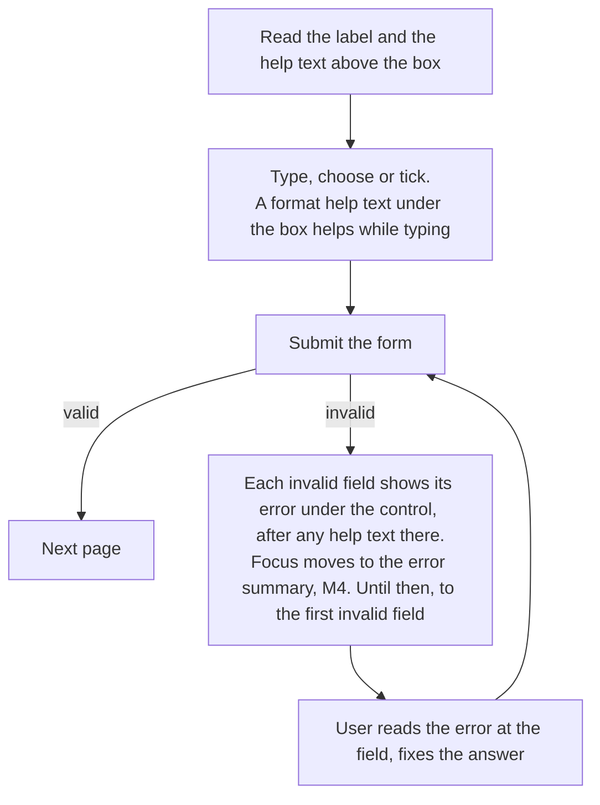

# Design spec: Form fields (Field, Fieldset, Input, InputGroup, Checkbox, RadioGroup, DateInput)

- **Status:** Draft. Updated 2026-10-02 for the field-order decision (default order, several help texts, InputGroup), and 2026-10-03 for the Prose-as-description decision (the help text is a `Prose`, not `Field.Description`)
- **Designer:** ux-designer agent · **Date:** 2026-10-02
- **Plan:** Plan 0013 (Phase 1b)
- **Terminology (Plan 0029, 2026-10-04):** this spec was written when a `Prose` in a Field was called "the help text". Since Plan 0029 a `Prose` is the **description** (above the control, 16px) and a **help text** is a `Field.HelpText` (14px), always under the control, never above it. Read every "hint above" below as the description, and every "hint under" as the help text. [field-help-text.md](field-help-text.md) is the current rule and supersedes this spec where they differ. Plan 0041 renamed the part `Hint` to `HelpText`, in this spec too.
- **Type:** component default styling (+ component tokens, + `theme:check` pairs, + Storybook pages, + DESIGN.md wording)

The parts and behaviour are decided in the Field decisions: `Field.Root`, `Field.Label`, `Field.ErrorMessage`, `Fieldset.Root` and `Fieldset.Legend`, plus a `Prose` as the help text (the Prose-as-description decision replaced `Field.Description` and `Fieldset.Description` with it), plus native controls: `TextInput`, `NumberInput`, `Checkbox`, `CheckboxGroup`, `RadioGroup` with `Radio`, and `DateInput` (three numeric text fields in a fieldset), and `InputGroup.Root` with `InputGroup.Addon` for units and icons inside the input's box. Numbers are a `NumberInput` (a `TextInput` with a number mask), not `type="number"`.

**The default order (replacing the Field-wiring decision's):** label, help text, control, an optional second help text (under the control: a format, a character count), then ErrorMessage. A help text is a `<Prose>` directly in the Field or Fieldset. A Fieldset is legend, help text, the controls, then ErrorMessage. The consumer owns the markup, so the order is a default in DESIGN.md, the theme, the stories and the docs, and the theme's spacing works in any order. `aria-describedby` lists every rendered help text in DOM order, then the error, `aria-invalid` goes on the control, `required` sets `aria-required` (not native `required`), non-required fields get "(optional)" in the label, and errors aren't live-announced.

This spec decides **what they look like in the default theme**: the class API, metrics, the spacing in the new order, states, modes, the checked marks, the DateInput layout and field order, the InputGroup box (§6.13), the strings, the DESIGN.md wording (§6.14) and the Storybook pages. The DOM shapes follow the Field decisions and the Plan 0013 API sketch. Where the spec needs something they don't fix yet, it says so (§6.1, open questions 2, 12, 13 and 14 to 17).

## 1. Brief

- **Users:** both.
  - Residents fill in e-service forms (applications, bookings, reports), usually once, often on a phone, often under stress: a deadline, money, a child, a benefit.
  - Staff fill in and correct case forms many times a day on a desktop, often in compact density.
  - Adopters' developers compose fields and groups.
- **Hardest-case users:**
  1. A 74-year-old resident on a phone at 400% zoom (320 CSS px) with a screen magnifier, entering a date of birth in Finnish, their second language. They see one part of the form at a time, so the label and the help text must sit right above the box, and the error right under it (under the format help text, if there is one), one 8px gap from each other and 32px from the next question. On a phone the on-screen keyboard can cover what's under a focused box, which is the risk the field-order decision accepts and mitigates (§3).
  2. A screen-reader user (NVDA or VoiceOver) who has just submitted and needs to hear, on each field, what's wrong and how to fix it. They never see the "kr" or "%" inside an input's box (Addons are hidden from them), so the label must say it: "Månadshyra i kronor".
  3. A Windows Contrast Themes user who must tell a checked box from an unchecked one, and an invalid field from a valid one, without the theme's colours.
  4. A user with a hand tremor who needs the whole option label to be the target, not a 24px box.
- **Job to be done:** When a service asks me something, I want to understand the question, give my answer in a form I know, and fix any mistake quickly, so I can finish and get on with my day.
- **Context:** resident use is infrequent and stressed, on any device. Staff use is daily and fast, on a desktop with a keyboard.
- **Constraints:**
  - Headless packages ship no CSS (hard rule 5). Options are modifier classes, state is `data-*` (`docs/architecture.md#styling-contract`).
  - Only DESIGN.md tokens. No new colours (§6.9).
  - Every visible or announced string from `@kvirn-ui/i18n` in all six locales (hard rule 4). The catalog's depth is fixed at `namespace.key`.
  - No third-party network calls (hard rule 7).
  - WAD/EN 301 549: the components are "designed and tested to meet WCAG 2.2 AA", never "compliant".
- **Success criteria:**
  - 0 axe violations in every story, in the four theme projects, RTL and forced colours.
  - No horizontal scroll at 320px with the Finnish fixture. Nothing clipped under the 1.4.12 overrides (the e2e `reflow-320` project).
  - Checked, indeterminate, invalid and disabled states are visible in the `chromium-forced-colors` project (e2e asserts computed colours).
  - In usability testing (§8, `pending`): every participant enters a date of birth without asking for help, and fixes a date error on the first try.
- **Evidence:** none from our own users. The prior art in §2 reports its own research, and that research is theirs, not ours.
- **Assumptions and research questions:**
  - Assumption: three labelled boxes in the order the user's region writes dates is faster and less error-prone than a fixed day-month-year order. → RQ: do Swedish residents (year first) and Finland-Swedish residents (day first) both complete DateInput without errors in their own order (§6.6)?
  - Assumption: an example with spaces ("27 3 2007") is read as "type these numbers into these boxes" in every locale, including where people write `2007-03-27` or `27.3.2007`. → RQ: do Swedish and Finnish participants copy the example's format or their usual one? Does it matter?
  - Assumption: help texts in `text` (not `text-muted`) are read more often by low-vision users, at no cost to scanning. → RQ: in the usability test, do participants read the help text before typing?
  - Assumption: "(optional)" on the few optional fields is enough, and residents don't need a "required" marker. → RQ: do participants skip required fields because nothing marks them?
  - Assumption: the octagon icon plus the error's position directly under the field lets magnifier users connect the error to its field. → RQ: does a magnifier user at 400% associate each error with the right field, and not with the next question's label 32px below it?
  - Assumption (a risk of the field order): when focus lands on an invalid field on a phone, the error under it stays visible above the on-screen keyboard and any autocomplete list, given the docs' `scroll-padding`. → RQ: on iOS Safari and Android Chrome with the keyboard open, do participants see the error under the field they were sent to?
  - Assumption: people read a format help text under the box before they type. → RQ: do participants who type first and then see "For example, ABC 123" under the box correct themselves, or wait for the error?
  - Assumption: a unit inside the box ("kr", "%") stops people typing it, and a unit in `text` colour isn't mistaken for part of the answer. → RQ: do participants type the unit anyway, or try to delete it?
  - Assumption: a decorative calendar icon in a single date field doesn't make people look for a calendar. → RQ: do participants click the icon and expect a calendar (open question 14)?

## 2. Prior art

| Source                                                                                                                                                                                                                                                                                                                                                                                                                                                                      | What we reuse                                                                                                                                                                                                                                                                                                                                                                                                                                                        | What we change and why                                                                                                                                                                                                                                                                                        |
| --------------------------------------------------------------------------------------------------------------------------------------------------------------------------------------------------------------------------------------------------------------------------------------------------------------------------------------------------------------------------------------------------------------------------------------------------------------------------- | -------------------------------------------------------------------------------------------------------------------------------------------------------------------------------------------------------------------------------------------------------------------------------------------------------------------------------------------------------------------------------------------------------------------------------------------------------------------- | ------------------------------------------------------------------------------------------------------------------------------------------------------------------------------------------------------------------------------------------------------------------------------------------------------------- |
| DESIGN.md `input`, Shapes, Components (text inputs, checkboxes and radios), Density                                                                                                                                                                                                                                                                                                                                                                                         | `canvas`, `md` radius, `0 12px`, 44px (32px compact). 1px `border-control`, 2px `danger` when invalid. Label, help text, input, then the error (the field-order decision replaces DESIGN.md's "error directly above the input", §6.14). Width reflects the answer. Checkboxes and radios at least 24px, whole label clickable, in a `fieldset` with a `legend` question. Rounded squares and circles                                                                 | Help text colour is `text`, not the `text-muted` listed under "hints" in the token table, because DESIGN.md's Don'ts forbid `text-muted` for anything the user must read (open question 1). Input value text stays 16px in compact (§6.7)                                                                     |
| KvirnUI Button, Card (`card.md`), Icon (`icon.md`)                                                                                                                                                                                                                                                                                                                                                                                                                          | The hovered-primary rule: a hovered filled control keeps a `primary` edge. The focus ring. Not-prose boundaries. The `error` octagon icon at step 5                                                                                                                                                                                                                                                                                                                  | –                                                                                                                                                                                                                                                                                                             |
| APG: [Checkbox](https://www.w3.org/WAI/ARIA/apg/patterns/checkbox/), [Radio Group](https://www.w3.org/WAI/ARIA/apg/patterns/radio/)                                                                                                                                                                                                                                                                                                                                         | Native semantics: `input type=checkbox` (mixed via `indeterminate`), native radios in a `fieldset` (one Tab stop, arrows move and select)                                                                                                                                                                                                                                                                                                                            | Nothing. Native first, no ARIA roles                                                                                                                                                                                                                                                                          |
| GOV.UK [Text input](https://design-system.service.gov.uk/components/text-input/), [Error message](https://design-system.service.gov.uk/components/error-message/), [Date input](https://design-system.service.gov.uk/components/date-input/), [Checkboxes](https://design-system.service.gov.uk/components/checkboxes/), [Radios](https://design-system.service.gov.uk/components/radios/), [Question pages](https://design-system.service.gov.uk/patterns/question-pages/) | Fixed-width inputs by character count. A visually hidden "Error:" prefix. Day, Month, Year boxes with "For example, 27 3 2007" and only the wrong box(es) highlighted. The label or legend as the page heading. Option help texts under the option label. [Prefixes and suffixes](https://design-system.service.gov.uk/components/text-input/): `aria-hidden`, for currencies and measurements, with the unit in the label ("What is the cost per item, in pounds?") | Our error goes under the control, not above. Our width set is smaller (§6.4). Field order follows the region, not always day-month-year (§6.6). Error weight 500, not bold. No red bar on the invalid group by default (open question 5). Our affixes sit inside the box, not as grey boxes beside it (§6.13) |
| GOV.UK: [why they stopped using `type="number"`](https://technology.blog.gov.uk/2020/02/24/why-the-gov-uk-design-system-team-changed-the-input-type-for-numbers/)                                                                                                                                                                                                                                                                                                           | `type="text" inputmode="numeric"` and lenient parsing                                                                                                                                                                                                                                                                                                                                                                                                                | Our `inputMode="decimal"` for amounts, with a decimal comma in sv, fi, nb, nn and se                                                                                                                                                                                                                          |
| Designsystemet (NO): [Field](https://designsystemet.no/en/components/docs/field/code/), [Checkbox](https://designsystemet.no/en/components/docs/checkbox/code/), [Radio](https://designsystemet.no/en/components/docs/radio/code/), [errors pattern](https://designsystemet.no/en/patterns/errors/)                                                                                                                                                                         | Field as a helper that wires Label, Description and ValidationMessage to the control. Fieldset as "a set of Fields"                                                                                                                                                                                                                                                                                                                                                  | Since the field-order decision we follow its visual order: description, control, then the message below. Designsystemet puts the error **first** in `aria-describedby`. We keep the descriptions first, in DOM order, so the accessible description matches the visual order. Noted as a research question    |
| USWDS [Input prefix or suffix](https://designsystem.digital.gov/components/input-prefix-suffix/)                                                                                                                                                                                                                                                                                                                                                                            | An input group that carries the border and the focus ring, with a text or icon prefix or suffix inside, `aria-hidden`, and the unit in the label ("Height, in inches"). Only widely known abbreviations, never full words                                                                                                                                                                                                                                            | Interactive add-ons are real Buttons placed directly in the group, never in an Addon. Text units are `text`, not grey (§6.13). Start and end follow DOM order and reading direction                                                                                                                           |
| [Modern CSS: custom checkbox](https://moderncss.dev/pure-css-custom-checkbox-style/) (Stephanie Eckles)                                                                                                                                                                                                                                                                                                                                                                     | The native input stays the control (`appearance: none`). The mark is a `::before` on the input, shaped with `clip-path` and filled with a colour, and given a system colour in forced colours                                                                                                                                                                                                                                                                        | Our marks, sizes and tokens (§6.5)                                                                                                                                                                                                                                                                            |

## 3. Flow

A field has no page flow of its own, but it has a lifecycle that every story and the Overview form show:



Unhappy paths the components must support:

- **Validation error after submit.** The message appears under the control, after the help text under it if there is one. The field keeps the user's answer, exactly as typed, so they can fix it instead of starting over. The error stays until the next submit (no live clearing while typing, which would move content under a magnifier).
- **The error under a focused field on a phone (a risk of the field order).** With the error below the box, the on-screen keyboard or an autocomplete list can cover it the moment the field gets focus. The mitigation is in the docs (`field.md`, `text-input.md`, `input-group.md`), not in the components, and the Overview story follows it:
  - On submit, move focus to the error summary (M4). Until it ships, move focus to the first invalid field.
  - Keep `scroll-padding-block` on the page's scroll container: the start value is the sticky header's height (2.4.11), and the end value leaves room for the message under the field, so the browser scrolls the field far enough up when it gets focus. The docs suggest `scroll-padding-block-end: 8rem` (about three lines of error text plus the gap) as a starting point. Whether the theme should add a `scroll-margin-block-end` to invalid controls is open question 16.
  - This is an AT and usability research question (§1, §8), not a solved problem: iOS doesn't always honour `scroll-padding` for its keyboard.
- **Partial or impossible date.** Only the wrong box gets the invalid border (`Year` missing: only Year). If the whole date is wrong (31 2 2026, or in the future), all three do. One message for the group.
- **Numbers typed the way people write them.** "1 250,50", "1250.50", "1 250 kr", " 2 ". The consumer's parser strips spaces and accepts both decimal marks. No `type="number"` spinners. Without a mask nothing is filtered. With a number mask (the default in the stories, plan 0032) a character it can't take is dropped and announced politely, and paste and autofill are normalised, never blocked (3.3.8). A box that already shows "kr" (an InputGroup Addon) still accepts "1 250 kr": the parser strips the unit, and the field never errors on it.
- **Clearing a search (InputGroup with a clear Button).** The consumer empties the value and moves focus to the Input, so focus never stays on a button that disappears when the box is empty, and never lands on `body`. Nothing is announced: the focused, empty Input is read as such.
- **Autofill and password managers.** `autocomplete` values are set (1.3.5), and an autofilled field still shows its border, error and focus ring.
- **Disabled and read-only.** Avoid both in resident forms: explain on submit instead (DESIGN.md Buttons). Read-only is for staff tools showing values they can't change here.
- **Back and change.** A field shows its saved value. Nothing in the component clears it.
- **Not applicable:** loading, empty and timeout belong to the form and page (the form wizard block, M4).

## 4. Content

### 4.1 Component strings (`@kvirn-ui/i18n`)

New namespaces `field` and `dateInput`, in all six locales. Agents write `fi`, `nb` and `nn`; `se` stays English, marked `lang="en"`, as `link.newTabNotice` does today.

| i18n key                            | en                     | sv                     | longest: fi (draft)   | Notes                                                                                                                                                                                                                              |
| ----------------------------------- | ---------------------- | ---------------------- | --------------------- | ---------------------------------------------------------------------------------------------------------------------------------------------------------------------------------------------------------------------------------- |
| `field.optional`                    | (optional)             | (valfritt)             | (vapaaehtoinen)       | Appended to the label or legend of an optional field, after a space, inside the `<label>` or `<legend>`, so it's part of the accessible name. `fi` alternative: "(valinnainen)". `sv` alternative: "(frivilligt)". Agent to choose |
| `field.errorPrefix`                 | Error:                 | Fel:                   | Virhe:                | First child of every error message, visually hidden by the theme. Includes its colon, so a locale can change the punctuation                                                                                                       |
| `dateInput.day`                     | Day                    | Dag                    | Päivä                 | Label of the day box                                                                                                                                                                                                               |
| `dateInput.month`                   | Month                  | Månad                  | Kuukausi              | Label of the month box                                                                                                                                                                                                             |
| `dateInput.year`                    | Year                   | År                     | Vuosi                 | Label of the year box                                                                                                                                                                                                              |
| `dateInput.example` (`{ example }`) | For example, {example} | Till exempel {example} | Esimerkiksi {example} | Optional helper for the help text (open question 4). `example` is the three numbers in the field order, separated by spaces, without leading zeros: en `27 3 2007`, sv-SE `2007 3 27`, fi `27 3 2007`                              |

The field-order decision adds no component strings. An Addon's text is the consumer's (one key per unit, §4.4), and a Button in a group gets its name from the consumer's translations.

No component string for "required": required fields aren't marked. No default error messages: the consumer writes them, because they name the field ("Enter your date of birth"). The docs give the patterns in §4.3.

### 4.2 Story fixture strings

In `apps/storybook/src/components/<name>/<name>.fixture.tsx`, with keys local to the file and a value in all six locales (storybook-presentation.md §4). The Overview form is a resident service: "Apply for a resident parking permit".

| Key                        | en                                                            | sv                                                         | longest: fi (draft)                                           | Element                                                                                                                   |
| -------------------------- | ------------------------------------------------------------- | ---------------------------------------------------------- | ------------------------------------------------------------- | ------------------------------------------------------------------------------------------------------------------------- |
| `permit.heading`           | Apply for a resident parking permit                           | Ansök om boendeparkeringstillstånd                         | Hae asukaspysäköintitunnusta                                  | h1 (Overview)                                                                                                             |
| `permit.name`              | Full name                                                     | Fullständigt namn                                          | Koko nimi                                                     | Label, `autocomplete="name"`                                                                                              |
| `permit.dateOfBirth`       | Date of birth                                                 | Födelsedatum                                               | Syntymäaika                                                   | Legend (DateInput), `autocomplete="bday"`                                                                                 |
| `permit.registration`      | Vehicle registration number                                   | Fordonets registreringsnummer                              | Ajoneuvon rekisteritunnus                                     | Label, `kv-input--width-10`                                                                                               |
| `permit.registrationHint`  | For example, ABC 123                                          | Till exempel ABC 123                                       | Esimerkiksi ABC-123                                           | Description **under** the control (the field-order decision: a format example), after `permit.registrationWhere` above it |
| `permit.registrationWhere` | You can find it on the vehicle registration certificate.      | Det står på registreringsbeviset.                          | Löydät sen ajoneuvon rekisteröintitodistuksesta.              | Description **above** the control (where to find the answer: read before typing)                                          |
| `permit.email`             | Email address                                                 | E-postadress                                               | Sähköpostiosoite                                              | Label, `type="email"`                                                                                                     |
| `permit.emailHint`         | We'll send the decision to this address.                      | Vi skickar beslutet till den här adressen.                 | Lähetämme päätöksen tähän osoitteeseen.                       | Description                                                                                                               |
| `permit.phone`             | Phone number                                                  | Telefonnummer                                              | Puhelinnumero                                                 | Label + `field.optional`, `kv-input--width-20`                                                                            |
| `permit.duration`          | How long do you need the permit?                              | Hur länge behöver du tillståndet?                          | Kuinka pitkäksi aikaa tarvitset tunnuksen?                    | Legend (RadioGroup)                                                                                                       |
| `permit.duration1`         | 1 month                                                       | 1 månad                                                    | 1 kuukausi                                                    | Radio label                                                                                                               |
| `permit.duration6`         | 6 months                                                      | 6 månader                                                  | 6 kuukautta                                                   | Radio label                                                                                                               |
| `permit.duration12`        | 12 months                                                     | 12 månader                                                 | 12 kuukautta                                                  | Radio label                                                                                                               |
| `permit.duration12Hint`    | The lowest price per month.                                   | Lägst pris per månad.                                      | Edullisin kuukausihinta.                                      | Option description                                                                                                        |
| `permit.contact`           | How should we contact you about your permit?                  | Hur ska vi kontakta dig om tillståndet?                    | Miten otamme sinuun yhteyttä tunnukseen liittyvissä asioissa? | Legend (CheckboxGroup)                                                                                                    |
| `permit.contactHint`       | Select all that apply.                                        | Välj alla som passar.                                      | Valitse kaikki sopivat vaihtoehdot.                           | Description                                                                                                               |
| `permit.contactEmail`      | Email                                                         | E-post                                                     | Sähköposti                                                    | Checkbox label                                                                                                            |
| `permit.contactText`       | Text message                                                  | Sms                                                        | Tekstiviesti                                                  | Checkbox label                                                                                                            |
| `permit.contactLetter`     | Letter                                                        | Brev                                                       | Kirje                                                         | Checkbox label                                                                                                            |
| `permit.declaration`       | I confirm that the information I have given is correct        | Jag intygar att uppgifterna jag har lämnat är korrekta     | Vahvistan, että antamani tiedot ovat oikein                   | Standalone Checkbox label                                                                                                 |
| `permit.submit`            | Send application                                              | Skicka ansökan                                             | Lähetä hakemus                                                | Button, primary                                                                                                           |
| `children.label`           | How many children live with you?                              | Hur många barn bor hos dig?                                | Montako lasta asuu kanssasi?                                  | Label, `inputMode="numeric"`, `--width-2`                                                                                 |
| `rent.label`               | How much rent do you pay each month?                          | Hur mycket hyra betalar du per månad?                      | Paljonko maksat vuokraa kuukaudessa?                          | Label, `inputMode="decimal"`, `--width-10`                                                                                |
| `rent.hint`                | Enter the amount without a currency sign, like {example}.     | Skriv beloppet utan valutatecken, till exempel {example}.  | Kirjoita summa ilman valuuttamerkkiä, esimerkiksi {example}.  | Description. `{example}` is `format.number(1250.5, { minimumFractionDigits: 2 })`: en `1,250.50`, sv and fi `1 250,50`    |
| `caseNumber.label`         | Case number                                                   | Ärendenummer                                               | Asianumero                                                    | Label, `inputMode="numeric"`, `--width-6`                                                                                 |
| `caseNumber.hint`          | It's at the top of our letter, for example 004512.            | Det står överst i vårt brev, till exempel 004512.          | Löydät sen kirjeemme yläreunasta, esimerkiksi 004512.         | Description. Leading zeros: why not `type="number"`                                                                       |
| `long.label`               | Reference number of your housing adaptation grant application | Referensnummer för din ansökan om bostadsanpassningsbidrag | Asunnonmuutostyöavustushakemuksen viitenumero                 | Label (wrap and hyphenation at 320px)                                                                                     |

### 4.3 Error messages (fixtures, and the docs' patterns)

Errors say what's wrong and how to fix it, start with the field's own words, and never blame ("You entered an invalid…"). Each is announced as "Error: …" (the prefix).

| Key                        | en                                                                  | sv                                                               | longest: fi (draft)                                                    |
| -------------------------- | ------------------------------------------------------------------- | ---------------------------------------------------------------- | ---------------------------------------------------------------------- |
| `errors.nameMissing`       | Enter your full name                                                | Ange ditt fullständiga namn                                      | Anna koko nimesi                                                       |
| `errors.dateMissing`       | Enter your date of birth                                            | Ange ditt födelsedatum                                           | Anna syntymäaikasi                                                     |
| `errors.dateYearMissing`   | Date of birth must include a year                                   | Födelsedatumet måste innehålla ett år                            | Syntymäajassa on oltava myös vuosi                                     |
| `errors.dateNotReal`       | Date of birth must be a real date                                   | Födelsedatumet måste vara ett riktigt datum                      | Syntymäajan on oltava oikea päivämäärä                                 |
| `errors.dateInFuture`      | Date of birth must be in the past                                   | Födelsedatumet kan inte vara i framtiden                         | Syntymäaika ei voi olla tulevaisuudessa                                |
| `errors.emailFormat`       | Enter an email address in the correct format, like name@example.com | Ange en e-postadress i rätt format, till exempel namn@exempel.se | Anna sähköpostiosoite oikeassa muodossa, esimerkiksi nimi@esimerkki.fi |
| `errors.durationMissing`   | Select how long you need the permit                                 | Välj hur länge du behöver tillståndet                            | Valitse, kuinka pitkäksi aikaa tarvitset tunnuksen                     |
| `errors.contactMissing`    | Select how we should contact you                                    | Välj hur vi ska kontakta dig                                     | Valitse, miten otamme sinuun yhteyttä                                  |
| `errors.declaration`       | Confirm that the information you have given is correct              | Intyga att uppgifterna du har lämnat är korrekta                 | Vahvista, että antamasi tiedot ovat oikein                             |
| `errors.childrenNotNumber` | Enter the number of children as a whole number, like 2              | Ange antalet barn som en siffra, till exempel 2                  | Anna lasten määrä kokonaislukuna, esimerkiksi 2                        |
| `errors.rentNotAmount`     | Enter the rent as an amount, like {example}                         | Ange hyran som ett belopp, till exempel {example}                | Anna vuokra summana, esimerkiksi {example}                             |

### 4.4 Which text goes where

Superseded by [field-help-text.md](field-help-text.md) §4.1.

- **Above the control, a description (`Field.Prose`):** what to answer and where to find it. Anything the user needs **before** they start typing. Most fields have only this one.
- **Under the control, a help text (`Field.HelpText`):** a format example or a limit that helps **while** typing ("For example, ABC 123", "Up to 500 characters"). Never the only instruction: a magnifier user at 400% may not see under the box until they've typed.
- A help text is never above the control (maintainer, 2026-10-04). A field may have a description, a help text, both or neither.
- A character count that updates as you type belongs to Textarea (`characterCount`, Plan 0034, [rich-text-editor.md](rich-text-editor.md) §4.1 and §6.3). Elsewhere in this spec a count is a static limit in a help text.

### 4.5 InputGroup fixtures and content rules

In `apps/storybook/src/components/input-group/input-group.fixture.tsx`, all six locales (fi strings below, `nb` and `nn` written by an agent, `se` English, marked `lang="en"`).

**Content rules:**

1. **The label carries the unit,** because Addons are `aria-hidden`: "Månadshyra i kronor", never "Månadshyra" plus a "kr" Addon. If the label can't say it, a description above the control does.
2. **Addon text is a symbol or a widely known abbreviation,** at most 4 characters: `kr`, `€`, `%`, `km`, `m²`. Never a word or a phrase ("per månad" goes in the label). Every Addon string is an i18n key, even `%`.
3. **One Addon per side at most.** A start Addon and an end Addon, or an Addon and a Button, are fine.
4. **An icon Addon repeats something the label or a help text already says** (a search, a date). It's never the only cue, and it never looks like it does something it doesn't (open question 14).
5. **A Button in a group has a verb label or, if it's icon-only, a name** from the translations ("Rensa", or `aria-label` "Rensa sökningen"). One short word for a text button (§6.13, 320px).

| Key                    | en                                                                 | sv                                                       | longest: fi (draft)                                  | Element                                                                                                             |
| ---------------------- | ------------------------------------------------------------------ | -------------------------------------------------------- | ---------------------------------------------------- | ------------------------------------------------------------------------------------------------------------------- |
| `rent.labelWithUnit`   | Monthly rent in kronor                                             | Månadshyra i kronor                                      | Kuukausivuokra kruunuina                             | Label. `inputMode="decimal"`, `kv-input--width-10`, `kv-input--numeric`                                             |
| `rent.unit`            | kr                                                                 | kr                                                       | kr                                                   | End Addon                                                                                                           |
| `rent.example`         | For example, {example}                                             | Till exempel {example}                                   | Esimerkiksi {example}                                | Description **under** the control. `{example}` is `format.number(8450)`: en `8,450`, sv and fi `8 450`              |
| `workTime.label`       | Working hours as a percentage of full time                         | Arbetstid i procent av heltid                            | Työaika prosentteina kokoaikatyöstä                  | Label. `inputMode="decimal"`, `kv-input--width-4`, `kv-input--numeric`                                              |
| `workTime.unit`        | %                                                                  | %                                                        | %                                                    | End Addon. sv and fi write "75 %": the 8px gap stands in for the space                                              |
| `workTime.example`     | For example, 75 or 37.5                                            | Till exempel 75 eller 37,5                               | Esimerkiksi 75 tai 37,5                              | Description under the control                                                                                       |
| `distance.label`       | Distance from home to school in kilometres                         | Avstånd mellan hemmet och skolan i kilometer             | Kodin ja koulun välinen matka kilometreinä           | Label. `inputMode="decimal"`, `kv-input--width-6`, `kv-input--numeric`                                              |
| `distance.hint`        | Measure the shortest walking route.                                | Mät den kortaste gångvägen.                              | Mittaa lyhin kävelyreitti.                           | Description **above** the control                                                                                   |
| `distance.unit`        | km                                                                 | km                                                       | km                                                   | End Addon                                                                                                           |
| `search.label`         | Search for a service                                               | Sök bland e-tjänster                                     | Hae palveluista                                      | Label. `type="search"`, full width. Start Addon: the `search` Icon                                                  |
| `search.clear`         | Clear                                                              | Rensa                                                    | Tyhjennä                                             | Text Button at the end. Its visible text is its name                                                                |
| `search.clearName`     | Clear search                                                       | Rensa sökningen                                          | Tyhjennä haku                                        | `aria-label` of the icon-only variant (`close` Icon), staff and compact only                                        |
| `visitDate.label`      | Date of the visit                                                  | Datum för besöket                                        | Käynnin päivämäärä                                   | Label. One text field, `kv-input--width-10`, `kv-input--numeric`. End Addon: the `calendar` Icon (open question 14) |
| `visitDate.example`    | For example, 27/3/2026                                             | Till exempel 2026-03-27                                  | Esimerkiksi 27.3.2026                                | Description under the control                                                                                       |
| `amountEuro.label`     | Amount in euros                                                    | Belopp i euro                                            | Summa euroina                                        | Label (the `RTL` story). `inputMode="decimal"`, `kv-input--width-10`, `kv-input--numeric`                           |
| `amountEuro.unit`      | €                                                                  | €                                                        | €                                                    | **Start** Addon: on the right in RTL                                                                                |
| `grant.labelWithUnit`  | Amount of housing adaptation grant you are applying for, in kronor | Belopp som du söker i bostadsanpassningsbidrag, i kronor | Haettavan asunnonmuutostyöavustuksen määrä kruunuina | Label (`LongFinnishLabel`, wraps and hyphenates at 320px). End Addon `rent.unit`                                    |
| `errors.rentNotAmount` | Enter the rent as an amount, like {example}                        | Ange hyran som ett belopp, till exempel {example}        | Anna vuokra summana, esimerkiksi {example}           | ErrorMessage, under the help text under the control (§4.3, same key)                                                |

The fixtures are for a Swedish service in all its languages, so the currency is kronor in `fi` too (Finnish is a national minority language in Sweden). The euro example is its own field.

## 5. Structure

Reading order equals DOM order equals visual order (1.3.2). Fields add no landmark or heading, except the "as page heading" option (§6.2), where the consumer wraps the label in `h1` or puts an `h1` in the legend. The wireframes show the **default order** from the field-order decision. A consumer may render the parts in another order: the theme's spacing still works (§6.2), and `aria-describedby` still lists the Descriptions in DOM order, then the error.

**Text field** (`Field.Root` + `TextInput`), with both help texts and an error:

```
div.kv-field
  label.kv-field-label[for=id]          Vehicle registration number
  div.kv-prose#desc-1 > p                You can find it on the vehicle registration certificate.
  input.kv-input.kv-input--width-10#id[aria-describedby="desc-1 desc-2 err"][aria-invalid=true][data-invalid]
  div.kv-prose#desc-2 > p                For example, ABC 123                       (optional second help text: under the control)
  p.kv-field-error-message#err           [svg.kv-icon error, aria-hidden] <span.kv-field-error-prefix>Error:</span> Enter …
```

Without the second help text, the error follows the control directly. Without any help text, the label is followed by the control. There is one ErrorMessage per Field (a dev warning fires for two).

**Text field with an InputGroup** (§6.13):

```
div.kv-field
  label.kv-field-label[for=rent]         Monthly rent in kronor
  div.kv-input-group[data-invalid]       InputGroup.Root: the box
    input.kv-input.kv-input--width-10.kv-input--numeric#rent[inputmode=decimal][aria-describedby="ex err"]
    span.kv-input-group-addon[aria-hidden=true]   kr
  div.kv-prose#ex > p                    For example, 8 450
  p.kv-field-error-message#err           Error: Enter the rent as an amount, like 8 450
```

**Choice field** (a standalone Checkbox, or one option of a group). The control is a **direct child** of `Field.Root`, and comes before the label in the DOM, so the box sits at the inline start:

```
div.kv-field                             (choice layout: the theme detects a direct .kv-checkbox or .kv-radio child)
  input.kv-checkbox | input.kv-radio     column 1, centred on the label's first line
  label.kv-field-label                   column 2, and padded under column 1 so the whole row is the target
  div.kv-prose > p                       column 2, under the label (option help text)
  p.kv-field-error-message               (standalone checkbox only; spans both columns, under the row and its help text)
```

**Group** (`CheckboxGroup`, `RadioGroup`, or `Fieldset.Root` around anything):

```
fieldset.kv-fieldset | .kv-checkbox-group | .kv-radio-group
  legend.kv-fieldset-legend              How should we contact you about your permit?
  div.kv-prose > p                       Select all that apply.
  div.kv-field (choice) × n              Email · Text message · Letter
  p.kv-field-error-message               Error: Select how we should contact you
```

**DateInput:**

```
fieldset.kv-fieldset                     (Fieldset.Root)
  legend.kv-fieldset-legend              Date of birth
  div.kv-prose > p                       For example, 27 3 2007
  div.kv-date-input                      DateInput.Root: a row that wraps
    div.kv-field.kv-date-input-day       DateInput.Day: a Field, label.kv-field-label "Day" + input.kv-input
    div.kv-field.kv-date-input-month     DateInput.Month
    div.kv-field.kv-date-input-year      DateInput.Year   (only this one invalid)
  p.kv-field-error-message               Error: Date of birth must include a year
```

The field order is the locale's (§6.6). The wireframe shows en.

**Overview form, per breakpoint** (a single column of at most `40rem`, DESIGN.md Layout):

| Width | Layout                                                                                                                                                                                                                                                   |
| ----- | -------------------------------------------------------------------------------------------------------------------------------------------------------------------------------------------------------------------------------------------------------- |
| 320px | h1, then each question stacked, 32px apart. Full-width inputs fill the 288px column (16px gutters). Width-class inputs keep their width, capped at 100%. DateInput's three boxes fit one row (about 206px). The button is full width (`kv-button-group`) |
| 40rem | Same column, 40rem wide. Width-class inputs keep their width, so a postcode box doesn't stretch. The button is start-aligned                                                                                                                             |
| 64rem | Same. The form never goes multi-column for residents. Staff (`kv-compact`): 32px controls and 14px labels from 64rem                                                                                                                                     |

```
main
  h1  Apply for a resident parking permit
  form[novalidate]
    Field     Full name
    DateInput Date of birth
    Field     Vehicle registration number (help text above, width-10, example under)
    Field     Email address (help text)
    Field     Phone number (optional) (width-20)
    RadioGroup     How long do you need the permit? (3 options, one with a help text)
    CheckboxGroup  How should we contact you about your permit? (help text, 3 options)
    Field (choice) I confirm that the information I have given is correct
    div.kv-button-group > Button.kv-button--primary  Send application
```

`novalidate`, so the browser's own bubbles (in the browser's language, gone after a moment, and not linked to the field) never replace our errors. The Overview is a component showcase. A real resident service asks one thing per page (the `AsPageHeading` stories show that pattern).

## 6. Visual specification

### 6.1 Class API

Parts render their own class (`kv-<part>`). Options are modifier classes the consumer adds (`kv-<part>--<option>`). State is `data-*`, set by the components. Default **bold**.

| Class                                                                                                        | Rendered by                                                                                                 | Notes                                                                                                                                                                                                                                    |
| ------------------------------------------------------------------------------------------------------------ | ----------------------------------------------------------------------------------------------------------- | ---------------------------------------------------------------------------------------------------------------------------------------------------------------------------------------------------------------------------------------- |
| `kv-field`                                                                                                   | `Field.Root`                                                                                                | Column layout. Becomes the **choice layout** when a direct child is `.kv-checkbox` or `.kv-radio` (`:has()`, as Card uses)                                                                                                               |
| `kv-field-label`, modifier `kv-field-label--heading`                                                         | `Field.Label`                                                                                               | `--heading`: the label is the page's `h1` (`<h1><label class="kv-field-label kv-field-label--heading">`)                                                                                                                                 |
| `kv-field-optional`                                                                                          | the "(optional)" span inside Label or Legend                                                                | Weight 400. **Never on an option label or a DateInput box label**: the marker belongs to the question (open question 12)                                                                                                                 |
| `kv-prose` as a direct child of `kv-field` or `kv-fieldset`                                                  | A `Prose`, in a Field or a Fieldset (it registers as the description)                                       | One class in both contexts, and in both positions: above the control and under it. Several per Field or Fieldset, each with its own id                                                                                                   |
| `kv-field-error-message`, `kv-field-error-prefix`                                                            | `Field.ErrorMessage`, in a Field or a Fieldset                                                              | The prefix span is visually hidden by the theme. Without the theme it shows ("Error: Enter …"), which is fine unstyled                                                                                                                   |
| `kv-fieldset`                                                                                                | `Fieldset.Root`                                                                                             | Reset `fieldset`                                                                                                                                                                                                                         |
| `kv-fieldset-legend`, modifier `kv-fieldset-legend--heading`                                                 | `Fieldset.Legend` (and the groups' legends)                                                                 | `--heading`: an `h1` inside the legend                                                                                                                                                                                                   |
| `kv-checkbox-group`, `kv-radio-group`                                                                        | `CheckboxGroup.Root`, `RadioGroup.Root` (`<fieldset>`, acting as `Fieldset.Root`)                           | Styled exactly as `kv-fieldset`. One selector list in `theme.css`                                                                                                                                                                        |
| `kv-input`, modifiers **full width**, `kv-input--width-2`, `-4`, `-6`, `-10`, `-20`, and `kv-input--numeric` | `TextInput`                                                                                                 | §6.4                                                                                                                                                                                                                                     |
| `kv-input-group`                                                                                             | `InputGroup.Root` (a `<div>`)                                                                               | The box around an Input and its Addons or Button: edge, fill, radius, states and the focus ring (§6.13). No modifiers: width classes stay on the Input                                                                                   |
| `kv-input-group-addon`                                                                                       | `InputGroup.Addon` (a `<span aria-hidden="true">`)                                                          | A unit or a decorative Icon inside the box. Start or end by DOM order. No modifiers                                                                                                                                                      |
| `kv-checkbox`                                                                                                | `Checkbox` (`<input type="checkbox">`)                                                                      | The input is the box                                                                                                                                                                                                                     |
| `kv-radio`                                                                                                   | `Radio` (`<input type="radio">`)                                                                            | The input is the circle                                                                                                                                                                                                                  |
| `kv-switch`                                                                                                  | `Switch` (`<input type="checkbox" role="switch">`)                                                          | The input is the pill track; a direct child of `Field.Root` makes the choice layout, with a first column of `calc(var(--kv-choice-size) * 11 / 6)` (44px). Design: [switch.md](switch.md)                                                |
| `kv-date-input`; `kv-date-input-day`, `kv-date-input-month`, `kv-date-input-year`                            | `DateInput.Root` (a `<div>` inside `Fieldset.Root`); `DateInput.Day`, `.Month`, `.Year` on their Field root | The row, and one class per box so the theme can size each box whatever order it's rendered in. The boxes are plain `kv-input`: the theme gives `.kv-date-input .kv-input` tabular figures and the 2/2/4 widths, so no modifier is needed |

**State attributes the theme selects on** (besides native `:checked`, `:indeterminate`, `:disabled`, `[readonly]`, which it also accepts):

| Attribute                                                | On                                                                                                                                                                                                                    |
| -------------------------------------------------------- | --------------------------------------------------------------------------------------------------------------------------------------------------------------------------------------------------------------------- |
| `data-invalid`                                           | the invalid control. In a group, every option input (styling only, see §7 on `aria-invalid`). In DateInput, only the wrong boxes. Also on `Field.Root`, the group root and `InputGroup.Root` (from the nearest Field) |
| `data-disabled`                                          | the control, `Field.Root`, the group root and `InputGroup.Root`                                                                                                                                                       |
| `data-state="checked" \| "unchecked" \| "indeterminate"` | `Checkbox`, and `checked` / `unchecked` on `Radio`                                                                                                                                                                    |
| `data-focus-visible`                                     | where the component sets it, as Button does. On `InputGroup.Root` when its Input has keyboard focus (for text inputs, also while typing after a click)                                                                |

If the Field-wiring decision names the parts differently (for example a `Checkbox.Root` wrapper, or `RadioGroup.Legend`), only the class names in this table change. The layout rules stay. Open question 2.

**Prose boundary.** `.kv-field`, `.kv-fieldset` and the three group roots go on the not-prose list in `theme.css` (the one place it's written), like `.kv-card`. A form inside `kv-prose` must not get prose margins on its help texts (`<p>`) or the `h1` in a heading label.

### 6.2 Field and Fieldset

| Part                                                     | Style                                                                                                                                                                                                                                                                                                                                                                                                                            |
| -------------------------------------------------------- | -------------------------------------------------------------------------------------------------------------------------------------------------------------------------------------------------------------------------------------------------------------------------------------------------------------------------------------------------------------------------------------------------------------------------------- |
| `kv-field`                                               | `display: flex; flex-direction: column; gap: var(--kv-field-gap)` (8px, 4px compact). `min-inline-size: 0`. `color: text`. `hyphens: auto`, `hyphenate-limit-chars: 10 4 4`, then `overflow-wrap: break-word`, so a Finnish compound label wraps at 320px. No margin: spacing between fields is the form's (32px in the stories, open question 10)                                                                               |
| `kv-field-label`                                         | `--kv-control-font-size/-weight/-line-height` (`label` 16/500/1.4, `label-compact` 14/500/1.3 in compact). `color: text`. `display: block`, `inline-size: fit-content`, `max-inline-size: 100%` (the click area is the label, not the empty row)                                                                                                                                                                                 |
| `kv-field-label--heading`, `kv-fieldset-legend--heading` | `heading-1` tokens (`--kv-font-heading-1-*`, `--kv-font-family-heading`, 24px below 40rem per the hyphenation decision), `color: heading`. The wrapping or inner `h1` gets `margin: 0`, `font: inherit`, `color: inherit`. `margin-block-end: var(--kv-space-2)` on top of the gap (16px to the help text). Never compact: a page heading isn't a control label                                                                  |
| `kv-field-optional`                                      | `font-weight: 400`, `color: inherit` (`text`, never muted: it tells the user they can skip). Inline, after a normal space, so it wraps with the label                                                                                                                                                                                                                                                                            |
| `kv-field > .kv-prose`, `kv-fieldset > .kv-prose`        | `body` 16/400/1.5, `color: text`, `margin: 0`, `max-inline-size: var(--kv-prose-measure)`. A help text under the control (a sibling after anything but the label, legend or another help text) is `body-small` 14/400/1.5 in the same colour. Its paragraphs, lists and links are prose again (the nearest of a field and a `kv-prose` wins, as for a card). Never compact and never `text-muted`: a help text is an instruction |
| `kv-field-error-message`                                 | `label` 16/500/1.4 (fixed, not the control tokens: never 14px in compact), `color: danger`, `margin: 0`. `display: flex; gap: var(--kv-space-2); align-items: flex-start`. The icon is `<Icon name="error" size="20">` (1.25rem, 20px), first child, `margin-block: calc((1lh - 1.25rem) / 2)` so it centres on the first line. `max-inline-size: var(--kv-prose-measure)`                                                       |
| `kv-field-error-prefix`                                  | Visually hidden: `position: absolute; inline-size: 1px; block-size: 1px; overflow: hidden; clip-path: inset(50%); white-space: nowrap`. Never `display: none`                                                                                                                                                                                                                                                                    |
| `kv-fieldset` (and group roots)                          | `border: 0; margin: 0; padding: 0; min-inline-size: 0` (a fieldset's default `min-content` breaks 320px reflow). `display: flex; flex-direction: column; gap: var(--kv-field-gap)`. Same hyphenation as `kv-field`. Two text Fields in a row inside a fieldset (an address) are `space-6` (24px) apart: `space-4` margin on top of the gap, only between non-choice Fields                                                       |
| `kv-fieldset-legend`                                     | Label typography (control tokens), `color: text`, `padding: 0`, `margin-block-end: var(--kv-field-gap)` (a rendered legend isn't a flex item, so the gap doesn't reach it), `max-inline-size: 100%`, `white-space: normal`                                                                                                                                                                                                       |

**Spacing in the default order.** Every part of a field is one `--kv-field-gap` from the next, whichever order it's in, so a consumer's own order spaces correctly too. The flex `gap` does it, so a part that isn't rendered leaves no hole. The order itself needs no new rule in `theme.css`: the Phase 1 gap already works in any order.

| Between                                                         | Comfortable | Compact (from 64rem) | Notes                                                                                                                                                                                           |
| --------------------------------------------------------------- | ----------- | -------------------- | ----------------------------------------------------------------------------------------------------------------------------------------------------------------------------------------------- |
| Label → help text above                                         | 8px         | 4px                  | `--kv-field-gap`                                                                                                                                                                                |
| Label → control (no help text above)                            | 8px         | 4px                  |                                                                                                                                                                                                 |
| help text above → control                                       | 8px         | 4px                  |                                                                                                                                                                                                 |
| Control → help text under (the help text under the control)     | 8px         | 4px                  | The focus ring takes 4px outside the control (2px offset, 2px ring), so even in compact it ends at the help text's line box and never covers its glyphs (16px text at 1.5 has 4px half-leading) |
| Control → ErrorMessage (no help text under)                     | 8px         | 4px                  | The error sits right under the box, or under the InputGroup                                                                                                                                     |
| help text under → ErrorMessage                                  | 8px         | 4px                  | See "Help text under and error together" below                                                                                                                                                  |
| `--heading` label or legend → next part                         | 16px        | 16px                 | `space-2` margin on top of the 8px gap. Never compact                                                                                                                                           |
| Legend → help text                                              | 8px         | 4px                  | The legend's `margin-block-end`                                                                                                                                                                 |
| help text → first option, or → the DateInput row                | 8px         | 4px                  |                                                                                                                                                                                                 |
| Option → option                                                 | 8px         | 4px                  | §6.5                                                                                                                                                                                            |
| Last option, or the DateInput row → the group's ErrorMessage    | 8px         | 4px                  |                                                                                                                                                                                                 |
| Choice row and its option help text → standalone checkbox error | 8px         | 4px                  | The error spans both columns under the row                                                                                                                                                      |
| Last part of a question → next question                         | 32px        | 32px                 | The form's, not the field's (story CSS, open question 10)                                                                                                                                       |

**Help text under and error together.** The control is followed by two 16px blocks, 8px apart (4px compact): the help text (`body`, weight 400, `text`, flush with the box's start edge), then the error (`label`, weight 500, `danger`, with the 20px octagon at the start and its text indented 28px). They differ in colour, weight, the icon and the indent, so they never read as one paragraph, and the error is never only "the red one" (1.4.1). The error is the last part of the field, 8px from the help text and 32px from the next question's label, so proximity ties it to its own field. The reading order (help text, then "Error: …") matches `aria-describedby`. No extra space goes before the error: a bigger gap would push it further from the box for a magnifier user, which matters more than separating it from the help text.

Everything is on the 4px grid.

### 6.3 TextInput

| Property      | Value                                                                                                                                                                                                                     |
| ------------- | ------------------------------------------------------------------------------------------------------------------------------------------------------------------------------------------------------------------------- |
| Box           | `box-sizing: border-box`, `min-block-size: var(--kv-control-min-block-size)` (44px, 32px compact from 64rem), `inline-size: 100%` by default, `max-inline-size: 100%`. No fixed `block-size`                              |
| Padding       | `padding-block: 0`, `padding-inline: var(--kv-input-padding-inline)` (`space-3`, 12px, both densities). When the border is 2px, the padding is 1px less, so the text never moves                                          |
| Border        | `var(--kv-border-width) solid var(--kv-color-border-control)`, `border-radius: var(--kv-radius-md)`                                                                                                                       |
| Fill and text | `background-color: canvas`, `color: text`, `caret-color: text`. `body` 16/400/1.5 in **both** densities (typed answers are essential content, and iOS zooms into inputs under 16px, which hits iPads at 64rem in compact) |
| Font          | `font-family: var(--kv-font-family-body, var(--kv-font-family-sans))`, `letter-spacing: normal`                                                                                                                           |
| Placeholder   | `::placeholder { color: text-muted; opacity: 1 }`. The docs say: don't use one. Put examples in the help text. No story uses a placeholder                                                                                |
| Depth         | None: no shadow, no tinted edge (DESIGN.md: depth means "press me")                                                                                                                                                       |
| Types         | `text`, `email`, `tel`, `url`, `password`, `search` look the same. The search type's native clear button and the browser's password reveal are left as they are                                                           |
| Autofill      | The browser's autofill fill is left alone. `color-scheme` per theme (already in `theme.css`) gives the dark variant in dark themes. Border, error and ring still show                                                     |

### 6.4 TextInput width classes

"The input width reflects the expected answer" (DESIGN.md). Five steps by character count, plus full width:

| Class                 | Characters | About (16px Plex Sans) | For                                                                                    |
| --------------------- | ---------- | ---------------------- | -------------------------------------------------------------------------------------- |
| **none (full width)** | –          | 100% of the field      | Names, email addresses, street addresses, free text                                    |
| `kv-input--width-2`   | 2          | 51px                   | Day, month, number of children                                                         |
| `kv-input--width-4`   | 4          | 74px                   | Year, a Norwegian postcode, a PIN-like code                                            |
| `kv-input--width-6`   | 6          | 97px                   | Swedish (`123 45`) and Finnish (`00100`) postcodes, short case numbers                 |
| `kv-input--width-10`  | 10         | 143px                  | Registration numbers, amounts, a Swedish organisation number                           |
| `kv-input--width-20`  | 20         | 258px                  | Phone numbers, personal identity numbers (`19900101-1234`, `010190-123A`), IBAN groups |

- **Formula:** `inline-size: calc(var(--kv-input-chars) * (1ch + 0.12em) + 2 * var(--kv-input-padding-inline) + 4px)`.
  - `1ch` is the width of a "0" in the input's own font, so the width grows with the text size (1.4.4).
  - `0.12em` per character is the 1.4.12 letter-spacing allowance, so the expected answer stays fully visible with the text-spacing overrides.
  - `4px` is a 2px border on both sides (the invalid state), so the answer fits then too.
- `max-inline-size: 100%` on all of them: `--width-20` (258px) is wider than the 254px card text column at 320px, and shrinks to fit.
- A width-class input is `align-self: flex-start` in the field column, so it doesn't stretch.
- Width is a help text, never a limit: no `maxlength` from the class. The consumer validates.
- `kv-input--numeric`: `font-feature-settings: var(--kv-font-numeric-feature-settings)` (`tnum`, DESIGN.md: dates, amounts and reference numbers use `numeric`). DateInput's boxes get the same figures from `.kv-date-input .kv-input`.
- **Inside an InputGroup (decision, the field-order decision leaves it to the spec):** the width classes **stay on the Input**, not on `InputGroup.Root`. The class counts the characters of the answer, and the answer is the Input's. The Root fits around the Input and its Addons or Button (`inline-size: fit-content`, `max-inline-size: 100%`, `align-self: flex-start`) when its Input has a width class, and is full width when it hasn't. Inside a group the formula drops the Input's own 4px edge allowance (the Root's edge and padding hold the 2px invalid edge, §6.13) and uses the Input's actual inline paddings. Why not a Root class: a `kv-input-group--width-*` couldn't know how wide the Addon is, so it would either eat into the answer's room or need a fudge per unit, and it would be a second set of classes for one idea.

**Number usage** (the NumberInput page, Plan 0033): a quantity or an amount is a `NumberInput`, a flat component that renders a text box (`type="text"`, never `type="number"`, never a spinbutton) with `masks.number()` built in, in the provider's locale: `decimals` (default 0), `allowNegative`, `grouping`, `min` and `max`. `inputMode` follows the mask (`numeric`, `decimal`, or `text` when negatives are allowed, because iOS numeric pads have no minus sign), `spellCheck` is `false`, and the classes are `kv-input kv-input--numeric`. A letter is left out and announced, `min` and `max` are reported as `isWithinRange` and never enforced, and ArrowUp and ArrowDown move the caret and never step the value. **A code** (a case number `004512`, a postcode) is a `TextInput` with a mask (`masks.digits()`, `masks.postalCode()`), because a number drops the leading zeros: the NumberInput page links to its masked examples. Also `autoComplete` where a value exists (`tel`). No `pattern`: it triggers browser validation messages in the browser's language. The unit goes in the label ("Månadshyra i kronor"). Since the field-order decision it can **also** be shown in the box with an InputGroup Addon (§6.13), never only there. With `decimals` a help text with an example is needed (3.3.2; a dev warning), such as "without a currency sign" (`rent.hint`). A whole number needs none.

### 6.5 Checkbox and Radio

**Choice layout** (`.kv-field` with a direct `.kv-checkbox` or `.kv-radio`):

- A grid with two columns, `var(--kv-choice-size) 1fr`, and `column-gap: var(--kv-space-3)` (12px).
- **The whole row is the target.** The label spans both columns of the control's row, with `padding-inline-start: calc(var(--kv-choice-size) + var(--kv-space-3))` and `padding-block: calc((var(--kv-control-min-block-size) - 1lh) / 2)`, so it's at least 44px high (32px compact) and covers the area around the box. The input sits on top in column 1 (`position: relative`), so clicking the box, its surroundings or the text toggles it. This makes the label a 44×44px target for the same action (2.5.5 in comfortable, 2.5.8 in compact).
- The box is centred on the label's **first line**: `margin-block-start: calc((var(--kv-control-min-block-size) - var(--kv-choice-size)) / 2)`, `align-self: start`. With a three-line Finnish label, it stays beside the first line. Both offsets use `1lh` and min-sizes, so they follow the 1.4.12 line height.
- The option label is weight **400** (`--kv-control-font-size`, 16px or 14px compact, and `--kv-control-line-height`). The question is the legend, at 500, so answers and question differ by weight as well as position.
- An option help text (a `kv-prose` directly in the option's Field) is in column 2, under the label row, 16px. An error (standalone checkbox only) spans both columns under the row and its option help text.
- Options in a group are `var(--kv-field-gap)` apart (8px, 4px compact).

**The box and the circle** (the input itself, `appearance: none`, `margin: 0`):

| Property | Checkbox                                                                         | Radio                                            |
| -------- | -------------------------------------------------------------------------------- | ------------------------------------------------ |
| Size     | `--kv-choice-size`: `1.5rem` (24px), both densities                              | Same                                             |
| Shape    | `border-radius: var(--kv-radius-sm)` (4px), a rounded square                     | `border-radius: var(--kv-radius-full)`, a circle |
| Edge     | 1px `border-control`                                                             | Same                                             |
| Fill     | `canvas`                                                                         | `canvas`                                         |
| Grid     | `display: inline-grid; place-content: center`, so the `::before` mark is centred | Same                                             |

**The marks.** Each mark is the input's own `::before`: a box filled with `background-color`, cut to shape with `clip-path`. No background images, SVG data URLs or box-shadows, which forced colours drop or can't recolour. The mark's colour is set explicitly in forced colours (§6.8). Checks never mirror in RTL (DESIGN.md Icons): `clip-path` coordinates are physical, which is what we want.

| Mark                 | Geometry, in the 24px box (scales with `--kv-choice-size`, so in % or em)                                                                                                                                                                                                                         | Colour       |
| -------------------- | ------------------------------------------------------------------------------------------------------------------------------------------------------------------------------------------------------------------------------------------------------------------------------------------------- | ------------ |
| Check (checked)      | `::before` 16×16px (`0.6667em` of the box font-size, or `calc(var(--kv-choice-size) * 2 / 3)`), `clip-path: polygon(…)` tracing a 2.5px-thick tick: from (2.5, 8.5) down to (6.5, 12.5) and up to (13.5, 4) in the 16px square. The engineer draws the polygon and checks it on a 400% screenshot | `on-primary` |
| Dash (indeterminate) | `::before` 12×2.5px, `clip-path: inset(0)` (or plain block), centred                                                                                                                                                                                                                              | `on-primary` |
| Dot (radio checked)  | `::before` 12×12px (half the circle), `border-radius: 50%`                                                                                                                                                                                                                                        | `primary`    |

- A **checked or indeterminate checkbox** is filled `primary` with a `primary` edge. The `on-primary` mark on it is a graphic, held at 3:1 by the 4.5:1 `on-primary`/`primary` text pair (4.70:1 lowest).
- A **checked radio** keeps its `canvas` fill, with a `primary` edge and a 12px `primary` dot, so the shape (a dot in a ring) carries the state, not only the colour. The gap between ring and dot is the `canvas` fill.
- **Unchecked** and **checked** differ in shape (a mark appears), not only in colour (1.4.1).
- The box is always 24px, also in compact: DESIGN.md "at least 24px", and 2.5.8 needs it.

### 6.5a Switch

Full spec: [switch.md](switch.md). A switch is a setting that takes effect at once; an answer sent with a form is a Checkbox (§6.5).

- **Layout:** the choice layout of §6.5 with `.kv-switch` as the control. The first column is `--kv-choice-column-size` (`calc(var(--kv-choice-size) * 11 / 6)`, 44px), set on the field with a fallback to `--kv-choice-size`. The label is padded past the track and spans the row (at least 44px, 32px compact).
- **Track:** the input (`appearance: none`), 44×24px, `--kv-radius-full`, 1px `border-control`, `canvas` fill. Flat: no shadow.
- **Thumb** (`::before`, 18px) and **tick** (`::after`, the checkbox's `clip-path`, 12px, on only) are placed from the inline start with `inset-inline-start`, so they follow right to left and the tick does not mirror. Off: thumb at the start in `border-control`. On: `primary` fill and edge, `on-primary` thumb at the end, `primary` tick (`primary-hover` when hovered). Position and tick carry the state, not only colour (1.4.1).
- **States:** hover edge and thumb `text`; focus a `focus-ring` outline outside the track; invalid a 2px `danger` edge; disabled off a dashed `border-control` edge on `surface`, disabled on solid `text-muted` with a `canvas` thumb.
- **Motion:** the thumb slides and the fill fades over `--kv-duration-fast`, only under `prefers-reduced-motion: no-preference`.
- **Forced colours:** off `Field` fill, `ButtonBorder` edge, `ButtonText` thumb; on `Highlight` fill and edge, `HighlightText` thumb, `Highlight` tick; invalid 2px `CanvasText` edge; disabled `GrayText`.
- **Tokens:** none new. The size aliases of switch.md §6.5 wait for the maintainer; the theme uses rule-local `--kv-switch-*` custom properties.

### 6.6 DateInput

**Layout.** A `Fieldset.Root` (§6.2) holds the legend and help text, then `DateInput.Root` (`kv-date-input`), then the error: `display: flex; flex-wrap: wrap; gap: var(--kv-space-4)` (16px, 12px compact). Each box is a Field (`kv-field`, a column with `gap: var(--kv-field-gap)`), its label above its box. The box labels (`.kv-date-input .kv-field-label`) are weight 400 at the control font size (16px, 14px compact): lighter than the legend, so "Date of birth" reads as the question and Day, Month, Year as its parts. The boxes are `kv-input` with tabular figures and the widths of `--width-2` (`kv-date-input-day`, `kv-date-input-month`) and `--width-4` (`kv-date-input-year`), set by the theme from the part classes. They have `inputMode="numeric"`, and `autocomplete` `bday-day`, `bday-month` and `bday-year` when `DateInput.Root` gets `autoComplete="bday"`. No separators are drawn between the boxes.

At 320px all three fit in one row (about 206px). At 200% text size on a 320px screen they wrap to two rows, in the same order. They never shrink below their width.

**Field order follows the user's region, not only the language** (decision for review, open question 3):

| Locale (`KvirnProvider locale`)       | `Intl` order     | DateInput order      | Help text example      |
| ------------------------------------- | ---------------- | -------------------- | ---------------------- |
| `sv-SE`, `sv`                         | year, month, day | Year, Month, Day     | Till exempel 2007 3 27 |
| `sv-FI`                               | day, month, year | Day, Month, Year     | Till exempel 27 3 2007 |
| `fi`, `fi-FI`                         | day, month, year | Day, Month, Year     | Esimerkiksi 27 3 2007  |
| `nb`, `nn` (and `-NO`)                | day, month, year | Day, Month, Year     | For eksempel 27 3 2007 |
| `se-NO`, `se-SE`, `se`                | year, month, day | Year, Month, Day     |                        |
| `se-FI`                               | day, month, year | Day, Month, Year     |                        |
| `en`, `en-US` (month first in `Intl`) | month, day, year | **Day, Month, Year** | For example, 27 3 2007 |
| `en-GB`, `en-IE`                      | day, month, year | Day, Month, Year     | For example, 27 3 2007 |

- **Why the region:** Finland is bilingual, and Finland-Swedish writes `27.3.2007`, while Sweden writes `2007-03-27`. The `sv` catalog serves both, so the language alone gives Finland-Swedish residents the wrong order. The provider already has the full BCP 47 locale (`sv-FI`), and `Intl.DateTimeFormat(locale).formatToParts()` gives the region's order with no data of our own (measured in Node, 2026-10-02, table above).
- **Why not month first:** KvirnUI's default `en` resolves to `en-US` in `Intl` (month, day, year). KvirnUI's English readers are in the EU, where month first is read as day first and gives wrong dates (3 7 2007). So a month-first result becomes day, month, year. A consumer who really needs month first sets the order on the instance.
- **Who sets the order:** the consumer renders `DateInput.Day`, `.Month` and `.Year`, so their markup is the order. The library supplies the default: `useDateInput` exposes the locale's order (for example `dateInput.order`, name for the plan), the docs and stories render the parts in it, and `DateInput.Root` without children could render them in it. A service that must match a paper form writes its own order, and its help text then follows it. The Plan 0013 sketch (sv: Year, Month, Day, "Till exempel 1990 3 27") matches this table.
- **Labels make any order safe:** each box has a visible label, so a user who expected another order can see it. The help text example is generated in the same order, so the two can't disagree.
- **Errors:** one message for the group (`Fieldset.ErrorMessage`), under the row of boxes, 8px (4px compact) below them. Only the wrong boxes get `aria-invalid` and `data-invalid` (the 2px border): "must include a year" marks Year; "must be a real date" and "must be in the past" mark all three. So `Fieldset.Root invalid` must not by itself mark all three boxes: each box needs its own `invalid` (open question 13).

### 6.7 Density

| Part                        | Comfortable (default)  | Compact (`kv-compact`, from 64rem) | Why                                              |
| --------------------------- | ---------------------- | ---------------------------------- | ------------------------------------------------ |
| Input min height            | 44px                   | 32px                               | DESIGN.md Density                                |
| Input value text            | 16px                   | **16px**                           | Essential content, and no iOS input zoom on iPad |
| Input padding               | 12px                   | 12px                               | DESIGN.md `input`                                |
| Label, legend, box labels   | `label` 16/500         | `label-compact` 14/500             | Control labels (DESIGN.md Typography)            |
| Option labels               | 16/400                 | 14/400                             | Same tokens, weight 400                          |
| help text above, error      | 16px                   | **16px**                           | Instructions and errors stay 16px                |
| help text under the control | 14px                   | **14px**                           | `body-small`, in `text`                          |
| Field gap, option gap       | 8px                    | 4px                                | `--kv-field-gap`                                 |
| Choice row (target)         | 44px                   | 32px                               | 2.5.5 in comfortable, 2.5.8 in compact           |
| Checkbox and radio box      | 24px                   | 24px                               | DESIGN.md "at least 24px"                        |
| DateInput box gap           | 16px                   | 12px                               |                                                  |
| `--heading` label or legend | `heading-1`            | `heading-1`                        | A page heading isn't a control                   |
| InputGroup box min height   | 44px                   | 32px                               | Same as Input (§6.13)                            |
| Addon text and icon         | 16px, step 5 icon 20px | **16px**, step 5 icon 20px         | It sits on the value's line, so it matches it    |
| Addon padding               | 12px outer, 8px gap    | 12px outer, 8px gap                | Same as the Input's 12px                         |
| Button in a group           | 44×44px at least       | 32×32px at least                   | The box's full height. 2.5.5, and 2.5.8 compact  |
| Button label in a group     | `label` 16/500         | `label-compact` 14/500             | Button tokens                                    |

Below 64rem compact returns to comfortable, as for every control.

### 6.8 States

**Input** (and DateInput's boxes):

| State                      | Edge                            | Fill        | Text         | Other                                                                                                                                                                               |
| -------------------------- | ------------------------------- | ----------- | ------------ | ----------------------------------------------------------------------------------------------------------------------------------------------------------------------------------- |
| Default                    | 1px `border-control`            | `canvas`    | `text`       |                                                                                                                                                                                     |
| Hover                      | 1px `text`                      | `canvas`    | `text`       | Not essential. No change when invalid, disabled or read-only                                                                                                                        |
| Focus-visible              | unchanged                       | unchanged   | unchanged    | 2px `focus-ring` outline, 2px offset, `md` radius. Text inputs match `:focus-visible` on click as well, so the ring always shows while typing                                       |
| Invalid                    | **2px `danger`**, padding −1px  | `canvas`    | `text`       | Plus the error message under the control and any help text under it (never colour alone). Focused and invalid: both the 2px `danger` edge and the ring                              |
| Disabled                   | 1px **dashed** `border-control` | `surface`   | `text-muted` | `cursor: not-allowed`. Same cue as a disabled Button                                                                                                                                |
| Read-only                  | 1px solid `border-control`      | `surface`   | `text`       | Focusable, ring on focus. Recommended only in staff tools. The help text should say why it can't change                                                                             |
| Autofilled                 | as the state                    | browser's   | browser's    |                                                                                                                                                                                     |
| With / without description | –                               | –           | –            | Every part one `--kv-field-gap` from the next (8px, 4px compact) in the default order: label, help text above, control, help text under, error (§6.2). A missing part leaves no gap |
| Optional                   | –                               | –           | –            | "(optional)" in the label, weight 400                                                                                                                                               |
| Inside an InputGroup       | none of its own                 | transparent | as the state | The Root draws the edge, fill and ring in every state (§6.13). The Input keeps only its text colour, caret and padding                                                              |

**Checkbox:**

| State                              | Edge                                                                                     | Fill            | Mark                | Label                                                                         |
| ---------------------------------- | ---------------------------------------------------------------------------------------- | --------------- | ------------------- | ----------------------------------------------------------------------------- |
| Unchecked                          | 1px `border-control`                                                                     | `canvas`        | none                | `text`                                                                        |
| Unchecked, hover (box or label)    | 1px `text`                                                                               | `canvas`        | none                | `text`                                                                        |
| Checked                            | 1px `primary`                                                                            | `primary`       | check, `on-primary` | `text`                                                                        |
| Checked, hover                     | 1px `primary`                                                                            | `primary-hover` | check, `on-primary` | `text`                                                                        |
| Indeterminate (± hover)            | as checked                                                                               | as checked      | dash, `on-primary`  | `text`                                                                        |
| Focus-visible (any)                | unchanged                                                                                | unchanged       | unchanged           | 2px `focus-ring` ring, 2px offset, around the **box** (`sm` radius + offset)  |
| Invalid (any)                      | **2px `danger`**                                                                         | unchanged       | unchanged           | `text`. Error message under the row (standalone) or under the group's options |
| Disabled, unchecked                | 1px **dashed** `border-control`                                                          | `surface`       | none                | `text-muted`, `cursor: not-allowed`                                           |
| Disabled, checked or indeterminate | 1px solid `text-muted`                                                                   | `text-muted`    | `canvas`            | `text-muted`                                                                  |
| Read-only                          | n/a: HTML has no read-only checkbox. Show the answer as text instead (a definition list) |                 |                     |                                                                               |

**Radio:** as Checkbox, except: checked is a 1px `primary` edge, `canvas` fill and a 12px `primary` dot; checked + hover makes the dot `primary-hover` and keeps the `primary` edge; no indeterminate; disabled + checked is a `text-muted` edge and dot. Read-only: n/a, as above.

**Field.Label, help text (Prose), ErrorMessage, Legend:** no interactive states. A disabled Field's label stays `text` (the question is still readable); only option labels of disabled choices go `text-muted`, like a disabled Button's label. In an invalid field the label doesn't change colour: the message and the edge carry the state.

**Why `primary-hover` is never an edge here:** it's 2.98:1 on `surface-raised` in dark (`card.md` §6.4), so a hovered checked box keeps a `primary` edge, like the hovered primary Button.

### 6.9 Tokens per part

| Part            | Tokens (DESIGN.md)                                                                                                                                                                                                            |
| --------------- | ----------------------------------------------------------------------------------------------------------------------------------------------------------------------------------------------------------------------------- |
| Field, Fieldset | `text`; `--kv-field-gap` (`space-2`, `space-1` compact); `space-4`, `space-6`, `space-8` (stories)                                                                                                                            |
| Label, Legend   | `label` / `label-compact` via `--kv-control-font-*`; `text`. `--heading`: `heading-1`, `heading`                                                                                                                              |
| Optional marker | weight 400, inherited colour                                                                                                                                                                                                  |
| help text       | `body`; `text`; `--kv-prose-measure`                                                                                                                                                                                          |
| ErrorMessage    | `label` (fixed); `danger`; Icon `error`, step 5; `space-2`                                                                                                                                                                    |
| Input           | `input` component: `canvas`, `text`, `body`, `md`, `space-3`, `--kv-control-min-block-size`; `border-control`; `danger`; `surface`, `text-muted`; `focus-ring`; `numeric`                                                     |
| Checkbox, Radio | `--kv-choice-size` (24px); `sm` / `full`; `border-control`, `canvas`, `text`, `primary`, `primary-hover`, `on-primary`, `danger`, `surface`, `text-muted`; `focus-ring`; `space-3`                                            |
| Switch          | `--kv-choice-size` (24px, track 11/6 of it); `full`; `border-control`, `canvas`, `text`, `primary`, `primary-hover`, `on-primary`, `danger`, `surface`, `text-muted`; `focus-ring`; `space-3`                                 |
| DateInput       | Input's, plus `space-4` / `space-3`, `body`                                                                                                                                                                                   |
| InputGroup      | Input's (on the Root), plus `space-2` (Addon gap), `--kv-control-padding-inline`, Icon step 5; Button in a group: `text`, `primary-subtle`, `border-control` (divider), `text-muted`, `focus-ring`, `label` / `label-compact` |
| Motion          | `--kv-duration-fast`, `--kv-easing-standard`                                                                                                                                                                                  |

### 6.10 Modes

**Measured pairs** (`packages/theme/src/contrast.ts` against `theme.css`, 2026-10-02; cells `canvas` / `surface` / `surface-raised`, the backgrounds a form sits on):

| Pair (use)                                            | light                 | dark                   | light-contrast        | dark-contrast         | In `theme:check`?                                    |
| ----------------------------------------------------- | --------------------- | ---------------------- | --------------------- | --------------------- | ---------------------------------------------------- |
| `border-control` (edges, 3:1)                         | 4.98 / 4.68 / 4.98    | 4.19 / 3.83 / 3.54     | 10.86 / 10.21 / 10.86 | 14.28 / 13.04 / 12.05 | Yes                                                  |
| `danger` (invalid edge, 3:1; error text, 4.5:1 / 7:1) | 6.40 / 6.02 / 6.40    | 9.29 / 8.48 / 7.84     | 8.23 / 7.73 / 8.23    | 12.35 / 11.28 / 10.42 | As text, yes. **Add as a 3:1 non-text pair** (§6.12) |
| `primary` (checked fill, radio edge and dot, 3:1)     | 4.70 / 4.42 / 4.70    | 4.44 / 4.05 / 3.75     | 9.89 / 9.29 / 9.89    | 11.14 / 10.17 / 9.40  | Yes                                                  |
| `primary-hover` (hovered fill, never an edge)         | 5.91 / 5.55 / 5.91    | 3.53 / 3.23 / **2.98** | 12.65 / 11.89 / 12.65 | 13.97 / 12.75 / 11.79 | `canvas`, `surface`. Not needed as an edge           |
| `text` (hover edge, labels, help texts)               | 19.05 / 17.90 / 19.05 | 19.61 / 17.90 / 16.55  | 20.86 / 19.61 / 20.86 | 20.86 / 19.05 / 17.61 | Yes                                                  |
| `focus-ring` (3:1)                                    | 4.70 / 4.42 / 4.70    | 7.27 / 6.64 / 6.14     | 9.89 / 9.29 / 9.89    | 11.14 / 10.17 / 9.40  | Yes                                                  |
| `on-primary` on `primary` / `primary-hover` (marks)   | 4.70 / 5.91           | 4.70 / 5.91            | 9.89 / 12.65          | 11.14 / 13.97         | Yes                                                  |
| `text-muted` (disabled text) on `surface`             | 5.84                  | 5.86                   | 10.21                 | 13.04                 | Yes                                                  |
| `canvas` on `text-muted` (disabled checked mark)      | 6.21                  | 6.42                   | 10.86                 | 14.28                 | No. Inactive, so 1.4.11 doesn't apply. Not added     |

On panels (`primary-subtle` / `danger-subtle` / `success-subtle` / `warning-subtle`), for a declaration checkbox inside an alert: `primary` lowest 3.32:1 (dark, `primary-subtle`), `danger` lowest 5.65:1 (light, `primary-subtle`). Both pass, and §6.12 proposes adding them.

- **Dark, light-contrast, dark-contrast:** only the tokens change. In dark the input stays `canvas` (black) on a `surface-raised` card (`neutral-900`), so the field reads as a hole in the card, like a native dark field. In the contrast themes text is at least 7:1 and every edge at least 7.26:1.
- **Forced colours** (`chromium-forced-colors`): the token mapping already turns `border-control` into `ButtonBorder`, `canvas` into `Canvas`, `danger` into `CanvasText`, `primary` into `Highlight` and `on-primary` into `HighlightText`. Every part keeps a real border. The theme also sets, inside `@media (forced-colors: active)`:
  - Input: `background-color: Field; color: FieldText; border-color: ButtonBorder`. Invalid: `border-color: CanvasText` at **2px**, so the width and the message carry it. Disabled: dashed `GrayText`, text `GrayText`. Focus: `outline-color: Highlight`.
  - Checkbox: unchecked `Field` fill, `ButtonBorder` edge. Checked and indeterminate: `Highlight` fill and edge, the mark `background-color: HighlightText`. Disabled: dashed `GrayText` edge, a checked mark in `GrayText` on `Field`.
  - Radio: checked `Highlight` edge and dot on `Field`. Disabled: `GrayText`.
  - The mark's **shape** carries checked and indeterminate, and the system colours are set explicitly, so nothing depends on a background the browser might drop. The e2e test asserts the computed colours of the `::before` mark and the edge, and takes a screenshot.
  - Error message: `CanvasText`, the icon follows it (Icon section 11). Hover changes nothing.
  - InputGroup: §6.13.
- **RTL:** logical properties only (`padding-inline-start`, `margin-block-start`, `inline-size`). The grid puts the box on the inline start, which is the right in RTL. DateInput's boxes flow right to left in DOM order. The check mark and the error icon don't mirror. An InputGroup's start Addon is on the right (§6.13). The help text under the control and the error under it are start-aligned, so on the right.
- **Motion:** `border-color` and `background-color` transition over `--kv-duration-fast` with `--kv-easing-standard`, only under `prefers-reduced-motion: no-preference`. The marks appear instantly (no drawing animation). No layout animation when an error appears.
- **320px, 400% zoom, 1.4.12:**
  - No fixed heights: `min-block-size` only. Offsets use `1lh`, so they follow the overridden line height.
  - Fieldsets have `min-inline-size: 0`. Inputs and width classes have `max-inline-size: 100%`.
  - Labels, legends, help texts and errors wrap and hyphenate (§6.2). The long Finnish label (`long.label`) wraps over two or three lines at 320px.
  - Width classes include the 1.4.12 letter-spacing allowance (§6.4).
  - Long typed values scroll inside the input, which is native and not a reflow failure.

### 6.11 Component tokens (aliases only)

| Token                                                  | Value                                                                                                                                | Notes                                                                                                                               |
| ------------------------------------------------------ | ------------------------------------------------------------------------------------------------------------------------------------ | ----------------------------------------------------------------------------------------------------------------------------------- |
| `--kv-field-gap`                                       | `var(--kv-space-2)`; `var(--kv-space-1)` in `kv-compact` from 64rem                                                                  | In section 6 (Density) with the other compact values                                                                                |
| `--kv-input-padding-inline`                            | `var(--kv-space-3)`                                                                                                                  | DESIGN.md `input`. Button keeps `--kv-control-padding-inline` (16px)                                                                |
| `--kv-input-chars`                                     | set by the width classes (2, 4, 6, 10, 20)                                                                                           | Per input                                                                                                                           |
| `--kv-choice-size`                                     | `1.5rem`                                                                                                                             | DESIGN.md "at least 24px". In rem so it follows the user's text size                                                                |
| `--kv-control-border-width-invalid`                    | `2px`                                                                                                                                | DESIGN.md Shapes: "2px `danger`". Shared by inputs, checkboxes and radios. Equal to `--kv-focus-ring-width`, but a separate meaning |
| `--kv-input-group-edge`, `--kv-input-group-edge-width` | Internal, set per state: `border-control` / `text` (hover) / `danger`, and `--kv-border-width` / `--kv-control-border-width-invalid` | Like Input's internal `--kv-input-edge`. Not a public token: don't set them from outside                                            |

No new colours and no new values: every value is a DESIGN.md token or rule. The field-order decision adds no public token: InputGroup reuses `--kv-input-padding-inline`, `--kv-field-gap`, `--kv-control-min-block-size`, `--kv-control-border-width-invalid` and `space-2`.

### 6.12 `theme:check` additions

All of these pass today (§6.10). They're added so a rebrand that breaks them fails the check.

| Pair (3:1, non-text)                                                              | Why                                                                                                                                                                     | Lowest today                   |
| --------------------------------------------------------------------------------- | ----------------------------------------------------------------------------------------------------------------------------------------------------------------------- | ------------------------------ |
| `danger` on `canvas`, `surface`, `surface-raised`                                 | The invalid edge. Already implied by the 4.5:1 text pairs, but listed as the edge's own requirement, so it survives if `danger` is ever split into text and edge tokens | 6.02 (light, `surface`)        |
| `danger` on `primary-subtle`, `danger-subtle`, `success-subtle`, `warning-subtle` | A control inside a panel, alongside `border-control` there                                                                                                              | 5.65 (light, `primary-subtle`) |
| `primary` on `danger-subtle`, `success-subtle`, `warning-subtle`                  | A checked box inside a panel (`primary-subtle` is already required)                                                                                                     | 3.39 (dark, `success-subtle`)  |

**The field-order decision adds no pair.** Every colour pair InputGroup uses is already required by `theme:check`. They're listed here so a refactor of `contrast-requirements.ts` doesn't drop them. Measured with `packages/theme/src/contrast.ts` against `theme.css`, 2026-10-02, lowest of the four themes:

| Pair                                                  | Use                                                                              | Min | Lowest today                   | Already required by      |
| ----------------------------------------------------- | -------------------------------------------------------------------------------- | --- | ------------------------------ | ------------------------ |
| `text` on `canvas`                                    | Addon text and icon, typed value                                                 | 4.5 | 19.05 (light)                  | text pairs               |
| `text` on `surface`                                   | Addon text in a read-only group                                                  | 4.5 | 17.90 (light, dark)            | text pairs               |
| `text-muted` on `surface`                             | Addon and value in a disabled group                                              | 4.5 | 5.84 (light)                   | text pairs               |
| `text` on `primary-subtle`                            | A hovered Button's label and icon                                                | 4.5 | 14.66 (dark)                   | text pairs               |
| `border-control` on `canvas`                          | Root edge, Button divider                                                        | 3   | 4.19 (dark)                    | non-text pairs           |
| `border-control` on `primary-subtle`                  | Divider and Root edge next to a hovered Button                                   | 3   | 3.13 (dark)                    | non-text pairs           |
| `border-control` on `surface`                         | Root edge, disabled or read-only                                                 | 3   | 3.83 (dark)                    | non-text pairs           |
| `danger` on `canvas`, `primary-subtle`                | Invalid Root edge, also next to a hovered Button                                 | 3   | 5.65 (light, `primary-subtle`) | form-field pairs (above) |
| `focus-ring` on `canvas`, `surface`, `surface-raised` | The ring around the Root or a Button, on any page background, and over the Input | 3   | 4.42 (light, `surface`)        | non-text pairs           |

The contrast themes hold every text pair at 7:1 or more (lowest `text-muted` on `surface`, 10.21:1 in light-contrast).

The Phase 1 DESIGN.md changes are applied. The field-order decision's are in §6.14.

### 6.13 InputGroup

A TextInput with a unit, a symbol, a decorative icon or a button **inside its box**. `InputGroup.Root` looks exactly like a TextInput: same height, edge, radius, fill and states. The Input inside loses its own edge, fill and ring, and the Root draws them. Addons are visual only (`aria-hidden`), so the label always carries the meaning (§4.5).

```
div.kv-field
  label.kv-field-label[for=q]               Search for a service
  div.kv-input-group[data-focus-visible]    InputGroup.Root
    span.kv-input-group-addon[aria-hidden]  svg.kv-icon search (md)          start Addon
    input.kv-input#q[type=search]                                            the Input, borderless
    button.kv-button[type=button]           Rensa                            a Button directly in the Root, never in an Addon
```

**The box, the Input, the Addon and the Button:**

| Part                                                         | Property              | Value                                                                                                                                                                                                                                                                                                                                                                                                                                      |
| ------------------------------------------------------------ | --------------------- | ------------------------------------------------------------------------------------------------------------------------------------------------------------------------------------------------------------------------------------------------------------------------------------------------------------------------------------------------------------------------------------------------------------------------------------------ |
| `kv-input-group` (Root)                                      | Layout                | `display: flex; align-items: stretch`. `box-sizing: border-box`, `min-block-size: var(--kv-control-min-block-size)` (44px, 32px compact from 64rem), no fixed height. `inline-size: 100%`, `max-inline-size: 100%`. With a width-class Input: `inline-size: fit-content`, `align-self: flex-start` (§6.4)                                                                                                                                  |
|                                                              | Edge                  | `var(--kv-input-group-edge-width) solid var(--kv-input-group-edge)`: 1px `border-control` at rest. `border-radius: var(--kv-radius-md)`                                                                                                                                                                                                                                                                                                    |
|                                                              | Padding               | `calc(var(--kv-control-border-width-invalid) - var(--kv-input-group-edge-width))` on all sides: 1px at rest, 0 when invalid. Edge plus padding is always 2px, so nothing inside moves when the edge goes to 2px                                                                                                                                                                                                                            |
|                                                              | Fill, cursor          | `background-color: canvas`. No shadow, no tinted edge (DESIGN.md: depth means "press me"). `cursor: text`: the whole box reads as one text field, and clicking an Addon focuses the Input                                                                                                                                                                                                                                                  |
|                                                              | Overflow              | **Never `overflow: hidden`.** The Root's ring and the Button's ring are drawn outside the box and must not be clipped (2.4.11, 2.4.13). Corners are rounded by the parts' own radii, not by clipping                                                                                                                                                                                                                                       |
| `.kv-input-group > .kv-input`                                | Box                   | `flex: 1 1 auto; min-inline-size: 0; inline-size: auto; align-self: stretch; min-block-size: 0; margin: 0`. It fills the space the Addons and Button leave, and the whole height, so the click target is the full box                                                                                                                                                                                                                      |
|                                                              | Edge, fill, ring      | `border: 0; border-radius: 0; background-color: transparent; box-shadow: none; outline: 0` **in every state** (hover, focus-visible, invalid, disabled, read-only). `outline: 0` is safe only because the Root draws the ring, and the Root's rule doesn't wait for JavaScript (`:has(> .kv-input:focus-visible)` as well as `[data-focus-visible]`)                                                                                       |
|                                                              | Padding               | Next to the Root's edge: 11px (`--kv-input-padding-inline` minus the Root's 1px padding), so the typed text starts 13px from the outer edge, exactly as in a plain Input, in every state. Next to an Addon: `space-2` (8px). Next to a Button: `--kv-input-padding-inline` (12px)                                                                                                                                                          |
|                                                              | Text                  | Unchanged from §6.3: `body` 16/400/1.5 in both densities, `text`, `caret-color: text`. Disabled: `text-muted` (with the iOS fill fix). `kv-input--numeric` works as before                                                                                                                                                                                                                                                                 |
| `kv-input-group-addon`                                       | Box                   | `display: flex; align-items: center; flex: none; white-space: nowrap`. Padding: on its outer side 11px (so its content starts 13px from the edge, where text would), 0 on the side facing the Input (the Input's 8px is the gap). Same font, size and line height as the value, so the baselines line up                                                                                                                                   |
|                                                              | Text                  | `body` 16/400/1.5 in both densities, `font-feature-settings: var(--kv-font-numeric-feature-settings)` (tabular figures, so a unit with digits lines up with a numeric value; letters are unaffected), `color: text`. Disabled: `text-muted`                                                                                                                                                                                                |
|                                                              | Icon                  | `<Icon name="search" size="20">` (1.25rem, 20px), decorative, `currentColor`, so it follows the Addon's colour in every state and mode. `search` and `calendar` don't mirror in RTL (icon.md)                                                                                                                                                                                                                                              |
|                                                              | No fill, no separator | An Addon is not a control. A grey fill or a line beside it would make it look like a button (GOV.UK's boxed prefix does), and a Button can sit in the same group. Plain text or an icon, with no edge, is the visual promise "this does nothing"                                                                                                                                                                                           |
|                                                              | Pointer               | `cursor: text`, `user-select: none` (the unit isn't part of the answer, so a double-click or a drag selects only the typed text). `cursor: not-allowed` when disabled                                                                                                                                                                                                                                                                      |
| `.kv-input-group > .kv-button`                               | Look                  | A **flat segment of the box**, not a raised button: no shadow, no tinted edge (button depth is off here), `background-color: transparent`, `color: text`. Only the default look: `kv-button--primary` and `--danger` aren't styled for a group, because a submit or destructive action belongs outside the box                                                                                                                             |
|                                                              | Divider               | 1px `border-control` on the side that faces the Input (`border-inline-start` when it comes after the Input, `border-inline-end` before), running between the Root's top and bottom edges, not across them. It tells the Button apart from an Addon: a segment with an edge is a control, plain text isn't                                                                                                                                  |
|                                                              | Size                  | It covers the Root's edge and padding on its three outer sides (negative margins of `--kv-control-border-width-invalid`, 2px), so it's exactly the Root's outer height: **44px** (32px compact), whatever `--kv-button-min-block-size` says. Its own edge on those sides is 2px transparent with `background-clip: padding-box`, so the Root's edge (1px, or 2px `danger`) shows through, also on hover. `flex: none; white-space: nowrap` |
|                                                              | Width                 | Icon-only (`kv-button--icon-only`): square, `min-inline-size` equal to the Root's height, padding `space-1`, so it's 44×44px (32×32px compact). A text button: `--kv-control-padding-inline` (16px, 12px compact), at least as wide as it's high. Target: 44×44px in comfortable (2.5.5), 32×32px in compact (2.5.8, above 24px)                                                                                                           |
|                                                              | Corners               | `md` radius on its two outer corners (`border-start-end-radius` and `border-end-end-radius` at the end; the start pair at the start), 0 on the inner ones, so the hover fill follows the box                                                                                                                                                                                                                                               |
|                                                              | Type                  | `label` 16/500 (`label-compact` 14/500 in compact), the button tokens. Icon `md`                                                                                                                                                                                                                                                                                                                                                           |
| `.kv-input-group:has(> .kv-button) > .kv-input[type=search]` | Native clear          | `::-webkit-search-cancel-button { appearance: none; display: none }`, so there are never two clear controls. Without a Button in the group, the native one stays (§6.3)                                                                                                                                                                                                                                                                    |

**States** (the Root; the Input inside follows §6.8's text colours only):

| State                                          | Root edge                                          | Root fill | Value and Addon             | Ring                                                                               | Other                                                                                                                                                                                            |
| ---------------------------------------------- | -------------------------------------------------- | --------- | --------------------------- | ---------------------------------------------------------------------------------- | ------------------------------------------------------------------------------------------------------------------------------------------------------------------------------------------------ |
| Default                                        | 1px `border-control`                               | `canvas`  | `text`                      | –                                                                                  |                                                                                                                                                                                                  |
| Hover (anywhere on the box, Button included)   | 1px `text`                                         | `canvas`  | `text`                      | –                                                                                  | Not essential. No change when invalid, disabled or read-only. The hovered Button also gets its fill (below)                                                                                      |
| Input focus-visible (typing after a click too) | unchanged                                          | unchanged | unchanged                   | 2px `focus-ring`, 2px offset, around the **whole Root**, following its `md` radius | From `[data-focus-visible]` or `:has(> .kv-input:focus-visible)`. The Input has no ring of its own                                                                                               |
| Button focus-visible                           | unchanged                                          | unchanged | unchanged                   | On the **Button only**: 2px `focus-ring`, 2px offset, around its box               | Three sides of its ring lie outside the Root, on the page. The inner side lies over the Input's `canvas`. Never clipped. The Root shows no ring                                                  |
| Invalid                                        | **2px `danger`**, Root padding 0                   | `canvas`  | `text`                      | When focused, the ring sits outside the `danger` edge                              | From `data-invalid` (Field) or `:has(> .kv-input:is([data-invalid], [aria-invalid='true']))`. Plus the error message under the group and its help text: never colour alone. Nothing inside moves |
| Disabled                                       | 1px **dashed** `border-control`                    | `surface` | `text-muted`                | –                                                                                  | From `data-disabled` or `:has(> .kv-input:disabled)`. `cursor: not-allowed` on the whole box. The consumer disables the Button too (the docs say so), and the theme shows it as below            |
| Read-only                                      | 1px solid `border-control`                         | `surface` | `text`                      | On focus, as above                                                                 | From `:has(> .kv-input[readonly])`. Staff tools only. A clear Button makes no sense here: the docs say to leave it out                                                                           |
| Autofilled                                     | as the state                                       | `canvas`  | browser's                   | as the state                                                                       | The browser's autofill fill covers only the Input's area, not the Addon. Known browser behaviour, accepted                                                                                       |
| Button: hover, pressed                         | unchanged (the divider stays 1px `border-control`) | –         | label and icon `text`       | –                                                                                  | Button fill `primary-subtle`, inside its padding box, so the Root's edge still shows                                                                                                             |
| Button: disabled                               | unchanged                                          | –         | label and icon `text-muted` | –                                                                                  | No fill, `cursor: not-allowed`. Its dashed-edge cue comes from the disabled Root                                                                                                                 |

**Spacing inside the box** (both densities; only the height and the Button label change in compact):

```
|1|11| [icon 20] |8| typed text …………………… |12|│ Rensa │     (│ = 1px divider; the Button covers the Root's edge at its end)
|1|11|  typed text ……………… |8| kr |11|1|                    (end Addon)
 ^ edge + Root padding = 2px in every state
```

**Width classes.** They stay on the Input (§6.4). Example: `rent` is a `--width-10` Input (10 characters plus its 11px and 8px paddings) and "kr", about 165px in all. `workTime` is `--width-4` plus "%". A search field has no width class, so the Root is full width.

**Forced colours** (`chromium-forced-colors`, set explicitly inside `@media (forced-colors: active)`):

- Root: `background-color: Field`, edge `ButtonBorder`. Invalid: `CanvasText` at **2px**, so the width and the message carry it. Disabled: dashed `GrayText`. Focus-visible: `outline-color: Highlight`. Hover changes nothing.
- Input inside: `background-color: Field` (the same as the Root, so no box shows inside the box), `color: FieldText`, no border. Disabled: `GrayText`.
- Addon: `color: FieldText`, disabled `GrayText`. Icons follow it.
- Button: label and icon `ButtonText`, divider `ButtonText`, focus `Highlight`. Its transparent edges become visible in forced colours, as transparent borders do, so it shows as a bordered button attached to the inside of the box. That is accepted, and it's the shape Contrast Themes users expect of a button. The e2e screenshot checks it doesn't overlap the typed text.

**RTL.** Start and end follow DOM order and reading direction: an Addon before the Input is at the start, on the right in RTL, with no `side` prop. Only logical properties (`padding-inline-*`, `border-inline-*`, `border-start-end-radius`, `margin-inline-*`), so the divider and the Button's rounded corners swap too. Icons in Addons don't mirror. Typed digits stay a left-to-right run, aligned to the start (the right). The `RTL` story uses a `€` start Addon (`amountEuro`).

**320px, 400% zoom and 1.4.12:**

- The Root never exceeds its column (`max-inline-size: 100%`). The Input shrinks (`min-inline-size: 0`). Addons and the Button don't (`flex: none`), and the content rule (§4.5) keeps Addons to 4 characters.
- Budget at 320px (a 288px column): a search icon Addon (40px) plus "Rensa" (about 78px) leaves the Input about 170px. "Tyhjennä" (fi) leaves about 150px. At 200% text on top of that, the Input is still about 56px wide with "Tyhjennä", and a long query scrolls inside it, which is native and not a reflow failure. The docs suggest the icon-only clear Button where the label is long and the column is narrow.
- A width-class Input in a group (`--width-20` plus an Addon) shrinks to fit.
- The label above wraps and hyphenates as usual (`grant.labelWithUnit`, `LongFinnishLabel`).
- No fixed heights: `min-block-size` only, and the Addon centres with flex, so the 1.4.12 line height doesn't clip it. Letter spacing widens the Addon a little, and the Input gives way.

**Motion.** The Root's `border-color` and `background-color`, and the Button's `background-color`, transition over `--kv-duration-fast` with `--kv-easing-standard`, only under `prefers-reduced-motion: no-preference`. The focus ring appears instantly.

**The examples** (the `Components/Form/InputGroup` stories; labels and strings in §4.5):

| Example                         | Label key            | Addon or Button                                                    | Input                                                                                                                                                             | Descriptions               |
| ------------------------------- | -------------------- | ------------------------------------------------------------------ | ----------------------------------------------------------------------------------------------------------------------------------------------------------------- | -------------------------- |
| Rent with "kr"                  | `rent.labelWithUnit` | End Addon `rent.unit` ("kr")                                       | `inputMode="decimal"`, `spellCheck={false}`, `kv-input--width-10`, `kv-input--numeric`                                                                            | Under: `rent.example`      |
| Percentage                      | `workTime.label`     | End Addon `workTime.unit` ("%")                                    | `inputMode="decimal"`, `kv-input--width-4`, `kv-input--numeric`                                                                                                   | Under: `workTime.example`  |
| Distance                        | `distance.label`     | End Addon `distance.unit` ("km")                                   | `inputMode="decimal"`, `kv-input--width-6`, `kv-input--numeric`                                                                                                   | Above: `distance.hint`     |
| Search                          | `search.label`       | Start Addon: `search` Icon                                         | `type="search"`, `enterKeyHint="search"`, full width                                                                                                              | –                          |
| Search with a clear Button      | `search.label`       | Start: `search` Icon. End: Button `search.clear`                   | as above. The Button renders only when there's a value (§7)                                                                                                       | –                          |
| Search, icon-only clear (staff) | `search.label`       | End: `kv-button--icon-only`, `close` Icon, name `search.clearName` | as above, in `kv-compact`                                                                                                                                         | –                          |
| Calendar icon                   | `visitDate.label`    | End Addon: `calendar` Icon (decorative)                            | One text field, `kv-input--width-10`, `kv-input--numeric`. **Not** `inputMode="numeric"`: iOS's number pad has no "-" or ".", so the separators couldn't be typed | Under: `visitDate.example` |
| Currency prefix (RTL)           | `amountEuro.label`   | **Start** Addon `amountEuro.unit` ("€")                            | `inputMode="decimal"`, `kv-input--width-10`, `kv-input--numeric`. `dir="rtl"`                                                                                     | –                          |

### 6.14 DESIGN.md changes

The Phase 1 changes (the token table's `text-muted` use, the Text inputs entry, the Theming class list) are in DESIGN.md. The field-order decision needs these, applied by the engineer in Phase 1b as the plan says ("DESIGN.md wording per the spec"). Exact wording, in the Components section:

1. **Text inputs, first line.** Replace

   > - **Text inputs.** A visible label above the input, help text between the label and the input, and the error message directly above the input. No placeholder-only labels. The input width reflects the expected answer (a postcode field is short).

   with

   > - **Text inputs.** A visible label above the input, then the help text, then the input. A second help text can go directly under the input, for a format or a character limit, and the error message comes last, under the input and any help text under it. No placeholder-only labels. The input width reflects the expected answer (a postcode field is short).

2. **Text inputs, Parts.** After "…and writes the messages." add

   > A field can have several help texts (`Prose`s), one above and one under the control. This order is the default in the theme, the stories and the docs. The consumer owns the markup, and `aria-describedby` always lists the help texts in DOM order, then the error. On submit, move focus to the error summary (or the first invalid field) and keep `scroll-padding` on the page, so the on-screen keyboard doesn't cover the message under the field.

3. **Text inputs, Invalid.** Replace "plus the error message above the input: never colour alone." with

   > plus the error message under the input: never colour alone.

4. **Text inputs, the label line.** After "…with the error icon and a visually hidden "Error:" prefix." add

   > A help text under the input looks the same as one above it.

5. **Text inputs, a new last sub-bullet** (after the `--heading` line):

   > - Units and icons inside the box use an input group. `InputGroup.Root` (`kv-input-group`) is the box: the input's edge, fill, radius and states, and the focus ring around the whole group when its input has keyboard focus. The input inside has no edge or ring of its own. `InputGroup.Addon` (`kv-input-group-addon`) holds a short unit or symbol ("kr", "%", "km", at most 4 characters) or a decorative icon, in `body` type and `text` colour, with no fill or separator. Addons are hidden from screen readers, so the label always names the unit ("Månadshyra i kronor"). An Addon before the input is at the start, on the right in right-to-left. A button in a group (clear, show password) is a flat segment with a 1px `border-control` divider, as tall as the box (44px, 32px in compact), with `primary-subtle` on hover and its own focus ring. Width classes stay on the input, and the group fits around it.

6. **Checkboxes and radios.** Append

   > A group's error message goes under the options, and a single checkbox's under its label.

7. **Buttons, the depth line.** After "Disabled buttons, the contrast themes and forced colours are flat." add

   > So is a button inside an input group, which is part of the box.

8. **Theming, the class list.** Replace "…`kv-fieldset-legend` and `kv-input`, and the invalid state is `data-invalid` or `aria-invalid="true"`." with

   > …`kv-fieldset-legend`, `kv-input`, `kv-input-group` and `kv-input-group-addon`, and the invalid state is `data-invalid` or `aria-invalid="true"`. An input group also takes `data-disabled` and `data-focus-visible`.

No token or colour changes, so no new contrast pairs (§6.12) and no decision record beyond the field-order decision.

## 7. Accessibility annotations

Draft input for the contracts (`field.a11y.md`, `text-input.a11y.md`, `input-group.a11y.md`, `checkbox.a11y.md`, `radio-group.a11y.md`, `date-input.a11y.md`). the Field decisions and the plan's contracts take precedence.

- **Names (2.5.3, 1.3.1, 3.3.2):**
  - Every control is named by its visible `<label for>`, every group by its `<legend>`. "(optional)" is inside the label or legend, so it's in the name.
  - DateInput: the boxes are named "Day", "Month", "Year". Screen readers announce the group ("Date of birth, group") on entry. The plan should check that NVDA, JAWS and VoiceOver announce the group name and its description on the first box (AT matrix, `pending`).
  - No placeholders as labels. No `aria-label` on any form control. (An icon-only Button in an InputGroup is a button, not a form control: its name is an `aria-label` from the translations, below.)
  - InputGroup: the Input is named by its label, and the label names the unit ("Månadshyra i kronor"), because Addons are `aria-hidden`. A text Button's name is its visible text ("Rensa"), so voice users can say it (2.5.3). An icon-only Button's name comes from the translations ("Rensa sökningen").
- **Roles:** native only: `input`, `fieldset`/`legend`, `label`, `button`. No ARIA roles. `InputGroup.Root` is a plain `<div>` with no role: it holds one control, and an unnamed `group` would only add noise.
- **Help texts:** `aria-describedby` = every help text's id in DOM order (the description above, then the help text under the control), then the error id, on the control in a Field, and on the `<fieldset>` for groups and DateInput. A screen-reader user hears the help texts, then "Error: …", whatever the visual order. An option's help text is on that option's input. An Addon's text is never in it (the field-order decision: the label already says it, so it would be heard twice).
- **Invalid:**
  - `aria-invalid="true"` on an invalid text input, standalone checkbox and DateInput box.
  - **For radios, ARIA 1.2 doesn't support `aria-invalid` on the `radio` role** (it does on `checkbox` and `radiogroup`, but a `fieldset` is `group`). The contract must choose: no `aria-invalid` on radios (the group's error is in its description), or `aria-invalid` anyway with an AT test. The theme doesn't depend on it: it styles `data-invalid`.
  - The error starts with "Error:" (`field.errorPrefix`), so screen readers hear it as an error without the colour or the icon. The icon is `aria-hidden` (no `label`).
- **Announcements:** none. Errors appear after submit and aren't live regions. Focus moves to the error summary (M4). Until then, the docs say "move focus to the first invalid field" (open question 8).
- **Keyboard:** native. Tab and Shift+Tab between fields. In an InputGroup, Tab goes Input, then the Button (DOM order). Addons are never focusable (a dev warning fires if one holds focusable content); a click on one focuses the Input, and the keyboard reaches the Input directly, so no key is needed for it. Space toggles a checkbox. In a radio group, Tab reaches the checked radio (or the first), and the arrow keys move and select, wrapping (native, and native RTL handling). No custom key handling.
- **Focus:** never moved by these components. The focus ring is on the control (on the whole InputGroup when its Input has focus, on the Button when it has), never hidden by its own label or by a sticky element (2.4.11, the consumer's `scroll-padding`).
  - **On submit (the mitigation):** the docs tell consumers to move focus to the error summary (M4), or until then to the first invalid field, and to keep `scroll-padding-block-end` so the message under the field isn't hidden by the on-screen keyboard or an autocomplete list (§3).
  - **Clear Button:** the docs' pattern renders it only when the Input has a value, and on activation empties the value and moves focus to the Input, so focus never lands on `body` when the Button disappears. Nothing is announced.
- **Input purpose (1.3.5):** the stories set `autocomplete` (`name`, `bday-day`/`-month`/`-year`, `email`, `tel`). Passwords never get `autocomplete="off"`, and paste is never blocked (3.3.8).
- **Target size:** the whole choice row is the target, at least 44px high in comfortable density (2.5.5) and 32px in compact (2.5.8). Inputs are 44px or 32px high. DateInput boxes are at least 51px wide. An Addon makes the InputGroup's target larger, never smaller (the whole box focuses the Input). A Button in a group is 44×44px, or 32×32px in compact.
- **Required and optional:** `required` on Field.Root sets `aria-required="true"` and `data-required`, not native `required`, so no browser bubbles. Required fields have no visible marker. Non-required fields get "(optional)" in the label. Option labels and DateInput's box labels must not (open question 12). The Overview's declaration checkbox and every required question set `required`. The stories' forms also use `noValidate`, in case a consumer adds native `required`.
- **Decorative calendar icon:** it opens nothing. Clicking it focuses the Input, like any Addon. When the M4 DatePicker ships, its calendar Button (with a name such as "Välj datum") takes the icon's place in the same group (open question 14).
- **WCAG SCs of note:** 1.3.1, 1.3.2, 1.3.5, 1.4.1, 1.4.3, 1.4.4, 1.4.10, 1.4.11, 1.4.12, 2.1.1, 2.4.6, 2.4.7, 2.4.11, 2.4.13, 2.5.3, 2.5.5 (comfortable), 2.5.8, 3.3.1, 3.3.2, 3.3.3, 3.3.8, 4.1.2.

### 7.1 Storybook pages

Titles `Components/Form/<Name>`, args-first with autodocs. Every story runs axe in the four theme projects. Fixture strings come from §4.2 to §4.5. Each page has `RTL` (`globals: { dir: 'rtl', locale: 'en' }`) and `ForcedColors`, as Card does.

**Phase 1b: every story that renders a help text or an error renders them in the default order** (label, help text, control, the help text under it, ErrorMessage; legend, help text, controls, ErrorMessage). New stories are **bold**. Phase 1 stories keep their names.

| Page                                   | Stories                                                                                                                                                                                                                                                                                                                                                                                                                                                                                                                                                                                                                                                                                                                                                                                       |
| -------------------------------------- | --------------------------------------------------------------------------------------------------------------------------------------------------------------------------------------------------------------------------------------------------------------------------------------------------------------------------------------------------------------------------------------------------------------------------------------------------------------------------------------------------------------------------------------------------------------------------------------------------------------------------------------------------------------------------------------------------------------------------------------------------------------------------------------------- |
| `Components/Form/Overview`             | `ShortForm` (the §5 form, en: registration number with a help text above and the example under). `ShortFormWithErrors` (after submit: name, date year, duration and declaration invalid, each error under its control; the page sets `scroll-padding-block-end`, §3). `Finnish` (fi fixture, for `reflow-320`). `Compact` (`kv-compact`, staff use). `RTL`. `ForcedColors`                                                                                                                                                                                                                                                                                                                                                                                                                    |
| `Components/Form/Field`                | `Default` (label + input). `WithDescription`. **`WithHelpTextUnder`** (`permit.registrationWhere` above, the input, `permit.registrationHint` under). `Optional`. `Required`. `Invalid` (label, help text, input, error). **`InvalidWithHelpTextUnder`** (label, help text above, input, help text under, error: the "hint under and error together" case, §6.2). `Disabled`. `ReadOnly`. `AsPageHeading`. `InsideProse`. `Compact`. `LongFinnish`. `RTL`. `ForcedColors`                                                                                                                                                                                                                                                                                                                     |
| `Components/Form/Label`                | `Default`. `Optional`. `WithoutMarker`. `AsPageHeading`. `LongFinnish`. `Compact`. `RTL`. `ForcedColors`. No change                                                                                                                                                                                                                                                                                                                                                                                                                                                                                                                                                                                                                                                                           |
| `Components/Form/HelpText`             | `InField`. `InFieldset`. `WithExample`. **`AboveAndUnder`** (two help texts in one Field; the docs show `aria-describedby` with both ids, then the error's). `Compact` (stays 16px). `LongFinnish`. `RTL`. `ForcedColors`                                                                                                                                                                                                                                                                                                                                                                                                                                                                                                                                                                     |
| `Components/Form/ErrorMessage`         | `InField` (under the input). `NotInvalid`. `InFieldset` (under the controls). **`UnderHelpText`** (after a help text under the control). `LongMessage` (the icon stays on the first line). `Compact` (stays 16px). `RTL`. `ForcedColors`                                                                                                                                                                                                                                                                                                                                                                                                                                                                                                                                                      |
| `Components/Form/Fieldset`             | `Default` (an address). `WithDescription`. `Invalid` (legend, help text, fields, then the error). `Disabled`. `AsPageHeading`. `LongFinnish`. `Compact`. `RTL`. `ForcedColors`                                                                                                                                                                                                                                                                                                                                                                                                                                                                                                                                                                                                                |
| `Components/Form/TextInput`            | `Default`. `Typing`. `Types`. `Widths`. `Invalid` (error under). `Disabled`. `ReadOnly`. `Controlled`. `PlainForm`. `OnSurfaces`. `Compact`. `LongFinnish`. `RTL`. `ForcedColors`                                                                                                                                                                                                                                                                                                                                                                                                                                                                                                                                                                                                             |
| **`Components/Form/InputGroup`** (new) | `Suffix` (rent, "kr", `--width-10`, example under). `Percentage` ("%", `--width-4`). `Distance` ("km", `--width-6`, help text above). `SearchIcon` (start `search` Icon, full width). `SearchWithClear` (+ the "Rensa" Button at the end, rendered when there's a value; clearing focuses the Input). `SearchIconOnlyClear` (`kv-compact`, `close` Icon, name `search.clearName`). `CalendarIcon` (single text date, `calendar` Icon at the end, example under; open question 14). `Invalid` (rent: 2px `danger` on the box, example and error under it). `Disabled` (with a disabled clear Button). `ReadOnly`. `InCard` (`surface-raised` around, `canvas` box). `LongFinnishLabel` (`grant.labelWithUnit` in fi at 320px). `Compact`. `RTL` (`€` start Addon on the right). `ForcedColors` |
| `Components/Form/NumberInput`          | `Default` (every option a control). `Keyboard`. `WholeNumber`. `Amount`. **`AmountWithUnit`** (`rent.labelWithUnit` with the "kr" Addon, linking to InputGroup). `Negative`. `OutOfRange` (error under). `Finnish`. `RTL`. `ForcedColors`. The docs explain why not `type="number"`, and link to TextInput's masked examples for codes (reference number, postcode)                                                                                                                                                                                                                                                                                                                                                                                                                           |
| `Components/Form/Checkbox`             | `Default` (unchecked). `Checked`. `Indeterminate` (a staff "select all rows" context). `WithDescription`. `Invalid` (declaration; error under the row). `Disabled`. `DisabledChecked`. `LongLabel` (fi, three lines, box on the first). `Compact`. `RTL`. `ForcedColors`                                                                                                                                                                                                                                                                                                                                                                                                                                                                                                                      |
| `Components/Form/CheckboxGroup`        | `Default` (`permit.contact`). `WithDescription`. `WithOptionHelpTexts`. `Invalid` (error under the options). `Disabled`. `InCard` (`surface-raised`). `Compact`. `RTL`. `ForcedColors`                                                                                                                                                                                                                                                                                                                                                                                                                                                                                                                                                                                                        |
| `Components/Form/Switch`               | `Default`. `Checked`. `WithDescription`. `Invalid`. `Disabled`. `DisabledChecked`. `LongLabel` (fi). `Keyboard`. `Controlled` (saves at once, status `<output>`). `PlainForm`. `OnSurfaces`. `Compact`. `RTL`. `ForcedColors`. `Reports`                                                                                                                                                                                                                                                                                                                                                                                                                                                                                                                                                      |
| `Components/Form/RadioGroup`           | `Default` (none selected). `Selected`. `WithOptionHelpTexts` (`permit.duration12Hint`). `Invalid` (error under the options). `DisabledOption`. `AsPageHeading`. `Compact`. `RTL`. `ForcedColors`                                                                                                                                                                                                                                                                                                                                                                                                                                                                                                                                                                                              |
| `Components/Form/DateInput`            | `Default` (en, day first). `SwedishSweden` (`sv-SE`, year first). `SwedishFinland` (`sv-FI`, day first). `Finnish`. `InvalidYear` (only Year marked; error under the boxes). `InvalidDate` (all three). `Disabled`. `ReadOnly`. `Compact`. `RTL`. `ForcedColors`                                                                                                                                                                                                                                                                                                                                                                                                                                                                                                                              |

**e2e** (`apps/storybook/src/components/<name>/<name>.e2e.ts`):

- Clicking the label text, and the label padding beside the box, toggles a checkbox and selects a radio.
- The choice row is at least 44px high (comfortable) and 32px (compact). The box is 24×24px.
- Forced colours: computed colours of the edge and the `::before` mark for checked, indeterminate, invalid and disabled (chromium-forced-colors), plus a screenshot.
- The marks render in Firefox and WebKit too (the `firefox` and `webkit` projects), on a screenshot.
- 320px: no horizontal scroll on Overview `Finnish`, Label `LongFinnish`, Input `Widths`, and InputGroup `LongFinnishLabel` and `SearchWithClear` (fi).
- The 1.4.12 overrides: the year "2007" is fully visible in its box, an Addon isn't clipped, and nothing overlaps.
- The DateInput order per locale (the three stories), and the generated help text matches it.
- Order: in `Field/InvalidWithHelpTextUnder`, the parts' boxes are in the visual order label, help text, input, help text, error, and `aria-describedby` lists the two help texts, then the error.
- InputGroup (`input-group.e2e.ts`):
  - Keyboard focus on the Input draws the ring on the Root (computed `outline` on `.kv-input-group`, none on the Input). Focus on the Button draws it on the Button only, and the ring isn't clipped (a screenshot).
  - A click on an Addon focuses the Input.
  - Tab order: Input, then the Button.
  - The Button's box is at least 44×44px (comfortable) and 32×32px (compact), and its block size equals the Root's.
  - Invalid: the typed text's position doesn't change between `Suffix` and `Invalid` (bounding box of the text start).
  - RTL: the start Addon's box is to the right of the Input's.
  - Forced colours: the Root's edge is `ButtonBorder`, the invalid edge `CanvasText` at 2px, the Addon `FieldText`, the focus outline `Highlight`, plus a screenshot.

## 8. Validation

- [x] Self-review against `.claude/skills/design/references/review-checklist.md`. No open blockers. Every string has a key. No colour-only state: invalid is a 2px edge and a message with a prefix and an icon, checked is a mark, disabled is dashed. Targets are 44px rows (24px boxes). Help texts and errors are 16px `text`/`danger`, never `text-muted` or `body-small`. Focus ring on every control. No compliance claim.
- [x] Contrast of every pair measured (§6.10). No new colour. Three groups of pairs proposed for `theme:check` (§6.12), all passing.
- [x] the field-order decision update self-reviewed against the checklist: no colour-only state in InputGroup (invalid is the 2px edge and the message under it, disabled is dashed, a Button is told from an Addon by its divider), the focus ring is never clipped (no overflow on the Root), Button targets are 44×44px (32×32px compact), Addons are 4 characters at most and never the only place the unit lives, every string has a key in en, sv and fi, the order is the same in the DOM and on screen (1.3.2). Every pair InputGroup uses was measured on 2026-10-02 and is already required by `theme:check` (§6.12). No new token. The error-under-the-field risk on phones is mitigated in the docs and listed as a research question, not claimed solved.
- [x] Usability test plan written. Result: `pending`.

### Usability test plan

- **Participants (8–10):** a screen-reader user (NVDA and VoiceOver on iOS), a screen-magnifier user at 400%, a Windows Contrast Themes user, a person with a motor impairment (tremor), a person with a cognitive disability, an older person with low digital confidence, a second-language reader (Finnish or Swedish), a Finland-Swedish resident and a Swedish resident (for the date order), and two staff users in compact density.
- **Tasks** (Overview form, in the participant's language):
  1. Apply for a resident parking permit, with your own details (or a persona's).
  2. After a submit with seeded errors (date of birth without a year, no duration chosen), fix the form.
  3. Enter a date of birth from a card in front of you (tests copying a written date into three boxes).
  4. Staff: correct the email address and contact choices on five records in a row.
  5. (InputGroup page, as a short form) Enter your monthly rent in the box that shows "kr", and your working hours in the box that shows "%".
  6. Search for "parkering", then clear the search and search for "skolskjuts".
  7. On a phone, after a submit with a seeded error on the registration number (it has a help text under the box), fix it with the on-screen keyboard open.
  8. Enter the date of a visit in the single date field with the calendar icon.
- **What we measure:**
  - Task completion, errors and time on task.
  - Whether participants read help texts before typing, and whether they notice "(optional)".
  - Date order errors (day and month swapped, year in the day box), per locale.
  - Whether magnifier users connect each error to its field.
  - Whether Contrast Themes users can tell checked, unchecked and invalid apart.
  - Whether screen-reader users hear the group, the help text and the error on the first DateInput box.
  - Whether participants see the error under the field on a phone with the keyboard open (a risk of the field order), and how many scroll to find it.
  - Whether participants read the help text under the box before typing, or only after an error.
  - Whether they type the unit ("kr", "%") anyway or try to delete it, and whether screen-reader users know the unit from the label alone.
  - Whether they find and use the clear Button, and where focus is afterwards.
  - Whether they click the calendar icon and expect a calendar.
- **Result:** `pending`. Assistive-technology testing is also `pending`.

## 9. Open questions

Questions 1 to 13 were resolved on 2026-10-02 (Plan 0013, Risks and open questions) and are kept for the record. The field-order decision settles 6 (descriptions stay first in `aria-describedby`, and the visual order now matches it) and brings the prefixes and suffixes in 9 into scope as InputGroup. Questions 14 to 17 are new: they're what the field-order decision leaves open.

1. **Help text colour.** DESIGN.md's token table lists help texts under `text-muted`, but its Don'ts forbid `text-muted` for anything the user must read, and `card.md` reads it as "metadata only". This spec uses `text` for help texts. Confirm, and update the table's wording through the number-and-date decision.
2. **The choice layout depends on the DOM shape in the Plan 0013 sketch:** each option is a `Field.Root` with the `Checkbox` or `Radio` as a **direct child**, then `Field.Label` and an optional help text (`Prose`). The theme finds it with `:has(> .kv-checkbox, > .kv-radio)`, so a wrapper between Field.Root and the input breaks the layout. Document it, or add a `kv-field--choice` class the components set? Also: the plan's sketch uses `kv-input--width-3`, which isn't in the proposed set (2, 4, 6, 10, 20). Number of children fits `--width-2`.
3. **DateInput field order.** Follow the region via `Intl` (`sv-SE` year first, `sv-FI` day first), with month-first results turned into day first and a per-instance override? Alternatives: always day-month-year (GOV.UK, simplest, wrong for Sweden), or a catalog value per language (wrong for Finland-Swedish). The `se` order follows CLDR (`y-MM-dd` in Norway and Sweden).
4. **The help text example.** Should DateInput provide the formatted example (`dateInput.example`, generated in the field order), or should the consumer write the whole help text? The helper keeps help text and order in step across `sv-SE` and `sv-FI`.
5. **A red bar on invalid fields.** GOV.UK adds a thick red inline-start bar to an invalid field or group, which helps magnifier users find errors. It isn't in DESIGN.md (the 2px border and the message are), so it's not in this spec. Add it later (`danger`, `--kv-indicator-width`, on `.kv-field[data-invalid]` and the group roots)?
6. **`aria-describedby` order.** Designsystemet puts the error first, so it's heard first. The Field-wiring decision has description first, matching the visual order. Keep it, and add it as a research question for the AT matrix?
7. **`aria-invalid` on radios** isn't supported by ARIA 1.2 on the `radio` role (§7). The contract needs a decision.
8. **Until the error summary ships (M4),** should the docs tell consumers to move focus to the first invalid field on submit?
9. **Out of scope, for later:** inline radios for two short answers (Yes/No), a show-password button's behaviour (it can sit in an InputGroup), and splitting a pasted "27.3.2007" across DateInput's boxes. Input prefixes and suffixes are now in scope (§6.13).
10. **Form layout.** Should the theme ship a `kv-form` (or `kv-field-stack`) class for the 32px gap between questions and the not-prose boundary, as Card's open question asks for card lists, instead of story CSS?
11. **The marks are `::before` on the input.** All target engines render pseudo-elements on an `appearance: none` checkbox, but the e2e screenshots in `firefox` and `webkit` must confirm it. The fallback would be an `aria-hidden` Indicator element after the input, which the Field-wiring decision would have to add.
12. **"(optional)" on options and date parts.** The Field-wiring decision appends `field.optional` to every Field.Label whose field isn't required. Each checkbox or radio option and each DateInput box is a Field, so without a rule they'd read "Email (optional)" and "Day (optional)". Proposed: a Field inside a CheckboxGroup, RadioGroup or DateInput defaults to `marker="none"`, and the marker goes on the Legend instead, when the group or date isn't required. The Field-wiring decision doesn't yet say whether Fieldset.Legend appends it.
13. **Per-box invalid in DateInput.** The Field-wiring decision gives every part `data-invalid` from Field.Root or Fieldset.Root. DateInput needs the group's message without marking every box, so `DateInput.Day`, `.Month` and `.Year` need their own `invalid`, and the fieldset's `invalid` shouldn't cascade to the boxes.
14. **The single date field with a calendar icon.** The maintainer asked for this example, but the number-and-date decision has three fields for known dates and the M4 DatePicker for dates near today, and a single typed date field is neither. A decorative calendar icon also looks like a button that opens a calendar, which doesn't exist yet: clicking it only focuses the Input. Options: (a) keep the `CalendarIcon` story as specified, with the docs saying the icon is decorative until M4 (the spec's default, with a research question); (b) drop it until M4, when the icon becomes a named calendar Button in the same group; (c) keep it, but frame it in the docs as "the DatePicker's typed field, coming in M4". Which?
15. **Addon text colour.** The spec uses `text`, because DESIGN.md's Don'ts forbid `text-muted` for anything the user must read, and a low-vision user reads the unit in the box. Many systems (Material, for one) use a muted colour, which sets the unit apart from the typed answer. `text-muted` passes as text (lowest 5.84:1 on `surface`, already in `theme:check`), so either works for contrast. Keep `text`?
16. **`scroll-margin` in the theme.** The field-order decision puts the mobile mitigation in the docs (focus on submit, `scroll-padding`). Should the theme also give an invalid control `scroll-margin-block-end` (for example `8rem`), so focusing it scrolls the error under it into view without page CSS? It costs nothing when the field is valid, but browsers differ in how they apply it to focus scrolling, so it needs an e2e check on WebKit and Chromium.
17. **The Button in a group.** The field-order decision says only that the theme fits a `kv-button` into the box. The spec makes it a flat, full-height segment with a 1px `border-control` divider, which turns off Button depth inside a group. The alternative is a borderless icon or text with no divider, as in Material. The spec chose the divider so a Button never looks like an Addon (plain text that does nothing). Confirm, and confirm that only the default look is supported inside a group (no primary or danger).
