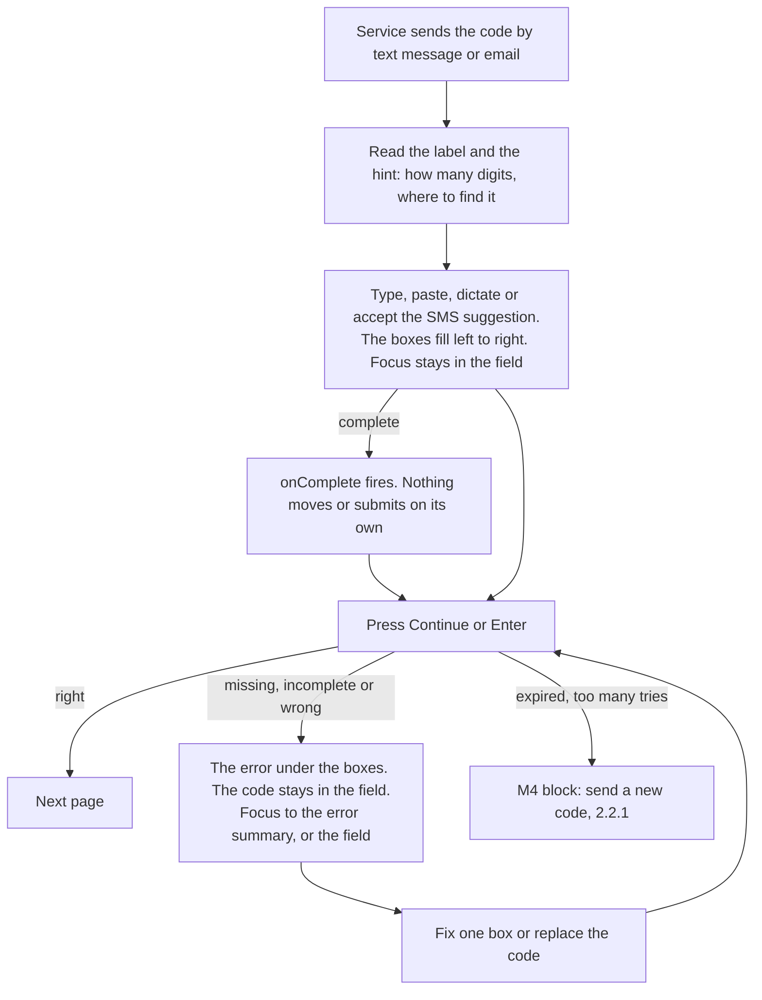

# Design spec: OneTimeCode

- **Status:** Draft
- **Designer:** ux-designer agent · **Date:** 2026-10-02
- **Plan:** [Plan 0014](../plans/0014-input-masks-and-one-time-code.md) (Phase 3) · **Related ADRs:** [ADR-0033](../adr/0033-one-time-code-single-input.md) (Proposed), [ADR-0032](../adr/0032-input-masks.md), [ADR-0029](../adr/0029-form-field-parts-and-association.md), [ADR-0030](../adr/0030-number-and-date-entry.md), [ADR-0031](../adr/0031-field-order-and-input-group.md), [ADR-0039](../adr/0039-apg-keyboard-interface-and-documented-keys.md), ADR-0007, ADR-0023, ADR-0028
- **Type:** component default styling (+ Storybook page, + DESIGN.md wording). No new tokens

ADR-0033 decides the parts and the behaviour: `OneTimeCode.Root` (`<div>`, `kv-one-time-code`), `OneTimeCode.Input` (one native `<input type="text">`, `kv-one-time-code-input`, inside a Field, `autocomplete="one-time-code"`, the `masks.oneTimeCode()` mask) and `OneTimeCode.Slot` (`<span aria-hidden="true">`, `kv-one-time-code-slot`), which draws one character. No auto-advance, no auto-submit, no form state.

This spec decides **what it looks like in the default theme**: how the slots sit over the input so the input stays the only operable element, the caret, the active slot, selection and the focus ring, the states, the 6- and 8-character and letters-and-digits variants, grouping, RTL, compact density, reflow and text spacing, and the exact conditions under which the theme falls back to a plain `kv-input` (ADR-0033 item 5). It reuses Input's tokens, states, width formula and compact density from [form-fields.md](form-fields.md) (§6.3, §6.4, §6.7, §6.8) and adds no token. Where it needs something ADR-0033 or the plan doesn't give yet, it says so (§6.1, open questions 1 to 4).

## 1. Brief

- **Users:** both.
  - Residents confirm a phone number or an email address, or sign in, with a code sent by text message or email. Usually once, on a phone, often while switching between the messages app and the browser, sometimes with the code arriving on a different device from the form.
  - Staff sign in to case tools with a code from an authenticator app, once or twice a day, on a desktop, often in compact density.
- **Hardest-case users:**
  1. A 70-year-old resident with low digital confidence, reading Swedish as a second language, on an older Android phone over a slow connection. The code is on their phone and the form on a library computer. They copy it digit by digit, and they need to see which box they're in and how many are left.
  2. A screen-reader user (VoiceOver on iOS, NVDA on Windows) who needs one field with a name and a hint, the code read back on request, and paste or SMS autofill that just works (3.3.8).
  3. A screen-magnifier user at 400%, whose magnifier follows the text caret. They need a caret they can see and a field that doesn't jump around.
  4. A Windows Contrast Themes user, who needs a field whose edge, value and focus survive system colours.
  5. A Dragon or Voice Control user who dictates "four eight one nine two zero" into one field.
- **Job to be done:** When a service sends me a code, I want to get it from my messages into the form quickly and without mistakes, so I can prove it's me and carry on.
- **Context:** resident use is rare, quick and stressful (the code expires, and people fear being locked out). Two devices or two apps are common. Staff use is routine and fast.
- **Constraints:**
  - Headless packages ship no CSS (hard rule 5). State is `data-*`, options are modifier classes (`docs/architecture.md#styling-contract`).
  - Only DESIGN.md tokens. No new colours, sizes or radii.
  - Every visible or announced string from i18n in all six locales (hard rule 4). The component itself adds none (§4.1).
  - 3.3.8 Accessible Authentication: paste, SMS autofill and password managers must work, and the code must stay visible (never `type="password"`).
  - WAD/EN 301 549: "designed and tested to meet WCAG 2.2 AA", never "compliant".
- **Success criteria:**
  - 0 axe violations in every story, in the four theme projects, RTL and forced colours.
  - The input is the only element that takes focus or pointer input. Every slot is `aria-hidden` (component test).
  - The forced-colours, 320px and 200%-text cases show the plain field, with the value and focus kept (e2e, §7.2).
  - Nothing clipped or overlapping under the 1.4.12 overrides.
  - In usability testing (§8, `pending`): every participant enters a code from another device without help, and corrects one wrong digit without retyping the whole code.
- **Evidence:** none from our own users. The prior art in §2 reports its own research.
- **Assumptions and research questions:**
  - Assumption: boxes help people check a code against the message, compared with GOV.UK's single plain field. → RQ: do participants make fewer copying errors, or notice their own errors sooner, with boxes than with the plain field (A/B within the session)?
  - Assumption: people who have used one-input-per-box designs elsewhere don't expect Tab or auto-advance between boxes. → RQ: does anyone press Tab after a digit and land on Continue by mistake?
  - Assumption: a static (non-blinking) caret plus a 2px edge on the current box is enough to show where the next character goes. → RQ: can magnifier and low-vision participants say which box is next, at a glance?
  - Assumption: ungrouped boxes are right by default, because most services send the code ungrouped. → RQ: when the message groups the code ("481 920"), do grouped boxes reduce errors?
  - Assumption: switching between the boxes and the plain field (rotating the phone, zooming) isn't disorienting, because the value and focus stay. → RQ: observe participants who zoom in mid-task.
  - Assumption: screen-reader users accept a 6-digit code read as a number ("four hundred eighty-one thousand…") and move by character to check it (ADR-0033 consequences). → RQ: how do they check the code they entered?
  - Assumption: SMS autofill (iOS QuickType, Android keyboard suggestions) and password-manager filling work with the overlay. → manual matrix, `pending`.

## 2. Prior art

| Source                                                                                                                                                                       | What we reuse                                                                                                                                                                                                                                                                                          | What we change and why                                                                                                                                                                                                                                                                                                                                  |
| ---------------------------------------------------------------------------------------------------------------------------------------------------------------------------- | ------------------------------------------------------------------------------------------------------------------------------------------------------------------------------------------------------------------------------------------------------------------------------------------------------ | ------------------------------------------------------------------------------------------------------------------------------------------------------------------------------------------------------------------------------------------------------------------------------------------------------------------------------------------------------- |
| KvirnUI Input, InputGroup, DateInput ([form-fields.md](form-fields.md))                                                                                                      | Input's box, edges, states and tokens (§6.3, §6.8). The width formula with the 1.4.12 allowance (§6.4). InputGroup's rule that the box draws the ring and the inner input has none (§6.13). Compact density (§6.7). The default field order: label, hint, control, error (ADR-0031). `numeric` figures | Each slot is a small Input-like box, but it's a drawing, not a control. The ring is drawn by the input itself, because it covers the whole row (§6.4)                                                                                                                                                                                                   |
| GOV.UK [Confirm a phone number](https://design-system.service.gov.uk/patterns/confirm-a-phone-number/)                                                                       | One input for the code, `autocomplete="one-time-code"`, `inputmode="numeric"`, spaces and dashes allowed. Errors that say how many digits the code has. This is our fallback (ADR-0033 option C), and a valid choice on its own                                                                        | We add the boxes as a visual aid on top of the same single input. GOV.UK's `--extra-letter-spacing` isn't copied: it would need a non-token letter spacing, and the 1.4.12 override replaces it anyway (open question 12). Its "You've not entered enough numbers" wording is replaced by a non-blaming one (§4.3)                                      |
| [`input-otp`](https://github.com/guilhermerodz/input-otp) (React)                                                                                                            | One input painted invisible, with the state handed to drawn slots. A drawn caret, because the real one is invisible. Password-manager badges noted as a known problem                                                                                                                                  | Their caret blinks: ours is static (2.2.2 and DESIGN.md motion). They rewrite every selection into a one-character range, so typing replaces: we keep native caret and selection, and draw both truthfully (§6.4). Their slots sit under the input: ours sit on top with `pointer-events: none`, so the browser's autofill fill can't cover them (§6.2) |
| WCAG 2.2 [Understanding 3.3.8](https://www.w3.org/WAI/WCAG22/Understanding/accessible-authentication-minimum), [3.2.2](https://www.w3.org/WAI/WCAG22/Understanding/on-input) | Paste and autofill must work. No change of context on input without warning                                                                                                                                                                                                                            | –                                                                                                                                                                                                                                                                                                                                                       |
| APG                                                                                                                                                                          | No pattern. The control is a native text input, so its keys are native (keyboard skill, key-tables "One-time code")                                                                                                                                                                                    | –                                                                                                                                                                                                                                                                                                                                                       |

## 3. Flow

The component has no page of its own. The M4 verification and login blocks own the page, the resend link and the timeout. This is the field's part of that flow:



Unhappy paths the field must support:

- **Nothing submitted yet, field empty.** Error `oneTimeCode.errorMissing` under the boxes.
- **Incomplete code.** Error `oneTimeCode.errorIncomplete` ("Enter all 6 digits of the code"). The digits already typed stay.
- **Wrong code.** Error `oneTimeCode.errorWrong`. The code stays in the field, so the user can compare it with the message and fix one digit (ADR-0033 item 6). Every box gets the invalid edge, because the code is wrong as a whole (unlike DateInput, form-fields §6.6).
- **Pasted with extra text.** "481 920", "481-920" or "Your code is 481920" ends as `481920` (ADR-0032 item 5). Nothing is refused for a separator.
- **A refused character** (a letter in a digits code, a 7th digit). Not inserted, and the shared Announcer says why, throttled (`mask.characterNotAllowed`, `mask.maximumLength`, ADR-0032 item 6). The boxes don't shake or flash.
- **Switching apps to read the message.** The field keeps its value and, when the browser restores it, its focus. Nothing in the component clears it.
- **The code completes and the service checks it at once** (`onComplete`). Allowed only if the hint says so in advance (3.2.2, `oneTimeCode.checkedEarly`, §4.4), and a Continue button stays.
- **While the code is being checked.** Don't disable the field: a disabled input loses focus, which lands on `body`. Use `readOnly` (still focusable, §6.8), and say "Checking the code" in the page's status, through the Announcer. The docs say so (open question 8).
- **The browser or the layout can't draw the boxes safely** (forced colours, a narrow column, large text, before the script runs). The plain field shows instead, with the same value, caret and focus, because it's the same element (§6.6).
- **Expired code, too many tries, no message arrived, session timeout.** Out of scope: the M4 blocks (ADR-0033 item 8). They must meet 2.2.1, and keep the field's value when they offer a new code only if the code is still valid.

## 4. Content

### 4.1 Component strings (`@kvirn-ui/i18n`)

**None.** The slots are `aria-hidden` and show only the value. The label and hint belong to the consumer, because they name the channel ("text message", "email", "authenticator app") and the length (ADR-0033 item 4). The rejection messages are the mask's, already in the plan (`mask.characterNotAllowed` in its digits and letters-and-digits variants, `mask.maximumLength`). `i18n:check` is unaffected.

The `oneTimeCode.*` keys below are **story fixture** strings, with keys local to the fixture (storybook-presentation.md §4), like the InputGroup strings in `form.fixture.tsx` (form-fields §4.5). The fixture can hold them as a nested `oneTimeCode` object.

### 4.2 Story fixture strings

`fi` strings are designer drafts for length checks. `{length}` is a number from the story (6 or 8), formatted with `Intl` (it's a small integer, so the same in every locale).

| Key                      | en                                                                                      | sv                                                                                                         | longest: fi (draft)                                                                                                   | Element                                                                  |
| ------------------------ | --------------------------------------------------------------------------------------- | ---------------------------------------------------------------------------------------------------------- | --------------------------------------------------------------------------------------------------------------------- | ------------------------------------------------------------------------ |
| `oneTimeCode.smsLabel`   | Code from the text message                                                              | Kod från sms:et                                                                                            | Tekstiviestissä saamasi koodi                                                                                         | Label (most stories)                                                     |
| `oneTimeCode.smsHint`    | The code has {length} digits. You'll find it in the text message we just sent you.      | Koden har {length} siffror. Du hittar den i sms:et som vi just skickade till dig.                          | Koodissa on {length} numeroa. Löydät sen tekstiviestistä, jonka lähetimme sinulle juuri.                              | Description **above** the boxes: the length and where to look            |
| `oneTimeCode.emailLabel` | Code from the email                                                                     | Kod från e-postmeddelandet                                                                                 | Sähköpostissa saamasi koodi                                                                                           | Label (`LettersAndDigits`)                                               |
| `oneTimeCode.emailHint`  | The code has {length} letters and digits. You'll find it in the email we just sent you. | Koden har {length} bokstäver och siffror. Du hittar den i e-postmeddelandet som vi just skickade till dig. | Koodissa on {length} merkkiä, sekä kirjaimia että numeroita. Löydät sen sähköpostista, jonka lähetimme sinulle juuri. | Description above (`LettersAndDigits`). The longest hint: wraps at 320px |
| `oneTimeCode.appLabel`   | Code from your authenticator app                                                        | Kod från din autentiseringsapp                                                                             | Todennussovelluksesi koodi                                                                                            | Label (`Compact`, staff sign-in)                                         |
| `oneTimeCode.appHint`    | Open the app and enter the code it shows. The code has {length} digits.                 | Öppna appen och skriv koden som visas. Koden har {length} siffror.                                         | Avaa sovellus ja kirjoita siinä näkyvä koodi. Koodissa on {length} numeroa.                                           | Description above (`Compact`)                                            |
| `oneTimeCode.submit`     | Continue                                                                                | Fortsätt                                                                                                   | Jatka                                                                                                                 | Primary Button after the field (`Keyboard`, `Invalid`)                   |

### 4.3 Error messages (fixtures, and the docs' patterns)

What's wrong and how to fix it, in the field's own words, never blaming. Each is announced as "Error: …" (`field.errorPrefix`).

| Key                           | en                                                                                       | sv                                                                               | longest: fi (draft)                                                                      |
| ----------------------------- | ---------------------------------------------------------------------------------------- | -------------------------------------------------------------------------------- | ---------------------------------------------------------------------------------------- |
| `oneTimeCode.errorMissing`    | Enter the code from the text message                                                     | Skriv koden från sms:et                                                          | Kirjoita tekstiviestissä saamasi koodi                                                   |
| `oneTimeCode.errorIncomplete` | Enter all {length} digits of the code                                                    | Skriv alla {length} siffrorna i koden                                            | Kirjoita koodin kaikki {length} numeroa                                                  |
| `oneTimeCode.errorWrong`      | The code doesn't match the one we sent. Check the text message and enter the code again. | Koden stämmer inte med den vi skickade. Kontrollera sms:et och skriv koden igen. | Koodi ei vastaa lähettämäämme koodia. Tarkista tekstiviesti ja kirjoita koodi uudelleen. |

The `Invalid` story uses `errorWrong` (the longest, so it tests wrapping under the boxes at 320px).

### 4.4 Docs-only content patterns

For `one-time-code.md` (the docs page), not the stories. Same three-column rule.

| Key                        | en                                                                 | sv                                                                  | longest: fi (draft)                                                     | Use                                                                            |
| -------------------------- | ------------------------------------------------------------------ | ------------------------------------------------------------------- | ----------------------------------------------------------------------- | ------------------------------------------------------------------------------ |
| `oneTimeCode.checkedEarly` | We check the code as soon as you have entered all {length} digits. | Vi kontrollerar koden så fort du har skrivit alla {length} siffror. | Tarkistamme koodin heti, kun olet kirjoittanut kaikki {length} numeroa. | Appended to the hint when the service uses `onComplete` to check early (3.2.2) |
| `oneTimeCode.checking`     | Checking the code                                                  | Koden kontrolleras                                                  | Koodia tarkistetaan                                                     | Status text and Announcer message while the field is `readOnly` (§3)           |

### 4.5 nb, nn and se

The fixture keeps `nb`, `nn` and `se` `undefined` (English, marked `lang="en"`) until a translator delivers them, as for every form fixture. These drafts are **input for the translator**, not strings for an agent to ship. `se` stays English with `TODO(native-review)`.

| Key                           | nb (draft)                                                                             | nn (draft)                                                                        |
| ----------------------------- | -------------------------------------------------------------------------------------- | --------------------------------------------------------------------------------- |
| `oneTimeCode.smsLabel`        | Kode fra SMS-en                                                                        | Kode frå SMS-en                                                                   |
| `oneTimeCode.smsHint`         | Koden har {length} sifre. Du finner den i SMS-en vi nettopp sendte deg.                | Koden har {length} siffer. Du finn han i SMS-en vi nett sende deg.                |
| `oneTimeCode.emailLabel`      | Kode fra e-posten                                                                      | Kode frå e-posten                                                                 |
| `oneTimeCode.emailHint`       | Koden har {length} bokstaver og sifre. Du finner den i e-posten vi nettopp sendte deg. | Koden har {length} bokstavar og siffer. Du finn han i e-posten vi nett sende deg. |
| `oneTimeCode.appLabel`        | Kode fra autentiseringsappen din                                                       | Kode frå autentiseringsappen din                                                  |
| `oneTimeCode.appHint`         | Åpne appen og skriv inn koden som vises. Koden har {length} sifre.                     | Opne appen og skriv inn koden som blir vist. Koden har {length} siffer.           |
| `oneTimeCode.submit`          | Fortsett                                                                               | Hald fram                                                                         |
| `oneTimeCode.errorMissing`    | Skriv inn koden fra SMS-en                                                             | Skriv inn koden frå SMS-en                                                        |
| `oneTimeCode.errorIncomplete` | Skriv inn alle de {length} sifrene i koden                                             | Skriv inn alle dei {length} siffera i koden                                       |
| `oneTimeCode.errorWrong`      | Koden stemmer ikke med den vi sendte. Sjekk SMS-en og skriv inn koden på nytt.         | Koden stemmer ikkje med den vi sende. Sjekk SMS-en og skriv inn koden på nytt.    |

### 4.6 Content rules (for the docs page)

1. **The label names where the code is** ("Code from the text message"), not "OTP", "verification code" or "PIN". The name is written out (`docs/architecture.md`, naming).
2. **The hint says how long the code is and where to find it,** above the boxes. The boxes show the length too, but they're `aria-hidden` and disappear in the fallback, so the hint is the only place screen-reader users and fallback users learn it.
3. **Group the boxes only the way the message groups the code** (`kv-one-time-code--grouped`, §6.5). A code sent as "481920" gets ungrouped boxes.
4. **Letters-and-digits codes avoid look-alikes.** The service should generate codes without `0`/`O` and `1`/`I`/`l`. The theme helps (§6.3, the dotted zero), but it can't fix a code that uses both.
5. **The boxes show exactly the value.** No `text-transform`. If the service treats codes as case-insensitive, the mask upper-cases them (ADR-0032 item 2, `transform`), so what's shown is what's sent (open question 6).
6. **Keep Continue,** keep the code after a wrong-code error, never disable the field while checking (§3).
7. **A plain Input with `masks.oneTimeCode()` is a valid choice** (ADR-0033 option C), and what the theme shows in the fallback anyway.

## 5. Structure

Reading order equals DOM order equals visual order (1.3.2). The field adds no landmark or heading.

```
div.kv-field
  label.kv-field-label[for=code]                 Kod från sms:et
  p.kv-field-description#hint                    Koden har 6 siffror. Du hittar den i sms:et som vi just skickade till dig.
  div.kv-one-time-code[data-ready][data-complete][data-invalid]          OneTimeCode.Root: the row, and the query container
    input.kv-one-time-code-input#code[type=text][inputmode=numeric][autocomplete=one-time-code]
         [dir=ltr][spellcheck=false][autocorrect=off][aria-describedby="hint err"][aria-invalid=true]
    span.kv-one-time-code-slot[aria-hidden=true][data-filled][data-invalid]                   4
    span.kv-one-time-code-slot[aria-hidden=true][data-filled][data-invalid]                   8
    span.kv-one-time-code-slot[aria-hidden=true][data-filled][data-invalid][data-active][data-caret=before]   1
    … × 6
  p.kv-field-error-message#err                   Error: Koden stämmer inte med den vi skickade. …
div.kv-button-group > button.kv-button.kv-button--primary    Fortsätt
```

- The Input comes **before** the slots in the DOM (as in the plan's sketch), so the theme can style the slots from the input's state with the `~` combinator (hover, disabled, read-only) without `:has()`.
- A hint under the boxes (ADR-0031) is allowed, but the stories don't use one: the length must be read **before** typing (form-fields §4.4).

| Width | Layout                                                                                                                                                                                                                                                                         |
| ----- | ------------------------------------------------------------------------------------------------------------------------------------------------------------------------------------------------------------------------------------------------------------------------------ |
| 320px | A 288px column (254px in a card). Six boxes shrink from 44px to about 41px (36px in a card) and stay in one row. Eight boxes don't fit at their 32px minimum, so the plain field shows (§6.5). The label and the Finnish hint wrap. Continue is full width (`kv-button-group`) |
| 40rem | Boxes at their full 44×44px, the row 304px (6) or 408px (8), at the start of the column. Continue start-aligned                                                                                                                                                                |
| 64rem | Same for residents. Staff (`kv-compact`): 32×32px boxes, 4px apart                                                                                                                                                                                                             |

## 6. Visual specification

### 6.1 Class API and state attributes

Default **bold**.

| Class                       | Rendered by                     | Notes                                                                                                                                                                                                                                                                     |
| --------------------------- | ------------------------------- | ------------------------------------------------------------------------------------------------------------------------------------------------------------------------------------------------------------------------------------------------------------------------- |
| `kv-one-time-code`          | `OneTimeCode.Root` (`<div>`)    | The row of slots, the positioning context for the input, and a named size container (`kv-one-time-code`). Draws nothing itself in any mode                                                                                                                                |
| `kv-one-time-code--grouped` | modifier, consumer adds         | **Off by default.** Splits an even-length code into two halves with a wider gap (§6.5). Ignored for odd lengths                                                                                                                                                           |
| `kv-one-time-code-input`    | `OneTimeCode.Input` (`<input>`) | In the fallback it looks exactly like `kv-input kv-input--numeric` with the code's width. The theme adds `.kv-one-time-code-input` to Input's selector lists, rather than the part rendering `kv-input`, so a consumer's global `.kv-input` CSS can't restyle the overlay |
| `kv-one-time-code-slot`     | `OneTimeCode.Slot` (`<span>`)   | One character. `aria-hidden="true"`, never focusable, `pointer-events: none`                                                                                                                                                                                              |

**State attributes.** The plan's set, plus four this spec needs (bold), which ADR-0033 item 3 and the hook's `slots` would gain (open questions 1 to 3):

| Attribute            | On                    | Meaning                                                                                                                                                                                                                                                                                                                                                          |
| -------------------- | --------------------- | ---------------------------------------------------------------------------------------------------------------------------------------------------------------------------------------------------------------------------------------------------------------------------------------------------------------------------------------------------------------- |
| `data-filled`        | Slot                  | The slot has a character                                                                                                                                                                                                                                                                                                                                         |
| `data-active`        | Slot                  | The input has focus, the selection is collapsed, and the caret is at this slot: index `min(caret, length − 1)`. Exactly one slot, or none                                                                                                                                                                                                                        |
| **`data-caret`**     | Slot (the active one) | `before`: the caret is before this slot's position (in an empty slot, that's where the next character goes). `after`: only on the last slot, when the code is complete and the caret is after the last character. Without it, the two cases on a complete code look the same, and Backspace would delete a different character from the one the user sees marked |
| **`data-selected`**  | Slot                  | The input has focus and a non-collapsed selection covers this slot's character                                                                                                                                                                                                                                                                                   |
| `data-invalid`       | Root, Slot            | From the Field (ADR-0029). Every slot                                                                                                                                                                                                                                                                                                                            |
| `data-complete`      | Root                  | Every slot is filled. **No visual by default**: complete isn't correct, and a tick or a green edge would read as "verified"                                                                                                                                                                                                                                      |
| `data-disabled`      | Root                  | From the Field or `disabled`. The theme styles the slots from the input's `:disabled` too                                                                                                                                                                                                                                                                        |
| **`data-ready`**     | Root                  | Set by the hook once it's running and has read the input's current value (autofill or typing before hydration). The theme draws the slots only with it, so typing before the script runs is never invisible (§6.6)                                                                                                                                               |
| `data-focus-visible` | Input                 | Where the component sets it, as Input does. The theme also accepts `:focus-visible`                                                                                                                                                                                                                                                                              |

The hook's slot object would become `{ character, isFilled, isActive, caret, isSelected }`, with `caret: 'before' | 'after' | undefined`. The `data-selected` value is new to the architecture's state table (`docs/architecture.md#styling-contract`), which lists `data-highlighted` for a different meaning (a menu item under the pointer).

**Length.** The theme reads the number of slots with CSS (`:has(> :nth-last-child(1 of .kv-one-time-code-slot):nth-child(6 of .kv-one-time-code-slot))` and the like, for 4 to 8) into an internal `--kv-one-time-code-length`. No `data-length` is needed (open question 4). A Root with no slots, or fewer than 4 or more than 8, always gets the plain field.

**Prose boundary.** `.kv-one-time-code` sits inside `.kv-field`, which is already on the not-prose list.

### 6.2 How the slots overlay the input

**The slots draw the code. The input is invisible and underneath, and receives everything.** This is ADR-0033 option A, decided in detail:

1. The Root is a flex row of slots, `position: relative`, `isolation: isolate`.
2. The input is `position: absolute` over the row: `inset-block: 0`, `inset-inline-start: 0`, and the row's width (§6.5), so it covers every slot **and the gaps between them**. It has no edge, no fill, transparent text (`color` and `-webkit-text-fill-color`), a transparent caret (`caret-color: transparent`) and a transparent `::selection`. It keeps its real font size, 16px, so iOS doesn't zoom in on focus.
3. The slots are stacked **above** the input (`z-index: 1`) with `pointer-events: none`, so every press goes through to the input. A press on a slot or in a gap focuses the input natively, with no script (ADR-0033 item 3). Slots have an opaque `canvas` fill, so even if a browser forces the input's text colour, its glyphs are hidden under the boxes.
4. The slots draw the characters, the caret and the selection from the hook's state (§6.4). Nothing visible depends on the input's own text metrics, so the slots can't drift from the text under zoom or the 1.4.12 overrides. The only thing that can go wrong is that the browser shows the input's own text or colours over the boxes, and that's what the fallback guards against (§6.6).
5. **Best-effort alignment of the invisible text.** The input gets `padding-inline-start: calc((slot − 1ch) / 2)` and `letter-spacing: calc(slot + gap − 1ch)` at the full slot size, so its real caret, which screen magnifiers follow, sits near the drawn one. Nothing visible relies on it: the 1.4.12 override replaces the letter spacing, and narrow rows shrink the slots. It's a help for magnifier tracking, not a layout rule.
6. **Pointer caret placement** (behaviour, for the hook): a press on slot _k_ puts the caret before slot _k_'s character if it's filled, or at the end of the value if it's empty, so a press never leaves the caret "inside" an empty run (open question 3). A press in a gap goes to the nearer slot. Double-click selects the whole code (native: a code is one word).
7. **Autofill.** The browser's autofill fill (Chromium's is `!important`) paints only the input, which lies under the opaque slots, so it shows only in the 8px gaps, as a faint tint. That's accepted, like InputGroup's autofill fill (form-fields §6.13), and it tells sighted users the code was filled in. The slots are never covered.
8. **Long-press on touch** still opens the native callout with Paste (3.3.8), because the input is the element under the finger. iOS may draw its selection handles where the invisible text is: accepted, and a research note (§8).

Why not the other way round (visible input text, with boxes drawn behind it by letter spacing): the 1.4.12 letter-spacing override, which we must allow, pulls the characters out of their boxes, and CSS can't detect that it happened. A comb that breaks silently is worse than a drawing that can't break.

### 6.3 Root, Input and Slot

| Part                                | Property   | Value                                                                                                                                                                                                                                                                                                                                                                                    |
| ----------------------------------- | ---------- | ---------------------------------------------------------------------------------------------------------------------------------------------------------------------------------------------------------------------------------------------------------------------------------------------------------------------------------------------------------------------------------------- |
| `kv-one-time-code` (Root)           | Layout     | `display: flex; gap: var(--kv-one-time-code-gap)`, no wrapping. `position: relative; isolation: isolate`. `inline-size: 100%` of the field column, `min-inline-size: 0`. `container: kv-one-time-code / inline-size`. No edge, fill, radius or outline in any mode                                                                                                                       |
|                                     | Direction  | The row always reads left to right: in an RTL context (`:dir(rtl)`) the theme sets `flex-direction: row-reverse; justify-content: flex-end`, so slot 1 is on the left and the row sits at the start (the right) of the column (§6.10)                                                                                                                                                    |
| `kv-one-time-code-input` (enhanced) | Box        | `position: absolute; inset-block: 0; inset-inline-start: 0; inline-size: min(100%, <row width>)`, `block-size: 100%`, `margin: 0`, `padding-block: 0`, the padding and letter spacing of §6.2 item 5. `z-index: 0`. `border: 0` **in every state**, `border-radius: var(--kv-radius-md)`, `background-color: transparent`, `box-shadow: none`                                            |
|                                     | Text       | `font-family` and size as Input (`body`, 16px in both densities), `font-feature-settings: var(--kv-font-numeric-feature-settings)`. `color: transparent; -webkit-text-fill-color: transparent; caret-color: transparent`. `::selection { background-color: transparent }`                                                                                                                |
|                                     | Ring       | Input's own focus rule (2px `focus-ring`, 2px offset). The input covers the row, so its ring is the ring around the whole row, following the `md` radius (§6.4)                                                                                                                                                                                                                          |
|                                     | Cursor     | `cursor: text`; `not-allowed` when disabled                                                                                                                                                                                                                                                                                                                                              |
| `kv-one-time-code-input` (fallback) | All        | Exactly `kv-input kv-input--numeric` (form-fields §6.3, §6.8): in normal flow, 1px `border-control`, `canvas`, 44px (32px compact), its own ring, its own invalid and disabled states. Width: Input's width formula with `--kv-input-chars: var(--kv-one-time-code-length)` (the 1.4.12 allowance and the 2px invalid edge included), `max-inline-size: 100%`                            |
| `kv-one-time-code-slot`             | Box        | `box-sizing: border-box`. `inline-size: var(--kv-one-time-code-slot-size)` (44px, 32px compact), `flex: 0 1 auto`, `min-inline-size: var(--kv-space-8)` (32px), `min-block-size: var(--kv-control-min-block-size)` (44px, 32px compact). No fixed `block-size`                                                                                                                           |
|                                     | Edge, fill | `var(--kv-one-time-code-slot-edge-width) solid var(--kv-one-time-code-slot-edge)`: 1px `border-control` at rest. `border-radius: var(--kv-radius-md)`. `background-color: canvas`. No shadow (DESIGN.md: depth means "press me")                                                                                                                                                         |
|                                     | Content    | `display: flex; align-items: center; justify-content: center`, so the character is centred and stays put when the edge goes from 1px to 2px. `position: relative; z-index: 1`. `direction: ltr` (a presentational, `aria-hidden` box). `overflow: visible`                                                                                                                               |
|                                     | Type       | `numeric` (16/400/1.5, `tnum`) in both densities, the same size as the fallback field, so switching never changes the code's size. `color: text`. `letter-spacing: normal` (the 1.4.12 override may replace it: the box has room, §6.5)                                                                                                                                                  |
|                                     | Letters    | With `characters="lettersAndDigits"` (the input has `autocapitalize="characters"`, so `.kv-one-time-code:has(> [autocapitalize=characters])`), the slots add Plex's dotted zero: `font-feature-settings: var(--kv-font-numeric-feature-settings), 'ss04'` (DESIGN.md Disambiguation). Never the slashed zero, which reads as Ø. A brand font must check its own `ss04` (open question 6) |
|                                     | Pointer    | `pointer-events: none; user-select: none`                                                                                                                                                                                                                                                                                                                                                |

### 6.4 Caret, active slot, selection and focus ring

**The focus ring** is the input's ring (2px `focus-ring`, 2px offset, `md` radius), drawn around the whole row, because the input covers it. Text inputs match `:focus-visible` on a click too, so the ring shows whenever the field has focus, as on Input. It's the field's focus indicator (2.4.7, and 2.4.13 in the default theme: the perimeter of the whole row, at least 4.42:1 against the page, §6.10). Nothing inside the row is a second ring.

**The active slot** (where the next character goes) has a **2px `focus-ring` edge** (`--kv-focus-ring-width`, the 1px extra taken from inside, so the character doesn't move) and the **caret**. The thicker edge is the at-a-glance cue for low-vision users. The caret says exactly where, between characters.

**The caret** is a bar drawn by the active slot:

| Case                                                           | Slot attributes                               | Where the bar is                                     |
| -------------------------------------------------------------- | --------------------------------------------- | ---------------------------------------------------- |
| Empty slot: the next character goes here                       | `data-active data-caret="before"`, not filled | Centred in the slot, where the character will appear |
| Before a filled character (the user moved back with ArrowLeft) | `data-active data-caret="before" data-filled` | Just before the character's glyph                    |
| After the last character of a complete code                    | `data-active data-caret="after" data-filled`  | Just after the character's glyph, in the last slot   |

- The bar is a pseudo-element in the slot's flex row, next to the character, `inline-size: var(--kv-focus-ring-width)` (2px) and `block-size: 1lh`, in `text` (Input's `caret-color`). Its negative inline margins cancel its own width plus a 1px gap, so the character never moves when the caret arrives or leaves. Because it sits next to the glyph in the flow, it's right for any glyph width (a narrow "1", a wide "W") and under the 1.4.12 overrides.
- **Static.** It never blinks, in any motion setting. A blinking author-drawn caret is non-essential motion that runs indefinitely (2.2.2, DESIGN.md Motion). The 2px edge and the bar don't need it to be found.
- `1lh` follows the 1.4.12 line height. In a 32px compact slot, a 24px bar fits.

**Selection** (Shift+arrows, Control/Command+A, a double-click, or Tab into a filled field, where browsers usually select the value): the selected slots get a **`primary-subtle` fill and a 2px `focus-ring` edge**, and no slot is active, so no caret is drawn. The edge width carries it as well as the fill, so it's not colour alone and it passes 3:1 as a boundary. The characters stay `text` (16.80:1 or more on `primary-subtle`, §6.10). The input's own selection highlight is transparent, because it would be in the wrong place.

**Blur.** No slot is active or selected, so the row is back to its resting edges.

### 6.5 Sizes, length, grouping and reflow

**Sizes** (internal aliases, §6.9):

| Value                    | Comfortable                             | Compact (`kv-compact`, from 64rem) |
| ------------------------ | --------------------------------------- | ---------------------------------- |
| Slot size (preferred)    | 44×44px (`--kv-control-min-block-size`) | 32×32px (same token)               |
| Slot minimum inline size | 32px (`space-8`)                        | 32px                               |
| Gap                      | 8px (`space-2`)                         | 4px (`space-1`)                    |
| Group gap (`--grouped`)  | 16px (two gaps)                         | 8px                                |
| Radius                   | `md` (8px)                              | `md`                               |

A slot is a square at its preferred size. Slots shrink equally (`flex: 0 1 auto`) when the column is narrower than the row, down to 32px. Below that, the field falls back (§6.6) instead of wrapping: a row broken into "48192" and "0" would look like two answers.

**Room for one character in the smallest slot:** 32px minus two 2px edges is 28px. A digit is 0.6em (9.6px) plus the 0.12em 1.4.12 allowance (1.9px). A wide capital such as W is about 1em with the allowance. Both fit with room to spare. Everything is in `rem` or `em`, so it grows with the user's text size (1.4.4).

**Row width and fallback threshold** per length (comfortable, at a 16px root):

| Length | Row at full size (ungrouped / `--grouped`) | Minimum row = fallback threshold (`2.5 × length` rem) | Slots at 320px, page column (288px) | Slots at 320px, in a card (254px) |
| ------ | ------------------------------------------ | ----------------------------------------------------- | ----------------------------------- | --------------------------------- |
| 4      | 200px / 208px                              | 10rem (160px)                                         | yes, full size                      | yes, full size                    |
| 5      | 252px / (odd: no grouping)                 | 12.5rem (200px)                                       | yes, full size                      | yes, full size                    |
| 6      | 304px / 312px                              | 15rem (240px)                                         | yes, about 41px                     | yes, about 36px                   |
| 7      | 356px / (odd)                              | 17.5rem (280px)                                       | yes, about 34px                     | no: plain field                   |
| 8      | 408px / 416px                              | 20rem (320px)                                         | no: plain field                     | no: plain field                   |

- The threshold is one number per length (5 container rules), counted as if grouped (one extra gap), so it's slightly conservative for ungrouped codes and for compact density, never too generous. A compact row in a column under the threshold falls back a little earlier than it strictly has to: accepted, for one rule per length.
- **The Root is the column's full width** and the slots pack at its start. The input overlay is sized to the row, `min(100%, <row width>)`, so its ring hugs the boxes, not the column.
- **Text size 200%** (the browser's font-size setting doubles `rem`): on a 320px phone every length falls back (the 4-slot threshold becomes 320px). On a desktop with a 40rem column, the boxes grow to 88px.
- **Browser zoom 400%** on a 1280px screen is a 320px viewport: the 320px rows above.
- Switching between slots and the plain field is CSS only. The input is the same element, so its value, caret, selection and focus stay when the user rotates the phone or zooms.

**Grouping.** `kv-one-time-code--grouped` adds one group gap (an extra `--kv-one-time-code-gap`, as `margin-inline-start` on the first slot of the second half, in the slot's own left-to-right direction) after `length / 2` slots: 2+2, 3+3 or 4+4. Odd lengths ignore it. No visible separator character: a "–" between the halves would read as part of the code, or as a minus. Default **off**, because most services send the code ungrouped and the box count should match what the user sees in the message (§4.6 rule 3). The `LettersAndDigits` story shows it (8 characters, 4+4).

### 6.6 Fallback: when the theme shows the plain field

**The slots are an enhancement the theme opts into only when every condition holds.** The base styles are the plain field (ADR-0033 option C), so a browser that doesn't understand a condition gets the plain field, not a broken drawing.

| Condition for drawing the slots                                                                                          | Why                                                                                                                                                                                                                                    | Reliable in CSS?                                                                        |
| ------------------------------------------------------------------------------------------------------------------------ | -------------------------------------------------------------------------------------------------------------------------------------------------------------------------------------------------------------------------------------- | --------------------------------------------------------------------------------------- |
| `@media (forced-colors: none)`                                                                                           | In forced colours, the browser replaces `transparent` text and fills with system colours, so the input's own text and caret would show through and over the slots, and the slots' fills and edges would be repainted (ADR-0033 item 5) | Yes. A browser without the media feature evaluates it false and gets the plain field    |
| Root has `[data-ready]`                                                                                                  | Before the script runs (a slow phone, server rendering), the slots can't follow typing or SMS autofill, so a transparent input would swallow what the user types                                                                       | Yes, given the hook sets it after reading the input's value on mount (open question 2)  |
| The Root has 4 to 8 slots (the length rules, §6.1)                                                                       | The row width and the threshold need the length                                                                                                                                                                                        | Yes (`:has()`, `:nth-child(… of …)`)                                                    |
| `@container kv-one-time-code (inline-size >= 2.5 × length rem)`                                                          | The row fits at 32px slots. Covers 320px, cards, sidebars, 200% text and 400% zoom                                                                                                                                                     | Yes. The container is the Root, whose width comes from the column, not from its content |
| `@supports (container-type: inline-size) and selector(:has(*)) and selector(:nth-child(1 of *)) and selector(:dir(rtl))` | Every feature the drawing relies on                                                                                                                                                                                                    | Yes. All Baseline 2023                                                                  |

In the fallback, the slots are `display: none` (they're `aria-hidden` anyway), the input is in normal flow with Input's look and the code's width, and its own ring, edge and invalid and disabled states apply. The Root stays a flex row, so in RTL the input sits at the start (the right).

**Not a trigger, on purpose:**

- `prefers-contrast: more`: the contrast themes remap the tokens, and the slots work in them (§6.10).
- The 1.4.12 overrides: the slots don't depend on the input's text metrics (§6.2), and each slot has room for the letter spacing (§6.5). The e2e test checks it.
- `prefers-reduced-motion`: nothing moves (§6.10).

**Known risks the theme can't detect** (manual matrix, §8): password-manager extensions that draw an icon over the input's inline end can cover the last slot (`input-otp` widens the input for this; we don't, open question 13); iOS selection handles at the invisible text; a user style sheet that forces `color` with `!important` on every element (the opaque slots still hide the glyphs; only the gaps could show them).

### 6.7 Density

| Part               | Comfortable (default) | Compact (`kv-compact`, from 64rem) | Why                                                           |
| ------------------ | --------------------- | ---------------------------------- | ------------------------------------------------------------- |
| Slot size          | 44×44px               | 32×32px                            | `--kv-control-min-block-size`                                 |
| Slot minimum width | 32px                  | 32px                               | Room for one character plus the 1.4.12 allowance              |
| Gap / group gap    | 8px / 16px            | 4px / 8px                          | `space-2` / `space-1`                                         |
| Character          | 16px `numeric`        | **16px** `numeric`                 | Essential content, and no iOS zoom on iPad (form-fields §6.7) |
| Label              | `label` 16/500        | `label-compact` 14/500             | Field's control tokens                                        |
| Hint, error        | 16px                  | **16px**                           | Instructions and errors never go below 16px                   |
| Target (the input) | the row, 44px high    | the row, 32px high                 | 2.5.5 in comfortable, 2.5.8 in compact                        |
| Fallback field     | 44px                  | 32px                               | Input                                                         |

Below 64rem compact returns to comfortable, as for every control.

### 6.8 States

The slots (enhanced mode). The fallback field follows Input's table (form-fields §6.8) exactly.

| State                        | Slot edge                                           | Slot fill                  | Character    | Caret            | Other                                                                                                                                                            |
| ---------------------------- | --------------------------------------------------- | -------------------------- | ------------ | ---------------- | ---------------------------------------------------------------------------------------------------------------------------------------------------------------- |
| Empty                        | 1px `border-control`                                | `canvas`                   | –            | –                |                                                                                                                                                                  |
| Filled                       | 1px `border-control`                                | `canvas`                   | `text`       | –                | The character is the cue                                                                                                                                         |
| Hover (pointer over the row) | 1px `text`, every slot                              | `canvas`                   | `text`       | –                | From `.kv-one-time-code-input:hover ~ .kv-one-time-code-slot`. Not essential. No change when invalid, disabled or read-only                                      |
| Focus-visible (the field)    | unchanged                                           | unchanged                  | unchanged    | –                | 2px `focus-ring` ring, 2px offset, around the whole row (the input's ring)                                                                                       |
| Active (caret slot)          | **2px `focus-ring`**                                | `canvas`                   | `text`       | bar              | §6.4                                                                                                                                                             |
| Selected                     | **2px `focus-ring`**                                | `primary-subtle`           | `text`       | –                | §6.4                                                                                                                                                             |
| Complete (`data-complete`)   | unchanged                                           | unchanged                  | `text`       | –                | No visual. Complete isn't correct                                                                                                                                |
| Invalid                      | **2px `danger`**, every slot                        | `canvas`                   | `text`       | –                | Plus the error message under the row: never colour alone. The input has `aria-invalid="true"`                                                                    |
| Invalid + active             | active slot: 2px `focus-ring`; others: 2px `danger` | `canvas`                   | `text`       | bar              | Where the next character goes matters most while correcting. The invalid state stays on the other slots, in the message and in `aria-invalid` (open question 10) |
| Invalid + selected           | selected: 2px `focus-ring`; others: 2px `danger`    | selected: `primary-subtle` | `text`       | –                |                                                                                                                                                                  |
| Disabled                     | 1px **dashed** `border-control`                     | `surface`                  | `text-muted` | –                | From `[data-disabled]` or the input's `:disabled`. `cursor: not-allowed`. Discouraged while checking a code (§3)                                                 |
| Read-only                    | 1px solid `border-control`                          | `surface`                  | `text`       | bar when focused | Focusable, ring on focus, caret and selection drawn. The recommended state while the code is being checked                                                       |
| Autofilled                   | as the state                                        | `canvas`                   | `text`       | as the state     | The browser's tint shows only in the gaps (§6.2 item 7)                                                                                                          |

The character never moves between states: the slot centres it, and every edge change is taken from inside the box (`box-sizing: border-box`).

### 6.9 Tokens per part

| Part             | Tokens (DESIGN.md)                                                                                                                                                                                                                                  |
| ---------------- | --------------------------------------------------------------------------------------------------------------------------------------------------------------------------------------------------------------------------------------------------- |
| Root             | `space-2` / `space-1` (gap)                                                                                                                                                                                                                         |
| Input (enhanced) | `body` size, `numeric` feature settings, `md` radius, `focus-ring`, `--kv-focus-ring-width`, `--kv-focus-ring-offset`                                                                                                                               |
| Input (fallback) | Input's: `canvas`, `text`, `body`, `md`, `--kv-input-padding-inline`, `--kv-control-min-block-size`, `border-control`, `danger`, `surface`, `text-muted`, `focus-ring`, `numeric`, the width formula                                                |
| Slot             | `--kv-control-min-block-size`, `space-8`, `md`, `--kv-border-width`, `--kv-focus-ring-width`, `--kv-control-border-width-invalid`; `border-control`, `text`, `canvas`, `focus-ring`, `primary-subtle`, `danger`, `surface`, `text-muted`; `numeric` |
| Motion           | `--kv-duration-fast`, `--kv-easing-standard`                                                                                                                                                                                                        |

**Internal aliases** (set by the theme, not public tokens, like Input's `--kv-input-edge`; don't set them from outside):

| Alias                                                                | Value                                                                                                                                                   |
| -------------------------------------------------------------------- | ------------------------------------------------------------------------------------------------------------------------------------------------------- |
| `--kv-one-time-code-length`                                          | 4 to 8, from the slot count (§6.1)                                                                                                                      |
| `--kv-one-time-code-slot-size`                                       | `var(--kv-control-min-block-size)`                                                                                                                      |
| `--kv-one-time-code-gap`                                             | `var(--kv-space-2)`; `var(--kv-space-1)` in `kv-compact` from 64rem                                                                                     |
| `--kv-one-time-code-slot-edge`, `--kv-one-time-code-slot-edge-width` | Per state: `border-control` / `text` / `focus-ring` / `danger`, and `--kv-border-width` / `--kv-focus-ring-width` / `--kv-control-border-width-invalid` |

**No new token, no new value, no new colour.** No ADR is needed for tokens, and `theme:check` gets no new pair (§6.10).

### 6.10 Modes

**Measured pairs** (`packages/theme/src/contrast.ts` against `theme.css`, 2026-10-02; `vp run theme:check` passed with 460 pairs in 4 themes the same day). Every pair is already required by `theme:check`:

| Pair (use)                                                                       | light              | dark               | light-contrast        | dark-contrast         |
| -------------------------------------------------------------------------------- | ------------------ | ------------------ | --------------------- | --------------------- |
| `border-control` on `canvas` / `surface` / `surface-raised` (slot edge, 3:1)     | 4.98 / 4.68 / 4.98 | 4.19 / 3.83 / 3.54 | 10.86 / 10.21 / 10.86 | 14.28 / 13.04 / 12.05 |
| `text` on `canvas` (character, caret, 4.5:1)                                     | 19.05              | 19.61              | 20.86                 | 20.86                 |
| `text` on `primary-subtle` (selected character, 4.5:1)                           | 16.80              | 14.66              | 18.41                 | 15.59                 |
| `text-muted` on `surface` (disabled character, 4.5:1)                            | 5.84               | 5.86               | 10.21                 | 13.04                 |
| `danger` on `canvas` (invalid edge, 3:1)                                         | 6.40               | 9.29               | 8.23                  | 12.35                 |
| `focus-ring` on `canvas` / `surface` / `surface-raised` (ring, active edge, 3:1) | 4.70 / 4.42 / 4.70 | 7.27 / 6.64 / 6.14 | 9.89 / 9.29 / 9.89    | 11.14 / 10.17 / 9.40  |
| `focus-ring` on `primary-subtle` (selected edge against its fill)                | 4.15               | 5.44               | 8.72                  | 8.33                  |

- **Dark, light-contrast, dark-contrast:** only the tokens change. In dark the slots are `canvas` (black) on a `surface-raised` card, so each reads as a hole, like the Input.
- **Forced colours:** the plain field (§6.6), styled as Input in forced colours: `Field` / `FieldText`, edge `ButtonBorder`, invalid 2px `CanvasText`, disabled dashed `GrayText`, focus `Highlight`, and the native selection in `Highlight`. The slots are `display: none`. The Storybook `ForcedColors` story only marks the story (`data-forced-colors`); the fallback itself is asserted in the `chromium-forced-colors` e2e project.
- **RTL:**
  - The code is an identifier: the input has `dir="ltr"`, from the `oneTimeCode` preset's suggestions (ADR-0032 item 3; open question 7).
  - The slot row reads left to right (`row-reverse` and `flex-end` under `:dir(rtl)`), and sits at the start of the column, on the right. The label, hint and error are right-aligned as usual.
  - The slots have `direction: ltr`, so the caret's "before" is on the left of the character, and the group gap sits between the halves.
  - The input overlay's `inset-inline-start: 0` resolves against the Root's direction, so it covers the row on the right. Its comb padding resolves against its own `dir="ltr"`.
  - In the fallback, the input sits at the start (the right), with its digits left to right.
- **Motion:** the slots' `border-color` and `background-color` transition over `--kv-duration-fast` with `--kv-easing-standard`, only under `prefers-reduced-motion: no-preference`. The caret, the active edge and the selection fill change instantly (they follow typing, and a delay would make the caret lag). The caret never blinks. No fill animation when a character arrives.
- **320px, 400% zoom, 200% text, 1.4.12:**
  - No fixed heights: `min-block-size` only. The caret uses `1lh`.
  - The slots shrink to 32px, then the field falls back (§6.5). Never horizontal scroll.
  - The label and the long Finnish hint (`oneTimeCode.emailHint`) wrap and hyphenate, as every Field part does (ADR-0028).
  - Under the 1.4.12 overrides, each character stays inside its slot, unclipped, and the caret stays beside it.

### 6.11 DESIGN.md changes

For the engineer to apply in Phase 3 with the theme styles, once the maintainer agrees (no token change, so no ADR beyond ADR-0033's amendment, open question 1). In the Components section, a new last sub-bullet under **Text inputs**:

> - A one-time code (ADR-0033) is one native input. The theme draws the code over it as a row of boxes, one per character: 44px squares (32px in compact) that shrink to 32px wide on a narrow screen, 8px apart (4px in compact), with the `md` radius, a 1px `border-control` edge and `numeric` figures. The boxes are hidden from assistive technology and can't be pressed: every press goes to the input. The focus ring goes around the whole row. The box where the next character goes has a 2px `focus-ring` edge and a static caret, and selected characters a `primary-subtle` fill with the same edge. Invalid is a 2px `danger` edge on every box plus the error message under the row. Complete has no look of its own. The row reads left to right in every direction. In forced colours, when the row doesn't fit at 32px boxes, or before the script runs, the theme shows a plain numeric input with the same value and focus instead. `kv-one-time-code--grouped` splits an even-length code into two halves.

In **Theming**, the class list: add `kv-one-time-code--grouped` to the form-field choices, and `kv-one-time-code`, `kv-one-time-code-input` and `kv-one-time-code-slot` to the rendered parts, with "A one-time code's slots take `data-filled`, `data-active`, `data-caret`, `data-selected` and `data-invalid`, and its root `data-ready`, `data-complete`, `data-invalid` and `data-disabled`."

## 7. Accessibility annotations

Draft input for `one-time-code.a11y.md`. ADR-0033 and the plan's contract take precedence.

- **Names (2.5.3, 1.3.1, 3.3.2):** the input is named by its visible `Field.Label` and described by the hint (and the error), through Field's `aria-describedby`. No `aria-label`. The slots are `aria-hidden` and have no name, role or description.
- **Roles:** a native `<input type="text">`, no added role. The Root is a plain `<div>` with no role: one control, and an unnamed `group` would only add noise.
- **Attributes:** `autocomplete="one-time-code"`, `inputmode="numeric"` (digits) or `autocapitalize="characters"` (letters and digits), `spellcheck="false"`, `autocorrect="off"`, `dir="ltr"`. No `maxlength`, no `pattern`, never `type="password"` (ADR-0033 item 2).
- **Invalid:** `aria-invalid="true"` on the input. The error starts with "Error:" (`field.errorPrefix`). The slots' `danger` edges are visual only.
- **Announcements:** none from OneTimeCode. The mask's refusals go through the shared Announcer, politely and throttled (ADR-0032 item 6). Completing the code announces nothing: the screen-reader user hears their own typing.
- **Focus:** never moved by the component (no auto-advance, no auto-submit). A press anywhere on the row focuses the input. The focus ring is the input's, around the row, and the field is one Tab stop.
- **Hidden-content check:** `aria-hidden` slots contain no focusable content (they're spans with text). The input is never hidden or `inert`.
- **Target size:** the input covers the row: at least 160×44px in comfortable (2.5.5) and 32px high in compact (2.5.8).
- **Input purpose:** `one-time-code` is in the HTML autofill tokens, not in 1.3.5's list, but it's what makes SMS and password-manager filling work (3.3.8).
- **WCAG SCs of note:** 1.3.1, 1.3.2, 1.4.1, 1.4.3, 1.4.4, 1.4.10, 1.4.11, 1.4.12, 2.1.1, 2.1.2, 2.2.2, 2.4.3, 2.4.7, 2.4.11, 2.4.13, 2.5.3, 2.5.5 (comfortable), 2.5.8, 3.2.1, 3.2.2, 3.3.1, 3.3.2, 3.3.8, 4.1.2, 4.1.3.

### 7.1 Keyboard (draft of the contract's Keyboard section)

- **Focus strategy:** native
- **Selection follows focus:** n/a
- **Arrows wrap:** n/a
- **Shortcuts:** none

| Key                                                        | Context                         | Action                                                                                                                                  | Test                                                                  |
| ---------------------------------------------------------- | ------------------------------- | --------------------------------------------------------------------------------------------------------------------------------------- | --------------------------------------------------------------------- |
| Tab                                                        | before the field                | Moves focus into the code field. The whole row is one stop                                                                              | `one-time-code.e2e.ts › Tab focuses the input once`                   |
| Tab                                                        | in the field                    | Moves focus to the next focusable element (Continue), never to another box, also when the code is complete                              | `one-time-code.e2e.ts › Tab leaves the field`                         |
| Shift+Tab                                                  | in the field                    | Moves focus to the previous focusable element                                                                                           | `one-time-code.e2e.ts › Shift+Tab leaves the field`                   |
| Characters                                                 | in the field                    | Inserted at the caret and shown in its box. The caret moves to the next box. Focus stays when the code is complete, and nothing submits | `one-time-code.e2e.ts › typing fills the boxes and keeps focus`       |
| A refused character                                        | in the field                    | Not inserted. A polite message says which characters fit ("Only digits can be entered here")                                            | `one-time-code.e2e.ts › a letter in a digits code is refused`         |
| Characters                                                 | code complete, caret at the end | Not inserted. A polite message says the code is complete ("You've entered all 6 characters")                                            | `one-time-code.e2e.ts › a seventh digit is refused`                   |
| Control/Command+V                                          | in the field                    | Pastes. Spaces, dashes and other text are removed, and the code fills the boxes                                                         | `one-time-code.e2e.ts › paste normalises the code`                    |
| Backspace                                                  | in the field                    | Deletes the character before the caret. Later characters move back one box                                                              | `one-time-code.e2e.ts › Backspace deletes before the caret`           |
| Delete                                                     | in the field                    | Deletes the character after the caret                                                                                                   | `one-time-code.e2e.ts › Delete deletes after the caret`               |
| ArrowLeft / ArrowRight                                     | in the field                    | Moves the caret one character, shown by the active box. Native                                                                          | `one-time-code.e2e.ts › arrows move the caret`                        |
| ArrowLeft / ArrowRight                                     | in the field, RTL page          | The code reads left to right, so ArrowRight still moves to the next character and the next box on the right                             | `one-time-code.e2e.ts › arrows follow the code in RTL`                |
| Home / End                                                 | in the field                    | Moves the caret before the first character, or after the last                                                                           | `one-time-code.e2e.ts › Home and End move to the ends`                |
| Shift+ArrowLeft / Shift+ArrowRight, Shift+Home / Shift+End | in the field                    | Extends the selection. The selected boxes are highlighted                                                                               | `one-time-code.e2e.ts › Shift extends the selection`                  |
| Control/Command+A                                          | in the field                    | Selects the whole code. Every filled box is highlighted                                                                                 | `one-time-code.e2e.ts › select all highlights every box`              |
| Control/Command+Z                                          | in the field                    | Undoes the last edit. Native                                                                                                            | `one-time-code.e2e.ts › undo restores the code`                       |
| ArrowUp / ArrowDown                                        | in the field                    | Native caret movement only. Never changes the value (ADR-0030)                                                                          | `one-time-code.e2e.ts › ArrowUp and ArrowDown never change the value` |
| Enter                                                      | in the field                    | Submits the form, if it has a submit button (native implicit submission). Never prevented                                               | `one-time-code.e2e.ts › Enter submits the form`                       |

The Docs page shows this table through `<KeyboardSection />` (ADR-0039). The `Keyboard` story is its fixture.

### 7.2 Storybook page

Title `Components/Form/OneTimeCode`, args-first with autodocs (ADR-0023), `parameters: { a11yContract: contract }` from `one-time-code.a11y.md?raw`, `globals: { locale: 'sv' }` and the form decorators, as the InputGroup page. Every story is a full Field: label, hint above, the Root with its input and slots, and an error when invalid. Every story runs axe in the four theme projects. Fixture codes avoid look-alikes (§4.6).

| Story              | Content                                                                                                                                    | Play / notes                                                                                                                                                                        |
| ------------------ | ------------------------------------------------------------------------------------------------------------------------------------------ | ----------------------------------------------------------------------------------------------------------------------------------------------------------------------------------- |
| `Default`          | 6 digits, empty. `smsLabel`, `smsHint` (6)                                                                                                 | The input's name and description. `autocomplete`, `inputmode`, `dir`. Six slots, each `aria-hidden`. Target size of the input                                                       |
| `PartlyFilled`     | `defaultValue="481"`                                                                                                                       | Three `data-filled` slots. The e2e test focuses it for the active-slot and caret screenshot (a play function that focuses would steal focus on the Docs page)                       |
| `Complete`         | `defaultValue="481920"`, `onComplete` logged as an action                                                                                  | Root `data-complete`, and no visual change from `PartlyFilled` but the characters                                                                                                   |
| `Invalid`          | `481920`, `invalid`, `errorWrong` under the row, then Continue                                                                             | `aria-invalid`, the description includes "Error: …". Every slot `data-invalid`                                                                                                      |
| `Disabled`         | `481920`, `disabled`                                                                                                                       | Not focusable. JSDoc: prefer `readOnly` while checking (§3)                                                                                                                         |
| `LettersAndDigits` | 8 characters, `characters="lettersAndDigits"`, `kv-one-time-code--grouped` (4+4), `emailLabel`, `emailHint` (8), `defaultValue="K7QX2M9P"` | `autocapitalize="characters"`, no `inputmode`. The longest hint. At 320px this story shows the plain field (the e2e reflow check)                                                   |
| `Compact`          | `kv-compact` wrapper, `appLabel`, `appHint` (6), `481` filled                                                                              | 32px slots and input height (target at least 24px)                                                                                                                                  |
| `RTL`              | `globals: { dir: 'rtl', locale: 'en' }`, `481920`                                                                                          | The first slot's box is left of the last's. The input has `dir="ltr"`. The field's label is right-aligned. Named `RTL` like every Form page (the brief says `Rtl`, open question 9) |
| `ForcedColors`     | `globals: { forcedColors: 'active' }`: empty, `481`, invalid with its error, disabled, in one column with unique names                     | Marks the story. The fallback is asserted in `chromium-forced-colors`                                                                                                               |
| `Keyboard`         | Empty 6-digit field, then the Continue button, in a `form` with `noValidate` and a submit handler that does nothing                        | JSDoc: "Try the keys in the Keyboard section above: Tab into the field and out to Continue, type, paste, Backspace, the arrows, Shift+arrows, Enter." The e2e fixture               |

**e2e** (`apps/storybook/src/components/one-time-code/one-time-code.e2e.ts`), besides the keyboard rows:

- Pointer: a press on slot 5 of `PartlyFilled` focuses the input with the caret after "481"; a press on slot 1 puts it at the start; a press in a gap focuses the input. `document.elementFromPoint` over any slot is the input.
- The ring is on the input and its box equals the row's (bounding boxes). No slot has an outline.
- Active slot: computed edge 2px `focus-ring`, the caret pseudo-element present; the character's box doesn't move when the caret arrives (bounding box before and after).
- Invalid: every slot's computed edge is 2px `danger`, and the characters don't move between `Complete` and `Invalid`.
- Selection: Control/Command+A sets `data-selected` on every filled slot and removes `data-active`.
- RTL: slot order left to right, the row at the right edge of the column.
- Fallback, `chromium-forced-colors`: slots not rendered (`display: none`), the input visible, `Field`/`FieldText`/`ButtonBorder`, invalid 2px `CanvasText`, focus `Highlight`, plus a screenshot.
- Fallback, `reflow-320`: `Default` shows slots with no horizontal overflow; `LettersAndDigits` shows the plain field; `Default` with the root font size at 200% shows the plain field. Resizing from 1280 to 320 with focus in the field keeps the value, the caret and focus.
- 1.4.12 overrides: each character's box lies inside its slot, unclipped, and nothing overlaps.
- Not ready: with the hook's `data-ready` removed (a test hook or a static render), the plain field shows and typed text is visible.

## 8. Validation

- [x] Self-review against `.claude/skills/design/references/review-checklist.md`. No open blockers. No component string; every fixture string has a key in en, sv and fi, with nb and nn drafts for the translator. No colour-only state: invalid is a 2px edge on every box plus a prefixed message, the active box and the selection are 2px edges as well as a caret or a fill, disabled is dashed. The focus ring is the input's 2px ring around the row. Targets: the row, 44px high (32px compact). Text is 16px in both densities, `text` or `text-muted` only when disabled. No motion beyond Input's edge transitions, and the caret never blinks. Reflow by falling back, never by scrolling. No compliance claim.
- [x] Contrast: no new colour pair. Every pair used was measured on 2026-10-02 (§6.10) and is already required by `theme:check`, which passed (460 pairs, 4 themes).
- [x] Usability test plan written. Result: `pending`.

### Usability test plan

- **Participants (8–10):** a screen-reader user on iOS (VoiceOver) and one on Windows (NVDA), a screen-magnifier user (ZoomText or Windows Magnifier at 400%), a Windows Contrast Themes user, a voice-control user (Dragon or Voice Control), a person with a hand tremor, a person with a cognitive disability, an older person with low digital confidence, a second-language reader (Swedish or Finnish), and two staff users signing in with an authenticator app in compact density.
- **Tasks** (a prototype verification page built from the stories, in the participant's language):
  1. Confirm your phone number: a real text message arrives on your own phone (accept the SMS suggestion if your phone offers it).
  2. Same, with the code on a phone and the form on a laptop: copy it by hand.
  3. After a seeded wrong code, find and fix the one wrong digit.
  4. Confirm your email with an 8-character letters-and-digits code (grouped 4+4).
  5. Paste a code copied from a message that says "Your code is 481 920".
  6. Staff: sign in with a code from an authenticator app, twice.
  7. Magnifier and low-vision participants: zoom in mid-task until the plain field appears, then finish.
- **What we measure:**
  - Task completion, copying errors, and time on task, with boxes and with the plain field (counterbalanced, task 2).
  - Whether participants can say which box is next, at a glance (the caret and the active edge).
  - Whether anyone presses Tab between digits, or expects focus to move by itself.
  - Whether grouped boxes change error rates for grouped messages.
  - How screen-reader users check the code they entered, and whether the number reading confuses them.
  - Whether the magnifier follows the drawn caret closely enough.
  - Whether switching to the plain field mid-task confuses anyone, and whether the value and focus survive.
  - Whether SMS autofill, password managers and dictation fill the field (manual matrix: iOS Safari, Android Chrome, 1Password, Bitwarden, the browsers' own managers, Dragon, Voice Control), and whether a manager's icon covers the last box.
- **Result:** `pending`. Assistive-technology testing is also `pending`.

## 9. Open questions

1. **Two slot attributes beyond ADR-0033 item 3:** `data-caret="before" | "after"` and `data-selected` (hook: `caret`, `isSelected`). Without `data-caret`, a complete code with the caret before the last character looks the same as one with the caret after it, and Backspace deletes a different character from the one marked. Without `data-selected`, a selection is invisible, because the input's own highlight would be in the wrong place. Amend ADR-0033 and the plan's theming surface? If not, the fallback design is input-otp's: no caret in filled slots, and no selection shown, which this spec doesn't recommend.
2. **`data-ready` on the Root,** set once the hook has read the input's current value on mount. It keeps typing and SMS autofill visible before the script runs, on the slow phones residents use. Add it, and the "read the DOM value on mount" rule, to ADR-0033?
3. **Pointer caret placement** (§6.2 item 6): a press on an empty slot puts the caret at the end of the value, a press on a filled slot before its character. The hook maps the press to a slot, because the invisible text's own positions are only approximate. Confirm, and add a sentence to ADR-0033 item 3.
4. **Length by CSS count, or `data-length`?** The spec counts slots with `:has()` and `:nth-child(… of …)` for lengths 4 to 8, so no API change is needed. `data-length` on the Root would be simpler to read and would work for any length. Lengths outside 4 to 8 get the plain field either way.
5. **Grouping:** one modifier, `kv-one-time-code--grouped`, halves only, off by default. Enough, or do services need 3+3+2 or other splits?
6. **Letters and digits:** the dotted zero (`ss04`) in the slots is Plex-specific. A brand font may map `ss04` to something else, so should it be a documented part of the variant, or left to the consumer? And should `masks.oneTimeCode({ characters: 'lettersAndDigits' })` upper-case by default, since the slots never transform?
7. **`dir="ltr"` on the input:** the spec relies on the `oneTimeCode` preset suggesting it (ADR-0032 item 3 says "for identifiers"). Confirm that the preset includes it.
8. **While checking:** the docs say to use `readOnly`, not `disabled`, so focus stays, plus a status message through the Announcer (`oneTimeCode.checking`). Is that the M4 blocks' pattern, or should OneTimeCode offer a `checking` state (`aria-busy`, `data-checking`)?
9. **Story name:** the brief lists `Rtl`. Every Form page exports `RTL`, so the spec uses `RTL`. Keep it?
10. **Invalid and active together:** the active slot shows its 2px `focus-ring` edge instead of `danger`, so the caret position is clear while correcting. The alternative keeps `danger` on every slot and shows the position with the caret alone, which is thin for low-vision users.
11. **nb, nn and se strings** need the translator. The nb and nn drafts in §4.5 are input for them.
12. **Extra letter spacing in the fallback,** as GOV.UK does. It would need a letter-spacing value DESIGN.md doesn't have (a new token, an ADR and a review), and the 1.4.12 override replaces it anyway. Not proposed.
13. **Password-manager icons** can cover the last slot. `input-otp` widens its input behind a clip to make room. Wait for the manual matrix before adding anything?
14. **`data-complete` has no look.** Confirm that the default theme shows nothing for a complete code, so it never reads as "correct".
