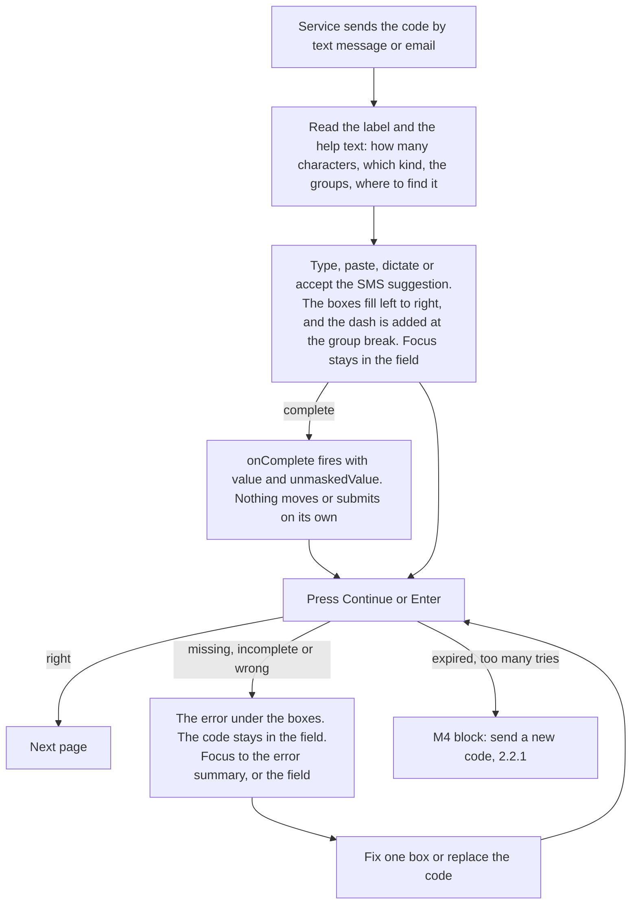

# Design spec: OneTimeCode

- **Status:** Draft · updated 2026-10-02 for the pattern (Plan 0019)
- **Designer:** ux-designer agent · **Date:** 2026-10-02
- **Plan:** [Plan 0019](../plans/0019-one-time-code-pattern.md) (the pattern), first built in [Plan 0014](../plans/0014-input-masks-and-one-time-code.md) (Phase 3)
- **Terminology (Plan 0029, 2026-10-04):** "the help text above the boxes" in this spec is the description, a `Field.Prose` above the control. A `Field.HelpText` goes under the control, never above it (see [field-help-text.md](field-help-text.md)).
- **Type:** component default styling (+ Storybook page, + DESIGN.md wording). No new tokens

the OneTimeCode decision decides the parts and the behaviour: `OneTimeCode.Root` (`<div>`, `kv-one-time-code`), `OneTimeCode.Input` (one native `<input type="text">`, `kv-one-time-code-input`, inside a Field, `autocomplete="one-time-code"`, the `masks.oneTimeCode()` mask) and `OneTimeCode.Slot` (`<span aria-hidden="true">`), which draws one cell. No auto-advance, no auto-submit, no form state. The OneTimeCode-pattern decision replaces `length` and `characters` with a `pattern` (`9` digit, `*` letter or digit, `a` letter, `A` capital letter, `&` capital letter or digit, `-` the only separator). One cell per pattern position: a **box** (`kv-one-time-code-slot`) for a character symbol, a **separator** (`kv-one-time-code-separator`) for `-`. `****-****` is 4 boxes, a dash and 4 boxes over one input. The value includes the dash (`ABCD-1234`).

This spec decides **what it looks like in the default theme**: how the cells sit over the input so the input stays the only operable element, the caret, the active box, selection and the focus ring, the separator, the states, the pattern variants, RTL, compact density, reflow and text spacing, the box and separator limits, and the exact conditions under which the theme falls back to a plain `kv-input`. It reuses Input's tokens, states, width formula and compact density from [form-fields.md](form-fields.md) (§6.3, §6.4, §6.7, §6.8) and adds no token. The `kv-one-time-code--grouped` modifier is gone: the pattern draws the groups. Where it needs something the OneTimeCode-pattern decision or Plan 0019 doesn't give yet, it says so (§6.1, §9).

## 1. Brief

- **Users:** both.
  - Residents confirm a phone number or an email address, or sign in, with a code sent by text message or email. Usually once, on a phone, often while switching between the messages app and the browser, sometimes with the code arriving on a different device from the form.
  - Staff sign in to case tools with a code from an authenticator app, once or twice a day, on a desktop, often in compact density.
- **Hardest-case users:**
  1. A 70-year-old resident with low digital confidence, reading Swedish as a second language, on an older Android phone over a slow connection. The code is on their phone and the form on a library computer. They copy it character by character, and they need to see which box they're in, how many are left, and where the groups break.
  2. A screen-reader user (VoiceOver on iOS, NVDA on Windows) who needs one field with a name and a help text that says the length and the groups, the code read back on request ("A B C D dash 1 2 3 4"), and paste or SMS autofill that just works (3.3.8).
  3. A screen-magnifier user at 400%, whose magnifier follows the text caret. They need a caret they can see and a field that doesn't jump around.
  4. A Windows Contrast Themes user, who needs a field whose edge, value (with its dash) and focus survive system colours.
  5. A Dragon or Voice Control user who dictates "A B C D 1 2 3 4" into one field, with or without "dash".
- **Job to be done:** When a service sends me a code, I want to get it from my messages into the form quickly and without mistakes, so I can prove it's me and carry on.
- **Context:** resident use is rare, quick and stressful (the code expires, and people fear being locked out). Two devices or two apps are common. Staff use is routine and fast.
- **Constraints:**
  - Headless packages ship no CSS (hard rule 5). State and facts are `data-*`, options are modifier classes (`docs/architecture.md#styling-contract`).
  - Only DESIGN.md tokens. No new colours, sizes or radii.
  - Every visible or announced string from i18n in all six locales (hard rule 4). The component itself adds none (§4.1).
  - 3.3.8 Accessible Authentication: paste, SMS autofill and password managers must work, with or without the dash, and the code must stay visible (never `type="password"`).
  - WAD/EN 301 549: "designed and tested to meet WCAG 2.2 AA", never "compliant".
- **Success criteria:**
  - 0 axe violations in every story, in the four theme projects, RTL and forced colours.
  - The input is the only element that takes focus or pointer input. Every box and separator is `aria-hidden` (component test).
  - The forced-colours, 320px and 200%-text cases show the plain field, with the value (dash included), caret and focus kept, and the whole code visible without scrolling inside the field (e2e, §7.2).
  - Nothing clipped or overlapping under the 1.4.12 overrides.
  - In usability testing (§8, `pending`): every participant enters a code from another device without help, and corrects one wrong character without retyping the whole code.
- **Evidence:** none from our own users. The prior art in §2 reports its own research.
- **Assumptions and research questions:**
  - Assumption: boxes help people check a code against the message, compared with GOV.UK's single plain field. → RQ: do participants make fewer copying errors, or notice their own errors sooner, with boxes than with the plain field (A/B within the session)?
  - Assumption: people who have used one-input-per-box designs elsewhere don't expect Tab or auto-advance between boxes. → RQ: does anyone press Tab after a character and land on Continue by mistake?
  - Assumption: a static (non-blinking) caret plus a 2px edge on the current box is enough to show where the next character goes, also on either side of a dash. → RQ: can magnifier and low-vision participants say which box is next, at a glance, when the caret is at a group break?
  - Assumption: drawing the groups exactly as the message shows them (`ABCD-1234` gets a dash) reduces errors for grouped codes, and ungrouped codes stay ungrouped. → RQ: with a message showing `ABCD-1234`, do boxes with a dash reduce errors compared with 8 boxes in a row?
  - Assumption: people don't know whether to type the dash, and it doesn't matter, because a typed dash is accepted once and a missing one is added. → RQ: how many participants type it, and does anyone hesitate?
  - Assumption: switching between the boxes and the plain field (rotating the phone, zooming) isn't disorienting, because the value and focus stay. → RQ: observe participants who zoom in mid-task.
  - Assumption: screen-reader users accept a code read with its dash ("A B C D dash 1 2 3 4", or "hyphen") because the help text names the groups (accessibility impact), and a 6-digit code read as a number. → RQ: how do they check the code they entered?
  - Assumption: SMS autofill (iOS QuickType, Android keyboard suggestions) and password-manager filling work with the overlay, with codes sent with or without the dash. → manual matrix, `pending`.

## 2. Prior art

| Source                                                                                                                                                                       | What we reuse                                                                                                                                                                                                                                                                                    | What we change and why                                                                                                                                                                                                                                                                                                                                                                                                                                                                                                       |
| ---------------------------------------------------------------------------------------------------------------------------------------------------------------------------- | ------------------------------------------------------------------------------------------------------------------------------------------------------------------------------------------------------------------------------------------------------------------------------------------------ | ---------------------------------------------------------------------------------------------------------------------------------------------------------------------------------------------------------------------------------------------------------------------------------------------------------------------------------------------------------------------------------------------------------------------------------------------------------------------------------------------------------------------------- |
| KvirnUI Input, InputGroup, DateInput ([form-fields.md](form-fields.md))                                                                                                      | Input's box, edges, states and tokens (§6.3, §6.8). The width formula with the 1.4.12 allowance (§6.4). InputGroup's rule that the box draws the ring and the inner input has none (§6.13). Compact density (§6.7). The default field order: label, help text, control, error. `numeric` figures | Each box is a small Input-like box, but it's a drawing, not a control. The ring is drawn by the input itself, because it covers the whole row (§6.4)                                                                                                                                                                                                                                                                                                                                                                         |
| GOV.UK [Confirm a phone number](https://design-system.service.gov.uk/patterns/confirm-a-phone-number/)                                                                       | One input for the code, `autocomplete="one-time-code"`, `inputmode="numeric"`, spaces and dashes allowed. Errors that say how many digits the code has. This is our fallback (the OneTimeCode decision), and a valid choice on its own                                                           | We add the boxes as a visual aid on top of the same single input. GOV.UK's `--extra-letter-spacing` isn't copied: it would need a non-token letter spacing, and the 1.4.12 override replaces it anyway (open question 11). Its "You've not entered enough numbers" wording is replaced by a non-blaming one (§4.3)                                                                                                                                                                                                           |
| [`input-otp`](https://github.com/guilhermerodz/input-otp) (React), and shadcn/ui's `InputOTP` wrapper of it                                                                  | One input painted invisible, with the state handed to drawn slots. A drawn caret, because the real one is invisible. Groups drawn with a separator element between slot groups. Password-manager badges noted as a known problem                                                                 | Their caret blinks: ours is static (2.2.2 and DESIGN.md motion). They rewrite every selection into a one-character range: we keep native caret and selection, and draw both truthfully (§6.4). Their slots sit under the input: ours sit on top with `pointer-events: none` (§6.2). Their separator is a dot icon outside the value: ours is the `-` the value holds, so boxes, plain field and message agree, and it's `aria-hidden`, not `role="separator"`, because the screen reader already reads the dash in the value |
| WCAG 2.2 [Understanding 3.3.8](https://www.w3.org/WAI/WCAG22/Understanding/accessible-authentication-minimum), [3.2.2](https://www.w3.org/WAI/WCAG22/Understanding/on-input) | Paste and autofill must work. No change of context on input without warning                                                                                                                                                                                                                      | –                                                                                                                                                                                                                                                                                                                                                                                                                                                                                                                            |
| APG                                                                                                                                                                          | No pattern. The control is a native text input, so its keys are native (keyboard skill, key-tables "One-time code")                                                                                                                                                                              | –                                                                                                                                                                                                                                                                                                                                                                                                                                                                                                                            |

## 3. Flow

The component has no page of its own. The M4 verification and login blocks own the page, the resend link and the timeout. This is the field's part of that flow:



Unhappy paths the field must support:

- **Nothing submitted yet, field empty.** Error `oneTimeCode.errorMissing` under the boxes.
- **Incomplete code.** Error `oneTimeCode.errorIncomplete` ("Enter all 6 digits of the code"). What's already typed stays. The count is the characters, never the dashes (§4.6 rule 3).
- **Wrong code.** Error `oneTimeCode.errorWrong`. The code stays in the field, so the user can compare it with the message and fix one character. Every box gets the invalid edge, because the code is wrong as a whole (unlike DateInput, form-fields §6.6). The separators don't change.
- **Pasted with or without the dash, or with extra text.** `ABCD1234`, `ABCD-1234`, `abcd 1234` (for `&&&&-&&&&`) and "Your code is ABCD 1234" all end as `ABCD-1234`. Nothing is refused for a separator or a space.
- **The user types the dash themselves** at the group break. Accepted once, not doubled. Typed anywhere else, it's a refused character (next item).
- **Lower case typed into a capital-letter position** (`A`, `&`). Upper-cased, not refused. The box shows the capital.
- **A refused character** (a letter in a digits position, `é` or `!` anywhere, a character past the end). Not inserted, and the shared Announcer says why, throttled (`mask.characterNotAllowed` in its digits, letters or letters-and-digits variant, `mask.maximumLength`). The boxes don't shake or flash.
- **Switching apps to read the message.** The field keeps its value and, when the browser restores it, its focus. Nothing in the component clears it.
- **The code completes and the service checks it at once** (`onComplete`). Allowed only if the help text says so in advance (3.2.2, `oneTimeCode.checkedEarly`, §4.4), and a Continue button stays.
- **While the code is being checked.** Don't disable the field: a disabled input loses focus, which lands on `body`. Use `readOnly` (still focusable, §6.8), and say "Checking the code" in the page's status, through the Announcer. The docs say so (open question 9).
- **The browser or the layout can't draw the boxes safely** (forced colours, a narrow column, large text, a pattern outside the limits, before the script runs). The plain field shows instead, with the same value (dash included), caret and focus, because it's the same element, and it's wide enough for the whole pattern (§6.6).
- **Expired code, too many tries, no message arrived, session timeout.** Out of scope: the M4 blocks. They must meet 2.2.1, and keep the field's value when they offer a new code only if the code is still valid.

## 4. Content

### 4.1 Component strings (`@kvirn-ui/i18n`)

**None.** The cells are `aria-hidden` and show only the value and the pattern's dashes. The label and help text belong to the consumer, because they name the channel ("text message", "email", "authenticator app"), the length and the groups. The rejection messages are the mask's, already shipped (`mask.characterNotAllowed` in its digits, letters and letters-and-digits variants, `mask.maximumLength`). `i18n:check` is unaffected.

The `oneTimeCode.*` keys below are **story fixture** strings, with keys local to the fixture (storybook-presentation.md §4), like the InputGroup strings in `form.fixture.tsx` (form-fields §4.5). The fixture holds them as a nested `oneTimeCode` object.

### 4.2 Story fixture strings

Agents write the `fi` strings. The placeholders are small integers from the story, formatted with `Intl` (the same digits in every locale): `{length}` is the number of **characters**, never counting the dashes (the hook's `characterCount`), `{groupCount}` and `{groupLength}` describe equal groups, `{letters}` and `{digits}` an unequal prefix code. Numerals, not number words, so the help text reads the same as the boxes and works in every locale.

| Key                           | en                                                                                                                               | sv                                                                                                                                                  | longest: fi (draft)                                                                                                                                                                    | Element                                                                                                         |
| ----------------------------- | -------------------------------------------------------------------------------------------------------------------------------- | --------------------------------------------------------------------------------------------------------------------------------------------------- | -------------------------------------------------------------------------------------------------------------------------------------------------------------------------------------- | --------------------------------------------------------------------------------------------------------------- |
| `oneTimeCode.smsLabel`        | Code from the text message                                                                                                       | Kod från sms:et                                                                                                                                     | Tekstiviestissä saamasi koodi                                                                                                                                                          | Label (digits stories, `LetterPrefix`, `RTL`)                                                                   |
| `oneTimeCode.smsHint`         | The code has {length} digits. You'll find it in the text message we just sent you.                                               | Koden har {length} siffror. Du hittar den i sms:et som vi just skickade till dig.                                                                   | Koodissa on {length} numeroa. Löydät sen tekstiviestistä, jonka lähetimme sinulle juuri.                                                                                               | Description **above** the boxes for an ungrouped digits code (`999999`)                                         |
| `oneTimeCode.smsPrefixHint`   | The code has {letters} letters and then {digits} digits. You'll find it in the text message we just sent you.                    | Koden har {letters} bokstäver och sedan {digits} siffror. Du hittar den i sms:et som vi just skickade till dig.                                     | Koodissa on ensin {letters} kirjainta ja sitten {digits} numeroa. Löydät sen tekstiviestistä, jonka lähetimme sinulle juuri.                                                           | Description above (`AA-9999`: `LetterPrefix`, `RTL`). Replaces nothing: new                                     |
| `oneTimeCode.emailLabel`      | Code from the email                                                                                                              | Kod från e-postmeddelandet                                                                                                                          | Sähköpostissa saamasi koodi                                                                                                                                                            | Label (`TwoGroups`, `ThreeGroups`, `Keyboard`)                                                                  |
| `oneTimeCode.emailGroupsHint` | The code has {length} letters and digits, in {groupCount} groups of {groupLength}. You'll find it in the email we just sent you. | Koden har {length} bokstäver och siffror, i {groupCount} grupper om {groupLength}. Du hittar den i e-postmeddelandet som vi just skickade till dig. | Koodissa on {length} merkkiä, sekä kirjaimia että numeroita, {groupCount} ryhmässä, joissa kussakin on {groupLength} merkkiä. Löydät sen sähköpostista, jonka lähetimme sinulle juuri. | Description above (`****-****`, `***-***-***`). **Replaces `emailHint`.** The longest help text: wraps at 320px |
| `oneTimeCode.appLabel`        | Code from your authenticator app                                                                                                 | Kod från din autentiseringsapp                                                                                                                      | Todennussovelluksesi koodi                                                                                                                                                             | Label (`Compact`, staff sign-in)                                                                                |
| `oneTimeCode.appHint`         | Open the app and enter the code it shows. The code has {length} digits.                                                          | Öppna appen och skriv koden som visas. Koden har {length} siffror.                                                                                  | Avaa sovellus ja kirjoita siinä näkyvä koodi. Koodissa on {length} numeroa.                                                                                                            | Description above (`Compact`)                                                                                   |
| `oneTimeCode.submit`          | Continue                                                                                                                         | Fortsätt                                                                                                                                            | Jatka                                                                                                                                                                                  | Primary Button after the field (`Keyboard`, `Invalid`)                                                          |

`emailHint` (length only) is removed: a grouped code's help text always says the groups (§4.6 rule 2).

### 4.3 Error messages (fixtures, and the docs' patterns)

What's wrong and how to fix it, in the field's own words, never blaming. Each is announced as "Error: …" (`field.errorPrefix`). Unchanged by the pattern, except that `errorIncomplete` names the same kind of character as the help text ("digits" here; a letters-and-digits service writes "characters", §4.6 rule 3).

| Key                           | en                                                                                       | sv                                                                               | longest: fi (draft)                                                                      |
| ----------------------------- | ---------------------------------------------------------------------------------------- | -------------------------------------------------------------------------------- | ---------------------------------------------------------------------------------------- |
| `oneTimeCode.errorMissing`    | Enter the code from the text message                                                     | Skriv koden från sms:et                                                          | Kirjoita tekstiviestissä saamasi koodi                                                   |
| `oneTimeCode.errorIncomplete` | Enter all {length} digits of the code                                                    | Skriv alla {length} siffrorna i koden                                            | Kirjoita koodin kaikki {length} numeroa                                                  |
| `oneTimeCode.errorWrong`      | The code doesn't match the one we sent. Check the text message and enter the code again. | Koden stämmer inte med den vi skickade. Kontrollera sms:et och skriv koden igen. | Koodi ei vastaa lähettämäämme koodia. Tarkista tekstiviesti ja kirjoita koodi uudelleen. |

The `Invalid` story uses `errorWrong` (the longest, so it tests wrapping under the boxes at 320px).

### 4.4 Docs-only content patterns

For `one-time-code.md` (the docs page), not the stories. Same three-column rule.

| Key                        | en                                                                 | sv                                                                  | longest: fi (draft)                                                     | Use                                                                                 |
| -------------------------- | ------------------------------------------------------------------ | ------------------------------------------------------------------- | ----------------------------------------------------------------------- | ----------------------------------------------------------------------------------- |
| `oneTimeCode.checkedEarly` | We check the code as soon as you have entered all {length} digits. | Vi kontrollerar koden så fort du har skrivit alla {length} siffror. | Tarkistamme koodin heti, kun olet kirjoittanut kaikki {length} numeroa. | Appended to the help text when the service uses `onComplete` to check early (3.2.2) |
| `oneTimeCode.checking`     | Checking the code                                                  | Koden kontrolleras                                                  | Koodia tarkistetaan                                                     | Status text and Announcer message while the field is `readOnly` (§3)                |

### 4.5 nb, nn and se

Agents write the `nb` and `nn` fixture strings below. The fixture keeps `se` `undefined` (English, marked `lang="en"`), as for every form fixture.

| Key                           | nb (draft)                                                                                                                      | nn (draft)                                                                                                                 |
| ----------------------------- | ------------------------------------------------------------------------------------------------------------------------------- | -------------------------------------------------------------------------------------------------------------------------- |
| `oneTimeCode.smsLabel`        | Kode fra SMS-en                                                                                                                 | Kode frå SMS-en                                                                                                            |
| `oneTimeCode.smsHint`         | Koden har {length} sifre. Du finner den i SMS-en vi nettopp sendte deg.                                                         | Koden har {length} siffer. Du finn han i SMS-en vi nett sende deg.                                                         |
| `oneTimeCode.smsPrefixHint`   | Koden har {letters} bokstaver og deretter {digits} sifre. Du finner den i SMS-en vi nettopp sendte deg.                         | Koden har {letters} bokstavar og deretter {digits} siffer. Du finn han i SMS-en vi nett sende deg.                         |
| `oneTimeCode.emailLabel`      | Kode fra e-posten                                                                                                               | Kode frå e-posten                                                                                                          |
| `oneTimeCode.emailGroupsHint` | Koden har {length} bokstaver og sifre, i {groupCount} grupper på {groupLength}. Du finner den i e-posten vi nettopp sendte deg. | Koden har {length} bokstavar og siffer, i {groupCount} grupper på {groupLength}. Du finn han i e-posten vi nett sende deg. |
| `oneTimeCode.appLabel`        | Kode fra autentiseringsappen din                                                                                                | Kode frå autentiseringsappen din                                                                                           |
| `oneTimeCode.appHint`         | Åpne appen og skriv inn koden som vises. Koden har {length} sifre.                                                              | Opne appen og skriv inn koden som blir vist. Koden har {length} siffer.                                                    |
| `oneTimeCode.submit`          | Fortsett                                                                                                                        | Hald fram                                                                                                                  |
| `oneTimeCode.errorMissing`    | Skriv inn koden fra SMS-en                                                                                                      | Skriv inn koden frå SMS-en                                                                                                 |
| `oneTimeCode.errorIncomplete` | Skriv inn alle de {length} sifrene i koden                                                                                      | Skriv inn alle dei {length} siffera i koden                                                                                |
| `oneTimeCode.errorWrong`      | Koden stemmer ikke med den vi sendte. Sjekk SMS-en og skriv inn koden på nytt.                                                  | Koden stemmer ikkje med den vi sende. Sjekk SMS-en og skriv inn koden på nytt.                                             |

### 4.6 Content rules (for the docs page)

1. **The label names where the code is** ("Code from the text message"), not "OTP", "verification code" or "PIN". The name is written out (`docs/architecture.md`, naming).
2. **The help text states the length and the groups, and where to find the code,** above the boxes: "The code has 8 letters and digits, in 2 groups of 4", "The code has 2 letters and then 4 digits", "The code has 6 digits". The boxes show the shape too, but they're `aria-hidden` and disappear in the fallback, so the help text is the only place screen-reader users and fallback users learn it, and it explains the "dash" they hear when the value is read back.
3. **Count characters, not dashes.** `****-****` is "8 letters and digits", never "9 characters". The incomplete error uses the help text's word and number.
4. **Use the pattern the message uses.** Put a `-` in the pattern only where the message shows one: a code sent as "481920" is `999999`, and one sent as "ABCD-1234" is `&&&&-&&&&`. A message that groups with a space ("481 920") is better sent without the space, or with a dash, so message and boxes match. Keep groups of 3 or 4.
5. **Prefer capital symbols for codes people copy by hand.** `&` and `A` accept lower case and show capitals, so case can't cause an error. `*` and `a` keep the case typed, and a service using them must say in the help text whether case matters.
6. **Letters-and-digits codes avoid look-alikes.** The service should generate codes without `0`/`O` and `1`/`I`/`l`. The theme helps (§6.3, the dotted zero), but it can't fix a code that uses both.
7. **The boxes show exactly the value.** No `text-transform`. Upper-casing is the mask's (`A`, `&`), so what's shown is what's sent.
8. **Keep Continue,** keep the code after a wrong-code error, never disable the field while checking (§3).
9. **A plain Input with `masks.oneTimeCode({ pattern })` is a valid choice** (the OneTimeCode decision), and what the theme shows in the fallback anyway.

## 5. Structure

Reading order equals DOM order equals visual order (1.3.2). The field adds no landmark or heading.

```
div.kv-field
  label.kv-field-label[for=code]                 Kod från e-postmeddelandet
  div.kv-prose#hint > p                        Koden har 8 bokstäver och siffror, i 2 grupper om 4. Du hittar den i …
  div.kv-one-time-code[data-ready][data-character-count=8][data-separator-count=1][data-invalid]   Root: the row, and the query container
    input.kv-one-time-code-input#code[type=text][autocomplete=one-time-code]
         [dir=ltr][spellcheck=false][autocorrect=off][aria-describedby="hint err"][aria-invalid=true]   value "K7QX-2M9P"
    span.kv-one-time-code-slot[aria-hidden=true][data-filled][data-invalid]          K
    span.kv-one-time-code-slot[aria-hidden=true][data-filled][data-invalid]          7
    span.kv-one-time-code-slot[aria-hidden=true][data-filled][data-invalid]          Q
    span.kv-one-time-code-slot[aria-hidden=true][data-filled][data-invalid]          X
    span.kv-one-time-code-separator[aria-hidden=true]                                -
    span.kv-one-time-code-slot[aria-hidden=true][data-filled][data-invalid]          2
    … × 3
  p.kv-field-error-message#err                   Error: Koden stämmer inte med den vi skickade. …
div.kv-button-group > button.kv-button.kv-button--primary    Fortsätt
```

- The Input comes **before** the cells in the DOM, so the theme can style the cells from the input's state with the `~` combinator (hover, disabled, read-only) without `:has()`.
- The cells follow the pattern in order: position _i_ of the pattern is the _i_-th cell and position _i_ of the value. A separator is a cell like a box, so `getSlotProps(index)` and `OneTimeCode.Slot index` share the index.
- A help text under the boxes is allowed, but the stories don't use one: the length and groups must be read **before** typing (form-fields §4.4).

| Width | Layout                                                                                                                                                                                                                                                                                                                               |
| ----- | ------------------------------------------------------------------------------------------------------------------------------------------------------------------------------------------------------------------------------------------------------------------------------------------------------------------------------------ |
| 320px | A 288px column (254px in a card). `999999` and `AA-9999` draw, the boxes shrinking towards 32px. `****-****` and `***-***-***` don't fit at 32px boxes, so the plain field shows, with the dash in its value and as wide as the pattern (§6.5). The label and the Finnish help text wrap. Continue is full width (`kv-button-group`) |
| 40rem | Boxes at their full 44×44px, at the start of the column: `999999` 304px, `AA-9999` 324px, `****-****` 428px, `***-***-***` 500px. Continue start-aligned                                                                                                                                                                             |
| 64rem | Same for residents. Staff (`kv-compact`): 32×32px boxes, 4px apart, a 12px separator                                                                                                                                                                                                                                                 |

## 6. Visual specification

### 6.1 Class API and attributes

| Class                        | Rendered by                                   | Notes                                                                                                                                                                                                                                                         |
| ---------------------------- | --------------------------------------------- | ------------------------------------------------------------------------------------------------------------------------------------------------------------------------------------------------------------------------------------------------------------- |
| `kv-one-time-code`           | `OneTimeCode.Root` (`<div>`)                  | The row of cells, the positioning context for the input, and a named size container (`kv-one-time-code`). Draws nothing itself in any mode                                                                                                                    |
| `kv-one-time-code-input`     | `OneTimeCode.Input` (`<input>`)               | In the fallback it looks exactly like `kv-input kv-input--numeric` with the pattern's width. The theme writes Input's rules out for it, rather than the part rendering `kv-input`, so a consumer's global `.kv-input` CSS can't restyle the overlay           |
| `kv-one-time-code-slot`      | `OneTimeCode.Slot` (`<span>`), character cell | One box. `aria-hidden="true"`, never focusable, `pointer-events: none`                                                                                                                                                                                        |
| `kv-one-time-code-separator` | `OneTimeCode.Slot` (`<span>`), separator cell | One drawn `-` between two boxes. `aria-hidden="true"`, never focusable, `pointer-events: none`. Its text is the pattern's `-`, always, whatever the value holds. **Never** gets `data-active`, `data-caret`, `data-selected`, `data-filled` or `data-invalid` |

**No modifier classes.** `kv-one-time-code--grouped` is removed: the pattern draws the groups.

**State attributes** (the hook's `slots`, `isReady`, `isComplete`, `isInvalid`, `isDisabled`, Plan 0019):

| Attribute            | On                   | Meaning                                                                                                                                                                                                            |
| -------------------- | -------------------- | ------------------------------------------------------------------------------------------------------------------------------------------------------------------------------------------------------------------ |
| `data-filled`        | Box                  | The box has a character                                                                                                                                                                                            |
| `data-active`        | Box                  | The input has focus, the selection is collapsed, and this box is where the caret is drawn (§6.4). Exactly one box, or none. Never a separator                                                                      |
| `data-caret`         | Box (the active one) | `before`: the caret is before this box's position. `after`: the caret is after this box's character: at the end of a complete code, or just before a dash in the value                                             |
| `data-selected`      | Box                  | The input has focus and a non-collapsed selection covers this box's character. Never a separator                                                                                                                   |
| `data-invalid`       | Root, Box            | From the Field. Every box                                                                                                                                                                                          |
| `data-complete`      | Root                 | Every box is filled. **No visual by default**: complete isn't correct, and a tick or a green edge would read as "verified"                                                                                         |
| `data-disabled`      | Root                 | From the Field or `disabled`. The theme styles the cells from the input's `:disabled` too                                                                                                                          |
| `data-ready`         | Root                 | Set by the hook once it's running and has read the input's current value (autofill or typing before hydration). The theme draws the cells only with it, so typing before the script runs is never invisible (§6.6) |
| `data-focus-visible` | Input                | Where the component sets it, as Input does. The theme also accepts `:focus-visible`                                                                                                                                |

**Pattern attributes (new, decided here; Plan 0019's contract table gains them).** The Root always renders both, from the pattern, on the server too:

| Attribute              | On   | Value                                                                                                |
| ---------------------- | ---- | ---------------------------------------------------------------------------------------------------- |
| `data-character-count` | Root | The number of character symbols in the pattern (the hook's `characterCount`): `8` for `****-****`    |
| `data-separator-count` | Root | The number of `-` in the pattern, `0` when there is none: `1` for `****-****`, `2` for `***-***-***` |

**How the theme reads the counts: from these attributes, not by counting children.** Decision for the engineer:

- The fallback threshold is a container query, and a container condition only takes a literal length, so the theme needs one rule per (characters, separators) pair whichever way it learns the counts. Counting children with `:has(> .kv-one-time-code-slot:nth-child(8 of .kv-one-time-code-slot):nth-last-child(1 of .kv-one-time-code-slot))` and the same for separators would repeat two long `:has()` chains in every one of the 21 pairs' rules (§6.5). An attribute selector is short and readable.
- The attributes come from the pattern, which is the truth. A child count is wrong as soon as a consumer forgets a `Slot` or wraps cells, and the row width would be computed from the wrong number.
- They're facts about the pattern, exposed as `data-*` like any state, so hard rule 5 holds. No inline `style` and no custom property is set by the headless package.
- The theme maps them into two internal custom properties with one-line rules: `[data-character-count='1']` to `'12'` set `--kv-one-time-code-characters`, and `[data-separator-count='0']` to `'3'` set `--kv-one-time-code-separators`. The row width and the fallback width are `calc()` over these (§6.5, §6.3).
- The drawing also requires at least one box child, `:has(> .kv-one-time-code-slot)`, so a Root whose cells aren't rendered keeps the plain field instead of an invisible input. A dev warning when the number of rendered cells differs from the pattern's length would catch the rest (open question 2).
- `:nth-child(… of …)` is no longer needed, and leaves the `@supports` condition (§6.6).

**Prose boundary.** `.kv-one-time-code` sits inside `.kv-field`, which is already on the not-prose list.

### 6.2 How the cells overlay the input

**The cells draw the code. The input is invisible and underneath, and receives everything.** This is the OneTimeCode decision, decided in detail:

1. The Root is a flex row of cells, `position: relative`, `isolation: isolate`.
2. The input is `position: absolute` over the row: `inset-block: 0`, at the row's start, and the row's width (§6.5), so it covers every box, separator **and gap**. It has no edge, no fill, transparent text (`color` and `-webkit-text-fill-color`), a transparent caret (`caret-color: transparent`) and a transparent `::selection`. It keeps its real font size, 16px, so iOS doesn't zoom in on focus.
3. The cells are stacked **above** the input (`z-index: 1`) with `pointer-events: none`, so every press goes through to the input. A press on a box, a separator or a gap focuses the input natively, with no script. Boxes have an opaque `canvas` fill, so even if a browser forces the input's text colour, its glyphs are hidden under the boxes. Separators have no fill (§6.3).
4. The cells draw the characters, the dashes, the caret and the selection from the hook's state (§6.4). Nothing visible depends on the input's own text metrics, so the cells can't drift from the text under zoom or the 1.4.12 overrides. The only thing that can go wrong is that the browser shows the input's own text or colours over the row, and that's what the fallback guards against (§6.6).
5. **Best-effort alignment of the invisible text.** The input gets `padding-inline-start: calc((slot − 1ch) / 2)` and `letter-spacing: calc(slot + gap − 1ch)` at the full box size, so its real caret, which screen magnifiers follow, sits near the drawn one. One letter spacing serves every character, so after each dash the invisible text runs ahead of the boxes by `slot − separator` (32px comfortable, 20px compact) per separator. Nothing visible relies on it: the 1.4.12 override replaces the letter spacing, and narrow rows shrink the boxes. It's a help for magnifier tracking in the first group, not a layout rule (open question 7).
6. **Pointer caret placement** (behaviour, for the hook): a press on box _k_ puts the caret before box _k_'s character if it's filled, or at the end of the value if it's empty, so a press never leaves the caret "inside" an empty run. A press in a gap goes to the nearer box. A press on a separator goes to the first box after it (the start of the group), with the same filled or empty rule. Double-click selects the whole code (native: `ABCD-1234` may be two words to the browser, in which case the hook selects all; open question 3).
7. **Autofill.** The browser's autofill fill (Chromium's is `!important`) paints only the input, which lies under the opaque boxes, so it shows only in the gaps and behind the separators, as a faint tint. That's accepted, like InputGroup's autofill fill (form-fields §6.13), and it tells sighted users the code was filled in. The boxes are never covered, and the dash stays `text` on the tint.
8. **Long-press on touch** still opens the native callout with Paste (3.3.8), because the input is the element under the finger. iOS may draw its selection handles where the invisible text is: accepted, and a research note (§8).

Why not the other way round (visible input text, with boxes drawn behind it by letter spacing): the 1.4.12 letter-spacing override, which we must allow, pulls the characters out of their boxes, and CSS can't detect that it happened. With a dash that needs a narrower advance than a box, it can't even be drawn. A comb that breaks silently is worse than a drawing that can't break.

### 6.3 Root, Input, Box and Separator

| Part                                | Property   | Value                                                                                                                                                                                                                                                                                                                                                                                                                                                                                                                                                                                                                 |
| ----------------------------------- | ---------- | --------------------------------------------------------------------------------------------------------------------------------------------------------------------------------------------------------------------------------------------------------------------------------------------------------------------------------------------------------------------------------------------------------------------------------------------------------------------------------------------------------------------------------------------------------------------------------------------------------------------- |
| `kv-one-time-code` (Root)           | Layout     | `display: flex; gap: var(--kv-one-time-code-gap)`, no wrapping. `position: relative; isolation: isolate`. `inline-size: 100%` of the field column, `min-inline-size: 0`. `container: kv-one-time-code / inline-size`. No edge, fill, radius or outline in any mode                                                                                                                                                                                                                                                                                                                                                    |
|                                     | Direction  | The row always reads left to right: in an RTL context (`:dir(rtl)`) the theme sets `flex-direction: row-reverse; justify-content: flex-end`, so the first box is on the left and the row sits at the start (the right) of the column (§6.10)                                                                                                                                                                                                                                                                                                                                                                          |
| `kv-one-time-code-input` (enhanced) | Box        | `position: absolute; inset-block: 0`, at the row's start, `inline-size: min(100%, var(--kv-one-time-code-row))`, `block-size: 100%`, `margin: 0`, `padding-block: 0`, the padding and letter spacing of §6.2 item 5. `z-index: 0`. `border: 0` **in every state**, `border-radius: var(--kv-radius-md)`, `background-color: transparent`, `box-shadow: none`                                                                                                                                                                                                                                                          |
|                                     | Text       | `font-family` and size as Input (`body`, 16px in both densities), `font-feature-settings: var(--kv-font-numeric-feature-settings)`. `color: transparent; -webkit-text-fill-color: transparent; caret-color: transparent`. `::selection { background-color: transparent }`                                                                                                                                                                                                                                                                                                                                             |
|                                     | Ring       | Input's own focus rule (2px `focus-ring`, 2px offset). The input covers the row, so its ring is the ring around the whole row, separators included, following the `md` radius (§6.4)                                                                                                                                                                                                                                                                                                                                                                                                                                  |
|                                     | Cursor     | `cursor: text`; `not-allowed` when disabled                                                                                                                                                                                                                                                                                                                                                                                                                                                                                                                                                                           |
| `kv-one-time-code-input` (fallback) | All        | Exactly `kv-input kv-input--numeric` (form-fields §6.3, §6.8): in normal flow, 1px `border-control`, `canvas`, 44px (32px compact), its own ring, its own invalid and disabled states. Width: Input's width formula with `--kv-input-chars: calc(var(--kv-one-time-code-characters, 16) + var(--kv-one-time-code-separators, 0))`, because each dash is a character of the value. The 1.4.12 allowance and the 2px invalid edge are included, `max-inline-size: 100%`. The dash shows as typed text, in `text`                                                                                                        |
| `kv-one-time-code-slot` (Box)       | Box        | `box-sizing: border-box`. `inline-size: var(--kv-one-time-code-slot-size)` (44px, 32px compact), `flex: 0 1 auto`, `min-inline-size: var(--kv-space-8)` (32px), `min-block-size: var(--kv-control-min-block-size)` (44px, 32px compact). No fixed `block-size`                                                                                                                                                                                                                                                                                                                                                        |
|                                     | Edge, fill | `var(--kv-one-time-code-slot-edge-width) solid var(--kv-one-time-code-slot-edge)`: 1px `border-control` at rest. `border-radius: var(--kv-radius-md)`. `background-color: canvas`. No shadow (DESIGN.md: depth means "press me")                                                                                                                                                                                                                                                                                                                                                                                      |
|                                     | Content    | `display: flex; align-items: center; justify-content: center`, so the character is centred and stays put when the edge goes from 1px to 2px. `position: relative; z-index: 1`. `direction: ltr` (a presentational, `aria-hidden` box). `overflow: visible`                                                                                                                                                                                                                                                                                                                                                            |
|                                     | Type       | `numeric` (16/400/1.5, `tnum`) in both densities, the same size as the fallback field, so switching never changes the code's size. `color: text`. `letter-spacing: normal` (the 1.4.12 override may replace it: the box has room, §6.5)                                                                                                                                                                                                                                                                                                                                                                               |
|                                     | Letters    | When the pattern can hold letters, that is, the input isn't `inputmode="numeric"` (the OneTimeCode-pattern decision: numeric only when every symbol is `9`), the boxes **and the fallback input** add Plex's dotted zero: `font-feature-settings: var(--kv-font-numeric-feature-settings), 'ss04'` (DESIGN.md Disambiguation). Selector: `.kv-one-time-code:has(> .kv-one-time-code-input:not([inputmode='numeric']))`. It replaces the old `[autocapitalize=characters]` test, which misses `*` and `a` patterns. Never the slashed zero, which reads as Ø. A brand font must check its own `ss04` (open question 6) |
|                                     | Pointer    | `pointer-events: none; user-select: none`                                                                                                                                                                                                                                                                                                                                                                                                                                                                                                                                                                             |
| `kv-one-time-code-separator`        | Box        | `box-sizing: border-box`. `display: flex; align-items: center; justify-content: center`. `flex: none` (never shrinks: only boxes do). `inline-size: var(--kv-one-time-code-separator-size)` = `var(--kv-space-3)` (12px, both densities). `min-block-size: var(--kv-control-min-block-size)`, so the dash sits on the boxes' centre line. `position: relative; z-index: 1`. `direction: ltr`. `overflow: visible`                                                                                                                                                                                                     |
|                                     | Edge, fill | **None.** No border, no fill (transparent), no radius, no shadow. A separator with an edge would read as one more box to fill                                                                                                                                                                                                                                                                                                                                                                                                                                                                                         |
|                                     | Type       | The same as a box: `numeric`, 16/400/1.5, `letter-spacing: normal` (1.4.12 may replace it). `color: text`: the dash is part of the value the user checks against the message, and DESIGN.md forbids `text-muted` for anything needed to complete the task. Disabled: `text-muted`, as the characters                                                                                                                                                                                                                                                                                                                  |
|                                     | Content    | The character `-` (U+002D, the value's own character), rendered as text by `OneTimeCode.Slot`. No pseudo-element bar, so it scales with text size and matches the plain field and the message                                                                                                                                                                                                                                                                                                                                                                                                                         |
|                                     | Pointer    | `pointer-events: none; user-select: none`                                                                                                                                                                                                                                                                                                                                                                                                                                                                                                                                                                             |
|                                     | Fallback   | `display: none`, like the boxes. The plain field shows the dash in its value                                                                                                                                                                                                                                                                                                                                                                                                                                                                                                                                          |

### 6.4 Caret, active box, selection and focus ring

**The focus ring** is the input's ring (2px `focus-ring`, 2px offset, `md` radius), drawn around the whole row, because the input covers it. Text inputs match `:focus-visible` on a click too, so the ring shows whenever the field has focus, as on Input. It's the field's focus indicator (2.4.7, and 2.4.13 in the default theme: the perimeter of the whole row, at least 4.42:1 against the page, §6.10). Nothing inside the row is a second ring.

**The active box** (where the caret is drawn) has a **2px `focus-ring` edge** (`--kv-focus-ring-width`, the 1px extra taken from inside, so the character doesn't move) and the **caret**. The thicker edge is the at-a-glance cue for low-vision users. The caret says exactly where, between characters. A separator is never active.

**Which box is active**, for a collapsed caret at value index _c_:

1. If the value has a `-` at index _c_ (the caret is just before an existing dash): the box before it, `data-caret="after"`.
2. Else, if the code is complete and _c_ is the end of the value: the last box, `data-caret="after"`.
3. Else: the first box at pattern index _c_ or later, `data-caret="before"`.

Worked through for `****-****`:

| Value       | Caret _c_            | Active box              | Drawn                                                             |
| ----------- | -------------------- | ----------------------- | ----------------------------------------------------------------- |
| (empty)     | 0                    | box 1, `before`, empty  | Bar centred in box 1                                              |
| `ABCD`      | 4 (end; no dash yet) | box 5, `before`, empty  | Bar centred in box 5, after the drawn dash: the next group starts |
| `ABCD-`     | 5 (end; dash typed)  | box 5, `before`, empty  | The same as above                                                 |
| `ABCD-12`   | 7 (end)              | box 7, `before`, empty  | Bar centred in box 7                                              |
| `ABCD-12`   | 5 (after the dash)   | box 5, `before`, filled | Bar just before "1"                                               |
| `ABCD-12`   | 4 (before the dash)  | box 4, `after`, filled  | Bar just after "D": rule 1. Distinct from the row above           |
| `ABCD-12`   | 3                    | box 4, `before`, filled | Bar just before "D"                                               |
| `ABCD-1234` | 9 (end, complete)    | box 8, `after`, filled  | Bar just after "4": rule 2                                        |

So every caret position draws differently, and ArrowLeft from "before 1" to "after D" to "before D" moves the bar visibly at each press. The dash itself is never marked.

**The caret** is a bar drawn by the active box:

| Case                                                               | Box attributes                                | Where the bar is                                    |
| ------------------------------------------------------------------ | --------------------------------------------- | --------------------------------------------------- |
| Empty box: the next character goes here                            | `data-active data-caret="before"`, not filled | Centred in the box, where the character will appear |
| Before a filled character (the user moved back with ArrowLeft)     | `data-active data-caret="before" data-filled` | Just before the character's glyph                   |
| After the last character of a group, before a dash, or of the code | `data-active data-caret="after" data-filled`  | Just after the character's glyph                    |

- The bar is a pseudo-element in the box's flex row, next to the character, `inline-size: var(--kv-focus-ring-width)` (2px) and `block-size: 1lh`, in `text` (Input's `caret-color`). Its negative inline margins cancel its own width plus a 1px gap, so the character never moves when the caret arrives or leaves. Because it sits next to the glyph in the flow, it's right for any glyph width and under the 1.4.12 overrides.
- **Static.** It never blinks, in any motion setting. A blinking author-drawn caret is non-essential motion that runs indefinitely (2.2.2, DESIGN.md Motion). The 2px edge and the bar don't need it to be found.
- `1lh` follows the 1.4.12 line height. In a 32px compact box, a 24px bar fits.
- The theme rules for `after` are no longer "last box only": any filled box may carry it (rule 1).

**Selection** (Shift+arrows, Control/Command+A, a double-click, or Tab into a filled field, where browsers usually select the value): the selected boxes get a **`primary-subtle` fill and a 2px `focus-ring` edge**, and no box is active, so no caret is drawn. The edge width carries it as well as the fill, so it's not colour alone and it passes 3:1 as a boundary. The characters stay `text` (14.66:1 or more on `primary-subtle`, §6.10). The input's own selection highlight is transparent, because it would be in the wrong place.

- **Across a separator** (`ABCD-1234`, C to 2 selected): boxes C, D, 1 and 2 are selected. The dash between them stays as at rest (`text`, no fill), because it's the pattern and is drawn whatever the value holds. The two highlighted runs on either side read as one selection because nothing between them is a box.
- **A selection of only the dash** (Shift+ArrowRight from "after D"): no box is selected, and no caret is drawn, so that one press shows nothing new. The next press adds box 5. Accepted under the OneTimeCode-pattern decision; open question 4 proposes a fill on the separator instead.

**Blur.** No box is active or selected, so the row is back to its resting edges.

### 6.5 Sizes, limits, row width and reflow

**Sizes** (internal aliases, §6.9):

| Value                               | Comfortable                             | Compact (`kv-compact`, from 64rem) |
| ----------------------------------- | --------------------------------------- | ---------------------------------- |
| Box size (preferred)                | 44×44px (`--kv-control-min-block-size`) | 32×32px (same token)               |
| Box minimum inline size             | 32px (`space-8`)                        | 32px                               |
| Separator inline size               | 12px (`space-3`), never shrinks         | 12px                               |
| Gap between any 2 cells             | 8px (`space-2`)                         | 4px (`space-1`)                    |
| Group break (gap + separator + gap) | 28px                                    | 20px                               |
| Radius (boxes)                      | `md` (8px)                              | `md`                               |

A box is a square at its preferred size. Boxes shrink equally (`flex: 0 1 auto`) when the column is narrower than the row, down to 32px. Below that, the field falls back (§6.6) instead of wrapping: a row broken into two lines would look like two answers, and a group split across lines would hide where it breaks.

**Room for one character in the smallest box:** 32px minus two 2px edges is 28px. A digit is 0.6em (9.6px) plus the 0.12em 1.4.12 allowance (1.9px). A wide capital such as W is about 1em with the allowance. Both fit with room to spare. **Room for the dash:** Plex's hyphen is about 0.33em (5.3px) plus 1.9px of 1.4.12 letter spacing in a 12px cell. Everything is in `rem` or `em`, so it grows with the user's text size (1.4.4).

**Limits**. The theme draws boxes only for:

| Limit           | Value        | Why                                                                                                                                            |
| --------------- | ------------ | ---------------------------------------------------------------------------------------------------------------------------------------------- |
| Characters, min | 4            | Fewer is not a code worth boxes, and a 3-box row is narrower than its own help text                                                            |
| Characters, max | 10           | Covers `999999`, `****-****`, `***-***-***` and a 10-digit code. A longer pattern (a recovery code) is a plain field: people copy it in chunks |
| Separators, max | 2            | Three groups at most. Four groups of 2 or 3 stop helping and cost a lot of width                                                               |
| Group size      | not enforced | The content rules say groups of 3 or 4 (§4.6 rule 4). The OneTimeCode-pattern decision already forbids empty groups                            |

Outside these, the plain field shows, always, at any width. It still has the pattern's width: the theme maps `data-character-count` 1 to 12 and `data-separator-count` 0 to 3 for the width, and anything beyond falls back to 16 characters, capped at the column (§6.3).

**Row width** (the input overlay's width, so its ring hugs the cells): with _c_ characters and _s_ separators,

```
--kv-one-time-code-row: c × slot-size + s × separator-size + (c + s − 1) × gap
```

**Fallback threshold** (the Root's minimum inline size for drawing): the same row with 32px boxes and comfortable gaps, which is exact for comfortable and a little early for compact:

```
threshold = c × 2rem + s × 0.75rem + (c + s − 1) × 0.5rem  =  (2.5c + 1.25s − 0.5) rem
```

One container rule per pair, 21 in all; pairs with the same threshold share a rule (`(4,2)` and `(5,0)` are both 12rem; `(5,2)` and `(6,0)` both 14.5rem), so 15 rules. Thresholds in rem (px at a 16px root):

| Characters _c_ | _s_ = 0    | _s_ = 1     | _s_ = 2    |
| -------------- | ---------- | ----------- | ---------- |
| 4              | 9.5 (152)  | 10.75 (172) | 12 (192)   |
| 5              | 12 (192)   | 13.25 (212) | 14.5 (232) |
| 6              | 14.5 (232) | 15.75 (252) | 17 (272)   |
| 7              | 17 (272)   | 18.25 (292) | 19.5 (312) |
| 8              | 19.5 (312) | 20.75 (332) | 22 (352)   |
| 9              | 22 (352)   | 23.25 (372) | 24.5 (392) |
| 10             | 24.5 (392) | 25.75 (412) | 27 (432)   |

The previous spec counted one extra gap per length (6 digits at 15rem). The exact threshold draws a little more often and is still never too generous: the boxes' 32px minimum is a `min-inline-size`, so they can't go below it.

**The stories' patterns:**

| Pattern       | _c_, _s_ | Row at full size, comfortable / compact | Threshold        | 320px page column (288px) | 320px in a card (254px) | Fallback field width (`c + s` characters) |
| ------------- | -------- | --------------------------------------- | ---------------- | ------------------------- | ----------------------- | ----------------------------------------- |
| `999999`      | 6, 0     | 304 / 212px                             | 14.5rem (232px)  | boxes, about 41px         | boxes, about 36px       | 6                                         |
| `AA-9999`     | 6, 1     | 324 / 228px                             | 15.75rem (252px) | boxes, about 38px         | boxes, about 32px       | 7                                         |
| `****-****`   | 8, 1     | 428 / 300px                             | 20.75rem (332px) | plain field               | plain field             | 9                                         |
| `***-***-***` | 9, 2     | 500 / 352px                             | 24.5rem (392px)  | plain field               | plain field             | 11                                        |

- **The Root is the column's full width** and the cells pack at its start. The input overlay is sized to the row, `min(100%, var(--kv-one-time-code-row))`.
- **Text size 200%** (the browser's font-size setting doubles `rem`): on a 320px phone every pattern falls back (4 characters need 304px). On a desktop with a 40rem column, the boxes grow to 88px.
- **Browser zoom 400%** on a 1280px screen is a 320px viewport: the 320px columns above.
- Switching between cells and the plain field is CSS only. The input is the same element, so its value, caret, selection and focus stay when the user rotates the phone or zooms.

### 6.6 Fallback: when the theme shows the plain field

**The cells are an enhancement the theme opts into only when every condition holds.** The base styles are the plain field (the OneTimeCode decision), so a browser that doesn't understand a condition gets the plain field, not a broken drawing.

| Condition for drawing the cells                                                                                                             | Why                                                                                                                                                                                                                  | Reliable in CSS?                                                                        |
| ------------------------------------------------------------------------------------------------------------------------------------------- | -------------------------------------------------------------------------------------------------------------------------------------------------------------------------------------------------------------------- | --------------------------------------------------------------------------------------- |
| `@media (forced-colors: none)`                                                                                                              | In forced colours, the browser replaces `transparent` text and fills with system colours, so the input's own text and caret would show through and over the cells, and the boxes' fills and edges would be repainted | Yes. A browser without the media feature evaluates it false and gets the plain field    |
| Root has `[data-ready]`                                                                                                                     | Before the script runs (a slow phone, server rendering), the cells can't follow typing or SMS autofill, so a transparent input would swallow what the user types                                                     | Yes, given the hook sets it after reading the input's value on mount                    |
| Root has `data-character-count` 4 to 10 and `data-separator-count` 0 to 2 (§6.5 limits), and a box child (`:has(> .kv-one-time-code-slot)`) | The row width and the threshold need the counts, and the drawing needs cells                                                                                                                                         | Yes (attribute selectors, `:has()`)                                                     |
| `@container kv-one-time-code (inline-size >= <threshold for c, s>)`                                                                         | The row fits at 32px boxes. Covers 320px, cards, sidebars, 200% text and 400% zoom                                                                                                                                   | Yes. The container is the Root, whose width comes from the column, not from its content |
| `@supports (container-type: inline-size) and selector(:has(*)) and selector(:dir(rtl))`                                                     | Every feature the drawing relies on                                                                                                                                                                                  | Yes. All Baseline 2023                                                                  |

In the fallback, the boxes and separators are `display: none` (they're `aria-hidden` anyway), the input is in normal flow with Input's look and the pattern's width (characters plus dashes), and its own ring, edge and invalid and disabled states apply. The value shows the dash where the pattern has it (`K7QX-2M9P`), because the mask inserts it. The Root stays a flex row, so in RTL the input sits at the start (the right).

**Not a trigger, on purpose:**

- `prefers-contrast: more`: the contrast themes remap the tokens, and the cells work in them (§6.10).
- The 1.4.12 overrides: the cells don't depend on the input's text metrics (§6.2), and each box and separator has room for the letter spacing (§6.5). The e2e test checks it.
- `prefers-reduced-motion`: nothing moves (§6.10).

**Known risks the theme can't detect** (manual matrix, §8): password-manager extensions that draw an icon over the input's inline end can cover the last box (open question 12); iOS selection handles at the invisible text; a user style sheet that forces `color` with `!important` on every element (the opaque boxes still hide the glyphs; the gaps and separators could show them).

### 6.7 Density

| Part                   | Comfortable (default) | Compact (`kv-compact`, from 64rem) | Why                                                                       |
| ---------------------- | --------------------- | ---------------------------------- | ------------------------------------------------------------------------- |
| Box size               | 44×44px               | 32×32px                            | `--kv-control-min-block-size`                                             |
| Box minimum width      | 32px                  | 32px                               | Room for one character plus the 1.4.12 allowance                          |
| Gap                    | 8px                   | 4px                                | `space-2` / `space-1`                                                     |
| Separator              | 12px wide, 44px high  | 12px wide, 32px high               | `space-3`. The group break is 28px / 20px, 3.5× / 5× a gap: clear in both |
| Character and dash     | 16px `numeric`        | **16px** `numeric`                 | Essential content, and no iOS zoom on iPad (form-fields §6.7)             |
| Label                  | `label` 16/500        | `label-compact` 14/500             | Field's control tokens                                                    |
| Help text above, error | 16px                  | **16px**                           | Instructions and errors stay 16px                                         |
| Help text under        | 14px                  | **14px**                           | `body-small`                                                              |
| Target (the input)     | the row, 44px high    | the row, 32px high                 | 2.5.5 in comfortable, 2.5.8 in compact                                    |
| Fallback field         | 44px                  | 32px                               | Input                                                                     |

Below 64rem compact returns to comfortable, as for every control.

### 6.8 States

The cells (enhanced mode). The fallback field follows Input's table (form-fields §6.8) exactly, with the dash as plain text in the value.

| State                        | Box edge                                           | Box fill                   | Character    | Caret            | Separator (the `-`)          | Other                                                                                                                                   |
| ---------------------------- | -------------------------------------------------- | -------------------------- | ------------ | ---------------- | ---------------------------- | --------------------------------------------------------------------------------------------------------------------------------------- |
| Empty                        | 1px `border-control`                               | `canvas`                   | –            | –                | `text`, no fill              | The dashes show the shape before anything is typed                                                                                      |
| Filled                       | 1px `border-control`                               | `canvas`                   | `text`       | –                | `text`                       | The character is the cue                                                                                                                |
| Hover (pointer over the row) | 1px `text`, every box                              | `canvas`                   | `text`       | –                | unchanged                    | From `.kv-one-time-code-input:hover ~ .kv-one-time-code-slot`. Not essential. No change when invalid, disabled or read-only             |
| Focus-visible (the field)    | unchanged                                          | unchanged                  | unchanged    | –                | unchanged                    | 2px `focus-ring` ring, 2px offset, around the whole row, separators included (the input's ring)                                         |
| Active (caret box)           | **2px `focus-ring`**                               | `canvas`                   | `text`       | bar              | unchanged, never active      | §6.4. At a group break the active box is the last of the group (`after`) or the first of the next (`before`)                            |
| Selected                     | **2px `focus-ring`**                               | `primary-subtle`           | `text`       | –                | unchanged, never selected    | §6.4                                                                                                                                    |
| Complete (`data-complete`)   | unchanged                                          | unchanged                  | `text`       | –                | unchanged                    | No visual. Complete isn't correct                                                                                                       |
| Invalid                      | **2px `danger`**, every box                        | `canvas`                   | `text`       | –                | unchanged (`text`)           | Plus the error message under the row: never colour alone. The input has `aria-invalid="true"`. The dash isn't wrong, so it isn't marked |
| Invalid + active             | active box: 2px `focus-ring`; others: 2px `danger` | `canvas`                   | `text`       | bar              | unchanged                    | Where the next character goes matters most while correcting (open question 10)                                                          |
| Invalid + selected           | selected: 2px `focus-ring`; others: 2px `danger`   | selected: `primary-subtle` | `text`       | –                | unchanged                    |                                                                                                                                         |
| Disabled                     | 1px **dashed** `border-control`                    | `surface`                  | `text-muted` | –                | **`text-muted`**             | From `[data-disabled]` or the input's `:disabled`. `cursor: not-allowed`. Discouraged while checking a code (§3)                        |
| Read-only                    | 1px solid `border-control`                         | `surface`                  | `text`       | bar when focused | unchanged (`text`, no fill)  | Focusable, ring on focus, caret and selection drawn. The recommended state while the code is being checked                              |
| Autofilled                   | as the state                                       | `canvas`                   | `text`       | as the state     | `text` on the browser's tint | The tint shows only in the gaps and behind the separators (§6.2 item 7)                                                                 |

The character never moves between states: the box centres it, and every edge change is taken from inside the box (`box-sizing: border-box`). The separator has no edge, so nothing about it changes size in any state.

### 6.9 Tokens per part

| Part             | Tokens (DESIGN.md)                                                                                                                                                                                                                                  |
| ---------------- | --------------------------------------------------------------------------------------------------------------------------------------------------------------------------------------------------------------------------------------------------- |
| Root             | `space-2` / `space-1` (gap)                                                                                                                                                                                                                         |
| Input (enhanced) | `body` size, `numeric` feature settings, `md` radius, `focus-ring`, `--kv-focus-ring-width`, `--kv-focus-ring-offset`                                                                                                                               |
| Input (fallback) | Input's: `canvas`, `text`, `body`, `md`, `--kv-input-padding-inline`, `--kv-control-min-block-size`, `border-control`, `danger`, `surface`, `text-muted`, `focus-ring`, `numeric`, the width formula                                                |
| Box              | `--kv-control-min-block-size`, `space-8`, `md`, `--kv-border-width`, `--kv-focus-ring-width`, `--kv-control-border-width-invalid`; `border-control`, `text`, `canvas`, `focus-ring`, `primary-subtle`, `danger`, `surface`, `text-muted`; `numeric` |
| Separator        | `space-3`, `--kv-control-min-block-size`; `text`, `text-muted` (disabled); `numeric`                                                                                                                                                                |
| Motion           | `--kv-duration-fast`, `--kv-easing-standard`                                                                                                                                                                                                        |

**Internal aliases** (set by the theme, not public tokens, like Input's `--kv-input-edge`; don't set them from outside):

| Alias                                                                | Value                                                                                                                                                   |
| -------------------------------------------------------------------- | ------------------------------------------------------------------------------------------------------------------------------------------------------- |
| `--kv-one-time-code-characters`                                      | 1 to 12, from `data-character-count` (§6.1). Replaces `--kv-one-time-code-length`                                                                       |
| `--kv-one-time-code-separators`                                      | 0 to 3, from `data-separator-count`                                                                                                                     |
| `--kv-one-time-code-row`                                             | The row width formula (§6.5)                                                                                                                            |
| `--kv-one-time-code-slot-size`                                       | `var(--kv-control-min-block-size)`                                                                                                                      |
| `--kv-one-time-code-separator-size`                                  | `var(--kv-space-3)`                                                                                                                                     |
| `--kv-one-time-code-gap`                                             | `var(--kv-space-2)`; `var(--kv-space-1)` in `kv-compact` from 64rem                                                                                     |
| `--kv-one-time-code-slot-edge`, `--kv-one-time-code-slot-edge-width` | Per state: `border-control` / `text` / `focus-ring` / `danger`, and `--kv-border-width` / `--kv-focus-ring-width` / `--kv-control-border-width-invalid` |

**No new token, no new value, no new colour.** No decision is needed for tokens, and `theme:check` gets no new pair (§6.10).

### 6.10 Modes

**Measured pairs** (`packages/theme/src/contrast.ts` against `theme.css`, 2026-10-02; `vp run theme:check` passed with 460 pairs in 4 themes the same day). Every pair is already required by `theme:check` (`contrast-requirements.ts`: every text token on `canvas`, `surface` and `surface-raised`; `text` on `primary-subtle`; control borders and the ring on the plain backgrounds and `primary-subtle`):

| Pair (use)                                                                       | light              | dark               | light-contrast        | dark-contrast         |
| -------------------------------------------------------------------------------- | ------------------ | ------------------ | --------------------- | --------------------- |
| `border-control` on `canvas` / `surface` / `surface-raised` (box edge, 3:1)      | 4.98 / 4.68 / 4.98 | 4.19 / 3.83 / 3.54 | 10.86 / 10.21 / 10.86 | 14.28 / 13.04 / 12.05 |
| `text` on `canvas` (character, caret, separator, 4.5:1)                          | 19.05              | 19.61              | 20.86                 | 20.86                 |
| `text` on `surface` / `surface-raised` (separator on the page or a card, 4.5:1)  | required ≥ 4.5     | required ≥ 4.5     | required ≥ 4.5        | required ≥ 4.5        |
| `text` on `primary-subtle` (selected character, 4.5:1)                           | 16.80              | 14.66              | 18.41                 | 15.59                 |
| `text-muted` on `surface` (disabled character, 4.5:1)                            | 5.84               | 5.86               | 10.21                 | 13.04                 |
| `text-muted` on `canvas` / `surface-raised` (disabled separator, 4.5:1)          | required ≥ 4.5     | required ≥ 4.5     | required ≥ 4.5        | required ≥ 4.5        |
| `danger` on `canvas` (invalid edge, 3:1)                                         | 6.40               | 9.29               | 8.23                  | 12.35                 |
| `focus-ring` on `canvas` / `surface` / `surface-raised` (ring, active edge, 3:1) | 4.70 / 4.42 / 4.70 | 7.27 / 6.64 / 6.14 | 9.89 / 9.29 / 9.89    | 11.14 / 10.17 / 9.40  |
| `focus-ring` on `primary-subtle` (selected edge against its fill)                | 4.15               | 5.44               | 8.72                  | 8.33                  |

The separator sits on whatever is behind the row (the page `canvas`, a `surface` panel or a `surface-raised` card), not on a box, so it's held to the text pairs on all three. The "required" cells are enforced by `theme:check` today; their exact ratios weren't re-measured for this update (the orchestrator's `theme:check` run confirms them).

- **Dark, light-contrast, dark-contrast:** only the tokens change. In dark the boxes are `canvas` (black) on a `surface-raised` card, so each reads as a hole, like the Input, and the dash sits on the card in `text`.
- **Forced colours:** the plain field (§6.6), styled as Input in forced colours: `Field` / `FieldText`, edge `ButtonBorder`, invalid 2px `CanvasText`, disabled dashed `GrayText`, focus `Highlight`, and the native selection in `Highlight`. The dash is part of the value, so it's `FieldText`. The boxes and separators are `display: none`. The Storybook `ForcedColors` story only marks the story (`data-forced-colors`); the fallback itself is asserted in the `chromium-forced-colors` e2e project.
- **RTL:**
  - The code is an identifier: the input has `dir="ltr"`.
  - The row reads left to right (`row-reverse` and `flex-end` under `:dir(rtl)`), and sits at the start of the column, on the right. The groups stay in pattern order, left to right: `AA-9999` shows the letters on the left, then the dash, then the digits, as in the message. The label, help text and error are right-aligned as usual.
  - Boxes and separators have `direction: ltr`, so the caret's "before" is on the left of the character.
  - The input overlay is placed physically at the row's left edge in LTR and right edge in RTL (as the theme does today), and its comb padding resolves against its own `dir="ltr"`.
  - In the fallback, the input sits at the start (the right), with its value left to right, dash included.
- **Motion:** the boxes' `border-color` and `background-color` transition over `--kv-duration-fast` with `--kv-easing-standard`, only under `prefers-reduced-motion: no-preference`. The caret, the active edge and the selection fill change instantly (they follow typing, and a delay would make the caret lag). The caret never blinks. The separator never animates. No fill animation when a character arrives.
- **320px, 400% zoom, 200% text, 1.4.12:**
  - No fixed heights: `min-block-size` only. The caret uses `1lh`.
  - The boxes shrink to 32px, then the field falls back (§6.5). Never horizontal scroll, neither of the page nor inside the plain field: the fallback is as wide as the pattern.
  - The label and the long Finnish help text (`oneTimeCode.emailGroupsHint`) wrap and hyphenate, as every Field part does.
  - Under the 1.4.12 overrides, each character stays inside its box, unclipped, the dash stays inside its 12px cell, and the caret stays beside the character.

### 6.11 DESIGN.md changes

For the engineer to apply with the theme styles in Plan 0019 step 4 (no token change, so no decision record beyond the OneTimeCode-pattern decision). In the Components section, replace the **Text inputs** sub-bullet about the one-time code with:

> - A one-time code is one native input. The theme draws the code over it as a row of boxes, one per character of its pattern, with a drawn dash wherever the pattern has a `-`: 44px squares (32px in compact) that shrink to 32px wide on a narrow screen, 8px apart (4px in compact), with the `md` radius, a 1px `border-control` edge and `numeric` figures. A dash is a 12px cell with no edge or fill, in `text`. Boxes and dashes are hidden from assistive technology and can't be pressed: every press goes to the input. The focus ring goes around the whole row. The box where the next character goes has a 2px `focus-ring` edge and a static caret, and selected characters a `primary-subtle` fill with the same edge. Invalid is a 2px `danger` edge on every box plus the error message under the row. Complete has no look of its own. The row reads left to right in every direction. The theme draws 4 to 10 characters in up to 3 groups. In forced colours, when the row doesn't fit at 32px boxes, outside those limits, or before the script runs, it shows a plain input as wide as the pattern, with the same value (dashes included) and focus instead.

In **Theming**, the class list: remove `kv-one-time-code--grouped`, list `kv-one-time-code`, `kv-one-time-code-input`, `kv-one-time-code-slot` and `kv-one-time-code-separator` as rendered parts, with "A one-time code's boxes take `data-filled`, `data-active`, `data-caret`, `data-selected` and `data-invalid`, its separators none, and its root `data-ready`, `data-complete`, `data-invalid`, `data-disabled`, `data-character-count` and `data-separator-count`."

## 7. Accessibility annotations

Draft input for `one-time-code.a11y.md`. the OneTimeCode decisions and Plan 0019's contract take precedence.

- **Names (2.5.3, 1.3.1, 3.3.2):** the input is named by its visible `Field.Label` and described by the help text (and the error), through Field's `aria-describedby`. No `aria-label`. Boxes and separators are `aria-hidden` and have no name, role or description. The help text states the length and the groups (§4.6 rule 2).
- **Roles:** a native `<input type="text">`, no added role. The Root is a plain `<div>` with no role: one control, and an unnamed `group` would only add noise. A separator is not `role="separator"`: the screen reader reads the dash in the value, and a hidden drawing needs no role.
- **Attributes:** `autocomplete="one-time-code"`, `inputmode="numeric"` when every symbol is `9`, `autocapitalize="characters"` when no symbol is `a` or `*`, `spellcheck="false"`, `autocorrect="off"`, `dir="ltr"`. No `maxlength`, no `pattern`, never `type="password"`. The Root's `data-character-count` and `data-separator-count` are styling facts, not exposed to AT.
- **Value:** includes the dash (`ABCD-1234`). Screen readers read it as "A B C D dash 1 2 3 4" (or "hyphen"), which the help text explains (accessibility impact).
- **Invalid:** `aria-invalid="true"` on the input. The error starts with "Error:" (`field.errorPrefix`). The boxes' `danger` edges are visual only.
- **Announcements:** none from OneTimeCode. The mask's refusals go through the shared Announcer, politely and throttled. The inserted dash is not announced. Completing the code announces nothing: the screen-reader user hears their own typing.
- **Focus:** never moved by the component (no auto-advance, no auto-submit). A press anywhere on the row, a separator included, focuses the input. The focus ring is the input's, around the row, and the field is one Tab stop. Separators are never focusable.
- **Hidden-content check:** `aria-hidden` cells contain no focusable content (they're spans with text). The input is never hidden or `inert`.
- **Target size:** the input covers the row: at least 152×44px in comfortable (2.5.5) and 32px high in compact (2.5.8).
- **Input purpose:** `one-time-code` is in the HTML autofill tokens, not in 1.3.5's list, but it's what makes SMS and password-manager filling work (3.3.8).
- **WCAG SCs of note:** 1.3.1, 1.3.2, 1.4.1, 1.4.3, 1.4.4, 1.4.10, 1.4.11, 1.4.12, 2.1.1, 2.1.2, 2.2.2, 2.4.3, 2.4.7, 2.4.11, 2.4.13, 2.5.3, 2.5.5 (comfortable), 2.5.8, 3.2.1, 3.2.2, 3.3.1, 3.3.2, 3.3.8, 4.1.2, 4.1.3.

### 7.1 Keyboard (draft of the contract's Keyboard section)

- **Focus strategy:** native
- **Selection follows focus:** n/a
- **Arrows wrap:** n/a
- **Shortcuts:** none

The rows marked "dash" use the `Keyboard` story (`****-****`); the digits-only refusal uses `Default`.

| Key                                                        | Context                                 | Action                                                                                                                                                                            | Test                                                                  |
| ---------------------------------------------------------- | --------------------------------------- | --------------------------------------------------------------------------------------------------------------------------------------------------------------------------------- | --------------------------------------------------------------------- |
| Tab                                                        | before the field                        | Moves focus into the code field. The whole row is one stop                                                                                                                        | `one-time-code.e2e.ts › Tab focuses the input once`                   |
| Tab                                                        | in the field                            | Moves focus to the next focusable element (Continue), never to another box, also when the code is complete                                                                        | `one-time-code.e2e.ts › Tab leaves the field`                         |
| Shift+Tab                                                  | in the field                            | Moves focus to the previous focusable element                                                                                                                                     | `one-time-code.e2e.ts › Shift+Tab leaves the field`                   |
| Characters                                                 | in the field                            | Inserted at the caret and shown in its box. The caret moves to the next box. Focus stays when the code is complete, and nothing submits                                           | `one-time-code.e2e.ts › typing fills the boxes and keeps focus`       |
| Characters                                                 | at a group break (dash)                 | The dash is added to the value and the character goes in the first box of the next group                                                                                          | `one-time-code.e2e.ts › typing crosses the dash`                      |
| `-`                                                        | at a group break                        | Accepted once: the caret moves to the first box of the next group. A second `-` is refused                                                                                        | `one-time-code.e2e.ts › a typed dash is accepted once`                |
| Lower-case letter                                          | in a capital-letter position (`A`, `&`) | Inserted as the capital                                                                                                                                                           | `one-time-code.e2e.ts › lower case becomes upper case`                |
| A refused character                                        | in the field                            | Not inserted. A polite message says which characters fit ("Only digits can be entered here", or letters, or letters and digits)                                                   | `one-time-code.e2e.ts › a letter in a digits code is refused`         |
| Characters                                                 | code complete, caret at the end         | Not inserted. A polite message says the code is complete                                                                                                                          | `one-time-code.e2e.ts › a character past the end is refused`          |
| Control/Command+V                                          | in the field                            | Pastes. Spaces, dashes and other text are removed, the dashes are put back where the pattern has them, and the code fills the boxes                                               | `one-time-code.e2e.ts › paste normalises the code`                    |
| Backspace                                                  | in the field                            | Deletes the character before the caret. Later characters move back one box, across the dash if needed                                                                             | `one-time-code.e2e.ts › Backspace deletes before the caret`           |
| Backspace                                                  | just after a dash                       | Crosses the dash (Plan 0019): the dash stays, because it's the pattern. Recommended: the character before the dash is deleted in the same press (open question 5)                 | `one-time-code.e2e.ts › Backspace after the dash`                     |
| Delete                                                     | in the field                            | Deletes the character after the caret. Just before a dash, the same rule as Backspace, mirrored                                                                                   | `one-time-code.e2e.ts › Delete deletes after the caret`               |
| ArrowLeft / ArrowRight                                     | in the field                            | Moves the caret one position, shown by the active box. Native. Across a dash, the bar goes from before the next group's first character to after the previous group's last (§6.4) | `one-time-code.e2e.ts › arrows cross the dash`                        |
| ArrowLeft / ArrowRight                                     | in the field, RTL page                  | The code reads left to right, so ArrowRight still moves to the next character and the next box on the right                                                                       | `one-time-code.e2e.ts › arrows follow the code in RTL`                |
| Home / End                                                 | in the field                            | Moves the caret before the first character, or after the last                                                                                                                     | `one-time-code.e2e.ts › Home and End move to the ends`                |
| Shift+ArrowLeft / Shift+ArrowRight, Shift+Home / Shift+End | in the field                            | Extends the selection. The selected boxes are highlighted; a dash inside the selection isn't                                                                                      | `one-time-code.e2e.ts › Shift extends the selection`                  |
| Control/Command+A                                          | in the field                            | Selects the whole code. Every filled box is highlighted                                                                                                                           | `one-time-code.e2e.ts › select all highlights every box`              |
| Control/Command+Z                                          | in the field                            | Undoes the last edit. Native                                                                                                                                                      | `one-time-code.e2e.ts › undo restores the code`                       |
| ArrowUp / ArrowDown                                        | in the field                            | Native caret movement only. Never changes the value                                                                                                                               | `one-time-code.e2e.ts › ArrowUp and ArrowDown never change the value` |
| Enter                                                      | in the field                            | Submits the form, if it has a submit button (native implicit submission). Never prevented                                                                                         | `one-time-code.e2e.ts › Enter submits the form`                       |

The Docs page shows this table through `<KeyboardSection />`. The `Keyboard` story is its fixture.

### 7.2 Storybook page

Title `Components/Form/OneTimeCode`, args-first with autodocs, `parameters: { a11yContract: contract }` from `one-time-code.a11y.md?raw`, `globals: { locale: 'sv' }` and the form decorators, as the InputGroup page. Every story is a full Field: label, help text above, the Root with its input and cells (rendered from the pattern, one `Slot` per position), and an error when invalid. Every story runs axe in the four theme projects. Fixture codes avoid look-alikes (§4.6 rule 6). The fixture takes `pattern` instead of `length` and `characters`, and builds the help text from the pattern (`smsHint`, `smsPrefixHint`, `emailGroupsHint`, `appHint`).

| Story                                     | Content                                                                                                                                                                | Play / notes                                                                                                                                                                                                                                                                         |
| ----------------------------------------- | ---------------------------------------------------------------------------------------------------------------------------------------------------------------------- | ------------------------------------------------------------------------------------------------------------------------------------------------------------------------------------------------------------------------------------------------------------------------------------ |
| `Default`                                 | Digits only, `999999` (the default pattern), empty. `smsLabel`, `smsHint` (6)                                                                                          | The input's name and description. `autocomplete`, `inputmode="numeric"`, `dir`. Six boxes, no separator, each `aria-hidden`. Root `data-character-count="6"`, `data-separator-count="0"`. Target size of the input                                                                   |
| `PartlyFilled`                            | `999999`, `defaultValue="481"`                                                                                                                                         | Three `data-filled` boxes. The e2e test focuses it for the active-box and caret screenshot (a play function that focuses would steal focus on the Docs page)                                                                                                                         |
| `Complete`                                | `999999`, `defaultValue="481920"`, `onComplete` logged as an action with both arguments                                                                                | Root `data-complete`, and no visual change from `PartlyFilled` but the characters                                                                                                                                                                                                    |
| `Invalid`                                 | `999999`, `481920`, `invalid`, `errorWrong` under the row, then Continue                                                                                               | `aria-invalid`, the description includes "Error: …". Every box `data-invalid`                                                                                                                                                                                                        |
| `Disabled`                                | `999999`, `481920`, `disabled`                                                                                                                                         | Not focusable. JSDoc: prefer `readOnly` while checking (§3)                                                                                                                                                                                                                          |
| `TwoGroups` (replaces `LettersAndDigits`) | `****-****`, `emailLabel`, `emailGroupsHint` (8, 2, 4), `defaultValue="K7QX-2M9P"`                                                                                     | 9 cells: 8 boxes and 1 `kv-one-time-code-separator` at index 4, all `aria-hidden`. The value is `K7QX-2M9P`. No `inputmode="numeric"`, no `autocapitalize="characters"` (`*`). The longest help text. At 320px this story shows the plain field with the dash (the e2e reflow check) |
| `ThreeGroups`                             | `***-***-***`, `emailLabel`, `emailGroupsHint` (9, 3, 3), `defaultValue="H4T-K92"` (partly filled)                                                                     | 11 cells, separators at indexes 3 and 7. The second dash is drawn before the empty boxes. Root `data-character-count="9"`, `data-separator-count="2"`                                                                                                                                |
| `LetterPrefix`                            | `AA-9999`, `smsLabel`, `smsPrefixHint` (2, 4), `defaultValue="HT-4829"`                                                                                                | `autocapitalize="characters"`, no `inputmode="numeric"`, dotted zero on. Draws at 320px in the page column. JSDoc: lower case typed into `A` becomes a capital                                                                                                                       |
| `Compact`                                 | `kv-compact` wrapper, `999999`, `appLabel`, `appHint` (6), `481` filled                                                                                                | 32px boxes and input height (target at least 24px). Authenticator apps show the code without a dash, so no separator here (§4.6 rule 4)                                                                                                                                              |
| `RTL`                                     | `globals: { dir: 'rtl', locale: 'en' }`, `AA-9999`, `smsPrefixHint`, `HT-4829`                                                                                         | The first box (H) is left of the last (9), the dash between the letters and the digits. The input has `dir="ltr"`. The field's label is right-aligned                                                                                                                                |
| `ForcedColors`                            | `globals: { forcedColors: 'active' }`: empty `999999`, `481` (app), invalid `****-****` `K7QX-2M9P` with its error, disabled `481920`, in one column with unique names | Marks the story. The fallback (with the dash in the invalid field's value) is asserted in `chromium-forced-colors`                                                                                                                                                                   |
| `Keyboard`                                | Empty `****-****` with `emailLabel` and `emailGroupsHint` (8, 2, 4), then the Continue button, in a `form` with `noValidate` and a submit handler that does nothing    | JSDoc: "Try the keys in the Keyboard section above: Tab into the field and out to Continue, type across the dash, type the dash yourself, paste with and without it, Backspace over it, the arrows, Shift+arrows, Enter." The e2e fixture                                            |

**e2e** (`apps/storybook/src/components/one-time-code/one-time-code.e2e.ts`), besides the keyboard rows:

- Pointer: a press on box 5 of `PartlyFilled` focuses the input with the caret after "481"; a press on box 1 puts it at the start; a press in a gap focuses the input. On `ThreeGroups`, a press on the first separator puts the caret before box 4 ("K"). `document.elementFromPoint` over any box or separator is the input.
- Focus visible (2.4.7): a key-focused input's outline is not `none`. A click sets `data-focused` and not `data-focus-visible`. The look of the ring, the active box and the caret is reviewed by eye in Storybook, never by test.
- Caret at a separator (`Keyboard`, typed `ABCD12`): End, then ArrowLeft ×2 gives box 5 `data-caret="before"`; ArrowLeft again gives box 4 `data-caret="after"`; the separator never has `data-active`.
- The separator never gets `data-selected` or `data-active`.
- Selection: Control/Command+A sets `data-selected` on every filled box, none on separators, and removes `data-active`.
- RTL: cell order in the DOM (H, T, dash, 4, 8, 2, 9) and the input keeps `dir="ltr"`.
- Fallback, `chromium-forced-colors`: boxes and separators hidden, the input visible with `K7QX-2M9P`, each input's border has a style and a width (1.4.11) and a key-focused input has an outline (2.4.7).
- Fallback, `reflow-320`: `Default` and `LetterPrefix` show cells with no horizontal overflow; `TwoGroups` and `ThreeGroups` show the plain field, value with the dashes, and the input's `scrollWidth` equals its `clientWidth` (the whole pattern fits); `Default` with the root font size at 200% shows the plain field. Resizing from 1280 to 320 with focus in the field keeps the value, the caret and focus.
- Limits: a test page with a 3-character and an 11-character pattern shows the plain field at 1280.
- 1.4.12 overrides: no box and no dash cell clips its text (`scrollWidth` and `scrollHeight` within the client size).
- Not ready: with the hook's `data-ready` removed (a test hook or a static render), the plain field shows and typed text is visible.

**`theme-css.test.ts`**: no one-time-code tests. The container rules, the dash and the dotted zero are reviewed in Storybook and covered by e2e (AGENTS.md rule 13).

## 8. Validation

- [x] Self-review against `.claude/skills/design/references/review-checklist.md`. No open blockers. No component string; every fixture string has a key in en, sv and fi, with nb and nn strings, and the help texts state length and groups. No colour-only state: invalid is a 2px edge on every box plus a prefixed message, the active box and the selection are 2px edges as well as a caret or a fill, disabled is dashed. The separator is a character, not a colour. The focus ring is the input's 2px ring around the row. Targets: the row, 44px high (32px compact). Text is 16px in both densities, `text` or `text-muted` only when disabled. No motion beyond Input's edge transitions, and the caret never blinks. Reflow by falling back, never by scrolling, and the fallback fits the pattern. No compliance claim.
- [x] Contrast: no new colour pair. The separator uses `text` (and `text-muted` when disabled) on `canvas`, `surface` and `surface-raised`, all already required by `theme:check` (§6.10). The orchestrator's `vp run theme:check` run confirms it; this agent doesn't run gates.
- [x] Usability test plan written. Result: `pending`.

### Usability test plan

- **Participants (8–10):** a screen-reader user on iOS (VoiceOver) and one on Windows (NVDA), a screen-magnifier user (ZoomText or Windows Magnifier at 400%), a Windows Contrast Themes user, a voice-control user (Dragon or Voice Control), a person with a hand tremor, a person with a cognitive disability, an older person with low digital confidence, a second-language reader (Swedish or Finnish), and two staff users signing in with an authenticator app in compact density.
- **Tasks** (a prototype verification page built from the stories, in the participant's language):
  1. Confirm your phone number: a real text message arrives on your own phone (accept the SMS suggestion if your phone offers it).
  2. Same, with the code on a phone and the form on a laptop: copy it by hand.
  3. After a seeded wrong code, find and fix the one wrong character.
  4. Confirm your email with an 8-character code in two groups (`ABCD-1234` in the message, `****-****` boxes), copied by hand.
  5. Enter a code with a letter prefix (`HT-4829`), with the phone's keyboard in lower case.
  6. Paste a code copied from a message that says "Your code is ABCD 1234".
  7. Staff: sign in with a code from an authenticator app, twice.
  8. Magnifier and low-vision participants: zoom in mid-task until the plain field appears, then finish.
- **What we measure:**
  - Task completion, copying errors, and time on task, with boxes and with the plain field (counterbalanced, task 2).
  - Whether participants can say which box is next, at a glance, including just before and just after a dash.
  - Whether anyone types the dash, hesitates over it, or tries to put a character in it.
  - Whether anyone presses Tab between characters, or expects focus to move by itself.
  - Whether grouped boxes change error rates for grouped messages (task 4 against an ungrouped 8-box variant).
  - How screen-reader users check the code they entered, and whether the "dash" in the read-back or the number reading confuses them.
  - Whether the magnifier follows the drawn caret closely enough, especially after a dash (§6.2 item 5).
  - Whether switching to the plain field mid-task confuses anyone, and whether the value and focus survive.
  - Whether SMS autofill, password managers and dictation fill the field, with codes sent with and without the dash (manual matrix: iOS Safari, Android Chrome, 1Password, Bitwarden, the browsers' own managers, Dragon, Voice Control), and whether a manager's icon covers the last box.
- **Result:** `pending`. Assistive-technology testing is also `pending`.

## 9. Open questions

1. **`data-character-count` and `data-separator-count` on the Root** (§6.1). The spec chooses attributes over counting children in CSS, because the threshold needs a literal per pair either way and the pattern is the truth. This adds two attributes to Plan 0019's contract table and to `docs/architecture.md`'s state list. Confirm.
2. **A dev warning when the rendered cells don't match the pattern** (a missing or extra `Slot`). The theme keeps the plain field when no box is rendered, but can't see a partial render. Worth a `use-control-warnings` entry?
3. **Pointer caret placement** (§6.2 item 6): a press on an empty box puts the caret at the end of the value, a press on a filled box before its character, a press on a separator before the first box after it. Double-click: the browser may treat `ABCD-1234` as two words, so the hook selects the whole code. Confirm, and add a sentence to the contract.
4. **A selection over only the dash shows nothing** (§6.4), because the OneTimeCode-pattern decision says a separator is never selected. Allowing `data-selected` on a separator (a `primary-subtle` fill, no edge) would make every Shift+Arrow press visible. Amend the OneTimeCode-pattern decision, or accept?
5. **Backspace just after a dash** (Plan 0019: "cross the dash like any character"). Recommended: delete the character before the dash in the same press, so the user sees a change. Moving the caret only (the dash comes back, nothing visible is deleted) reads as a broken key to a stressed user. Delete before a dash mirrors it. Confirm with the engine's tests.
6. **Dotted zero** (`ss04`) is Plex-specific, and now applies whenever the input isn't numeric. A brand font may map `ss04` to something else: a documented part of the theme, or left to the consumer?
7. **Magnifier tracking after a dash** (§6.2 item 5): one letter spacing can't follow boxes and narrower separators, so the invisible caret drifts 32px per dash. Accept for now and check in the matrix, or have the hook set a per-position offset (more script, for a best-effort aid)?
8. **Limits** (§6.5): 4 to 10 characters, up to 2 separators. Enough for the services we know? A narrower gap (4px) under 40rem would let `****-****` draw at 320px; not proposed, because it changes every pattern's look on phones.
9. **While checking:** the docs say to use `readOnly`, not `disabled`, so focus stays, plus a status message through the Announcer (`oneTimeCode.checking`). Is that the M4 blocks' pattern, or should OneTimeCode offer a `checking` state (`aria-busy`, `data-checking`)?
10. **Invalid and active together:** the active box shows its 2px `focus-ring` edge instead of `danger`, so the caret position is clear while correcting. The alternative keeps `danger` on every box and shows the position with the caret alone, which is thin for low-vision users.
11. **Extra letter spacing in the fallback,** as GOV.UK does. It would need a letter-spacing value DESIGN.md doesn't have (a new token, the maintainer's approval and a review), and the 1.4.12 override replaces it anyway. Not proposed.
12. **Password-manager icons** can cover the last box. `input-otp` widens its input behind a clip to make room. Wait for the manual matrix before adding anything?
13. **`data-complete` has no look.** Confirm that the default theme shows nothing for a complete code, so it never reads as "correct".
14. **Stories use `*` patterns** (`****-****`, `***-***-***`) as the brief names them. §4.6 rule 5 recommends `&` for codes copied by hand. Switch `TwoGroups` and `ThreeGroups` to `&` so the stories show the recommended practice?
15. **"You don't have to type the dash"** in the help text: helpful for low-confidence users, or noise? Left out until research (§1) says people hesitate.

Resolved since the first draft: `data-caret`, `data-selected` and `data-ready` are in the hook (Plan 0019's slot object and `isReady`); `dir="ltr"` and upper-casing are decided in the OneTimeCode-pattern decision; grouping is the pattern's job, so the `--grouped` question is gone; the story stays `RTL`.
