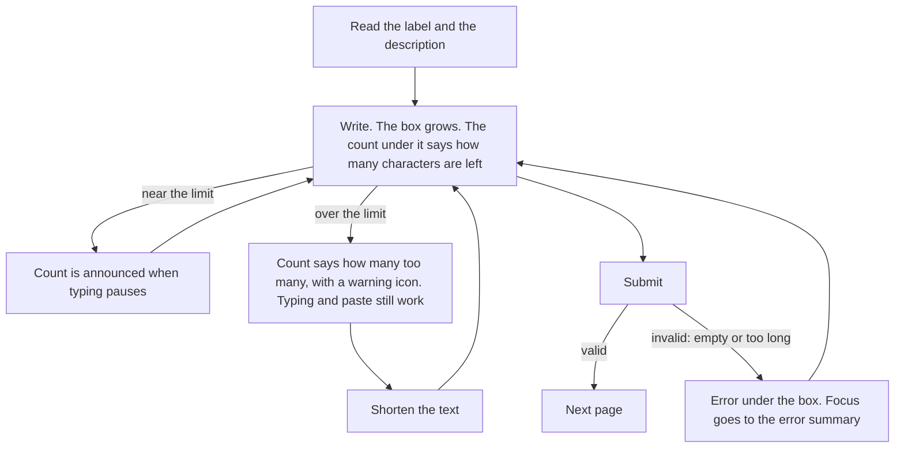
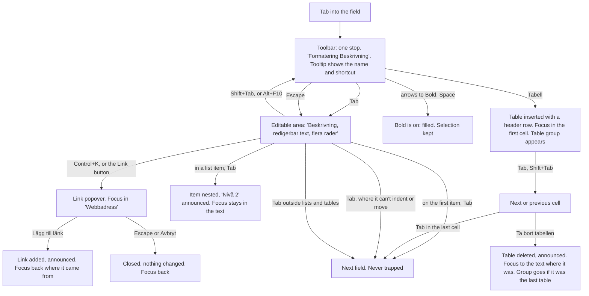

# Design spec: Textarea, Toggle, Toolbar, ButtonGroup and RichTextEditor

- **Status:** Accepted (the maintainer, 2026-10-04)
- **Designer:** ux-designer agent · **Date:** 2026-10-04
- **Plan:** [0034 Textarea](../plans/0034-textarea.md), [0035 Toggle, Toolbar and ButtonGroup](../plans/0035-toggle-toolbar-button-group.md), [0036 RichTextEditor](../plans/0036-rich-text-editor.md) (the new `@kvirn-ui/rich-text` package), and [0037 Tooltip](../plans/0037-tooltip.md) (a prerequisite, spec: [tooltip.md](tooltip.md))
- **Type:** component default styling (+ two new components on the roadmap, + one new package, + DESIGN.md wording, see §6.10 and §9)
- **Superseded 2026-10-05 (Plan 0045):** the Textarea and the editor take the page's direction from the provider, with no `dir` prop and no `dir="auto"` (§6.2, §6.7, §9 Q8), and there is no "Escape, then Tab" way out and no keyboard instruction under the box (§4.3, §6.6.6, §7.4): Tab leaves wherever it does not act. The sections below are the history.

This spec covers five parts that build on each other. The scope was decided with the maintainer:

1. **Textarea**: a native `<textarea>` in a Field, with the TextInput look, and an opt-in character count (`characterCount`).
2. **Toggle**: a `<button aria-pressed>`. Pressed is a solid `primary` fill, a shape that doesn't rely on hue.
3. **Toolbar**: the APG toolbar (`role="toolbar"`, one Tab stop, arrow keys).
4. **ButtonGroup**: `role="group"` with a label, used in a toolbar and on its own (a Card footer).
5. **RichTextEditor**: a Field whose control is a box with a formatting Toolbar and an editable area, built on Tiptap, with Link and Image popovers, a contextual Table group, and Tab that indents a list item or moves between cells where it can, and leaves everywhere else.

The maintainer decided the main questions on 2026-10-04 (§9, "Decided"). Where this spec still needs a decision, it says so in §9.

## 1. Brief

- **Users:** both, but not equally.
  - **Staff** write case notes, decisions, letters, news and page content, often every day, on a desktop, sometimes in compact density. The RichTextEditor is mainly theirs.
  - **Residents** describe their situation in free text ("Beskriv vad som hänt"), usually once, often on a phone and under stress. They need a **Textarea**. A resident service gets a RichTextEditor only when the answer must be published with structure (an association's event text on the municipality's calendar, for example), and then with a small toolbar, usually with visible names (§6.6.4).
- **Hardest-case users:**
  1. A case worker who uses **NVDA** with Chrome all day. She needs to know which toolbar belongs to which field, hear whether Bold is on, indent a list item and move between table cells the way Word does, and **always know how to get out** of a list or a table (2.1.2).
  2. A resident at **400% zoom (320 CSS px)** with a magnifier, writing in Finnish in a Swedish municipality's service. The editor's toolbar wraps to several rows above the text. Anything that makes the text jump (a toolbar row appearing as the caret moves, anything that appears on focus) loses her place.
  3. A **Windows Contrast Themes** user who must tell a pressed Bold from an unpressed one with no theme colours.
  4. A **voice-control** user (Dragon, Voice Control) who says "click Bold" or "click Fetstil": the names must be predictable and discoverable. The tooltips and the icon-and-text option show them.
  5. A Swedish, Finnish or Norwegian **keyboard user on Windows**, who types `@`, `£`, `$`, `€`, `{`, `[`, `]`, `}` and `\` with **AltGr**, which Windows reports as Control+Alt. Tiptap's default heading shortcuts are Control+Alt+1 to 6, so out of the box AltGr+2 (`@`) could turn a line into a heading instead of typing `@` (§6.6.6).
  6. A resident writing in **Arabic or Somali**, their first language, in a Swedish form. The text field must lay out right-to-left text correctly inside a left-to-right page.
- **Job to be done:**
  - Textarea: _When a service asks me to explain something in my own words, I want to write it without worrying about the box or a limit, so that the case worker understands my situation._
  - RichTextEditor: _When I write something that will be published or sent, I want to give it headings, lists and links that work for everyone who reads it, without learning a new tool, so that it's clear and accessible when it goes out._
- **Context:** residents use a Textarea once, often on a phone, and it may hold the most important answer in the service. Staff write in the editor many times a day and expect Word and Google Docs conventions (Control+B, Control+Z, Tab to indent a list item and to move to the next table cell).
- **Constraints:**
  - WCAG 2.2 AA. Hard rules 2 (APG and the keyboard practice), 4 (every string in six locales), 5 (headless packages ship no CSS) and 7 (no third-party network calls).
  - Tiptap (MIT) is a new runtime dependency in the new `@kvirn-ui/rich-text` package. Approval for it, and the updates to `docs/architecture.md` and the `regulations` skill, go in the plan (hard rule 6). Only the open-source Tiptap extensions: no Tiptap Cloud, collaboration or AI services, which call third-party servers.
  - An image inserted by URL makes the reader's browser fetch it from that server. That is the adopter's content, but the library should let them restrict it (§9, Q9).
  - The editor's HTML output must be sanitised on the server. That's not a design decision, but the docs must say it.
  - **Tooltip** is a prerequisite (Plan 0037, [tooltip.md](tooltip.md)). Menu is planned but not built, and isn't needed (D5). Popover and Listbox exist (alpha candidates).
  - `docs/vision.md` lists data grids with editable cells as a non-goal. A table inside the editor is document content in a native `<table>`, not a data grid, so it's within scope.
- **Success criteria:**
  - 0 axe violations in every story state, in the four theme projects, RTL and forced colours.
  - No horizontal scroll at 320px with the Finnish strings, in both label modes, and nothing clipped under the 1.4.12 overrides, except a wide table inside the editor, which scrolls inside its own wrapper (1.4.10 allows that for tables).
  - Every keyboard row in §7 has an e2e test. Tab leaves the editor wherever it can't indent or move to a cell, and Tab never adds a table row.
  - In usability testing (§8, `pending`): every participant can tell pressed from not pressed in greyscale and in forced colours, adds a link with meaningful link text, adds an image with a description, and leaves the editor from inside a list and a table, without help.
- **Evidence:** none from our own users. The prior art in §2 reports its own research, and that research is theirs, not ours.
- **Assumptions and research questions:**
  - Assumption: a solid `primary` fill reads as "on" in greyscale and in Windows Contrast Themes. → RQ: do participants say which of Bold, Italic and Underline are on?
  - Assumption: the filled buttons changing as the caret moves through formatted text doesn't distract staff who write all day (the trade-off the maintainer accepted with D3). → RQ: do staff mention the toolbar "flashing", and does it slow them down?
  - Assumption: icon-only formatting buttons with names, tooltips and shortcuts are usable for staff who know Word. → RQ: can voice-control participants find the names ("click Fetstil", "click Punktlista")? Which buttons do sighted participants fail to recognise until the tooltip shows?
  - Assumption: keeping the Table group in the toolbar (unavailable outside a table) is less disorienting than showing and hiding it as the caret moves. → RQ: do magnifier users lose their place when the group first appears, after inserting a table?
  - Assumption: Tab, which acts only where it can, always gets a keyboard user out of a list or a table, with no instruction. → RQ: do participants get out of a list and a table with Tab alone, and without help?
  - Assumption: Word users expect Tab to indent a list item and to move between table cells, and are not surprised that Tab on the first item of a list, or in the last cell, leaves the editor. → RQ: what do participants do at those two edges?
  - Assumption: a visible character count with announcements only near the limit doesn't interrupt screen-reader users while they type. → RQ: do NVDA and VoiceOver participants find the announcements helpful or noisy?
  - Assumption: "Vad visar bilden?" is understood by people who've never heard of alternative text. → RQ: what do participants write, and do they understand "only decoration"?
  - Assumption: residents rarely need an editor. → RQ: in a pilot service, how many residents use any formatting at all?

## 2. Prior art

| Source                                                                                                                                                             | What we reuse                                                                                                                                                                                                                                                                                                                                   | What we change and why                                                                                                                                                                                                                        |
| ------------------------------------------------------------------------------------------------------------------------------------------------------------------ | ----------------------------------------------------------------------------------------------------------------------------------------------------------------------------------------------------------------------------------------------------------------------------------------------------------------------------------------------- | --------------------------------------------------------------------------------------------------------------------------------------------------------------------------------------------------------------------------------------------- |
| KvirnUI TextInput and Field (`form-fields.md`, `field-help-text.md`)                                                                                               | The box: 1px `border-control`, `md` radius, `canvas`, 16px text in both densities, hover to `text`, 2px `border-focus` on any focus, the ring on keyboard focus, 2px `danger` invalid with padding compensation, dashed disabled on `surface`, solid read-only on `surface`. The order: label, description (`Prose`), control, help text, error | Textarea grows with its text and resizes vertically. The editor's box holds a toolbar and an editable area. The count uses the help text's style, unchanged                                                                                   |
| KvirnUI InputGroup (`form-fields.md` §6.13)                                                                                                                        | **Buttons inside a control's box are flat segments** with `primary-subtle` on hover and their own ring. **The ring goes around the whole box** when the text part has keyboard focus                                                                                                                                                            | The editor box applies both rules: flat toolbar buttons, and the ring around the whole box when the editable area has keyboard focus                                                                                                          |
| KvirnUI Button (`button.a11y.md`, DESIGN.md Button depth)                                                                                                          | The base look, depth, `focusableWhenDisabled` (`aria-disabled`), the icon-only class, and the primary button's fill, label colour and hovered edge                                                                                                                                                                                              | Toggle's pressed state is the primary button's fill, pressed in (no depth). In a toolbar it's flat (InputGroup precedent)                                                                                                                     |
| KvirnUI Listbox (`listbox.a11y.md`, `combobox.md`)                                                                                                                 | The popup, options, tick on the chosen option, typeahead, and its keys. The active option's solid `primary` fill                                                                                                                                                                                                                                | The trigger in a toolbar is flat, like the toolbar's buttons, and keeps a stable width (§6.6.3). Home and End on a closed trigger: §9, Q1                                                                                                     |
| KvirnUI Popover (`popover.a11y.md`)                                                                                                                                | The non-modal popup, Escape and outside press, focus back to the trigger, the "a popover whose first thing is a form can move focus itself" case                                                                                                                                                                                                | The Link and Image popovers move focus to their first field when they open, and are placed after the toolbar in the DOM, not inside it (§5.5)                                                                                                 |
| KvirnUI Tooltip ([tooltip.md](tooltip.md), Plan 0037)                                                                                                              | The tooltip on every toolbar control whose name isn't visible: the name and the shortcut, on hover and keyboard focus, hoverable, Escape, persistent (1.4.13)                                                                                                                                                                                   | The name part is hidden from AT and the shortcut part is the button's description, so the name is heard once (§6.5.5)                                                                                                                         |
| KvirnUI Prose (`foundations-and-prose.md`)                                                                                                                         | `kv-prose` on the editable area, exactly as published, so what staff see is what gets published                                                                                                                                                                                                                                                 | The one editor-only rule is no automatic hyphenation while editing (§6.7)                                                                                                                                                                     |
| APG [Toolbar pattern](https://www.w3.org/WAI/ARIA/apg/patterns/toolbar/) and [Toolbar example](https://www.w3.org/WAI/ARIA/apg/patterns/toolbar/examples/toolbar/) | One Tab stop with roving `tabindex`. ArrowLeft and ArrowRight **wrap**. Home and End. Tab returns to the last focused control. Toggle buttons with `aria-pressed`. Groups with a label. `aria-controls` from the toolbar to the text area it formats                                                                                            | We don't use a radio group (no text alignment in scope). Our popups are a Listbox and Popovers, not a menu button                                                                                                                             |
| APG [Button pattern](https://www.w3.org/WAI/ARIA/apg/patterns/button/) (toggle button)                                                                             | `aria-pressed`, and "the label doesn't change when the state changes"                                                                                                                                                                                                                                                                           | –                                                                                                                                                                                                                                             |
| WCAG 2.2 [Understanding 2.1.2 No Keyboard Trap](https://www.w3.org/WAI/WCAG22/Understanding/no-keyboard-trap.html)                                                 | Its passing example is a rich text editor in which Tab and Shift+Tab indent, and the user is told how to leave (Alt+F10 / Option+F10). "Content can still pass this criterion provided that the user is advised how they can untrap focus"                                                                                                      | We use Tab only where it can act (a list item that can be nested or outdented, a table cell that isn't the last), so it leaves everywhere else, and keep Alt+F10. No instruction is shown (decided 2026-10-05, Plan 0045)                     |
| GOV.UK [Textarea](https://design-system.service.gov.uk/components/textarea/)                                                                                       | 5 rows by default, height in proportion to the expected answer, no placeholder as label, a character count instead of a hard limit. The GOV.UK Design System has no rich text editor: residents get plain text                                                                                                                                  | Ours grows with the text where the browser supports it (§6.2)                                                                                                                                                                                 |
| GOV.UK [Character count](https://design-system.service.gov.uk/components/character-count/)                                                                         | "You can enter up to 200 characters" before typing, "You have N characters remaining" while typing, an over-limit message, no `maxlength` on the element, the message directly under the box, announced when the user stops typing, and a threshold option. Its own research: 17 users in 2017, a fix in 2022 for counts announced twice        | `maxLength` is the limit and isn't written as the native attribute while the count is on. We announce through the shared Announcer only from the threshold (§6.3). Over the limit isn't styled as an error until submit (`form-fields.md` §3) |
| Designsystemet (NO) [ToggleGroup](https://designsystemet.no/en/components/docs/toggle-group/overview)                                                              | Use toggles when "the selection has a direct and visible effect in the interface", not for answers in a form (use radios) or on/off settings (use a Switch). Its selected item is a solid accent fill                                                                                                                                           | Our Toggle is a single `aria-pressed` button. Designsystemet's is a single-select group, which we don't need here                                                                                                                             |
| [Tiptap keyboard shortcuts](https://tiptap.dev/docs/editor/core-concepts/keyboard-shortcuts)                                                                       | Control/Command+B, I, U, Z and Shift+Z. ListItem's sink and lift, and the table's next and previous cell                                                                                                                                                                                                                                        | We turn off the ones that clash with Nordic AltGr characters and browsers (§6.6.6). Shift+Tab never lifts a top-level item out of its list, and Tab in a table's last cell leaves instead of adding a row                                     |
| CKEditor 5, TinyMCE (staff convention, not cited as research)                                                                                                      | Toolbar above the content, a pressed state with a fill, link and image forms in a small panel, Alt+F10 to the toolbar                                                                                                                                                                                                                           | Their floating toolbars are not used: a floating bar covers text (2.4.11) and is hard to find at 400%                                                                                                                                         |

### 2.1 Decisions in this spec (summary)

| #   | Decision                                                                                                                                                                                                                                                                                   | Status                                    | Section      |
| --- | ------------------------------------------------------------------------------------------------------------------------------------------------------------------------------------------------------------------------------------------------------------------------------------------ | ----------------------------------------- | ------------ |
| D1  | Textarea: `rows` (default 5) is the minimum height. It grows with its text where `field-sizing: content` and typed `attr()` are both supported, `resize: vertical`. No new custom property                                                                                                 | Decided 2026-10-04                        | §6.2         |
| D2  | A boolean `characterCount` on Textarea and RichTextEditor, with the limit from `maxLength`, which isn't written as the native attribute while the count is on. The GOV.UK wording, the help text's style, directly under the control, read on focus, announced only near or over the limit | Decided 2026-10-04                        | §6.3         |
| D3  | Pressed = a solid `primary` fill with `on-primary` icon and label, like the primary button, pressed in (no depth) and flat in a toolbar. In forced colours a `Highlight` fill with `HighlightText`. Replaces the 4px bar                                                                   | Decided 2026-10-04                        | §6.4         |
| D4  | The editor's toolbar follows the surrounding density: 44px buttons by default, 32px in `kv-compact` from 64rem. Not compact by default                                                                                                                                                     | Proposed (§9, Q11)                        | §6.5.3       |
| D5  | The toolbar wraps, group by group. No overflow "More" button                                                                                                                                                                                                                               | Proposed                                  | §6.5.4       |
| D6  | Icon-only buttons by default for the well-known formatting actions, each with an i18n name, `aria-keyshortcuts` and a Tooltip (name and shortcut). `labels="icon-and-text"` shows the names. Text buttons for the table actions                                                            | Decided 2026-10-04                        | §6.5.5       |
| D7  | The Table group is in the toolbar while the document has a table, and its buttons are unavailable while the caret is outside one. It appears when a table is inserted and goes when the last one is deleted, never because the caret moved                                                 | Proposed (§9, Q2)                         | §6.6.5       |
| D8  | The ring goes around the whole editor box when the editable area has keyboard focus. Any focus inside the box gives it the 2px `border-focus` edge                                                                                                                                         | Proposed                                  | §6.6.1       |
| D9  | The content is exactly `kv-prose`, with no editor copy of its type styles. The one editor-only rule is `hyphens: manual` while editing. No placeholder                                                                                                                                     | Decided 2026-10-04 (hyphens: Q17)         | §6.7         |
| D10 | Tab indents a list item and Shift+Tab outdents it, only when possible. In a table, Tab and Shift+Tab move between cells, and leave at the last and first cell. Tab never adds a row, and Shift+Tab never lifts an item out of its list. Alt+F10 goes to the toolbar                        | Decided 2026-10-04 (replaces the old D10) | §6.6.6, §7.4 |
| D11 | "Italic" (Kursiv) is the label of the mark Tiptap writes as `<em>`                                                                                                                                                                                                                         | Proposed                                  | §4.3         |
| D12 | Shortcuts are on by default: the platform's text-editing convention only. None uses an AT modifier (Caps Lock, Insert, Scroll Lock, macOS Control+Option), AltGr (Control+Alt), a browser key or a single character                                                                        | Decided 2026-10-04                        | §6.6.6       |
| D13 | **Superseded 2026-10-05 (Plan 0045):** there is no keyboard instruction (`KeyboardHint`) under the box and no "Escape, then Tab" way out. Tab leaves wherever it can't act                                                                                                                 | Decided 2026-10-05                        | –            |
| D14 | The Lists group has Increase indent and Decrease indent (icon-only), unavailable when they can't act, so nesting never depends on Tab                                                                                                                                                      | Decided 2026-10-04                        | §6.6.4       |

## 3. Flow

### 3.1 Textarea



### 3.2 RichTextEditor



### 3.3 Unhappy paths

- **Validation error after submit** (empty when required, too long): the Field's error under the box, after the count and the help text. The box gets the 2px `danger` edge. The text and its formatting are kept.
- **Over the limit while typing:** the count says "Du har 12 tecken för mycket." with a warning icon. Nothing blocks typing or paste, so a user can paste a long text and shorten it (3.3.8). It becomes an error only on submit.
- **Link popover, no address or a wrong one:** on "Lägg till länk" the popover shows the error under the field and moves focus to it. It stays open. `javascript:` and other unsafe schemes are refused with the same message.
- **Link with no selected text:** the popover shows a "Länktext" field, so a link never becomes its bare address (2.4.4).
- **Image without a description:** "Vad visar bilden?" is required unless "Bilden är bara dekoration" is ticked. The error says both ways out.
- **Image that doesn't load** (wrong address, the server refuses): the editor shows the browser's broken image with its description as `alt`. The library doesn't check the address over the network (hard rule 7).
- **Pasting from Word or a web page:** the editor keeps what its toolbar can make (headings, lists, links, bold, italic, underline, strikethrough, code, quotes, tables) and drops fonts, colours and sizes. A pasted heading 1 becomes heading 2. A pasted image file isn't inserted, and "Bilder kan inte klistras in. Använd knappen Bild." is announced (§4.3).
- **Stuck in a list or a table** (the user pressed Tab to leave and the item was nested instead, or the caret moved to the next cell): Tab again goes on, as many presses as there are levels or cells, and Shift+Tab goes back. Control/Command+Z undoes an unwanted indent. Tab leaves by itself on the first item of a list and in the last cell. Enter on an empty list item ends the list. In a code block, Tab isn't bound (it leaves), and Enter three times at the end, or ArrowDown on the last line, leaves the block (Tiptap's behaviour, documented in the contract).
- **Undo after a mistake:** Ångra (and Control/Command+Z) undoes any change, including deleting a table or an indent, which is why deleting needs no confirmation step (§9, Q5).
- **Disabled and read-only:** see the state tables (§6.8). For showing saved content, render it as Prose, not as a read-only editor.
- **Session timeout (2.2.1):** a long text is the worst thing to lose. The page warns and lets the user extend (`service-patterns.md`). Saving drafts is the consumer's, and the docs should recommend it for staff tools.
- **Empty editor:** an editor with only an empty paragraph counts as empty, for "required" and for the count.
- **Not applicable:** loading, no results and the "not eligible" exit belong to the page.

## 4. Content

Every visible or announced string has a key. **Textarea, Toggle, Toolbar and ButtonGroup have no strings of their own**: their labels are the consumer's. The character count and the RichTextEditor do. The `fi` column is a draft for the length check, to be reviewed by a native speaker like the other catalogs. The `richText` messages are a namespace in `KvirnMessages` (Plan 0036). The keys follow the catalog's `namespace.key` depth. Key names in shortcuts ("Ctrl+B", "⌘B") aren't translated (the Kbd decision): a platform formatter writes them, not the catalog.

### 4.1 Character count (`characterCount`)

| i18n key                                 | en                                                                            | sv                                  | fi (draft, length check)                             | Notes                                                                  |
| ---------------------------------------- | ----------------------------------------------------------------------------- | ----------------------------------- | ---------------------------------------------------- | ---------------------------------------------------------------------- |
| `characterCount.limit` (`{ limit }`)     | You can enter up to {limit} characters.                                       | Du kan skriva högst {limit} tecken. | Voit kirjoittaa enintään {limit} merkkiä.            | Shown while the field is empty. `limit` formatted with `format.number` |
| `characterCount.remaining` (`{ count }`) | You have {count} characters remaining. (one: You have 1 character remaining.) | Du har {count} tecken kvar.         | Sinulla on {count} merkkiä jäljellä. (one: 1 merkki) | Plural through `format.plural`                                         |
| `characterCount.over` (`{ count }`)      | You have {count} characters too many. (one: 1 character)                      | Du har {count} tecken för mycket.   | Sinulla on {count} merkkiä liikaa. (one: 1 merkki)   | With the `warning` icon. Never `danger` before submit                  |

The consumer's error on submit names the field and the fix, as every Field error does: "Beskrivningen kan vara högst 500 tecken. Ta bort 12 tecken." (fixture copy, not a library string).

### 4.2 Toolbar, ButtonGroup and Toggle

No library strings. The docs and stories show:

- A **Toolbar** needs a name: `aria-label` from the consumer's translations, or `aria-labelledby`. A dev warning without one.
- A **ButtonGroup** in a toolbar needs a name. On its own (a Card footer) a name is optional (§6.5.2, §9 Q3).
- A **Toggle**'s name never changes with its state ("Visa karta", never "Visa karta" / "Dölj karta").

### 4.3 RichTextEditor (`richText`)

**Italic or emphasis (D11).** Tiptap's Italic mark writes `<em>`. The button is **"Kursiv" / "Italic"**, because that's the word people know from Word and Google Docs, and the word "betoning" would make them wonder what the button does. The HTML stays `<em>`, which is right for published text. Bold writes `<strong>`, and is "Fetstil" / "Bold" for the same reason.

**Toolbar and group names.** The toolbar's name is the word "Formatering" and the field's label, joined by `aria-labelledby` (a visually hidden span with `richText.toolbar`, then the `Field.Label`'s id). So a screen reader says "Formatering Beskrivning, verktygsfält", and two editors on one page have different toolbar names, with no string concatenation.

**Control names** are the same strings in both label modes (§6.5.5): the `aria-label` of an icon-only button and its tooltip's first line, or the visible text with `labels="icon-and-text"`.

| i18n key                                       | en                                                                                  | sv                                                                                               | fi (draft)                                                                    | Part, notes                                                                                                                     |
| ---------------------------------------------- | ----------------------------------------------------------------------------------- | ------------------------------------------------------------------------------------------------ | ----------------------------------------------------------------------------- | ------------------------------------------------------------------------------------------------------------------------------- |
| `richText.toolbar`                             | Formatting                                                                          | Formatering                                                                                      | Muotoilu                                                                      | Visually hidden, first part of the toolbar's name                                                                               |
| `richText.groupHistory`                        | Undo and redo                                                                       | Ångra och gör om                                                                                 | Kumoa ja tee uudelleen                                                        | ButtonGroup name                                                                                                                |
| `richText.groupTextStyle`                      | Text style                                                                          | Textstil                                                                                         | Tekstin tyyli                                                                 | ButtonGroup name (the marks)                                                                                                    |
| `richText.groupLists`                          | Lists                                                                               | Listor                                                                                           | Luettelot                                                                     | ButtonGroup name                                                                                                                |
| `richText.groupInsert`                         | Insert                                                                              | Infoga                                                                                           | Lisää                                                                         | ButtonGroup name                                                                                                                |
| `richText.groupTable`                          | Table                                                                               | Tabell                                                                                           | Taulukko                                                                      | ButtonGroup name (contextual)                                                                                                   |
| `richText.undo`                                | Undo                                                                                | Ångra                                                                                            | Kumoa                                                                         | Button, icon. `aria-keyshortcuts` Control+Z (Meta+Z on macOS)                                                                   |
| `richText.redo`                                | Redo                                                                                | Gör om                                                                                           | Tee uudelleen                                                                 | Button, icon. Control+Shift+Z and Control+Y (Meta+Shift+Z)                                                                      |
| `richText.blockType`                           | Text type                                                                           | Texttyp                                                                                          | Tekstityyppi                                                                  | The picker's name (`aria-label` on the Listbox trigger), and its tooltip. The visible text is the current value                 |
| `richText.blockParagraph`                      | Normal text                                                                         | Vanlig text                                                                                      | Tavallinen teksti                                                             | Option. "Normal text" is Google Docs' word, and plainer than "Paragraph"                                                        |
| `richText.blockHeading2`                       | Heading 2                                                                           | Rubrik 2                                                                                         | Otsikko 2                                                                     | Option. The page has the `h1`                                                                                                   |
| `richText.blockHeading3`                       | Heading 3                                                                           | Rubrik 3                                                                                         | Otsikko 3                                                                     | Option                                                                                                                          |
| `richText.blockHeading4`                       | Heading 4                                                                           | Rubrik 4                                                                                         | Otsikko 4                                                                     | Option, only when the configured levels include 4 (Plan 0036's default is 2 and 3, §9 Q6)                                       |
| `richText.blockQuote`                          | Quote                                                                               | Citat                                                                                            | Lainaus                                                                       | Option                                                                                                                          |
| `richText.blockCode`                           | Code block                                                                          | Kodblock                                                                                         | Koodilohko                                                                    | Option                                                                                                                          |
| `richText.blockMixed`                          | Several types                                                                       | Flera typer                                                                                      | Useita tyyppejä                                                               | The picker's value when the selection spans different types. Choosing an option applies it to all                               |
| `richText.bold`                                | Bold                                                                                | Fetstil                                                                                          | Lihavointi                                                                    | Toggle, icon. Control/Meta+B                                                                                                    |
| `richText.italic`                              | Italic                                                                              | Kursiv                                                                                           | Kursiivi                                                                      | Toggle, icon. Control/Meta+I. Writes `<em>` (D11)                                                                               |
| `richText.underline`                           | Underline                                                                           | Understrykning                                                                                   | Alleviivaus                                                                   | Toggle, icon. Control/Meta+U (§9, Q7)                                                                                           |
| `richText.strike`                              | Strikethrough                                                                       | Genomstrykning                                                                                   | Yliviivaus                                                                    | Toggle, icon. No shortcut (Control+Shift+S is Firefox's screenshot)                                                             |
| `richText.code`                                | Code                                                                                | Kod                                                                                              | Koodi                                                                         | Toggle, icon. No shortcut (Control+E is the browser's search in Chrome on Windows)                                              |
| `richText.bulletList`                          | Bulleted list                                                                       | Punktlista                                                                                       | Luettelomerkit                                                                | Toggle, icon                                                                                                                    |
| `richText.orderedList`                         | Numbered list                                                                       | Numrerad lista                                                                                   | Numeroitu luettelo                                                            | Toggle, icon                                                                                                                    |
| `richText.indent`                              | Increase indent                                                                     | Öka indrag                                                                                       | Suurenna sisennystä                                                           | Button, icon (D14). Unavailable outside a list or on the first item of a list. Word's and Office's names                        |
| `richText.outdent`                             | Decrease indent                                                                     | Minska indrag                                                                                    | Pienennä sisennystä                                                           | Button, icon (D14). Unavailable outside a list or on a top-level item                                                           |
| `richText.link`                                | Link                                                                                | Länk                                                                                             | Linkki                                                                        | Button, icon, `aria-haspopup="dialog"`, `aria-expanded`. Control/Meta+K                                                         |
| `richText.image`                               | Image                                                                               | Bild                                                                                             | Kuva                                                                          | Button, icon, opens a popover                                                                                                   |
| `richText.table`                               | Table                                                                               | Tabell                                                                                           | Taulukko                                                                      | Button, icon. Inserts a table (3 columns, 3 rows, header row on)                                                                |
| `richText.clearFormatting`                     | Clear formatting                                                                    | Ta bort formatering                                                                              | Poista muotoilu                                                               | Button, icon. Removes marks and makes the blocks normal text                                                                    |
| `richText.addRowAbove`                         | Add row above                                                                       | Lägg till rad ovanför                                                                            | Lisää rivi yläpuolelle                                                        | Text button                                                                                                                     |
| `richText.addRowBelow`                         | Add row below                                                                       | Lägg till rad nedanför                                                                           | Lisää rivi alapuolelle                                                        | Text button                                                                                                                     |
| `richText.addColumnLeft`                       | Add column to the left                                                              | Lägg till kolumn till vänster                                                                    | Lisää sarake vasemmalle                                                       | Text button. Mapped to Tiptap's "before" in LTR and "after" in RTL, so the word always matches what the user sees               |
| `richText.addColumnRight`                      | Add column to the right                                                             | Lägg till kolumn till höger                                                                      | Lisää sarake oikealle                                                         | Text button, mapped the other way                                                                                               |
| `richText.deleteRow`                           | Delete row                                                                          | Ta bort raden                                                                                    | Poista rivi                                                                   | Text button. Unavailable when the table has one row                                                                             |
| `richText.deleteColumn`                        | Delete column                                                                       | Ta bort kolumnen                                                                                 | Poista sarake                                                                 | Text button. Unavailable with one column                                                                                        |
| `richText.deleteTable`                         | Delete table                                                                        | Ta bort tabellen                                                                                 | Poista taulukko                                                               | Text button (§9, Q5)                                                                                                            |
| `richText.headerRow`                           | Header row                                                                          | Rubrikrad                                                                                        | Otsikkorivi                                                                   | Toggle, text. Pressed when the first row is header cells                                                                        |
| `richText.linkAddTitle`                        | Add link                                                                            | Lägg till länk                                                                                   | Lisää linkki                                                                  | Popover heading (its name)                                                                                                      |
| `richText.linkEditTitle`                       | Edit link                                                                           | Ändra länk                                                                                       | Muokkaa linkkiä                                                               | Popover heading when the caret is in a link                                                                                     |
| `richText.linkUrl`                             | Web address                                                                         | Webbadress                                                                                       | Verkko-osoite                                                                 | Field label                                                                                                                     |
| `richText.linkUrlHint`                         | For example, https://www.example.com                                                | Till exempel https://www.exempel.se                                                              | Esimerkiksi https://www.esimerkki.fi                                          | Field.HelpText. The address in `<bdi>` in RTL                                                                                   |
| `richText.linkText`                            | Link text                                                                           | Länktext                                                                                         | Linkin teksti                                                                 | Field label. Only when nothing is selected                                                                                      |
| `richText.linkTextHint`                        | Say where the link goes, for example Apply for a parking permit.                    | Skriv vart länken leder, till exempel Ansök om parkeringstillstånd.                              | Kerro, minne linkki vie, esimerkiksi Hae pysäköintilupaa.                     | Field.HelpText. Teaches 2.4.4 at the moment it matters                                                                          |
| `richText.linkAdd`                             | Add link                                                                            | Lägg till länk                                                                                   | Lisää linkki                                                                  | Primary button (new link)                                                                                                       |
| `richText.save`                                | Save                                                                                | Spara                                                                                            | Tallenna                                                                      | Primary button (editing a link or an image)                                                                                     |
| `richText.linkRemove`                          | Remove link                                                                         | Ta bort länk                                                                                     | Poista linkki                                                                 | Secondary button, only when editing                                                                                             |
| `richText.cancel`                              | Cancel                                                                              | Avbryt                                                                                           | Peruuta                                                                       | `Popover.Close`                                                                                                                 |
| `richText.linkUrlMissing`                      | Enter a web address.                                                                | Skriv en webbadress.                                                                             | Kirjoita verkko-osoite.                                                       | Error                                                                                                                           |
| `richText.linkUrlInvalid`                      | Enter the web address like https://www.example.com                                  | Skriv webbadressen som https://www.exempel.se                                                    | Kirjoita verkko-osoite muodossa https://www.esimerkki.fi                      | Error. Repeats the format                                                                                                       |
| `richText.linkTextMissing`                     | Enter the link text.                                                                | Skriv en länktext.                                                                               | Kirjoita linkin teksti.                                                       | Error                                                                                                                           |
| `richText.imageAddTitle`                       | Add image                                                                           | Lägg till bild                                                                                   | Lisää kuva                                                                    | Popover heading                                                                                                                 |
| `richText.imageEditTitle`                      | Edit image                                                                          | Ändra bild                                                                                       | Muokkaa kuvaa                                                                 | Popover heading                                                                                                                 |
| `richText.imageUrl`                            | Image web address                                                                   | Bildens webbadress                                                                               | Kuvan verkko-osoite                                                           | Field label                                                                                                                     |
| `richText.imageUrlHint`                        | For example, https://www.example.com/map.png                                        | Till exempel https://www.exempel.se/karta.png                                                    | Esimerkiksi https://www.esimerkki.fi/kartta.png                               | Field.HelpText                                                                                                                  |
| `richText.imageAlt`                            | What does the image show?                                                           | Vad visar bilden?                                                                                | Mitä kuvassa näkyy?                                                           | Field label. A question, not the jargon "alternativ text"                                                                       |
| `richText.imageAltHint`                        | This is read out to people who can't see the image.                                 | Texten läses upp för den som inte ser bilden.                                                    | Teksti luetaan ääneen niille, jotka eivät näe kuvaa.                          | Field.HelpText                                                                                                                  |
| `richText.imageDecorative`                     | The image is only decoration                                                        | Bilden är bara dekoration                                                                        | Kuva on vain koriste                                                          | Checkbox label                                                                                                                  |
| `richText.imageDecorativeHint`                 | It shows nothing that needs describing.                                             | Den visar inget som behöver beskrivas.                                                           | Siinä ei ole mitään kuvattavaa.                                               | The checkbox's Field.HelpText                                                                                                   |
| `richText.imageAdd`                            | Add image                                                                           | Lägg till bild                                                                                   | Lisää kuva                                                                    | Primary button                                                                                                                  |
| `richText.imageRemove`                         | Remove image                                                                        | Ta bort bild                                                                                     | Poista kuva                                                                   | Secondary button, only when editing                                                                                             |
| `richText.imageUrlMissing`                     | Enter the image's web address.                                                      | Skriv bildens webbadress.                                                                        | Kirjoita kuvan verkko-osoite.                                                 | Error                                                                                                                           |
| `richText.imageUrlInvalid`                     | Enter the web address like https://www.example.com/map.png                          | Skriv webbadressen som https://www.exempel.se/karta.png                                          | Kirjoita verkko-osoite muodossa https://www.esimerkki.fi/kartta.png           | Error                                                                                                                           |
| `richText.imageUrlNotAllowed`                  | Images from that address aren’t allowed here. Enter a different web address.        | Bilder från den adressen får inte användas här. Skriv en annan webbadress.                       | Kuvia tästä osoitteesta ei voi käyttää täällä. Kirjoita toinen verkko-osoite. | Error, when the address is outside `imageSources` (Plan 0036). Names no origin: the allow-list is the adopter's                 |
| `richText.imageAltMissing`                     | Describe what the image shows, or tick that it's only decoration.                   | Beskriv vad bilden visar, eller kryssa i att den bara är dekoration.                             | Kuvaile, mitä kuvassa näkyy, tai valitse, että se on vain koriste.            | Error. Names both ways out                                                                                                      |
| `richText.linkAdded`                           | Link added.                                                                         | Länken är tillagd.                                                                               | Linkki lisätty.                                                               | Announced (polite)                                                                                                              |
| `richText.linkUpdated`                         | Link changed.                                                                       | Länken är ändrad.                                                                                | Linkki muutettu.                                                              | Announced                                                                                                                       |
| `richText.linkRemoved`                         | Link removed.                                                                       | Länken är borttagen.                                                                             | Linkki poistettu.                                                             | Announced                                                                                                                       |
| `richText.imageAdded`                          | Image added.                                                                        | Bilden är tillagd.                                                                               | Kuva lisätty.                                                                 | Announced                                                                                                                       |
| `richText.imageUpdated`                        | Image changed.                                                                      | Bilden är ändrad.                                                                                | Kuva muutettu.                                                                | Announced                                                                                                                       |
| `richText.imageRemoved`                        | Image removed.                                                                      | Bilden är borttagen.                                                                             | Kuva poistettu.                                                               | Announced                                                                                                                       |
| `richText.tableInserted` (`{ columns, rows }`) | Table with {columns} columns and {rows} rows added.                                 | Tabell med {columns} kolumner och {rows} rader tillagd.                                          | Taulukko lisätty: {columns} saraketta ja {rows} riviä.                        | Announced, when focus moves into the first cell                                                                                 |
| `richText.rowAdded`                            | Row added.                                                                          | Raden är tillagd.                                                                                | Rivi lisätty.                                                                 | Announced                                                                                                                       |
| `richText.columnAdded`                         | Column added.                                                                       | Kolumnen är tillagd.                                                                             | Sarake lisätty.                                                               | Announced                                                                                                                       |
| `richText.rowDeleted`                          | Row deleted.                                                                        | Raden är borttagen.                                                                              | Rivi poistettu.                                                               | Announced                                                                                                                       |
| `richText.columnDeleted`                       | Column deleted.                                                                     | Kolumnen är borttagen.                                                                           | Sarake poistettu.                                                             | Announced                                                                                                                       |
| `richText.tableDeleted` (`{ shortcut }`)       | Table deleted. Undo with {shortcut}.                                                | Tabellen är borttagen.                                                                           | Taulukko poistettu.                                                           | Announced, with focus back in the text                                                                                          |
| `richText.listLevel` (`{ level }`)             | Level {level}                                                                       | Nivå {level}                                                                                     | Taso {level}                                                                  | Announced after an indent or outdent (Tab, Shift+Tab or the buttons). Nothing visible under the caret says how deep the item is |
| `richText.formattingCleared`                   | Formatting cleared.                                                                 | Formateringen är borttagen.                                                                      | Muotoilu poistettu.                                                           | Announced                                                                                                                       |
| `richText.undone`                              | Undone.                                                                             | Ångrat.                                                                                          | Kumottu.                                                                      | Announced from the toolbar button only (the shortcut is the native undo)                                                        |
| `richText.redone`                              | Redone.                                                                             | Gjort om.                                                                                        | Tehty uudelleen.                                                              | Announced from the toolbar button only                                                                                          |
| `richText.formatOn` (`{ name }`)               | {name} on                                                                           | {name} på                                                                                        | {name} käytössä                                                               | Announced after a formatting shortcut in the text (Control+B). `name` is the button's name                                      |
| `richText.formatOff` (`{ name }`)              | {name} off                                                                          | {name} av                                                                                        | {name} pois                                                                   | As above                                                                                                                        |
| `richText.imagePasteNotSupported`              | Images can't be pasted. Use the Image button.                                       | Bilder kan inte klistras in. Använd knappen Bild.                                                | Kuvia ei voi liittää. Käytä Kuva-painiketta.                                  | Announced when a pasted or dropped image file is ignored                                                                        |
| `richText.imageSourceNotAllowed`               | The pasted image wasn’t added, because it comes from an address that isn’t allowed. | Den inklistrade bilden lades inte till, eftersom den kommer från en adress som inte är tillåten. | Liitettyä kuvaa ei lisätty, koska se on osoitteesta, jota ei sallita.         | Announced when a pasted image's address is outside `imageSources` (Plan 0036)                                                   |

**Word length:** the longest visible toolbar strings are the table buttons ("Lägg till kolumn till vänster", 29 characters; fi "Lisää sarake vasemmalle", 23) and, with `labels="icon-and-text"`, fi "Suurenna sisennystä" (19). They wrap inside the button at 320px if they must (§6.5.4). The longest picker value is fi "Tavallinen teksti" (17), which sets the picker's width (§6.6.3).

## 5. Structure

The field adds no landmark or heading. Reading order = DOM order = visual order = focus order.

### 5.1 Textarea field, 320px (and 400% zoom), comfortable

```
[Field.Root .kv-field]
  label.kv-field-label             Beskriv vad som hänt
  div.kv-prose                     Skriv vad som hände, när och var.            16px (description, optional)
  textarea.kv-textarea rows=5      [                                    ]
                                   [                                    ]       5 rows minimum, grows
                                   [____________________________________]
                                                                    ↕ (vertical resize only)
  p.kv-field-help-text.kv-character-count   Du har 380 tecken kvar.                 14px, only with characterCount
  p.kv-field-help-text                  Du kan svara på svenska, finska eller engelska.   14px (optional)
  p.kv-field-error-message         (only after submit)
```

The count is rendered by the Textarea itself (`characterCount`), so it's directly under the box, where GOV.UK puts it, and before the consumer's help text. 40rem and 64rem: the same column. In `kv-compact` from 64rem: label 14px, gaps 4px, the text stays 16px and the rows stay 5.

### 5.2 RichTextEditor field, 64rem, comfortable, the default toolbar, icon-only

```
[Field.Root .kv-field]
  label.kv-field-label   Nyhetstext
  div.kv-prose           Texten publiceras på kommunens webbplats.              (description)
  ┌─ div.kv-rich-text (the box: border-control, md radius) ───────────────────────────────────────┐
  │ [div role=toolbar .kv-toolbar .kv-toolbar--attached]  surface, hairline under it               │
  │  (↶)(↷) │ [Vanlig text  ⌄] │ (B)(I)(U)(S)(<>) │ (•≡)(1≡)(⇥)(⇤) │ (🔗)(🖼)(▦) │ (Tx)              │
  │ ─────────────────────────────────────────────────────────────────────────────────────────────── │
  │ [div role=textbox .kv-rich-text-content .kv-prose]                                             │
  │   Rubrik 2 text …                                                                              │
  │   Brödtext …                                                    min 5 lines, grows             │
  └────────────────────────────────────────────────────────────────────────────────────────────────┘
                         och i tabeller går Tabb till nästa cell.
  p.kv-field-help-text.kv-character-count   Du har 1 620 tecken kvar.               (only with characterCount)
  p.kv-field-help-text        Skriv om något som händer i kommunen.                  (the consumer's help text, optional)
  p.kv-field-error-message
```

Hovering or focusing (B) shows its tooltip above it: "Fetstil" and the key `Ctrl` + `B` ([tooltip.md](tooltip.md)).

With a table in the document, the Table group is the last group (D7):

```
  │ … │ (Tx) │ [Lägg till rad ovanför][Lägg till rad nedanför][Lägg till kolumn till vänster]        │
  │       [Lägg till kolumn till höger][Ta bort raden][Ta bort kolumnen][Ta bort tabellen][Rubrikrad]  │
```

### 5.3 RichTextEditor, 320px (about 270px inside the box), icon-only

The toolbar wraps, and a group never splits across rows unless it is wider than the row by itself (the Table group):

```
┌─────────────────────────────────┐
│ (↶)(↷)  [Vanlig text ⌄]          │  row 1
│ (B)(I)(U)(S)(<>)                │  row 2
│ (•≡)(1≡)(⇥)(⇤)                  │  row 3
│ (🔗)(🖼)(▦)  (Tx)                │  row 4   about 200px of toolbar at 44px
│─────────────────────────────────│
│ text …                          │
└─────────────────────────────────┘
```

This is why the docs recommend a smaller toolbar for resident-facing editors (§6.6.4).

### 5.4 Icon and text (`labels="icon-and-text"`)

64rem, the small resident toolbar:

```
┌──────────────────────────────────────────────────────────────────────────────────────────┐
│ (B Fetstil)(I Kursiv) │ (•≡ Punktlista)(1≡ Numrerad lista)(⇥ Öka indrag)(⇤ Minska indrag) │
│ (🔗 Länk)                                                                                  │
│──────────────────────────────────────────────────────────────────────────────────────────│
│ text …                                                                                    │
└──────────────────────────────────────────────────────────────────────────────────────────┘
```

320px, the same toolbar: groups wrap inside themselves, a button never truncates, and a name wraps inside its button only if the button alone is wider than the row:

```
┌─────────────────────────────────┐
│ (B Fetstil)(I Kursiv)            │  row 1
│ (•≡ Punktlista)                  │  row 2
│ (1≡ Numrerad lista)              │  row 3
│ (⇥ Öka indrag)                   │  row 4
│ (⇤ Minska indrag)                │  row 5
│ (🔗 Länk)                         │  row 6   about 300px at 44px
│─────────────────────────────────│
```

The full default toolbar with names is about ten rows (about 480px) at 320px. That's the consumer's trade-off between visible names and height, and the docs say so: names with a small toolbar for residents, icons with the full toolbar for staff.

### 5.5 DOM order inside and under the box

1. The visually hidden toolbar name (`richText.toolbar`).
2. The Toolbar (one Tab stop), with its ButtonGroups. The Listbox popup is inside the picker, as today. Each Tooltip popup follows its trigger in the DOM. It isn't focusable and isn't a toolbar item, so the arrow keys never land on it ([tooltip.md](tooltip.md) §5).
3. The Link and Image popovers (`Popover.Popup`), as **siblings after the Toolbar**, not inside it, so the toolbar's arrow keys never reach their fields, and Tab from the popover's last control goes to the editable area. Hidden while closed.
4. The editable area.
5. Under the box, outside it: the `CharacterCount`, then the consumer's help texts and the error.

## 6. Visual specification

### 6.1 Class API

Parts render their own class. Options are modifier classes. State is `data-*` (and the native or ARIA attribute the theme also accepts).

| Class                                                                   | Rendered by                                              | Notes                                                                                                                                                                                            |
| ----------------------------------------------------------------------- | -------------------------------------------------------- | ------------------------------------------------------------------------------------------------------------------------------------------------------------------------------------------------ |
| `kv-textarea`                                                           | `Textarea` (`<textarea>`)                                | The `kv-input` look (§6.2). Not `kv-input` itself, because the input's single-line rules (no block padding, width classes) don't apply                                                           |
| `kv-field-help-text` + `kv-character-count`                             | `CharacterCount` (a `<p>`), rendered by `characterCount` | The help text's rule, unchanged. `kv-character-count` adds only the over-limit look (§6.3). `data-over` when over the limit, `data-near` from the threshold                                      |
| `kv-toggle`                                                             | `Toggle` (`<button aria-pressed>`), with `kv-button`     | `data-pressed` and `aria-pressed="true"`                                                                                                                                                         |
| `kv-toolbar`, modifiers `kv-toolbar--attached` and `kv-toolbar--labels` | `Toolbar.Root` (`<div role="toolbar">`)                  | `--attached`: the toolbar is part of a control's box: a `surface` bar with flat buttons (§6.5). The RichTextEditor renders it. `--labels`: icon and text (§6.5.5), from `labels="icon-and-text"` |
| `kv-button-group`                                                       | `ButtonGroup` (`<div role="group">`)                     | Exists today as a layout class. Inside `.kv-toolbar` it's a row of flat or normal buttons with a 4px gap and never stacks (§6.5.2)                                                               |
| `kv-tooltip`                                                            | `Tooltip.Popup`                                          | [tooltip.md](tooltip.md)                                                                                                                                                                         |
| `kv-rich-text`                                                          | `RichTextEditor.Root` (the box)                          | `data-invalid`, `data-disabled`, `data-readonly`, `data-focus-visible` (keyboard focus in the content), `data-focus-within` optional (any focus inside)                                          |
| `kv-rich-text-content`                                                  | the editable element, with `kv-prose`                    | `data-empty` while empty                                                                                                                                                                         |
| `kv-rich-text-popover`                                                  | the Link and Image `Popover.Popup`                       | The popover's level 3 look, and a width. Its `<form>` pads itself (§6.6.7)                                                                                                                       |

Prose boundary: `.kv-rich-text` goes on the not-prose list in `theme.css` (it's inside a field anyway), and `kv-prose` on `kv-rich-text-content` turns prose on again, as `kv-prose` on a card does. The editable area is not a direct child of `kv-field`, so the description rule (`kv-field > .kv-prose`) never matches it. The editor uses the class, not the `Prose` component, so it doesn't register as a description.

### 6.2 Textarea (D1)

| Property         | Value                                                                                                                                                                                                                                                                                                                                                                                                                                                                                                |
| ---------------- | ---------------------------------------------------------------------------------------------------------------------------------------------------------------------------------------------------------------------------------------------------------------------------------------------------------------------------------------------------------------------------------------------------------------------------------------------------------------------------------------------------- |
| Box              | `box-sizing: border-box`, `inline-size: 100%`, `max-inline-size: 100%`. Full width of the field: no width classes                                                                                                                                                                                                                                                                                                                                                                                    |
| Height           | **`rows`**, the native attribute, which the component defaults to 5. **Grows with its text** where the browser supports both `field-sizing: content` and typed `attr()`: inside one `@supports` for both, `field-sizing: content` and `min-block-size: calc(attr(rows type(<number>), 5) * 1lh + 2 * var(--kv-space-2) + 2 * var(--kv-border-width))`, so `rows` stays the minimum. Elsewhere `rows` sets the height and the text scrolls inside. No `max-block-size` by default. No custom property |
| Resize           | `resize: vertical`. Never `none` (a user who wants more room can make it taller) and never `both` (a wider textarea breaks the layout and 1.4.10)                                                                                                                                                                                                                                                                                                                                                    |
| Padding          | `padding-block: var(--kv-space-2)` (8px), `padding-inline: var(--kv-input-padding-inline)` (12px). Minus 1px each when the edge is 2px, so the text never moves (as `kv-input`)                                                                                                                                                                                                                                                                                                                      |
| Edge, fill, text | As `kv-input`: 1px `border-control`, `md` radius, `canvas`, `text`, `caret-color: text`, `body` 16/400/1.5 in both densities, Plex Sans, `letter-spacing: normal`                                                                                                                                                                                                                                                                                                                                    |
| Wrapping         | Soft wrap (native). `overflow-wrap: break-word`, so a long address or compound doesn't scroll sideways                                                                                                                                                                                                                                                                                                                                                                                               |
| Placeholder      | As `kv-input` (`text-muted`), and the docs say don't use one                                                                                                                                                                                                                                                                                                                                                                                                                                         |
| Depth            | None                                                                                                                                                                                                                                                                                                                                                                                                                                                                                                 |
| Direction        | From the page: no `dir` prop and no `dir="auto"` (decided 2026-10-05, Plan 0045). `KvirnProvider` puts its `dir` on the page                                                                                                                                                                                                                                                                                                                                                                         |
| Scrollbar        | Native, never hidden or thinned                                                                                                                                                                                                                                                                                                                                                                                                                                                                      |
| `maxLength`      | With `characterCount`, it's the count's limit and **isn't written** as the native `maxlength`, which silently cuts pasted text (3.3.8). Without the count it passes through as any native attribute, and the docs recommend the count instead                                                                                                                                                                                                                                                        |

Why both features in one `@supports`: with `field-sizing: content` and no typed `attr()`, the box would shrink to one line. Chromium has both at the time of writing; the engineer checks the others when building.

### 6.3 Character count (D2)

`characterCount` (boolean, on Textarea and on RichTextEditor) renders a `CharacterCount` under the control, with the limit from `maxLength`. No limit, no count (a dev warning). GOV.UK's advice applies and goes in the docs: raise the limit before you add a count.

| Property       | Value                                                                                                                                                                                                                                                                                                                                                                      |
| -------------- | -------------------------------------------------------------------------------------------------------------------------------------------------------------------------------------------------------------------------------------------------------------------------------------------------------------------------------------------------------------------------- |
| Position       | Directly under the control: under the Textarea or the editor's box. Before the consumer's `Field.HelpText` and the error. The component renders it, so the consumer can't misplace it                                                                                                                                                                                      |
| Look           | **Exactly `kv-field-help-text`**: `body-small` (14px, 1.5), `text`, `margin: 0`, the prose measure. No style of its own except over the limit                                                                                                                                                                                                                              |
| Text           | Empty: `characterCount.limit`. Typing: `characterCount.remaining`. Over: `characterCount.over`                                                                                                                                                                                                                                                                             |
| Over the limit | `data-over`. Weight 600 (`strong`, DESIGN.md Weights) and the `warning` Icon at `md` (1.25em) at the inline start, centred on the first line, laid out with the error message's icon rule. Text stays `text`; the icon is `warning`. Never `danger` before submit: it isn't an error until the user submits                                                                |
| Counting       | Characters as the user sees them (grapheme clusters, `Intl.Segmenter`), so `å` typed as `a` plus a combining ring, or an emoji, counts as one. The consumer can pass the server's own counting function when they differ. In the editor: text only, not markup. (Plan 0034 counts the same way, with `countCharacters` for a server that counts differently: §9, Q15)      |
| Accessibility  | In the control's `aria-describedby` (read on focus with its current value). **Not** a live region. Announced through the Announcer, debounced like `combobox.resultCount`, only when typing pauses at or past the threshold (default 80% of the limit), and when the count crosses over the limit. So screen-reader users aren't interrupted on every pause in a long text |

The help texts and the count are all 14px `text` under the box. They differ in content, and the over-limit count adds weight and an icon, never colour alone.

### 6.4 Toggle (D3)

A Toggle is a Button with `aria-pressed`. It looks like a Button when it's off, and like a **pressed-in primary button** when it's on: a solid `primary` fill with the `on-primary` icon and label, no depth.

**Why it doesn't rely on colour (1.4.1, 1.4.11).** The pressed state is a filled tile that is either there or not, and the icon or label changes colour with it:

- The fill against what's around it (the toolbar's `surface`, or the page) is at least 3:1 in every theme: `primary` on `surface` 4.05:1 at the lowest (dark), on `surface-raised` 3.75:1 (dark), on `canvas` 4.44:1 (dark). In greyscale it's a mid-tone tile behind a white glyph, next to bare glyphs.
- Against a hovered or open button next to it (`primary-subtle`), the pressed fill is 3.32:1 at the lowest (dark).
- In light and light-contrast, the icon also flips from near-black (`text`) to white (`on-primary`). In dark the icon stays light and the tile alone carries the state, at 4.05:1 or more.
- Focus is a different shape again: the 2px ring 2px outside the button. Hover is a faint tint and is never information.

The trade-off the maintainer accepted: as the caret moves through formatted text, the Bold or Italic button fills and empties. It's a colour change in place, with no layout change and no motion under `prefers-reduced-motion: reduce`. The usability test checks whether staff find it distracting (§1).

**Standalone** (a Toggle on a page or in a card, `kv-button kv-toggle`):

| State                                               | Edge                                                                                                                       | Fill             | Shadow                | Label or icon                      |
| --------------------------------------------------- | -------------------------------------------------------------------------------------------------------------------------- | ---------------- | --------------------- | ---------------------------------- |
| Not pressed                                         | As Button (`secondary`, tinted)                                                                                            | `surface-raised` | `--kv-shadow-button`  | `text`                             |
| Not pressed, hover                                  | As Button hover (`primary`)                                                                                                | `primary-subtle` | hover shadow          | `text`                             |
| Not pressed, active (pointer down)                  | 1px `primary`, untinted on all four sides                                                                                  | `primary-subtle` | none                  | `text`                             |
| **Pressed** (`aria-pressed="true"`, `data-pressed`) | 1px `primary`, **untinted on all four sides**                                                                              | **`primary`**    | **none** (pressed in) | **`on-primary`**                   |
| Pressed, hover                                      | 1px `primary` (as a hovered primary button, so the edge stays at 3:1)                                                      | `primary-hover`  | none                  | `on-primary`                       |
| Focus-visible (any)                                 | unchanged                                                                                                                  | unchanged        | none (as Button)      | Ring: 2px `focus-ring`, 2px offset |
| Disabled, not pressed                               | Button disabled (dashed `border-control`)                                                                                  | `surface`        | none                  | `text-muted`                       |
| Disabled, pressed                                   | 1px dashed `border-control`, with the fill inside it (`background-clip: padding-box`), so the dashes show against the page | `text-muted`     | none                  | `surface`                          |

- Pressed differs from a primary button at rest by having no depth and by `aria-pressed`. In the contrast themes, where buttons are flat, a pressed Toggle and a primary button look the same (§9, Q16).
- **Disabled and pressed** keeps the tile, in grey, so the state stays visible, and the dashed edge says "disabled", as on every disabled control. Using `text-muted` as a fill is a role extension that needs the maintainer's approval (§6.10, §9 Q13). The pair is `surface` on `text-muted`, the same ratio as the existing `text-muted` on `surface` pair (5.84:1 or more).
- **The label never changes** with the state (APG). A setting that turns something on or off for good is a Switch or a Checkbox, not a Toggle (Designsystemet's rule, in the docs).
- **Forced colours:** not pressed is a Button (`ButtonText` edge, `ButtonFace`). Pressed is a **`Highlight` fill with `HighlightText`** label or icon and a `Highlight` edge (`forced-color-adjust: none` on the pressed button only), the way Windows draws a selected item, and as the active Listbox option already does. Hover: `Highlight` edge. Disabled: dashed `GrayText`. Disabled and pressed: a `GrayText` fill with `Canvas` icon or label, and a dashed `GrayText` edge.
- **Motion:** the fill, edge and shadow change over `--kv-duration-fast` under `prefers-reduced-motion: no-preference`, and instantly otherwise.

### 6.5 Toolbar and ButtonGroup

#### 6.5.1 Toolbar

| Class                                      | Style                                                                                                                                                                                                                                                                                                                                                                                                                                                  |
| ------------------------------------------ | ------------------------------------------------------------------------------------------------------------------------------------------------------------------------------------------------------------------------------------------------------------------------------------------------------------------------------------------------------------------------------------------------------------------------------------------------------ |
| `kv-toolbar`                               | `display: flex; flex-wrap: wrap; align-items: center; gap: var(--kv-space-1) var(--kv-space-2)`, `min-inline-size: 0`. No fill, no edge. Buttons keep their own look: a standalone toolbar (actions over a table) is a row of real Buttons                                                                                                                                                                                                             |
| `kv-toolbar--attached`                     | The toolbar is part of a control's box. `background-color: surface`, `padding: var(--kv-space-1)`, `border-block-end: 1px solid border-subtle` (a hairline between two regions of one control, not the control's edge, so `border-subtle` is right), top corners `calc(var(--kv-radius-md) - var(--kv-border-width))`. Buttons inside are **flat** (InputGroup precedent): transparent fill, 1px transparent edge, no shadow, `text` icon, `md` radius |
| Flat button, hover                         | `primary-subtle` fill (as the InputGroup's button). Not essential                                                                                                                                                                                                                                                                                                                                                                                      |
| Flat button, pressed (Toggle)              | §6.4: a solid `primary` fill, 1px `primary` edge, `on-primary` icon or label, no shadow. On hover, `primary-hover` with the `primary` edge                                                                                                                                                                                                                                                                                                             |
| Flat button, focus-visible                 | The 2px ring, 2px offset. The neighbouring button is 4px away, so the ring touches its edge and never covers its icon. Around a pressed button the ring is separated from the fill by 2px of the toolbar's `surface`, as around a primary button                                                                                                                                                                                                       |
| Flat button, unavailable (`aria-disabled`) | Icon `text-muted`, `cursor: not-allowed`, no hover fill. No dashed edge: the flat buttons have no edge to dash (InputGroup precedent). Inactive components are exempt from 1.4.3 and 1.4.11, and the name says "unavailable". Unavailable and pressed: §6.8                                                                                                                                                                                            |

#### 6.5.2 ButtonGroup

- **In a toolbar:** `display: inline-flex; flex-wrap: nowrap; gap: var(--kv-space-1)` (4px). It never stacks below 40rem (overrides today's `kv-button-group` stacking). If a group alone is wider than the toolbar (the Table group at 320px, and most groups with `kv-toolbar--labels`), it wraps inside: `flex-wrap: wrap; max-inline-size: 100%`.
- **Separators between groups:** a 1px `border-subtle` line between two groups, `space-2` (8px) on each side, as tall as an icon (1.25em), drawn by CSS on every group but the first. There is no `role="separator"` element: the groups already say where one ends, and a separator would add a stop for screen-reader users with nothing to say. **A separator must not show at the start of a wrapped row.** CSS can't tell when a row wraps, so the engineer may clip it with a wrapper, as long as no focus ring is clipped (each ring reaches 4px outside its button, 2.4.11 and 2.4.13). If that can't be guaranteed, the separators are not drawn below 40rem, where the toolbar is expected to wrap, and the 8px gap alone groups the buttons (§9, Q4). In the contrast themes `border-subtle` is 4.68:1 or more, so the lines get stronger there by themselves.
- **On its own** (a Card footer, a form's actions): today's `kv-button-group` layout, unchanged: start-aligned, 12px gap, wraps, stacks at full width below 40rem, one primary per view. Buttons keep their depth.
- **Name:** in a toolbar a ButtonGroup always has a name (`aria-label` or `aria-labelledby`), so a screen reader says "Textstil, grupp" as focus enters it. On its own, the brief asks for `role="group"` with a label. Recommendation: with a name it renders `role="group"`; without one it renders a plain `<div>`, because an unnamed group in a Card footer only adds noise. A Card footer that wants it uses `aria-labelledby` pointing at the card's heading (§9, Q3).

#### 6.5.3 Density and target size (D4)

DESIGN.md lists toolbars under compact density (32px controls, 24×24px minimum target, meets 2.5.8 only). For an editor that a resident form can contain, that's not the right default:

- **2.5.8 Target Size (Minimum, AA)** needs 24×24px or enough spacing. 32px compact buttons pass. So does 44px.
- **2.5.5 Target Size (Enhanced, AAA)** needs 44×44px. DESIGN.md's principle is that comfortable density, which meets it, is the default for everything resident-facing, and that compact is opt-in for staff tools.
- An editor toolbar is a dense row of small icons, used by people with tremor, on touch screens, at high zoom. The cost of 44px is a taller toolbar (one more row when it wraps). The cost of 32px is mis-taps on the button next door (Bold for Italic) that the user may not notice.

So the editor's toolbar **follows the surrounding density** and has none of its own: 44px buttons with 20px icons by default, 32px buttons in a `kv-compact` container from 64rem (staff tools, as DESIGN.md already defines), and 44px again below 64rem, where touch is likely. Icons stay `md` (20px) in both. The 4px gap means two 32px targets are 4px apart, which is more than 2.5.8 asks. The DESIGN.md wording is §9, Q11.

#### 6.5.4 When the toolbar doesn't fit (D5)

**Wrap.** The toolbar's groups wrap to new rows; a group moves as a whole; buttons never shrink, scroll sideways or truncate. Why not an overflow "More" button:

- **Everything stays visible** (recognition over recall). Behind "More", Underline and the lists would be hidden exactly on the phone where the user is least likely to guess they're there.
- **1.4.10 at 320px** is met without measuring anything. An overflow menu has to measure, move buttons between the bar and the menu as the width changes, and keep roving focus right while it does.
- **No new component.** Menu is planned (M2) but not built.
- The keyboard order doesn't change with the width: ArrowRight always goes to the same next button.

The cost is height: about 200px of toolbar at 320px with the full default set, icon-only (§5.3), and more with names (§5.4). The answer is a smaller toolbar for small, resident-facing editors (§6.6.4), not hiding buttons. Arrow keys follow the DOM order across rows, ArrowLeft and ArrowRight only (ArrowUp and ArrowDown are the picker's). The toolbar is never sticky by default (§6.6.1).

#### 6.5.5 Icon-only or icon and text, and tooltips (D6)

**Decided 2026-10-04:** icon-only buttons are allowed in a formatting toolbar, with tooltips, and the label mode is an option per editor. The DESIGN.md wording (today "only for close and search") is updated with the plan (§6.10).

- **`labels="icon"` (default):** icon-only buttons for actions with a widely known icon: Ångra, Gör om, Fetstil, Kursiv, Understrykning, Genomstrykning, Kod, Punktlista, Numrerad lista, Öka indrag, Minska indrag, Länk, Bild, Tabell, Ta bort formatering. The name is `aria-label` from i18n (§4.3), plus `aria-keyshortcuts` where there's a shortcut, set for the platform (`Control+B`, or `Meta+B` on macOS).
- **`labels="icon-and-text"`** (on `Root` for the whole editor, or on `Toolbar`), class `kv-toolbar--labels`: each of those buttons shows its name after the icon. The name comes from the content, with no `aria-label`, so the visible label is the accessible name (2.5.3).
- **Text** in both modes for the table actions, because there are no widely known icons for "add column to the left" (design skill: icon-only buttons only for what's universal). "Rubrikrad" is a text Toggle.

**The icon-and-text look:**

| Property    | Value                                                                                                                                                                                                                 |
| ----------- | --------------------------------------------------------------------------------------------------------------------------------------------------------------------------------------------------------------------- |
| Button      | The flat toolbar button (§6.5.1), `inline-size: auto`, `min-block-size` as the density (44px, 32px compact), `padding-inline: var(--kv-space-3)` (12px), `gap: var(--kv-space-2)` (8px) between the icon and the name |
| Name        | `label` type (`label-compact` in compact), `text`, sentence case. `text-align: start`. It wraps inside the button only when the button alone is wider than the row, and never truncates (DESIGN.md Layout)            |
| Icon        | `md` (1.25em), at the inline start, centred on the first line of the name, `aria-hidden`                                                                                                                              |
| Groups      | Wrap inside themselves (§6.5.2), so a long group breaks between buttons, never inside a button unless it must                                                                                                         |
| Pressed     | As icon-only: `primary` fill, `on-primary` icon and name (4.70:1 at the lowest, AA for 16px text and 14px compact text at weight 500)                                                                                 |
| Unavailable | Icon and name `text-muted`                                                                                                                                                                                            |
| The picker  | Unchanged: it shows its value. Its name ("Texttyp") isn't visible, so it keeps its tooltip                                                                                                                            |

**Tooltips** (`tooltips`, default on; [tooltip.md](tooltip.md)):

- **Icon-only:** every toolbar control whose name isn't visible gets a Tooltip with its name and, where it has one, its shortcut: "Fetstil" and `Ctrl` + `B` (`⌘` + `B` on macOS). Shown on hover after a delay and at once on keyboard focus. Hoverable, dismissed with Escape, persistent (1.4.13). Never the `title` attribute: it isn't shown on keyboard focus or touch, can't be hovered or dismissed, and is announced twice next to `aria-label`.
- **Icon and text:** a button with a shortcut gets a Tooltip with the shortcut only. A button without one gets none. The picker keeps its name tooltip.
- **The indent buttons' tooltips have no key.** Tab isn't a shortcut you can press anywhere, only in a list item, and the contract and the Docs page explain it.
- **What AT hears (decided here):** the tooltip's **name line is hidden** from AT (`aria-hidden="true"`), because the button already has that name. The **shortcut line is the button's description** (`aria-describedby`). So NVDA says "Fetstil, växlingsknapp, inte nedtryckt, Ctrl+B": the name once, the shortcut once. Why not hide the whole tooltip and rely on `aria-keyshortcuts`: screen readers don't reliably announce `aria-keyshortcuts`, so a screen-reader user would never learn the shortcut, which is the only thing the tooltip adds for them. `aria-keyshortcuts` stays (keyboard rule 7). A screen reader that reads both may say the shortcut twice: the name is still heard once, and the AT matrix checks it (`pending`). The description is in the DOM while the tooltip is closed, so it's read on focus with no timing.
- **`tooltips={false}` with `labels="icon"`** gives icon-only buttons with no visible name. It's allowed for adopters who supply their own, with a dev warning, because DESIGN.md allows icon-only buttons in a toolbar only with tooltips.
- **Touch:** no tooltips ([tooltip.md](tooltip.md)). That's one more reason the docs recommend `labels="icon-and-text"` for resident-facing editors.
- **Icons:** none of them are in the built-in set (`icon.md`). The plan adds them to the rich-text package (or the built-in set), drawn on the same keylines: 1.5 stroke, 24 grid, round caps, `currentColor`. Undo, redo, the two list icons and the two indent icons show horizontal direction and mirror in RTL (`mirrorInRtl`). The letter icons (B, I, U, S), code, link, image, table and clear formatting don't mirror.

### 6.6 RichTextEditor

#### 6.6.1 The box (D8)

| Property                                             | Value                                                                                                                                                                                                                                                                                                                                                 |
| ---------------------------------------------------- | ----------------------------------------------------------------------------------------------------------------------------------------------------------------------------------------------------------------------------------------------------------------------------------------------------------------------------------------------------- |
| Box (`kv-rich-text`)                                 | `box-sizing: border-box`, full width, `max-inline-size: 100%`. 1px `border-control`, `md` radius, `canvas`. No `overflow: hidden`, so no ring is clipped: the toolbar rounds its own top corners instead. Not sticky, no shadow                                                                                                                       |
| Editable area                                        | `min-block-size: calc(5 * 1lh + 2 * var(--kv-space-3))`, about 5 lines. Grows with the content. **No inner scroll** by default: a long text makes the page longer, so there's never a scroll area inside a scrolling page, which is hard on a phone and at 400% zoom. Padding `space-3` (12px) on all sides, minus 1px where the box's edge is 2px    |
| Any focus inside the box (toolbar, picker, content)  | The box's edge goes to 2px `border-focus` (as `kv-input` on any focus), unless invalid or disabled                                                                                                                                                                                                                                                    |
| Keyboard focus in the editable area                  | The **ring goes around the whole box** (toolbar included): 2px `focus-ring`, 2px offset, the box's radius. Like InputGroup: the field is one control, and its label belongs to the box. At 400% a tall box's ring still shows on its sides. A click in the text shows only the 2px edge, as for text inputs (`data-focus-visible` decides, Plan 0031) |
| Keyboard focus in the toolbar                        | The ring is on the focused button only. The box keeps the 2px `border-focus` edge. Never two rings                                                                                                                                                                                                                                                    |
| Selection while focus is in the toolbar or a popover | Stays visible: an inactive-selection highlight in `primary-subtle` behind `text` (16.80:1 light, 14.66:1 dark), `Highlight` and `HighlightText` in forced colours. A keyboard user who selected text and moved to Bold must still see what Bold will change                                                                                           |
| Opt-in sticky toolbar (staff, long documents)        | From 64rem only, with the editor's scroll margin set to the toolbar's height so the caret's line is never under it (2.4.11). Never below 64rem: a wrapped toolbar would cover half a phone screen                                                                                                                                                     |

#### 6.6.2 Field placement

The editor is the control of a Field, in the Field's order (`field-help-text.md` §2.1):

```
Field.Label          Nyhetstext                                label type
Field.Prose          description, optional                     16px, above the box
RichTextEditor       the box: toolbar, then the text
CharacterCount       with characterCount (D2)                  14px, kv-field-help-text
Field.HelpText           the consumer's help text, optional             14px, under the box
Field.ErrorMessage   only while invalid                        16px, danger, icon, "Fel:"
```

- A `<label for>` can't label an editable `<div>`, so the editable area gets `aria-labelledby` (the label's id) and the label's click focuses the editable area (the engineer wires it).
- The editable area gets `aria-describedby`: the descriptions and help texts in DOM order (so the description, the count, the consumer's help text), then the error, as every Field control.
- Spacing: the Field's `--kv-field-gap` between every part (8px, 4px compact).

#### 6.6.3 The block type picker

- A **Listbox** (popup rendering, not native: a native `<select>` can't be styled to sit in the toolbar), with `aria-label` `richText.blockType`. The visible text is the current value ("Vanlig text", "Rubrik 2", "Flera typer"). Its name is in its tooltip in both label modes.
- **Flat**, like the toolbar's buttons, not the boxed `kv-listbox-trigger` look: a boxed field in a toolbar reads as something to fill in. Text in `label` type (`label-compact` in compact), the chevron, `primary-subtle` on hover, the ring on focus. Its height is the toolbar button's (44px, 32px compact).
- **Its width doesn't change with its value.** As the caret moves from a paragraph into a heading, the value changes. If the width followed it, every button after the picker would shift sideways under the pointer. The engineer sizes it to its longest option: for example by stacking every option's text, hidden, in the same grid cell as the value, so the widest sets the width in every language and at every text size. `max-inline-size: 100%`, and the value wraps rather than truncates (DESIGN.md Layout).
- The popup and options are Listbox's (level 3, tick on the chosen option). The options are plain text, not previews in heading sizes: a 22px serif "Rubrik 2" in a 44px row is noise, and the tick plus the name is enough (§9, Q6 has the levels). The tooltip closes when the popup opens.

#### 6.6.4 Toolbar presets (D14)

The default toolbar is the brief's, with the indent buttons in the Lists group: Ångra, Gör om | Texttyp | Fetstil, Kursiv, Understrykning, Genomstrykning, Kod | Punktlista, Numrerad lista, Öka indrag, Minska indrag | Länk, Bild, Tabell | Ta bort formatering.

- **Öka indrag** nests the list item at the caret under the item above. It's unavailable (`aria-disabled`) outside a list and on the first item of a list, where there's nothing to nest under.
- **Minska indrag** moves a nested item out one level. It's unavailable outside a list and on a top-level item: it never lifts an item out of its list (the Punktlista or Numrerad lista toggle does that).
- Both do exactly what Tab and Shift+Tab do in a list item, so nesting never depends on knowing Tab. Both announce the new level (`richText.listLevel`).

The docs show a second, smaller set for resident-facing use, with names: Fetstil, Kursiv | Punktlista, Numrerad lista, Öka indrag, Minska indrag | Länk, with `labels="icon-and-text"` (§5.4, §9 Q7). Which buttons a toolbar has is the consumer's choice; the order inside a group and the order of groups don't change. The indent buttons come with the lists: a toolbar with lists has them.

#### 6.6.5 The contextual Table group, without a jump (D7)

The brief asks for a Table group that appears while the caret is in a table, without a disorienting layout jump. Showing and hiding it as the caret moves means the toolbar grows and shrinks by a row (44px, and several rows at 320px) **while the user is just moving through the text**. Everything below, including the line with the caret, jumps. A magnifier user tracking the caret sees the text move under them, and a pointer user aiming at the second line of buttons hits something else. That's the "content jumping out of view" problem `field-help-text.md` §2.1 ruled out for errors.

**Proposed:**

1. The Table group is in the toolbar **while the document has at least one table**, as the last group.
2. While the caret is **in** a table, its buttons are available. While the caret is **outside** every table, they're unavailable (`aria-disabled="true"`, still focusable, read as unavailable, keyboard rule 5).
3. It **appears** when the user inserts a table (with the Tabell button or by pasting one), and **goes** when the user deletes the last table. Both are the user's own action, and both move focus on purpose: into the new table's first cell, or back to the text where the table was. So the change is expected, and never caused by moving the caret (3.2.1, 3.2.2).
4. No animation in any motion setting: the group is there or not.
5. If the remembered toolbar item was in the group when it goes, the toolbar's Tab stop falls back to its first item.

Within the group: "Ta bort raden" is unavailable when the table has one row, "Ta bort kolumnen" with one column. "Rubrikrad" is a Toggle, pressed when the first row is header cells. New tables start with a header row (1.3.1 for the published table), and the docs tell authors why.

The literal alternative (show and hide with the caret) is §9, Q2.

#### 6.6.6 Shortcuts, Tab, and the way out (D10, D12)

**Shortcuts are on by default** (decided 2026-10-04). Modifier shortcuts that are the platform's text-editing convention, never single characters, so 2.1.4 doesn't apply:

- Control/Command+Z (undo), Control/Command+Shift+Z and Control+Y on Windows (redo), Control/Command+B, I, U, and Control/Command+K (Link popover).
- Alt+F10 (Option+F10 on macOS): from the text to the toolbar's remembered item (the CKEditor and TinyMCE convention, and WCAG's own 2.1.2 example).
- Each is in the control's `aria-keyshortcuts` (Alt+F10 on the toolbar element), in the contract and on the Docs page, and in the tooltip. A formatting shortcut announces `richText.formatOn` or `formatOff`, because nothing visible under the caret says it worked.

**None interferes with keyboard navigation or AT keys** (APG keyboard practice). No shortcut uses Caps Lock, Insert or Scroll Lock as a modifier (screen-reader keys), Control+Option on macOS (VoiceOver), Control+Alt on Windows (AltGr), a single character, or a key the browser keeps (Control+L, Control+T, Control+W, Control+F, F5, F6). The arrow keys, Home, End, PageUp and PageDown are never bound: they move the caret. The AT matrix checks Alt+F10 against NVDA, JAWS, Narrator and VoiceOver (`pending`).

**Off by default:** Tiptap's Control+Alt+1–6 (headings) and Control+Alt+C (code block), because on Windows Control+Alt **is AltGr**, which Swedish, Finnish and Norwegian users need for `@`, `£`, `$`, `€`, `{`, `[`, `]` and `}`. Control+Shift+S (Firefox's screenshot), Control+E (Chrome's search on Windows), Control+Shift+B (bookmarks bar), and Control+Shift+7 and 8 (Shift+7 is `/` on Nordic keyboards). **A test types every AltGr character on the sv, fi and nb Windows layouts and checks it lands as text.**

**Input rules off by default** (typing `# ` makes a heading, `* ` a list, `**x**` bold, `--` a dash). They change content with no warning, and a screen-reader user isn't told their line became a heading. A consumer can turn them on for staff who want Markdown habits.

**Tab in lists and tables (D10, decided 2026-10-04).** WCAG's Understanding page for 2.1.2 uses a rich text editor with Tab indentation as a passing example, as long as the user is told how to leave. Tab acts **only where it can**, so everywhere else it moves focus as usual:

| Where the caret is                                                 | Tab                                                          | Shift+Tab                                                     |
| ------------------------------------------------------------------ | ------------------------------------------------------------ | ------------------------------------------------------------- |
| Outside lists and tables (a paragraph, heading, quote, code block) | Leaves: the next focusable element after the editor          | Back to the toolbar                                           |
| A list item that has an item above it at its level                 | Nests the item under that one. "Nivå 2" is announced         | –                                                             |
| The first item of a list (nothing to nest under)                   | Leaves, as outside a list                                    | –                                                             |
| A nested list item                                                 | (as above)                                                   | Outdents one level. "Nivå 1" is announced                     |
| A top-level list item                                              | (as above)                                                   | Back to the toolbar. **Never lifts the item out of its list** |
| A table cell that isn't the last                                   | The next cell, row by row, with its text selected (as Word)  | –                                                             |
| The last cell                                                      | Leaves. **Never adds a row** ("Lägg till rad nedanför" does) | –                                                             |
| A table cell that isn't the first                                  | (as above)                                                   | The previous cell                                             |
| The first cell                                                     | (as above)                                                   | Back to the toolbar                                           |

Shift+Tab never indents. A list inside a table cell: the list rule wins while the caret is in a list item that can be nested or outdented, and the cell rule applies otherwise.

**The way out (2.1.2; decided 2026-10-05, Plan 0045).** There is no "Escape, then Tab" way out and no instruction under the box. Tab acts only where it can, so the unmodified Tab and Shift+Tab always get out: every press moves somewhere, nesting, outdenting and cell moves are finite, and the first and last list item and cell leave. Control/Command+Z undoes an unwanted indent.

- The first Escape in the text is consumed, so a Dialog around the editor stays open and the text is kept (§9, Q12). Tab and Shift+Tab never read it.
- An open Link or Image popover takes Escape first (it closes, §7.4). A tooltip is only ever open on a toolbar control, never while the text has focus.
- **Screen readers:** NVDA and JAWS use Escape themselves to leave focus or forms mode, so Escape may never reach the editor. They're then in browse mode, where their own Tab moves to the next focusable element. The AT matrix checks it (`pending`).

#### 6.6.7 Link and Image popovers

| Property                       | Value                                                                                                                                                                                                                                                                                                                                         |
| ------------------------------ | --------------------------------------------------------------------------------------------------------------------------------------------------------------------------------------------------------------------------------------------------------------------------------------------------------------------------------------------- |
| Popup (`kv-rich-text-popover`) | Level 3, exactly as DESIGN.md's popups: `surface-raised`, 1px `border-subtle` edge, `--kv-shadow-popup`, `xl` radius, **8px padding** (`space-2`). `inline-size: min(24rem, 100vw - 2 * 8px)`, so at 320px it's the viewport minus 8px each side. Scrolls inside when the on-screen keyboard leaves too little room (`--kv-popup-max-height`) |
| Form inside                    | The `<form>` pads itself with `space-2` (8px), as a list option pads its own text inside a popup's 8px. So the labels sit 16px from the popup's edge, which a form needs to not crowd the edge, **with no DESIGN.md change** (decided 2026-10-04)                                                                                             |
| Heading                        | `richText.linkAddTitle` etc., in a `<p>` with the alert title's style (sans, 18px, weight 600), which the popup's `aria-labelledby` points at. Not a heading element: a popover isn't page structure, so it adds nothing to the heading outline                                                                                               |
| Fields                         | Ordinary Fields: label, the control, help text, error, 16px gaps between Fields (`space-4`). Full width                                                                                                                                                                                                                                       |
| Actions                        | `kv-button-group` at the end: primary ("Lägg till länk", "Spara"), then "Ta bort länk" when editing, then "Avbryt" (`Popover.Close`). One primary. They stack at full width below 40rem, as every button group                                                                                                                                |
| Image: decorative              | "Vad visar bilden?" comes first (most images aren't decoration), the checkbox after it. While the box is ticked, the description field is disabled (dashed), not cleared, so unticking brings the text back. The image is saved with `alt=""`                                                                                                 |
| Placement                      | Under the toolbar button (or under the caret's line for Control+K), flipped above when there's no room, never covering the button (2.4.11). The button's tooltip closes when the popover opens                                                                                                                                                |
| Motion                         | None for the position (Popover). An opacity fade over `--kv-duration-medium` only under `prefers-reduced-motion: no-preference`                                                                                                                                                                                                               |

#### 6.6.8 No keyboard instruction (decided 2026-10-05, Plan 0045)

The editor renders no `KeyboardHint` and no instruction under the box, and the three `richText.keyboardHint…` messages are gone. 2.1.2 is met by the behaviour: Tab acts only where it can, so it always leaves (§6.6.6). The keys are in the contract and on the Docs page.

### 6.7 Content styles (D9)

The editable area is `kv-rich-text-content kv-prose`: **exactly the published prose** (type, spacing, first and last child margins, lists, quotes, code and tables), so what staff see is what residents get. The editor has no copy of prose's type styles. The editor-only rules are about editing, not type:

- **No automatic hyphenation while editing:** `hyphens: manual`, the documented way to turn it off (DESIGN.md Layout). In prose, `hyphens: auto` adds hyphens nobody typed. In a text you're writing, those look like your own typos, and a user may try to delete them. `overflow-wrap: break-word` stays, so a long word or address still wraps. The published Prose hyphenates as usual (§9, Q17).
- **Links** look like links (prose's underlined `link`) but aren't followed on a click: the caret goes into them. The Link button (or Control+K) edits them.
- **Images:** prose's image rules. A selected image (ProseMirror's node selection) has a 2px `primary` outline with a 2px offset (`Highlight` in forced colours).
- **Tables:** prose's table styles. A table wider than the box scrolls sideways inside its own wrapper (1.4.10 allows tables to scroll). The wrapper isn't a Tab stop: the caret moving into a cell scrolls it. Selected cells (a cell selection) get a `primary-subtle` fill and a 2px `primary` inset outline, so the selection is a shape, not only a tint (`Highlight` in forced colours). Header cells keep prose's header style.
- **Direction:** inherited from the page. The blocks carry no `dir` and the editor has no `dir` prop: `KvirnProvider` puts its `dir` on the page (decided 2026-10-05, Plan 0045, §9 Q8).
- **No placeholder.** An empty editor shows an empty box under its label. A placeholder is gone the moment you type, it's `text-muted`, and a CSS-generated one may be read as content by some screen readers. Anything the user needs goes in the description or the help text. If an adopter adds one anyway, it's `aria-placeholder` and `text-muted`, never the label.

### 6.8 States

**Textarea:** exactly `kv-input`'s states (`form-fields.md` §6.8): default, hover (`text` edge), any focus (2px `border-focus`), keyboard focus (ring), invalid (2px `danger`, padding −1px), disabled (dashed, `surface`, `text-muted`, not resizable), read-only (solid, `surface`, focusable, resizable). The resize handle is the browser's and takes the system colours. The count keeps its look in every state (a help text never changes with the field's state).

**RichTextEditor box:**

| State                         | Box edge                                 | Toolbar                                                                                                           | Content                                                                | Under the box                 | Notes                                                                |
| ----------------------------- | ---------------------------------------- | ----------------------------------------------------------------------------------------------------------------- | ---------------------------------------------------------------------- | ----------------------------- | -------------------------------------------------------------------- |
| Default                       | 1px `border-control`                     | `surface`, flat buttons                                                                                           | `canvas`, `text`                                                       | Instruction, count, help text |                                                                      |
| Hover (anywhere on the box)   | 1px `text`                               | unchanged                                                                                                         | unchanged                                                              | unchanged                     | Not essential. Not when invalid, disabled or read-only               |
| Focus inside (any)            | 2px `border-focus`                       | –                                                                                                                 | –                                                                      | unchanged                     | Padding gives back the pixel                                         |
| Keyboard focus in the content | 2px `border-focus` + ring around the box | –                                                                                                                 | caret `text`                                                           | unchanged                     | Escape arms the way out: no visible change                           |
| Invalid                       | 2px `danger` (kept while focused)        | unchanged                                                                                                         | unchanged                                                              | Plus the error, last          | `aria-invalid` on the textbox                                        |
| Disabled                      | 1px **dashed** `border-control`          | `surface`, every button unavailable, **out of the Tab order** (the whole toolbar, natively disabled), no tooltips | `surface`, `text-muted`, not focusable                                 | Count and help text unchanged | As every disabled control. Avoid in resident forms                   |
| Read-only                     | 1px solid `border-control`               | **not rendered** (nothing to format)                                                                              | `surface`, `text`, focusable (`tabindex="0"`), selectable and copyable | Help text unchanged           | `aria-readonly="true"`. For showing saved text, render Prose instead |
| Empty                         | as default                               | as default                                                                                                        | `data-empty`, no placeholder                                           | as default                    | Counts as empty for required                                         |
| Table in the document         | –                                        | Table group present (D7)                                                                                          | –                                                                      | –                             | Unavailable outside a table                                          |

**Flat toolbar button** (in `kv-toolbar--attached`, both label modes):

| State                                                | Fill             | Edge                                      | Icon or text | Other                                                             |
| ---------------------------------------------------- | ---------------- | ----------------------------------------- | ------------ | ----------------------------------------------------------------- |
| Default                                              | transparent      | 1px transparent                           | `text`       | Tooltip on hover (after the delay) and keyboard focus             |
| Hover                                                | `primary-subtle` | transparent                               | `text`       |                                                                   |
| Active (pointer down)                                | `primary-subtle` | 1px `primary`                             | `text`       | The tooltip closes                                                |
| **Pressed** (Toggle on)                              | **`primary`**    | 1px `primary`                             | `on-primary` | A solid tile                                                      |
| Pressed, hover                                       | `primary-hover`  | 1px `primary`                             | `on-primary` |                                                                   |
| Focus-visible                                        | unchanged        | unchanged                                 | unchanged    | 2px ring, 2px offset                                              |
| Unavailable (`aria-disabled`)                        | transparent      | transparent                               | `text-muted` | No hover. Still focusable in the toolbar, with its tooltip        |
| Unavailable and pressed                              | `text-muted`     | 1px dashed `border-control` (padding-box) | `surface`    | A grey tile with a dashed edge (§6.4, §9 Q13)                     |
| Open (Link or Image popover, `aria-expanded="true"`) | `primary-subtle` | 1px `primary`                             | `text`       | Not a toggle, so not filled. The open popover under it is the cue |

A pointer press on a toolbar button keeps focus and the selection in the text (the button doesn't take focus on pointer down), so a mouse user keeps typing. Where keyboard focus goes after a command is §9, Q14.

### 6.9 Modes

**Measured pairs** (the WCAG formula from `packages/theme/src/contrast.ts`, against the palette in `theme.css`, 2026-10-04, in a scratch calculation, not `theme:check` output; light / dark / light-contrast / dark-contrast). **No new colour pair:** every pair the design needs is already a `theme:check` requirement (`packages/theme/src/contrast-requirements.ts`).

| Pair (use)                                                                                           | Needs                 | light       | dark        | light-contrast | dark-contrast | Already required by `theme:check` as   |
| ---------------------------------------------------------------------------------------------------- | --------------------- | ----------- | ----------- | -------------- | ------------- | -------------------------------------- |
| `on-primary` on `primary` (icon or name on a pressed button)                                         | 3:1 icons, 4.5:1 text | 4.70        | 4.70        | 9.89           | 11.14         | Labels on filled buttons               |
| `on-primary` on `primary-hover` (pressed, hovered)                                                   | as above              | 5.91        | 5.91        | 12.65          | 13.97         | Labels on filled buttons               |
| `primary` on `surface` (the pressed tile against the toolbar and the unpressed buttons beside it)    | 3:1                   | 4.42        | 4.05        | 9.29           | 10.17         | `primary` as an indicator              |
| `primary` on `canvas` / `surface-raised` (a standalone pressed Toggle on a page or a card)           | 3:1                   | 4.70 / 4.70 | 4.44 / 3.75 | 9.89 / 9.89    | 11.14 / 9.40  | `primary` as an indicator              |
| `primary` on `primary-subtle` (pressed next to a hovered or open button)                             | 3:1                   | 4.15        | **3.32**    | 8.72           | 8.33          | `primary` as an indicator              |
| `primary-hover` on `surface` (pressed and hovered; the `primary` edge stays anyway)                  | –                     | 5.55        | 3.23        | 11.89          | 12.75         | Hovered filled buttons                 |
| `focus-ring` on `surface` (the ring around any toolbar button, pressed included)                     | 3:1                   | 4.42        | 6.64        | 9.29           | 10.17         | Focus rings                            |
| `surface` on `text-muted` (icon on a disabled pressed tile; same ratio as `text-muted` on `surface`) | – (inactive)          | 5.84        | 5.86        | 10.21          | 13.04         | Text pairs (`text-muted` on `surface`) |
| `text` on `surface` (icons, names and the picker in the toolbar)                                     | 4.5:1                 | 17.90       | 17.90       | 19.61          | 19.05         | Text pairs                             |
| `text` on `primary-subtle` (hovered and open buttons, the inactive selection)                        | 4.5:1                 | 16.80       | 14.66       | 18.41          | 15.59         | Text pairs                             |
| `border-control` on `canvas` / `surface` (the box)                                                   | 3:1                   | 4.98 / 4.68 | 4.19 / 3.83 | 10.86 / 10.21  | 14.28 / 13.04 | Control borders                        |
| `text-muted` on `surface` (unavailable icons, exempt)                                                | –                     | 5.84        | 5.86        | 10.21          | 13.04         | Text pairs                             |
| `border-subtle` on `surface` (separators, decorative)                                                | –                     | 1.18        | 1.24        | 4.68           | 5.86          | –                                      |
| `primary-subtle` on `surface` (the hover tint alone, not information)                                | –                     | 1.07        | 1.22        | 1.07           | 1.22          | –                                      |

The lowest needed pair is `primary` on `primary-subtle` in dark, 3.32:1. The tooltip's pairs are in [tooltip.md](tooltip.md) §6. The orchestrator runs `vp run theme:check` when `theme.css` changes.

- **Dark, light-contrast, dark-contrast:** only the tokens change. In dark the toolbar's `surface` (neutral-950) is barely lighter than the content's `canvas`, and the hairline separates them. In the contrast themes the hairline and the separators are 4.68:1 or more, and the pressed tile 8.33:1 or more against anything next to it.
- **Forced colours:**
  - Textarea: as `kv-input` (`Field`, `FieldText`, `ButtonBorder`, 2px `CanvasText` invalid, dashed `GrayText` disabled, `Highlight` focus).
  - Box: `ButtonBorder` edge, 2px `CanvasText` invalid, dashed `GrayText` disabled, `Highlight` ring. Toolbar: `Canvas`, a `CanvasText` hairline. Flat buttons get a `ButtonText` 1px edge in forced colours (DESIGN.md: every control keeps a border), so each target's bounds show.
  - Toggle pressed: `Highlight` fill and edge, `HighlightText` icon or name (`forced-color-adjust: none` on the pressed button only). Hover: `Highlight` edge. Unavailable: `GrayText`. Unavailable and pressed: `GrayText` fill, `Canvas` icon, dashed `GrayText` edge.
  - Separators: `GrayText`. Selection, selected cells and a selected image: `Highlight`.
  - Instruction, count and help text: `CanvasText`. Count over the limit: the icon's shape and the weight carry it.
  - Tooltip: [tooltip.md](tooltip.md) §6.
- **RTL:** logical properties only. The toolbar flows right to left, ArrowLeft moves to the next button and ArrowRight to the previous (the arrows flip, keyboard rule 6). Undo, redo, the list icons and the indent icons mirror. In icon-and-text mode the icon is at the inline start, on the right. The column buttons are named by what the user sees (§4.3). The picker's chevron moves to the inline end (Listbox does this). Content blocks take the page's direction (no `dir`). Tab and Shift+Tab between cells follow the DOM order of cells, which is the reading order in RTL too.
- **Motion:** button fills and edges over `--kv-duration-fast`, the popover's fade over `--kv-duration-medium`, the tooltip's per [tooltip.md](tooltip.md), all only under `prefers-reduced-motion: no-preference`. Nothing moves the layout: no slide-in for the Table group, no animated height for the growing Textarea or editor, and nothing appearing on focus.
- **320px, 400% zoom, 1.4.12:** the toolbar wraps (§6.5.4), in both label modes, the box and the Textarea are full width, the popover fits the viewport, text buttons wrap their label, nothing has a fixed height (only `min-block-size`, with `1lh`, which follows the 1.4.12 line height). Long words in the content wrap (`overflow-wrap: break-word`). Only a wide table scrolls, inside its wrapper.
- **200% text zoom (1.4.4):** every size is in `rem`, `em` or `lh`. The picker's stable width is computed from its options, so it grows with the text.

### 6.10 New or changed tokens

**No new token, no new colour pair and no new custom property.** DESIGN.md wording changes:

| Change                                                                                                                                                                                                                | Why                                     | Status                                                     |
| --------------------------------------------------------------------------------------------------------------------------------------------------------------------------------------------------------------------- | --------------------------------------- | ---------------------------------------------------------- |
| Shapes, Icons: icon-only buttons are also allowed in a **formatting toolbar**, with an i18n name, `aria-keyshortcuts` where there's a shortcut, and a Tooltip ([tooltip.md](tooltip.md)), and an icon-and-text option | D6                                      | Approved 2026-10-04. Lands with Plan 0036 or 0037          |
| Components, Buttons: a **pressed toggle** is the primary fill with `on-primary`, pressed in (no depth), and flat in a toolbar                                                                                         | D3                                      | Approved 2026-10-04. Lands with Plan 0035                  |
| Components, Popups: the tooltip's look (level 3 surface, `md` radius, `body` text)                                                                                                                                    | Tooltip                                 | Proposed in [tooltip.md](tooltip.md) §9                    |
| Density: an attached toolbar follows the surrounding density, and isn't compact by default                                                                                                                            | D4                                      | Proposed (§9, Q11)                                         |
| Colors: `text-muted` may also **fill** a disabled pressed toggle, with `surface` on it                                                                                                                                | §6.4                                    | Proposed (§9, Q13). Pair already measured (5.84:1 or more) |
| Component aliases, internal (not public): `--kv-rich-text-edge`, `--kv-rich-text-edge-width`                                                                                                                          | As InputGroup's internal edge variables | –                                                          |

**Withdrawn** by the 2026-10-04 decisions: the 4px indicator bar for a pressed toggle (D3 is a fill now), `--kv-textarea-min-rows` (the `rows` attribute), and 16px popup padding for forms (the form pads itself inside the popup's 8px).

## 7. Accessibility annotations

Draft input for `textarea.a11y.md`, `toggle.a11y.md`, `toolbar.a11y.md`, `button-group.a11y.md`, `rich-text-editor.a11y.md` and `tooltip.a11y.md` ([tooltip.md](tooltip.md) §7). Every key row needs an e2e test, and arrow rows an RTL test.

### 7.1 Textarea

- Native `<textarea>` in a Field: `<label for>`, `aria-describedby` (descriptions, the count, help texts, then the error, in DOM order), `aria-invalid`, `aria-required` for required (not native `required`), `disabled`, `readonly`.
- **Keyboard:** native. Tab and Shift+Tab move in and out. Every text key is the browser's; Enter is a new line and never submits. The contract documents them (keyboard skill: document native keys).
- **Announcements:** none of its own. CharacterCount: §6.3.
- SCs: 1.3.1, 1.4.10 (resize vertical only, wraps), 1.4.12, 2.1.1, 3.3.2, 3.3.8 (no native `maxlength` with the count, paste works), 4.1.2.

### 7.2 Toggle

- Native `<button type="button" aria-pressed="true|false">`. Name from content, or `aria-label` from i18n for an icon-only one. The name never changes with the state.
- Disabled: `disabled`, or `focusableWhenDisabled` (`aria-disabled`) as Button. Inside a toolbar it's always `aria-disabled` (keyboard rule 5).
- **Keyboard:**

| Key       | Context           | Action                                        |
| --------- | ----------------- | --------------------------------------------- |
| Tab       | before the toggle | Moves focus to the toggle (standalone)        |
| Shift+Tab | on the toggle     | Moves focus to the previous focusable element |
| Enter     | on the toggle     | Turns it on, or off                           |
| Space     | on the toggle     | Turns it on, or off                           |

- **Announcements:** none: the screen reader reads the new `aria-pressed` on the focused button.
- SCs: 1.4.1 (the filled tile and the changed icon colour, not hue), 1.4.11 (the tile at 3:1 or more against everything next to it), 2.5.3, 4.1.2.

### 7.3 Toolbar and ButtonGroup

- `Toolbar.Root`: `<div role="toolbar">`, a name (`aria-label` or `aria-labelledby`, dev warning without), `aria-orientation` not set (horizontal is the default), `aria-controls` to the element it acts on when there is one (the editable area, as in the APG example).
- `ButtonGroup`: `<div role="group">` with a name in a toolbar. Outside a toolbar: §6.5.2.
- Tooltips on toolbar items: [tooltip.md](tooltip.md). A tooltip is never a toolbar item.
- **Focus strategy:** roving `tabindex`. **Arrows wrap:** yes (as the APG example). **Selection follows focus:** n/a. **Shortcuts:** none.

| Key                    | Context                          | Action                                                                                               |
| ---------------------- | -------------------------------- | ---------------------------------------------------------------------------------------------------- |
| Tab                    | before the toolbar               | Moves focus into the toolbar: to the item focused last, or the first item the first time             |
| Shift+Tab              | in the toolbar                   | Moves focus to the previous focusable element before the toolbar                                     |
| Tab                    | in the toolbar                   | Moves focus to the next focusable element after the toolbar (in the editor: the text)                |
| ArrowRight             | in the toolbar                   | Moves focus to the next item, across groups and rows. From the last item, to the first. Flips in RTL |
| ArrowLeft              | in the toolbar                   | Moves focus to the previous item. From the first, to the last. Flips in RTL                          |
| Home                   | in the toolbar                   | Moves focus to the first item                                                                        |
| End                    | in the toolbar                   | Moves focus to the last item                                                                         |
| Enter / Space          | on a button or toggle            | Activates it                                                                                         |
| Escape                 | on an item with its tooltip open | Hides the tooltip. Focus stays (1.4.13)                                                              |
| ArrowRight / ArrowLeft | on an unavailable item           | Unavailable items are reached and read as unavailable. Enter and Space do nothing                    |
| ArrowDown / ArrowUp    | on any item but the picker       | Nothing (the page's own)                                                                             |

- A disabled item stays focusable with `aria-disabled` (keyboard rule 5). A whole disabled toolbar (a disabled editor) leaves the Tab order.
- ButtonGroup has no keys of its own: its buttons are the toolbar's items, or ordinary Tab stops when it stands alone.

### 7.4 RichTextEditor

- **Roles:** the box is a plain `<div>`. The Toolbar is a `role="toolbar"` named by `richText.toolbar` plus the field's label (§4.3), with `aria-controls` to the editable area and `aria-keyshortcuts="Alt+F10"`. The editable area is `<div contenteditable role="textbox" aria-multiline="true">` with `aria-labelledby` (the label), `aria-describedby` (description, the count, help texts, the error), `aria-invalid`, `aria-required`, `aria-readonly`. The picker is a Listbox (`role="combobox"` trigger, `aria-label`). Link and Image are buttons with `aria-haspopup="dialog"`, `aria-expanded` and `aria-controls`; their popups are `role="dialog"` named by their title.
- **Names:** icon-only buttons: `aria-label` from i18n; the tooltip's name line is `aria-hidden` and its shortcut line is the `aria-describedby` (§6.5.5). Icon-and-text buttons: the visible name, no `aria-label`.
- **Output semantics:** headings `h2`–`h4`, `ul`, `ol` (nested for indented items), `blockquote`, `pre code`, `strong`, `em`, `u`, `s`, `code`, `a href`, `img alt`, `table` with `th` in a header row. Images can't be inserted without `alt` (empty only by the decorative choice), so the output meets 1.1.1 for images added in the editor.
- **Tab order:** the toolbar (one stop), then the open popover's fields, if any, then the text.
- **Focus strategy:** roving `tabindex` in the toolbar, native in the text. **Arrows wrap:** yes, in the toolbar. **Shortcuts:** on (D12, approved 2026-10-04, a change to the keyboard skill's rule 7 for text editors).

| Key                                          | Context                                           | Action                                                                                                                          |
| -------------------------------------------- | ------------------------------------------------- | ------------------------------------------------------------------------------------------------------------------------------- |
| Tab                                          | before the editor                                 | Moves focus to the toolbar's remembered item; its tooltip shows                                                                 |
| Tab                                          | on the toolbar                                    | Moves focus to the text. The caret and the selection are where they were                                                        |
| Shift+Tab                                    | on the toolbar                                    | Moves focus to the previous focusable element before the editor                                                                 |
| Escape                                       | on the toolbar, a tooltip open                    | Hides the tooltip. Focus stays                                                                                                  |
| Escape                                       | on the toolbar, nothing open                      | Moves focus to the text, at the selection (Plan 0036)                                                                           |
| Tab                                          | in the text, outside lists and tables             | Moves focus to the next focusable element after the editor                                                                      |
| Shift+Tab                                    | in the text, outside lists and tables             | Moves focus to the toolbar's remembered item                                                                                    |
| Tab                                          | in a list item with an item above it at its level | Nests the item. Focus stays. "Nivå 2" announced                                                                                 |
| Tab                                          | on the first item of a list                       | Moves focus to the next focusable element after the editor                                                                      |
| Shift+Tab                                    | in a nested list item                             | Outdents it one level. Focus stays. "Nivå 1" announced                                                                          |
| Shift+Tab                                    | in a top-level list item                          | Moves focus to the toolbar. Never lifts the item out of its list                                                                |
| Tab                                          | in a table cell, not the last                     | Moves to the next cell, row by row, and selects its text                                                                        |
| Tab                                          | in the last cell                                  | Moves focus to the next focusable element after the editor. Never adds a row                                                    |
| Shift+Tab                                    | in a table cell, not the first                    | Moves to the previous cell and selects its text                                                                                 |
| Shift+Tab                                    | in the first cell                                 | Moves focus to the toolbar                                                                                                      |
| Escape                                       | in the text                                       | The first Escape is not passed on, so a Dialog around the editor stays open and the text is kept                                |
| Alt+F10 (Option+F10 on macOS)                | in the text                                       | Moves focus to the toolbar's remembered item                                                                                    |
| Arrow keys, Home, End, PageUp, PageDown      | in the text                                       | Move the caret, as in any text field. In a table, the arrows move into the next cell at a cell's edge                           |
| Shift + the above                            | in the text                                       | Extend the selection                                                                                                            |
| Enter                                        | in the text                                       | New paragraph. In a list, a new item; on an empty item, ends the list. In a code block, a new line; three at the end, leaves it |
| Shift+Enter                                  | in the text                                       | Line break in the same paragraph                                                                                                |
| Control/Command+Z                            | in the text                                       | Undo                                                                                                                            |
| Control/Command+Shift+Z, Control+Y (Windows) | in the text                                       | Redo                                                                                                                            |
| Control/Command+B, I, U                      | in the text                                       | Bold, italic, underline on or off; announced (`formatOn`, `formatOff`)                                                          |
| Control/Command+K                            | in the text                                       | Opens the Link popover with focus in "Webbadress"                                                                               |
| AltGr (Control+Alt) + a key                  | in the text, Windows, sv, fi, nb, nn layouts      | Types the character (`@`, `£`, `$`, `€`, `{`, `[`, `]`, `}`, `\`). Never a shortcut                                             |
| ArrowLeft / ArrowRight                       | on the closed picker                              | Toolbar navigation (the picker doesn't use them when closed)                                                                    |
| ArrowDown, ArrowUp, Enter, Space, typeahead  | on the picker                                     | Listbox's keys (`listbox.a11y.md`)                                                                                              |
| Home / End                                   | on the closed picker                              | §9, Q1: proposed toolbar navigation                                                                                             |
| Enter / Space                                | on Öka indrag or Minska indrag                    | Nests or outdents the item at the caret; the level is announced                                                                 |
| Enter / Space                                | on Länk or Bild                                   | Opens the popover and moves focus to its first field                                                                            |
| Enter                                        | in a popover field                                | Submits the popover's form (the primary button)                                                                                 |
| Escape                                       | in a popover                                      | Closes it without changes. Focus goes back to where it was opened from                                                          |
| Enter / Space                                | on Tabell                                         | Inserts a table and moves focus into its first header cell; announced                                                           |
| Enter / Space                                | on a Table group button                           | Does it; announced. "Ta bort tabellen" moves focus to the text where the table was                                              |

- **Focus moves:**
  - A popover opens with focus in its first field (the Popover contract's allowed case).
  - Apply, "Avbryt" and Escape return focus to where the popover was opened from: the Link or Image button, or the text for Control+K. Then the result is announced.
  - A popover with an error keeps focus in it, on the first invalid field.
  - After a toolbar command, focus stays on the button (APG) or goes back to the text (Plan 0036): §9, Q14.
  - Focus never lands on `body`: when a focused button goes away (the Table group after the last table is deleted), focus goes to the text.
- **Announcements** (Announcer, polite, i18n keys in §4.3): link added, changed or removed; image added, changed or removed; table inserted; row or column added or deleted; table deleted; list level after an indent or outdent; formatting cleared; undone and redone (from the buttons); formatting on or off (from shortcuts); a pasted image ignored; the character count (§6.3). Nothing for a toolbar toggle pressed with Enter or Space: `aria-pressed` on the focused button says it. Nothing when Escape arms the way out.
- **WCAG SCs of note:** 1.1.1 (alt required), 1.3.1 (semantic output, named groups), 1.3.2, 1.4.1 (the pressed tile), 1.4.3, 1.4.10 (wrapping toolbar, both label modes), 1.4.11, 1.4.12, 1.4.13 (tooltips), 2.1.1, 2.1.2 (Tab acts only where it can, so it always leaves), 2.1.4 (no single-key shortcuts, input rules off), 2.4.3, 2.4.4 (the link text help text), 2.4.7, 2.4.11 (popover and tooltip never cover their trigger; sticky toolbar off), 2.5.3 (visible names in icon-and-text mode are the names), 2.5.8 (44px default, 32px compact), 3.2.1 and 3.2.2 (the Table group changes only on the user's own action), 3.3.1, 3.3.2, 3.3.8 (paste allowed), 4.1.2, 4.1.3.

## 8. Validation

- [x] Self-review against `review-checklist.md`. No open blocker in the spec. Remaining risks are usability questions, not WCAG failures: the toolbar's filled buttons changing with the caret (§1), and Escape inside a Dialog (§9, Q12).
- [x] Contrast of every colour pair measured (§6.9). No new pair: all are already `theme:check` requirements.
- [x] Usability test plan written. Result: `pending`.

### Usability test plan

Result: `pending`. Nothing here has been tested with users.

- **Participants (two rounds):**
  - Staff (8): case workers and web editors, including an NVDA user, a JAWS user, a VoiceOver user on macOS, a ZoomText or Windows Magnifier user at 400%, a keyboard-only user, a Dragon or Voice Control user, a Windows Contrast Themes user, and a Finnish-speaking editor on a Finnish keyboard layout.
  - Residents (6, Textarea and the small toolbar with names): low digital confidence, a second-language writer (Arabic or Somali), an older person on a phone, a person with a cognitive disability, a screen-reader user on a phone.
- **Tasks:**
  1. Textarea: explain a situation in a field with a 500-character limit, then shorten a pasted text that is too long.
  2. Make a line a "Rubrik 2", make two words bold, and turn three lines into a numbered list.
  3. Nest the second item of the list under the first, with Tab, and again with the toolbar button. Then move it back.
  4. Add a link to "Ansök om parkeringstillstånd" with meaningful link text, then change its address.
  5. Add an image with a description. Add a second image and mark it as decoration.
  6. Insert a table, fill in the header row moving with Tab, add a row, turn off the header row and on again, delete the table, then undo.
  7. With the keyboard, leave the editor from the middle of a list and from the middle of a table, without being told how.
  8. Type an email address with `@` (Windows, Nordic layout).
  9. Say which formatting buttons are on, in greyscale and in a Contrast Theme.
  10. Icon-only toolbar: find the button for "strikethrough" and say its shortcut.
- **What we measure:** task completion; errors (wrong button, lost selection, unwanted indent, stuck in a list or table); whether participants get out of a list or a table with Tab alone; whether the pressed state is recognised without colour; whether staff find the filled buttons distracting; whether participants find the names of icon-only buttons (voice control, tooltips); disorientation when the Table group appears; whether the count and list-level announcements help or annoy; time on task for staff.

## 9. Open questions

**Decided 2026-10-04.** The maintainer accepted every recommendation: Q1 (the Listbox keeps Home and End), Q5 (no confirmation, undo and announcement), Q9 (`imageSources`, same-origin and relative by default), Q11, Q12 (the first Escape is consumed, and nothing arms a way out, Plan 0045) and Q13. Q14 and Q15 follow this spec. The rest (Q2, Q3, Q4, Q6, Q7, Q8, Q10, Q16, Q17) take this spec's proposal, and the plans follow it. A question comes back only if implementation or the accessibility review finds a problem.

### Decided 2026-10-04

- **Icon-only buttons** in a formatting toolbar, with Tooltips (a component, not `title`), and an icon-and-text option per editor (D6, [tooltip.md](tooltip.md)).
- **Pressed toggle = solid `primary` fill** with `on-primary`, replacing the 4px bar (D3).
- **Shortcuts on by default**, none on AT or navigation keys, AltGr exclusions kept (D12).
- **No `--kv-textarea-min-rows`:** the `rows` attribute, default 5 (D1).
- **No DESIGN.md change for the popover form's padding:** the form pads itself inside the popup's 8px (§6.6.7).
- **Tab in lists and tables, where it can act, and leaving everywhere else** (D10, D14), replacing "Tab always leaves".
- **Character count as a boolean** on Textarea and RichTextEditor, limit from `maxLength`, not written natively (D2).
- **Reuse:** the content is `kv-prose`, and the count is `Field.HelpText`'s style (D9, D2).
- **Where the `richText` messages live:** a namespace in `KvirnMessages` (settled in Plan 0036).
- **Tooltip first:** Tooltip (Plan 0037) is a prerequisite of the editor.

### Still open

Items marked **(maintainer)** need the maintainer's approval, and a DESIGN.md or skill change in the same PR if approved.

1. **(maintainer, APG detail) Home and End on the picker.** Listbox's contract opens the popup on Home and End. In a toolbar, should a closed picker give Home and End to the toolbar (first and last item), as the proposal says, or keep Listbox's? Either way the contract must say which.
2. **The Table group (D7).** The brief says the group appears while the caret is in a table. This spec proposes "present while the document has a table, available while the caret is in one", to avoid a layout jump on every caret move. Is that acceptable, or should it follow the caret literally (and accept the jump)?
3. **ButtonGroup without a name.** `role="group"` only when named, and a plain `<div>` otherwise (§6.5.2)? Or always a group, with a dev warning when it has no name?
4. **Separators when the toolbar wraps.** If a separator at the start of a wrapped row can't be hidden without clipping focus rings, drop separators below 40rem (§6.5.2)?
5. **(maintainer) Deleting a table without confirmation.** DESIGN.md says destructive actions use `button-danger` and a confirmation step. The proposal is a plain toolbar button, no confirmation, and Undo (announced) as the recovery, because a confirmation dialog in an editing flow is worse than undo for a reversible action. Accept the deviation?
6. **Heading levels.** Plan 0036 defaults to Heading 2 and 3 (DESIGN.md: resident text stops at `h3`), and levels are an option. Should the docs also say that an editor whose output is shown under an `h2` starts at `h3`?
7. **Underline and strikethrough in the default toolbar.** Underlined text looks like a link (DESIGN.md: links are underlined), and screen readers don't announce strikethrough, so its meaning is lost. Keep them in the default set, as the brief says, or move them to an opt-in set and say why in the docs?
8. **`dir`.** Decided 2026-10-05 (Plan 0045): no `dir` prop and no `dir="auto"` on the Textarea or the editor. The direction is the page's, which `KvirnProvider` sets.
9. **Images from other servers.** An image inserted by URL is fetched from that server by every reader's browser (GDPR, the adopter's content, not a library call). Should the editor take an `allowedImageHosts` option, and should the docs and the `regulations` skill say so? An upload flow (FileUpload) is outside this scope.
10. **Pasted images without `alt`.** Pasted HTML can bring `` with no description. Keep them as they are, drop them, or keep them and show that they need a description?
11. **(maintainer) Density of an attached toolbar (D4).** Follows the surrounding density (44px by default, 32px in `kv-compact` from 64rem), which changes DESIGN.md's "toolbars are compact" line. Approve the wording?
12. **Escape inside a Dialog.** Decided 2026-10-05 (Plan 0045): the first Escape in the editor's text is consumed, so a Dialog around the editor stays open and the text is kept, and nothing arms a way out. A second Escape passes on as usual.
13. **(maintainer) Disabled and pressed.** A grey tile (`text-muted` fill, `surface` icon) with the dashed disabled edge, so a disabled Toggle still shows that it's on (§6.4). It uses `text-muted` as a fill, a role extension in DESIGN.md Colors. Approve, or accept that a disabled pressed Toggle looks unpressed?
14. **Focus after a toolbar command. Decided 2026-10-04 (Plan 0036 follows this spec).** This spec follows APG (focus stays on the button, so a keyboard user can press Bold and then Italic). Plan 0036 sends focus back to the text (`chain().focus()`), which is what CKEditor and TinyMCE do and lets the user keep typing. Pick one, and the contract and the e2e tests follow.
15. **How the count counts. Decided 2026-10-04 (Plan 0034 follows this spec, with `countCharacters`).** This spec and Plan 0034 both count what the user sees (grapheme clusters, `Intl.Segmenter`), so an emoji or a decomposed `å` counts 1, where `value.length` would count 2 or more. A server that counts differently (UTF-16 `value.length`, bytes) passes its rule as `countCharacters`, and both sides then count the same way.
16. **A pressed standalone Toggle looks like a primary button** at rest in the contrast themes, where buttons have no depth. Accept (the context and `aria-pressed` tell them apart), or give a standalone pressed Toggle something more (a tick before the label)?
17. **`hyphens: manual` in the editor** is its one rule beyond `kv-prose` (§6.7). Keep it, or show exactly what prose does, phantom hyphens included?
