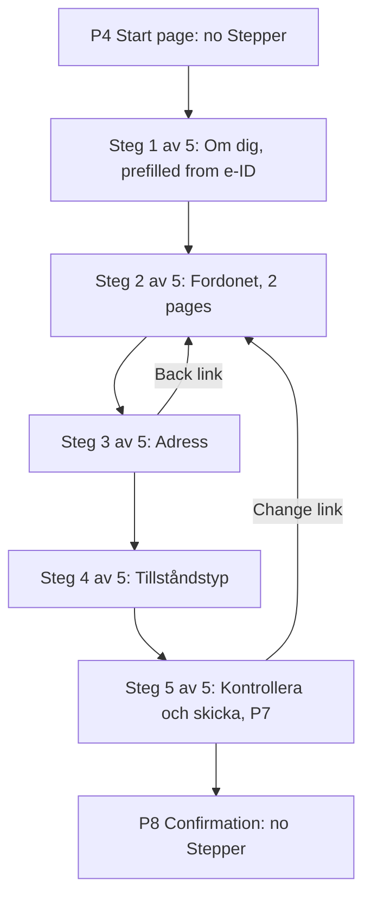

# Design spec: Stepper (narrowed to a text step indicator)

- **Status:** Approved 2026-10-06 (maintainer: the name `Stepper`; its own element under the page heading; Check answers counts as the last step)
- **Designer:** ux-designer agent · **Date:** 2026-10-06
- **Plan:** to be written (S4 of [0053](../plans/0053-docs-as-municipality-site.md); B20 in [municipality-reference-site.md](municipality-reference-site.md))
- **Type:** component default styling (one text part) + flow annotations

## 1. Brief

- **Users:** residents. Hardest case: a screen reader user on a phone, in their second language, three pages into an application, who wants to know how much is left before deciding to finish now or later.
- **Job:** When I move to the next page of an e-service form, I want to know where I am and how much is left, so I can decide whether to go on and trust that it ends.
- **Context:** once a year, phone first, often stressed (deadlines, money, children). One question per page (T4 Transaction template).
- **Constraints:** WAD (WCAG 2.2 AA), no data. Answers are kept by the form, not by this part (3.3.7).
- **Success:** after any step, the user can say "step 3 of 5" (asked in testing); SR users find the step right after the question without searching; no one uses it as navigation.
- **Evidence:** none of our own. Prior art below.
- **Assumptions and research questions:**
  - Assumption: the step is orientation, not task content, so one reading stop after the question is enough → RQ: do SR users notice it there, or miss it when they Tab straight to the field?
  - Assumption: residents read a step as a section that may span pages → RQ: does "Steg 2 av 5" on two pages in a row confuse?

## 2. Prior art

| Source                                                                                 | What we reuse                                                                                                                                                  | What we change and why                                                                                       |
| -------------------------------------------------------------------------------------- | -------------------------------------------------------------------------------------------------------------------------------------------------------------- | ------------------------------------------------------------------------------------------------------------ |
| `kv-steps` ([prose-content-types.md](prose-content-types.md) §6.4)                     | nothing, by rule: they share no markup, class, token or string                                                                                                 | –                                                                                                            |
| Progress ([status-patterns.md](status-patterns.md))                                    | nothing: Progress is for waiting                                                                                                                               | no bar, no `progressbar`, no percent                                                                         |
| ErrorSummary, `useRouteFocus`, Heading, Stack                                          | focus moves on submit and on step change; `Stack gap="2"` for the heading pair                                                                                 | the Stepper adds no focus move and no announcement                                                           |
| APG                                                                                    | no pattern: static text, native semantics only                                                                                                                 | –                                                                                                            |
| GOV.UK [Question pages](https://design-system.service.gov.uk/patterns/question-pages/) | test without one first; show the total only "if you can do so reliably"; avoid indicators that list all steps and link to past ones; a Back link on every page | –                                                                                                            |
| GOV.UK [Headings](https://design-system.service.gov.uk/styles/headings/)               | a short caption tied to the page heading                                                                                                                       | ours sits **under** the heading (maintainer decision): the question is seen and heard first, the step second |
| USWDS [Step indicator](https://designsystem.digital.gov/components/step-indicator/)    | the "Step 3 of 5" text with the section name; segments are never links; navigation is separate                                                                 | no segment bar or `aria-current` list: at 320px it competes with the question, and the text carries it all   |

## 3. Flow

Reference flow (parking permit, P4–P8). A step is a **section**, which may span pages, so the total never changes when an answer adds a page. Check answers is the last counted step (accepted).



| Path                               | Stepper                                 | Focus and what is heard (approximation, AT `pending`)                                            |
| ---------------------------------- | --------------------------------------- | ------------------------------------------------------------------------------------------------ |
| Next step (client navigation)      | new step                                | `useRouteFocus` → `h1`: "Var bor du?, heading level 1". Next reading stop: "Steg 3 av 5: Adress" |
| Submit with errors                 | unchanged                               | ErrorSummary gets focus; reading on: `h1`, then the Stepper                                      |
| Back link (B19, previous URL)      | previous step, answers kept (3.3.7)     | as Next: the key changes, so `useRouteFocus` moves to the `h1`                                   |
| Browser Back                       | previous step                           | `useRouteFocus` leaves focus to the browser (its rule); reading order is unchanged               |
| Full page load (no SPA)            | as rendered                             | SR reads `<title>`; H or 1 reaches the `h1`, the Stepper follows it                              |
| Change from Check answers          | the step of that answer ("Steg 2 av 5") | as Next; returning to Check answers is the flow's job (out of scope)                             |
| Branching changes the page count   | unchanged, because it counts sections   | if even sections can't be counted reliably, **leave the Stepper out**; never "Steg 3 av ?"       |
| Save and return later, timeout     | the step resumed                        | owned by the flow and the Dialog spec                                                            |
| Not eligible, integration failed   | none: an exit page is not a step        | the exit page's `h1`                                                                             |
| Start, Confirmation, one-page form | none                                    | –                                                                                                |

## 4. Content

Library keys (all 6 locales; messages are functions with `format.number`, like `pagination.status`):

| i18n key                 | en                                | sv                                | fi                              | nb / nn                           | se                                           |
| ------------------------ | --------------------------------- | --------------------------------- | ------------------------------- | --------------------------------- | -------------------------------------------- |
| `stepper.status`         | Step {current} of {total}         | Steg {current} av {total}         | Vaihe {current}/{total}         | Steg {current} av {total}         | English placeholder, native review `pending` |
| `stepper.statusWithName` | Step {current} of {total}: {name} | Steg {current} av {total}: {name} | Vaihe {current}/{total}: {name} | Steg {current} av {total}: {name} | English placeholder, native review `pending` |

- fi uses `{current}/{total}` to avoid case endings on the numbers. fi, nb, nn are drafts for native review (`pending`).
- The colon is in the message, so each locale owns its punctuation.
- `name` is the section name, short and in plain words. Reference copy (S4, sv/en): Om dig / About you; Fordonet / Your vehicle; Adress / Address; Tillståndstyp / Permit type; Kontrollera och skicka / Check and send. Length check, fi: "Vaihe 4/5: Pysäköintitunnuksen tyyppi" wraps at 320px and must not truncate.
- No string for "completed", "current" or "remaining": there is no list.

## 5. Structure

Same at 320px, 40rem and 64rem: T4, one column, `Container size="form"` (40rem). No sidebar.

```
[banner] skip link · brand · service name · language · Kontakta oss
[main]
  Back link "Tillbaka"                                  (B19)
  [ErrorSummary, only after a submit with errors]
  ┌ Stack gap="2" (one item of the form's Stack)
  │ h1 "Vilket fordon gäller ansökan?"
  └ p.kv-stepper "Steg 2 av 5: Fordonet"                (directly after the h1, a sibling)
  Field(s)
  [primary] Fortsätt
  link Spara och fortsätt senare
[contentinfo]
```

- **Label or legend as the heading** (form-fields.md §6.2): the Stepper is the next element after the `h1`, outside the `label` and outside the `legend`, so it never enters the control's or the group's name. It comes before the description and the control, and is never in `aria-describedby`.
- The reference spec's T4 order (step caption → `h1`) becomes `h1` → Stepper (task 5).

## 6. Visual specification

| Part          | Tokens / style (DESIGN.md)                                                                                                                                                                       | Density                                          | Notes                                                                    |
| ------------- | ------------------------------------------------------------------------------------------------------------------------------------------------------------------------------------------------ | ------------------------------------------------ | ------------------------------------------------------------------------ |
| `.kv-stepper` | `--kv-font-family-body`; `--kv-font-body-size`, `-weight` (400), `-line-height`, `-letter-spacing`; `--kv-font-numeric-feature-settings`; colour `--kv-color-text`; `margin: 0`; `hyphens: auto` | same in compact (it's text, not a control label) | no outer margin: the layout owns rhythm (`Stack gap="2"`, the field gap) |

- `space-2` under the heading groups the two by proximity; the form's own gap (`space-6`) then separates the pair from the fields.
- Hierarchy comes from size, family and weight (16px sans 400 under a serif `heading-1`), never from colour. `text`, not `text-muted`: it is content (DESIGN.md "Don't use `text-muted`…").
- No dots, bar, segments, icon, badge, border or fill. No box, so no forced-colours border is needed.

### States

Static text. Only **default** applies; hover, focus-visible, active, disabled, invalid, loading, selected and empty are N/A (not interactive, not a Tab stop). An invalid page doesn't change it.

### Modes

- **Dark, light-contrast, dark-contrast:** `text` on `canvas` (and `surface`/`surface-raised`): already measured pairs (4.5:1, 7:1 in contrast themes).
- **Forced colours:** `CanvasText`; nothing is carried by colour.
- **RTL:** no physical property; the message owns word order.
- **Motion:** none.
- **320px, 400% zoom, 1.4.12:** wraps, never `nowrap`, never truncated, no fixed height; long Finnish and Sámi names hyphenate or break. Sizes in `rem`.

### New or changed tokens

None. No new colour pair. One new class, `kv-stepper`, for the class contract (DESIGN.md text needs maintainer approval, task 3).

## 7. Accessibility annotations (draft for `stepper.a11y.md`)

**Decisions**

1. **One line of text, not a list.** No `ol`, no `aria-current="step"`, no links: a list of all steps puts 5–8 reading stops before the fields, GOV.UK advises against it, and in a branching flow a link to a past step lets a user jump past later steps that depend on the answer they change. Going back is the Back link (B19) and Check answers' Change links (SummaryList).
2. **Its own element, directly after the heading.** `useRouteFocus` focuses the `h1`; the Stepper is the **next item in reading order** (1.3.2): one Down arrow (NVDA, JAWS browse mode) or one swipe (VoiceOver, TalkBack) after the question, and it is read by "say all".
3. **No extra cue.** Weighed and rejected:
   - A live region on step change: the new page is content reached by navigation and carried by focus, so it is not a status message (4.1.3 doesn't apply). It would also queue behind or interrupt the `h1` and be read twice when the user reads on.
   - `aria-describedby` from the `h1`: descriptions on a static heading are read inconsistently (assumption, AT `pending`), and in browse mode the text would be read twice.
   - Visually hidden text in the `h1`: the maintainer chose a separate element; it would also lengthen every heading in the heading list.
   - Why none is needed: the step is orientation, not information needed to answer the question (sighted users also see the question first), and it is one stop away. The usability test checks this (§8). An adopter may put the hook's `text` in `<title>`; that's optional and not part of the component.
4. **Default element `p`:** a paragraph of its own, valid after a heading in any flow content, including inside a `fieldset` after its `legend`.

| Topic               | Contract                                                                                                                                                                                                                                                       |
| ------------------- | -------------------------------------------------------------------------------------------------------------------------------------------------------------------------------------------------------------------------------------------------------------- |
| Element and role    | `<p class="kv-stepper">`; no role, no ARIA, no `data-*` (no state). `as` may change the element                                                                                                                                                                |
| Name                | none; plain text in reading order                                                                                                                                                                                                                              |
| Placement           | the next sibling after the page heading; never inside a heading, `label` or `legend`                                                                                                                                                                           |
| Keyboard            | "This component has no focusable parts and handles no keys." One Tab row proves Tab passes over it (back link → first field)                                                                                                                                   |
| Focus moves         | none of its own. Next, Back link, Change: `useRouteFocus` → `h1`. Submit with errors: ErrorSummary                                                                                                                                                             |
| Announcements       | none. `readAloud` of a T4 page: the phrase after "heading, level 1, Which vehicle is the permit for?" is "Step 2 of 5: Your vehicle"                                                                                                                           |
| Messages            | `stepper.status`, `stepper.statusWithName`; per provider and per instance (`messages` prop)                                                                                                                                                                    |
| Dev warnings (once) | `current` or `total` not a positive integer, or `current > total`; rendered inside an `h1`–`h6`, `label` or `legend` (it would join that name)                                                                                                                 |
| SCs                 | 1.3.1, 1.3.2 (next in reading order), 1.4.1 (no dots alone), 1.4.3, 1.4.4, 1.4.10, 1.4.12, 2.4.3 (via `useRouteFocus`), 3.2.3 (same place each step), 3.3.7 (the flow keeps answers), 4.1.3 (not a status message). Supports 2.4.8 Location (AAA): not claimed |

**Public API (smallest):** a hook and one component, shaped like Badge.

- `useStepper({ current, total, name?, messages? })` → `{ text, element, rootProps }`. `text` lets an adopter reuse the same words, for example in `<title>`.
- `<Stepper current={2} total={5} name="Fordonet" />`: `current`, `total`, `name?: string`, `messages?`, `render?`, `ref`, HTML attributes. No `children`: the text is the message. Exports `UseStepperOptions`, `UseStepperResult`, `StepperProps`. The Docs page says it is a position, not navigation.

## 8. Validation

- [x] Self-review against `review-checklist.md`: unhappy paths in §3, no colour-only signal, no new token, no Tab stop, i18n keys for every string, no claims. No open blocker.
- [x] Contrast: no new colour pair.
- [ ] Usability test plan written. Result: `pending`. AT matrix: `pending`.

### Usability test plan (`pending`)

- **Participants:** 6–8 residents: NVDA + Firefox, VoiceOver iOS, a magnifier user at 400%, a cognitive disability, low digital confidence, two second-language readers of Swedish, one Finnish reader.
- **Tasks:** apply for the reference parking permit; after step 3, "How much is left?"; go back and change the vehicle; recover from an error on step 4.
- **Measure:** correct answer to "how much is left"; whether SR users found the step after the question unprompted (and whether Tab users missed it); any attempt to click it; in label-as-heading pages, whether anyone took the step for a hint; completion.

### Stories (`apps/storybook/src/components/stepper/`)

| Story             | Shows                                                                                        |
| ----------------- | -------------------------------------------------------------------------------------------- |
| Default           | under an `h1`, "Step 2 of 5"                                                                 |
| WithName          | `name`, "Step 2 of 5: Your vehicle"                                                          |
| LabelAsHeading    | after `<h1>` around a `Field.Label --heading`, before the TextInput                          |
| LegendAsHeading   | after a `Fieldset.Legend --heading`, inside the fieldset, before a RadioGroup                |
| WizardPage        | T4: back link, ErrorSummary (invalid), `Stack gap="2"` with `h1` and Stepper, field, primary |
| LongFinnish       | `fi` provider, long section name, at 320px                                                   |
| Overrides         | provider messages and the per-instance `messages` prop                                       |
| RTL, ForcedColors | the required mode stories                                                                    |

No `Keyboard` story: no focusable part. The four theme projects run every story.

### Task split for the plan

1. **i18n:** `stepper.status` and `stepper.statusWithName` in `types.ts` and 6 locales (se placeholder, noted in the file's comment); `vp run i18n:check`.
2. **react:** `packages/react/src/stepper/`: `use-stepper.ts`, `stepper.tsx`, export, `stepper.a11y.md` (from §7), `stepper.md`; `stepper.test.tsx`: text for each message and `format.number`, both overrides, no role, ARIA or `tabindex`, Tab passes over, the Stepper is the reading stop after the heading (`readAloud`), not in a label's or legend's name, each dev warning, `as`.
3. **theme:** `.kv-stepper` per §6; DESIGN.md: the Patterns "Step indicator" line becomes a Components "Stepper" entry, the class goes into the class contract, the spec into the index (maintainer approval).
4. **storybook:** the stories above.
5. **docs:** a Stepper page; amend [municipality-reference-site.md](municipality-reference-site.md) (B20, the §5 Stepper note: under the `h1`, no `aria-describedby`; T4 order `h1` → Stepper) and the "Stepper / step indicator" row in [prose-content-types.md](prose-content-types.md) §6.4 ("under the question `h1`"); the roadmap row keeps the name Stepper, status updated; changeset (`@kvirn-ui/react`, `@kvirn-ui/i18n`, `@kvirn-ui/theme` minor).

## 9. Open questions

1. **Label or legend as heading:** the Stepper sits between the question and the control. If testing shows people read it as a hint, move it before the `Field` on those pages? (Research, not a blocker.)
2. **Out of scope, later:** a task list ("3 av 5 delar klara") for long, non-linear applications is a separate pattern, as the reference spec says.
