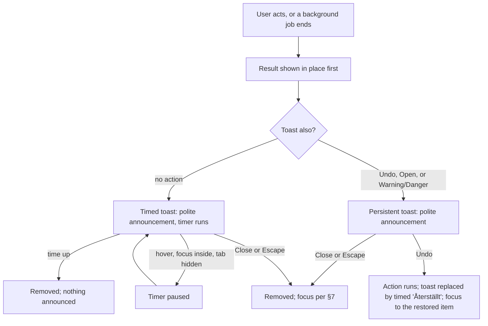

# Design spec: Toast

- **Status:** Draft · **Designer:** ux-designer agent · **Date:** 2026-10-06
- **Plan:** to be written (roadmap M3: "Needs a decision on duration and persistence (2.2.1) before it is built"). Not needed by the reference site ([municipality-reference-site.md](municipality-reference-site.md))
- **Type:** component default styling (`kv-toast`, `kv-toast-region`) and behaviour rules. Reuses the Alert look ([alert.md](alert.md) §6.3, D9)

## 1. Brief

- **Users:** both, mostly staff. A resident meets a toast rarely ("Länken har kopierats"); a staff user dozens of times a day ("Ändringarna är sparade").
- **Hardest case:** a low-vision staff user with a screen magnifier at 400% (320 × ~200 CSS px in view) and speech on, who saves a setting and is looking at the switch, not at the corner where the toast appears. Then: an NVDA user who must reach an Undo; a resident with a cognitive disability reading Swedish as a second language; a Windows Contrast Themes user.
- **Job:** _When I've done something that worked, I want a quiet sign that it worked, without losing my place, so I can carry on._
- **Constraints:** no APG pattern; the Announcer (polite `<output>`); Alert tokens and status words only; six locales; no new colour.
- **Success:** 0 axe violations in every story and theme; in the usability test (`pending`) every participant can say whether their change was saved **without** the toast, and every one who wants to can Undo.
- **Evidence:** none from our users. **Assumptions** → RQs:
  - Adopters will build toasts anyway; a guarded one is safer than a homemade one (Roselli found none in the wild that would pass an audit). → RQ: do adopters in the reference group ask for one?
  - Magnifier users miss timed toasts. → RQ: in task 1, do they see it at all, and does it matter when the result shows in place?

### Does a toast belong in a Nordic public-sector library?

**Yes, narrowly, as a secondary channel.** Never the only place a result lives, never an error to fix, never a required action. Scottish Government advises against toasts (they "might disappear before the user notices"); GOV.UK, Designsystemet and Aksel ship none. We agree for residents: **the default answer is an inline status or an Alert.** We ship Toast so staff tools get one that obeys these rules, and the docs page opens with the decision table below.

| What happened                                                                | Use                                                                                                 | Not a toast because            |
| ---------------------------------------------------------------------------- | --------------------------------------------------------------------------------------------------- | ------------------------------ |
| A setting saved, a link copied, a draft auto-saved, a background export done | **Toast** (Success or Info), plus the result in place (the switch's state, CopyButton's "Kopierat") | –                              |
| An error the user must fix, a failed submit                                  | `Field.ErrorMessage` + error summary                                                                | 2.2.1, 3.3.1: it must stay     |
| The outcome of a submit, a deadline, an outage                               | `Alert` in the content, or a confirmation page                                                      | It's needed to finish the task |
| A decision the user must make (timeout, delete)                              | `AlertDialog`                                                                                       | Needs a response and focus     |
| A state already visible at the control (Switch, Toggle)                      | Nothing (`switch.md` §3)                                                                            | Repeats what's in view         |

## 2. Prior art

| Source                                                                                                             | Reuse                                                                                                               | Change and why                                                   |
| ------------------------------------------------------------------------------------------------------------------ | ------------------------------------------------------------------------------------------------------------------- | ---------------------------------------------------------------- |
| KvirnUI Alert (`alert.md` §6.3, §7.2, §7.5)                                                                        | The look, status classes, icons, status words, `kv-alert-close`, announce through the Announcer, no role on the box | Floats: level 3 shadow and a hairline. Never focus-moved         |
| [Scottish Gov. DS: modals and toasts](https://designsystem.gov.scot/components/notification-message/modals-toasts) | The risk list; persistent alternatives first                                                                        | We allow a toast only as a duplicate of a visible result         |
| [Roselli, Defining "Toast" Messages](https://adrianroselli.com/2020/01/defining-toast-messages.html)               | No auto-dismiss for actions; `status`, not `alert`; don't move focus                                                | –                                                                |
| APG [Alert](https://www.w3.org/WAI/ARIA/apg/patterns/alert/), WCAG 2.2.1 / 2.2.2 / 4.1.3 Understanding             | Live region exists before the text; alerts shouldn't vanish on their own                                            | We treat auto-dismiss as a time limit (the conservative reading) |
| CopyButton (`copy-button.md`)                                                                                      | The in-place status that makes a "copied" toast unnecessary in most cases                                           | –                                                                |

## 3. Flow



- **Queue:** up to 10 toasts stack (default limit 10); beyond it the oldest timed toast is evicted first, and when none can be (all persistent, or the user is on one) a new toast is ignored, with no queue (a toast is a second channel, never the only copy, so ignoring is safe). A new toast with the same `id` replaces the old one, restarts its timer and announces again (ten saves = one toast).
- **Modal open:** toasts are held until it closes; a dialog shows its own status inline (`dialog.md` §7).
- **Failed submit:** no toast; clear timed toasts so nothing competes with the error summary.
- **Page navigation:** timed toasts are cleared; persistent ones stay until their action is no longer possible (the consumer removes them).
- **Job in progress** ("Exporterar…"): a persistent Info, replaced by the result, never a spinner alone.

## 4. Content

Component keys (all six locales). Status words and the close name **reuse** `alert.*Prefix` and `alert.close` (one translation, overridable per provider and instance).

| Key                                             | en                  | sv                | fi (longest)       |
| ----------------------------------------------- | ------------------- | ----------------- | ------------------ |
| `toast.regionLabel` (new)                       | Notifications       | Meddelanden       | Ilmoitukset        |
| `alert.successPrefix` … `dangerPrefix` (reused) | Success: / Error: … | Klart: / Fel: …   | Valmis: / Virhe: … |
| `alert.close` (reused)                          | Close message       | Stäng meddelandet | Sulje ilmoitus     |

Example strings (app keys, not the component's):

| Key                       | Status           | en                                                        | sv                                                            | fi                                                                      |
| ------------------------- | ---------------- | --------------------------------------------------------- | ------------------------------------------------------------- | ----------------------------------------------------------------------- |
| `settings.saved`          | Success          | Notification settings saved.                              | Aviseringsinställningarna är sparade.                         | Ilmoitusasetukset on tallennettu.                                       |
| `link.copied`             | Success          | Link copied.                                              | Länken har kopierats.                                         | Linkki on kopioitu.                                                     |
| `draft.deleted` / `.undo` | Success + action | Draft deleted. / Undo                                     | Utkastet har tagits bort. / Ångra                             | Luonnos on poistettu. / Kumoa                                           |
| `report.ready` / `.open`  | Info + action    | Your report is ready. / Open report                       | Din rapport är klar. / Öppna rapporten                        | Raporttisi on valmis. / Avaa raportti                                   |
| `sync.offline`            | Warning          | You're offline. Changes are kept on this device.          | Du är offline. Ändringarna sparas på den här enheten.         | Olet offline-tilassa. Muutokset säilyvät tällä laitteella.              |
| `list.refreshFailed`      | Danger           | We couldn't update the list. We'll try again in a minute. | Vi kunde inte uppdatera listan. Vi försöker igen om en minut. | Emme voineet päivittää luetteloa. Yritämme uudelleen minuutin kuluttua. |

**Rules:** one sentence, ≤ 80 characters where possible; past tense or perfect ("är sparade", "har kopierats"), naming the thing; no title + body, no headings; no "OK", "Stäng" as an action, no "Lyckades!", no exclamation marks; at most **one** action, a verb ("Ångra", "Öppna rapporten"); a Danger toast says what we'll do, never what the user must fix. `{n}` and dates via `Intl`.

## 5. Structure

```
<section class="kv-toast-region" aria-label={toast.regionLabel} popover="manual" [hidden when empty]>
  <ul role="list">                                   oldest first = reading order = visual order
    <li><div class="kv-alert kv-alert--success kv-toast">
          [icon]  <p class="kv-alert-title">[Klart:] Utkastet har tagits bort.</p>   [×]
                  <div class="kv-alert-actions">[Ångra]</div>
```

| Viewport               | Placement and limits                                                                                                                                                    |
| ---------------------- | ----------------------------------------------------------------------------------------------------------------------------------------------------------------------- |
| < 40rem, and 400% zoom | Full width minus `space-3` each side, at block-end. Up to 10 stacked, the region scrolls beyond 50dvh. Actions stay inline (one button)                                 |
| ≥ 40rem                | Inline-end, block-end, `space-4` from the edges. `inline-size: min(100% - 2 × space-4, 24rem)` (T1). Up to 10 stacked, `space-2` apart, the region scrolls beyond 50dvh |
| ≥ 64rem `kv-compact`   | As above, Alert compact padding; Close and buttons 32px                                                                                                                 |

- **Safe area:** each inset is `max(<space>, env(safe-area-inset-*))`, both inline sides, so notches and home bars never cover it.
- **Top layer** (`popover="manual"`): above sticky headers without a z-index token.
- **Never over focus (2.4.11):** if the focused element's box intersects the region, the region moves to block-start, below `--kv-toast-offset-block-start` (T2, the consumer's sticky header height). An error summary sits at the top of `main` and is never shown with a toast (§3).
- **Height:** no fixed height; the region is at most half the viewport tall (50dvh) and scrolls (visible scrollbar, keyboard-reachable only while it overflows) so text spacing and 400% zoom never cut a toast off. RTL: logical properties, so inline-end is the left.

## 6. Visual specification

| Part                                         | Tokens and style                                                                                                                                                                                                                                             |
| -------------------------------------------- | ------------------------------------------------------------------------------------------------------------------------------------------------------------------------------------------------------------------------------------------------------------ |
| Toast `kv-alert kv-alert--<status> kv-toast` | The Alert root unchanged (background, 4px bar, `sm` radius, padding, icon, hidden status word, `text`), plus level 3: `--kv-shadow-popup` (light only) and `border-subtle` on the three non-bar sides (decorative). `overflow-wrap: break-word`, hyphenation |
| Title                                        | Always a `<p>` (`alert.md` §7.1: one sentence needs no heading)                                                                                                                                                                                              |
| Actions                                      | `kv-alert-actions`; one secondary `kv-button` (Undo) or a `kv-link` (Open report)                                                                                                                                                                            |
| Close                                        | `kv-alert-close`: quiet icon button, decorative `close` icon, 44px square (32px compact, never < 24px), hover `surface-raised` fill                                                                                                                          |
| Region                                       | Transparent, no border, no padding; `space-2` gap                                                                                                                                                                                                            |

### States and variants

| Variant                                  | Timer             | Actions | Close | Announce |
| ---------------------------------------- | ----------------- | ------- | ----- | -------- |
| `Toast.Success`, `Toast.Info`, no action | **Timed** (below) | –       | yes   | polite   |
| Any with an action (Undo, Open)          | **None**          | 1       | yes   | polite   |
| `Toast.Warning`, `Toast.Danger`          | **None**          | 0–1     | yes   | polite   |

**Timer:** `max(10 s, 100 ms × characters)` (about 100 words a minute). Counts only while shown, the page visible, the window focused, the pointer not over the region and focus not inside it. Resumes with the remaining time, at least 5 s. No visible countdown or progress bar. **2.2.1:** a provider setting `toastDuration` scales it ×1–×10 or `'never'`; services expose it as a user setting ("Låt meddelanden stå kvar tills jag stänger dem"). Swipe-to-dismiss: none.

| Part   | Default              | Hover                   | Focus-visible                | Active  | Disabled | Paused           |
| ------ | -------------------- | ----------------------- | ---------------------------- | ------- | -------- | ---------------- |
| Toast  | §6                   | none (pauses the timer) | – (never focused itself)     | –       | –        | No visual change |
| Close  | §6                   | `surface-raised` fill   | 2px `focus-ring`, 2px offset | no fill | –        | –                |
| Action | Button / Link states | Button                  | Button ring                  | Button  | Busy: Q4 | –                |

### Modes

- **Contrast (existing Alert pairs, `alert.md` §6.6, light / dark / light-contrast / dark-contrast, lowest status):** `text` on `-subtle` 16.80 / 14.66 / 18.41 / 15.59; bar and icon on own `-subtle` 4.15 / 3.32 / 7.31 / 8.33; bar on the page 4.42 / 3.75 / 7.73 / 9.40; `focus-ring` on `-subtle` 4.15 / 5.44 / 8.72 / 8.33; `secondary` (Undo edge) 4.39 / **3.13** / 9.58 / 10.68; Close hover `text` on `surface-raised` 19.05 / 16.55 / 20.86 / 17.61. All in `theme:check` already. Over images the bar's inner pair still holds, so the toast is always findable.
- **Dark and contrast themes:** no shadow; the hairline and the bar carry the edge.
- **Forced colours:** the Alert rule: `Canvas`, `CanvasText`, a 1px `CanvasText` edge on all four sides with the 4px bar kept; icon shape and the status word carry status. Close and buttons follow Button. No `forced-color-adjust: none`.
- **Motion:** under `no-preference` only: in, fade + `space-2` from block-end over `--kv-duration-medium`; out, fade over `--kv-duration-fast`; neighbours jump, never slide. Under `reduce`: instant.
- **320px, 400%, 1.4.12:** stacked, full width, no fixed sizes. The magnifier user (hardest case) likely won't see it: they keep the result in place, the speech hears the announcement, the timer pauses only if the pointer reaches it, and `'never'` exists for them.

### New tokens (maintainer decisions, not added)

| Token                                       | Value                                                       | Contrast   |
| ------------------------------------------- | ----------------------------------------------------------- | ---------- |
| T1 `--kv-toast-inline-size`                 | `24rem` (the Columns `lg` constant)                         | n/a (size) |
| T2 `--kv-toast-offset-block-start` / `-end` | `space-4`; the consumer adds sticky header or footer height | n/a (size) |

## 7. Accessibility annotations

Draft input for `toast.a11y.md`.

- **Roles:** the region is a `section` named by `toast.regionLabel` (a `region` landmark, rendered only with toasts in it); a `ul role="list"`; each toast a generic `div` with **no** `role`, `aria-live` or `aria-atomic` (as Alert). Icon decorative; status word first in the text.
- **Announcement (4.1.3):** on **show**, once, through `useAnnouncer()` **polite** (`<output>`, role `status`), text = status word + message (the action is not read; it's a control). **Never assertive**: anything that needs it isn't a toast. Never duplicated: the toast takes no focus, and the region is not a live region. Removal announces nothing.
- **Focus:** never moves on show (no magnifier pan, no lost place, 3.2.2). Action and Close get `aria-describedby` → the message, so on focus they read "Ångra, knapp, Utkastet har tagits bort".
- **Tab stops:** in DOM order, per toast: [Action] → [Close]. The region sits at the end of the provider's DOM, after the page.
- **Keys:** Tab / Shift+Tab move; Enter / Space press; **Escape** with focus inside a toast closes it. No other key (a jump-to-region hotkey is Q1).
- **Focus on close:** the next toast's first control → the previous toast's → the element focused before entering the region → the consumer's fallback (`h1`, `tabIndex={-1}`). Never `body`. After Undo: the restored item.
- **Targets:** 44px (2.5.5), 24px floor in compact (2.5.8).
- **Never the only place:** an action in a toast is a shortcut; Undo also exists elsewhere (the item's restore, a "Borttagna" list), so 2.1.1 doesn't depend on reaching the region.
- **WCAG SCs:** 1.3.1, 1.4.1, 1.4.3, 1.4.10, 1.4.11, 1.4.12, 2.1.1, 2.2.1, 2.2.2, 2.4.3, 2.4.11, 2.5.3, 2.5.8, 3.2.2, 4.1.2, 4.1.3.

## 8. Validation

- [x] Self-review against `review-checklist.md`: no open blocker. Every string keyed; status never colour alone; 320px, 400% and safe area covered.
- [x] No new colour pair; T1, T2 are sizes.
- [x] Usability test plan written. Result: `pending`. AT matrix: `pending`.

**Usability test plan (`pending`).** Participants: NVDA, JAWS, VoiceOver (macOS, iOS) and TalkBack users; ZoomText or Windows Magnifier at 400%; a Contrast Themes user; two second-language Swedish readers; two residents with low digital confidence; four staff. Tasks: 1. Change a notification setting, then say whether it saved. 2. Copy a link and paste it. 3. Delete a draft, then undo it, by keyboard. 4. Start an export, keep working, open the report. 5. Save the same field five times quickly. Measure: whether the result is known without the toast; Undo success and time; missed or doubled announcements; annoyance at repeats; whether anyone finds the duration setting.

## 9. Open questions

1. **(maintainer, keyboard skill)** A hotkey to jump to the region (F6 or F8, as Radix), announced in a hint key? Without it, keyboard users reach an Undo only by Tab past the page, which is why the "also elsewhere" rule is required.
2. **(maintainer)** T1 and T2, and a DESIGN.md Overlays bullet for Toast plus the index row.
3. Does the reference site's user settings page expose `toastDuration`, or is a provider default (×1) with `'never'` per app enough for 2.2.1?
4. Busy action (Undo waiting for the server): same as `dialog.md` Q2.
5. On-screen keyboard: a block-end toast can sit behind it on iOS. Use `visualViewport` to lift it, or move to block-start while a text field has focus?
6. Should Toast ship at all before an adopter asks (roadmap: the reference site doesn't need it)?
