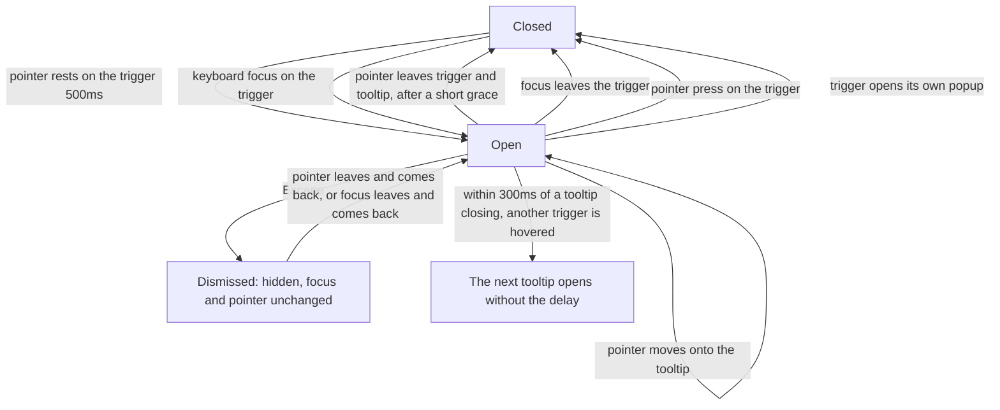

# Design spec: Tooltip

- **Status:** Accepted (the maintainer, 2026-10-04)
- **Designer:** ux-designer agent · **Date:** 2026-10-04
- **Plan:** Plan 0037. First user: the RichTextEditor's toolbar ([rich-text-editor.md](rich-text-editor.md) §6.5.5, Plan 0036)
- **Type:** component default styling (`kv-tooltip`) and behaviour rules

## 1. Brief

- **Users:** both. Mostly staff, in the editor's toolbar and other icon buttons, and residents who meet an icon-only button.
- **Hardest-case users:**
  1. A **magnifier user at 400%**, who sees a small part of the screen. The tooltip must stay while she moves the pointer onto it to read it, must not cover the button she's on, and must go away with Escape when it covers what she's reading (1.4.13).
  2. A **keyboard user** arrowing along a toolbar. Each button's tooltip must show at once on focus, without waiting for a hover delay, and the next one must replace it without flicker.
  3. A **screen-reader user**, who must hear the button's name once, not "Fetstil … Fetstil", and learn the shortcut.
  4. A **touch user**, who has no hover. Nothing they need may be only in a tooltip.
  5. A **Windows Contrast Themes** user, who must see the tooltip's edge with no shadow.
- **Job to be done:** _When I see an icon I don't recognise, I want to find out what it does, and its shortcut, without pressing it, so I can act with confidence._
- **Context:** a passing glance, many times a day for staff; once, and possibly confused, for a resident.
- **Constraints:**
  - The APG Tooltip pattern (still marked work in progress) and WCAG 1.4.13 Content on Hover or Focus.
  - DESIGN.md: never put essential information in tooltips. Icon-only buttons in a formatting toolbar are allowed with tooltips (decided 2026-10-04).
  - No `title` attribute anywhere (decided 2026-10-04): it isn't shown on keyboard focus or touch, can't be hovered or dismissed, and is announced twice next to `aria-label`.
  - Existing tokens only. No new colour, size or radius.
- **Success criteria:**
  - 0 axe violations in every story state, in the four themes, RTL and forced colours.
  - e2e tests prove the three 1.4.13 conditions (dismissable, hoverable, persistent) and Escape with a Popover open underneath.
  - In the AT matrix (`pending`): NVDA, JAWS and VoiceOver read an icon-only button's name once.
- **Evidence:** none from our own users.
- **Assumptions and research questions:**
  - Assumption: showing the tooltip at once on keyboard focus helps keyboard users more than it distracts them. → RQ: do keyboard participants read the tooltips as they arrow along a toolbar, or find them noisy?
  - Assumption: a 500ms hover delay is long enough not to flash tooltips at a pointer passing over, and short enough not to feel slow. → RQ: do pointer participants wait for it, or give up?
  - Assumption: hiding the repeated name from AT and describing the shortcut is what screen-reader users want. → RQ: do they find the shortcut useful, and is anything read twice?

## 2. Prior art

| Source                                                                                                      | What we reuse                                                                                                                                               | What we change and why                                                                                                                                                                   |
| ----------------------------------------------------------------------------------------------------------- | ----------------------------------------------------------------------------------------------------------------------------------------------------------- | ---------------------------------------------------------------------------------------------------------------------------------------------------------------------------------------- |
| APG [Tooltip pattern](https://www.w3.org/WAI/ARIA/apg/patterns/tooltip/)                                    | `role="tooltip"`, shown on focus and hover, Escape hides it, focus stays on the trigger, never focusable, the trigger references it with `aria-describedby` | When the tooltip repeats the trigger's name (an icon-only button), that part is hidden from AT and only the rest (the shortcut) is the description, so the name is never read twice (§7) |
| WCAG 2.2 [Understanding 1.4.13](https://www.w3.org/WAI/WCAG22/Understanding/content-on-hover-or-focus.html) | Dismissable without moving pointer or focus, hoverable, persistent                                                                                          | –                                                                                                                                                                                        |
| GOV.UK Design System                                                                                        | Has no tooltip component: help is visible text (a hint, Details)                                                                                            | We agree for content. A tooltip here only names a control and its shortcut, and the trigger is complete without it                                                                       |
| KvirnUI Listbox and Popover popups (`combobox.md`)                                                          | The native `popover` top layer, `computePlacement` and flipping, the 4px gap to the anchor, the level 3 surface, the dismissable layer stack for Escape     | `popover="manual"`, so a tooltip never light-dismisses an open Popover. Smaller padding and the `md` radius, because it's one line (§6)                                                  |
| KvirnUI Kbd (`kbd.md`)                                                                                      | Keys in a shortcut are `kv-kbd`, grouped, with the `+` between them                                                                                         | –                                                                                                                                                                                        |

## 3. Flow



- **Unhappy paths:**
  - The trigger is natively `disabled`: no pointer events and no focus, so no tooltip. Use `aria-disabled` (toolbar items always do) if the name must stay discoverable.
  - Touch: no tooltip. The trigger's name, and visible text where it matters (the editor's `labels="icon-and-text"`), carry it.
  - The trigger scrolls out of view: the tooltip hides (it returns with the trigger).
  - The tooltip doesn't fit above: it flips below. At 320px wide and 640 high it never covers its trigger. In a viewport shorter than the tooltip needs (320 by 256, a long text) it can, and Escape hides it: the text is never clipped (decided by the orchestrator, 2026-10-04).

## 4. Content

Tooltip has **no strings of its own**: the consumer passes the text, from their translations.

- **Text and keys only.** A short phrase, ideally one line (under about 60 characters), in plain text, with `Kbd` for keys. **Never interactive content** (links, buttons, inputs), never headings, never images that need a description. Anything a user must act on or read to finish the task belongs in visible text or a Popover. A dev warning catches interactive content (Plan 0037).
- **Never essential.** The trigger has its own accessible name, and the tooltip only shows it, or adds something (a shortcut) that's also documented elsewhere.
- **The name first** (2.5.3): on an icon-only button, the tooltip starts with exactly the button's accessible name, from the same i18n key, so a voice-control user can say what they see.
- **One shortcut**, the platform's usual one, with key names that aren't translated (the Kbd decision): `Ctrl` + `B` on Windows and Linux, `⌘` `B` on macOS (Apple's convention, no plus). Redo shows `Ctrl` + `Y` on Windows and `⇧` `⌘` `Z` on macOS. The editor's platform formatter writes them (Plan 0037).

Example, the editor's Bold button: **Fetstil** `Ctrl` + `B`.

## 5. Structure

```
<button aria-label="Fetstil" aria-pressed="false"
        aria-keyshortcuts="Control+B" aria-describedby="tt-1-shortcut">  (icon)  </button>
<div class="kv-tooltip" role="tooltip" id="tt-1" popover="manual" data-placement="top">
  <span class="kv-tooltip-name" aria-hidden="true">Fetstil</span>
  <span class="kv-tooltip-shortcut" id="tt-1-shortcut">
    <kbd class="kv-kbd"><kbd class="kv-kbd">Ctrl</kbd>+<kbd class="kv-kbd">B</kbd></kbd>
  </span>
</div>
```

- **DOM position:** right after its trigger. It's in the top layer while open, so its DOM position doesn't affect painting. It isn't focusable and has no role a composite would treat as an item, so a toolbar's arrow keys never land on it.
- **Always in the DOM**, hidden while closed (`popover` closed is `display: none`), so `aria-describedby` resolves on focus before it opens. (Plan 0037: render the popup even while closed.)
- **Parts (names for the plan):** `Tooltip.Popup`, and inside it the part that repeats the trigger's name (hidden from AT) and the part that adds information (the description). A popup with only extra information is the description as a whole, as in APG. A popup with only the name adds no `aria-describedby`.
- **Layout inside:** the name and the shortcut on one line, `space-2` (8px) apart, wrapping to two lines when the line is too narrow (`flex-wrap: wrap`).

## 6. Visual specification

| Part                             | Tokens and style                                                                                                                                                                                                                                                               | Notes                                                                                                                                                   |
| -------------------------------- | ------------------------------------------------------------------------------------------------------------------------------------------------------------------------------------------------------------------------------------------------------------------------------ | ------------------------------------------------------------------------------------------------------------------------------------------------------- |
| Popup (`kv-tooltip`)             | Level 3, as every popup: `surface-raised`, 1px `border-subtle` edge, `--kv-shadow-popup` (none in dark), `color: text`. **`md` radius** (8px). Padding `space-1` block (4px), `space-2` inline (8px). `body` type (16px, 1.5), Plex Sans, weight 400, `letter-spacing: normal` | A one-line box with the popups' 16px radius reads as a pill or a tag. `md` is the control radius, so it matches the button it names (§9, Q1)            |
| Size                             | `max-inline-size: min(20rem, 100vw - 2 * var(--kv-space-2))`. No fixed width or height. `overflow-wrap: break-word`, `hyphens: manual`, never truncated or clipped (`overflow: visible`)                                                                                       | At 320px it's at most the viewport less 8px each side                                                                                                   |
| Name (`kv-tooltip-name`)         | `label` type (16px, weight 500), `text`                                                                                                                                                                                                                                        | Weight 500 sets it apart from the keys                                                                                                                  |
| Shortcut (`kv-tooltip-shortcut`) | `kv-kbd` keys, exactly as `kbd.md`: the key at `0.875em` (14px), `surface` fill, `border-control` edge, `sm` radius.                                                                                                                                                           | The tooltip is `body` (16px), not `body-small`, so the keys are 14px. At 14px text they would be 12.25px, and DESIGN.md has no size under 14px (§9, Q2) |
| Gap to the trigger               | `space-1` (4px)                                                                                                                                                                                                                                                                | As the Listbox popup                                                                                                                                    |
| Placement                        | **Block-start (above)**, centred on the trigger. Flips to block-end when there's no room above. Shifts along the inline axis to stay `space-2` inside the viewport. **Doesn't cover its trigger** (2.4.11), except in a viewport shorter than the tooltip needs (320 by 256)   | Above, because in the editor the text the user is working on is below the toolbar, and a tooltip below would cover the first lines                      |
| Arrow                            | None                                                                                                                                                                                                                                                                           | The 4px gap and the centring show what it belongs to. An arrow is one more shape to keep right in forced colours and RTL                                |
| Pointer                          | `pointer-events: auto` (it must be hoverable), default cursor                                                                                                                                                                                                                  | Never `pointer-events: none`: that fails 1.4.13's hoverable condition                                                                                   |

### Timing (behaviour, in core, not tokens)

| Moment                                    | Default                                                               | Why                                                                                                                                 |
| ----------------------------------------- | --------------------------------------------------------------------- | ----------------------------------------------------------------------------------------------------------------------------------- |
| Open on hover                             | after **500ms** of the pointer resting on the trigger                 | A pointer passing over a toolbar doesn't flash tooltips                                                                             |
| Open on keyboard focus (`:focus-visible`) | **at once**                                                           | A keyboard user stopping on a button wants to know what it is. A click doesn't open it (the pointer already did, or didn't need it) |
| Open the next one                         | **at once**, if another tooltip closed less than 300ms ago            | Moving along a toolbar isn't slow (a shared timer, Plan 0037)                                                                       |
| Close when the pointer leaves             | after a **100ms** grace, cancelled if the pointer reaches the tooltip | So the pointer can cross the 4px gap (hoverable)                                                                                    |
| Auto-hide                                 | **never**                                                             | 1.4.13 persistent                                                                                                                   |

The delays are `useTooltip` options (`delay`, `closeDelay`), not theme tokens: they're behaviour, and the theme ships no script.

### The 1.4.13 rules

| Condition       | How                                                                                                                                                                                                                                                                                                                                                                                   |
| --------------- | ------------------------------------------------------------------------------------------------------------------------------------------------------------------------------------------------------------------------------------------------------------------------------------------------------------------------------------------------------------------------------------- |
| **Dismissable** | Escape hides it without moving the pointer or focus. Escape goes through the dismissable layer stack: the tooltip is the innermost layer, so an open Popover underneath stays open (a focused open Listbox or Combobox handles Escape first: the next Escape hides the tooltip). After Escape it stays hidden until the pointer leaves and comes back, or focus leaves and comes back |
| **Hoverable**   | The pointer can move from the trigger onto the tooltip (the grace period covers the gap), and it stays open while the pointer is over it                                                                                                                                                                                                                                              |
| **Persistent**  | It stays while hover or focus is on the trigger or the tooltip, until Escape, or until a pointer press on the trigger. No timeout. A keyboard activation (Enter or Space) doesn't close it: focus is still there, and the text is still true. When the trigger opens its own popup (a Popover, a Listbox), the tooltip closes and stays closed while that popup is open               |

### States

| Part    | Closed          | Waiting (hover delay) | Open                                      | Dismissed (Escape)               |
| ------- | --------------- | --------------------- | ----------------------------------------- | -------------------------------- |
| Popup   | `display: none` | `display: none`       | shown, `data-open`, `data-placement`      | `display: none` until re-entered |
| Trigger | its own states  | its own states        | its own states (the tooltip changes none) | its own states                   |

The trigger's look never depends on its tooltip.

### Modes

**Measured pairs** (the WCAG formula from `packages/theme/src/contrast.ts`, against the palette in `theme.css`, 2026-10-04, a scratch calculation, not `theme:check` output). **No new pair:** each is already a `theme:check` requirement.

| Pair (use)                                                           | Needs | light | dark  | light-contrast | dark-contrast | Already required as |
| -------------------------------------------------------------------- | ----- | ----- | ----- | -------------- | ------------- | ------------------- |
| `text` on `surface-raised` (the name)                                | 4.5:1 | 19.05 | 16.55 | 20.86          | 17.61         | Text pairs          |
| `text` on `surface` (the key's label, `kbd.md`)                      | 4.5:1 | 17.90 | 17.90 | 19.61          | 19.05         | Text pairs          |
| `border-control` on `surface-raised` (the key's edge, outside it)    | –     | 4.98  | 3.54  | 10.86          | 12.05         | Control borders     |
| `border-subtle` on `surface-raised` (the tooltip's edge, decorative) | –     | 1.26  | 1.15  | 4.98           | 5.42          | –                   |

- **Light:** the shadow and the hairline lift it off the page. **Dark:** no shadow (DESIGN.md), so `surface-raised` (neutral-900) on the page and a hairline carry the edge, as for every popup. The text is what must be read, and it's 16.55:1. 1.4.11 doesn't apply to the box: it's not a control, and its content is text (§9, Q4).
- **Contrast themes:** the hairline is 4.98:1 or more.
- **Forced colours:** `Canvas` fill, `CanvasText` text, a 1px `CanvasText` edge (set explicitly), no shadow. The keys keep `kbd.md`'s `CanvasText` edge. No `forced-color-adjust: none`.
- **RTL:** placement and padding use logical properties. Centred, so nothing flips.md` leaves the order of keys in RTL open; this follows the same choice).
- **Motion:** an opacity fade in over `--kv-duration-fast` (120ms), only under `prefers-reduced-motion: no-preference`. No movement, no scale. Closing is instant in every setting, so a dismissed tooltip never lingers over what the user is reading. Under `reduce`, opening is instant too.
- **Touch:** no tooltip on `pointerType: touch`, and no long press: the system uses long press for selection and context menus, and nobody would find it. A pen that hovers is a pointer like a mouse.
- **320px, 400% zoom, 1.4.12:** the width limit keeps it inside the viewport, and the text wraps. No fixed height, so the 1.4.12 overrides only make it taller. At 400% it may cover content near the trigger: that's why it's hoverable and dismissable.
- **200% text zoom (1.4.4):** every size is in `rem` or `em`.

### New or changed tokens

None. DESIGN.md wording, proposed: "Tooltips are level 3, with the `md` radius, `body` text and 4px/8px padding" (§9, Q1, Q2).

## 7. Accessibility annotations

Draft input for `tooltip.a11y.md`.

- **Roles:** `role="tooltip"` on the popup. It's never focusable and holds no focusable content.
- **Names (the decision, 2026-10-04 brief):** a tooltip **never duplicates the trigger's accessible name to AT**.
  - The trigger always has a name of its own (`aria-label` from i18n, or its content). A tooltip is never the only name (dev warning, Plan 0037).
  - The part of the tooltip that repeats the name is `aria-hidden="true"`, so it isn't read in the description and isn't read again in browse mode while the tooltip is open.
  - The part that adds information (the shortcut) is the trigger's `aria-describedby`. NVDA: "Fetstil, växlingsknapp, inte nedtryckt, Ctrl+B".
  - Why not hide the whole tooltip and rely on `aria-keyshortcuts` (Plan 0037's draft default): screen readers don't reliably announce `aria-keyshortcuts`, so a screen-reader user would never learn the shortcut, which is the one thing the tooltip adds for them. The trigger keeps `aria-keyshortcuts` too (keyboard rule 7). A screen reader that announces both may read the shortcut twice; the name is still read once. The AT matrix checks it (`pending`).
  - A tooltip with only extra information (APG's case) is the trigger's description as a whole. A tooltip with only the name adds no description.
- **Keyboard:**
  - **Focus strategy:** n/a (the tooltip is never focused; the trigger owns focus). **Shortcuts:** none.

| Key       | Context             | Action                                                                                   |
| --------- | ------------------- | ---------------------------------------------------------------------------------------- |
| Tab       | before the trigger  | Keyboard focus on the trigger opens its tooltip at once                                  |
| Shift+Tab | on the trigger      | Focus leaves, and the tooltip closes                                                     |
| Escape    | the tooltip is open | Hides it. Focus stays on the trigger, and an open Popover underneath stays open (1.4.13) |
| Escape    | no tooltip is open  | Not handled: passes on to whatever owns it (a Popover, the editor)                       |

- **Focus moves:** none, ever. The tooltip doesn't cover its focused trigger (2.4.11), except in a viewport shorter than a long tooltip needs, where Escape hides it.
- **Announcements:** none. The description is read with the trigger, so no live region is needed.
- **WCAG SCs of note:** 1.3.1, 1.4.3, 1.4.4, 1.4.10, 1.4.12, 1.4.13, 2.1.1, 2.4.7 (the trigger's ring is never covered), 2.4.11, 2.5.3 (the tooltip starts with the trigger's name), 4.1.2.

## 8. Validation

- [x] Self-review against `review-checklist.md`. No open blocker.
- [x] Contrast measured (§6, Modes). No new pair.
- [x] Usability test plan written. Result: `pending`.

### Usability test plan

Result: `pending`. Run together with the RichTextEditor's (`rich-text-editor.md` §8).

- **Participants:** a screen-magnifier user at 400%, a keyboard-only user, NVDA, JAWS and VoiceOver users, a voice-control user, a Windows Contrast Themes user, a touch-only user, and a staff user who knows Word.
- **Tasks:**
  1. Find out what three unfamiliar toolbar icons do, without pressing them.
  2. Say the shortcut for Bold.
  3. At 400%, read a tooltip that's partly off the magnified view by moving the pointer onto it.
  4. Hide a tooltip that covers the text you're reading, without moving the pointer.
  5. On a phone, find the Bold button (no tooltip).
- **What we measure:** whether names and shortcuts are found; whether anything is read twice (AT); whether the tooltips at keyboard focus help or distract; whether the hover delay feels right; whether Escape is discovered.

## 9. Open questions

**Decided 2026-10-04.** The maintainer accepted Q1 (`md` radius) and Q2 (16px text). Q3 and Q4 take this spec's proposal, and Q5 follows §7.

1. **(maintainer) Radius.** DESIGN.md gives popups the `xl` radius (16px). A one-line tooltip at 32px high with 16px corners reads as a pill or a tag. Use `md` (8px) for tooltips, and add that to DESIGN.md Components, Popups?
2. **(maintainer) Text size.** `body` (16px) rather than `body-small`, so the keys inside stay at 14px and nothing is under DESIGN.md's smallest size. Approve, or keep `body-small` and give keys in a tooltip `1em`?
3. **Timing defaults:** 500ms to open on hover, at once on keyboard focus, 300ms to skip the delay for the next tooltip, 100ms grace on leaving. Plan 0037 makes them options. Confirm the defaults, or set them after the usability test.
4. **The edge in dark.** Like every popup, the tooltip's edge in dark is a 1.15:1 hairline with no shadow. That's fine for reading (the text is 16.55:1), but at a glance it may not stand out from the toolbar behind it. Keep the popup look, or give popups in dark a stronger edge (a DESIGN.md change for all of them)?
5. **Decided 2026-10-04 (Plan 0037 follows §7):** Plan 0037's draft default (the whole popup `aria-hidden`, the shortcut only in `aria-keyshortcuts`) should follow §7 here (the name hidden, the shortcut described), and its task list should include rendering the popup while closed.
